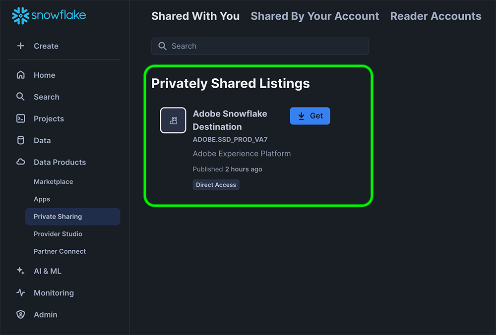
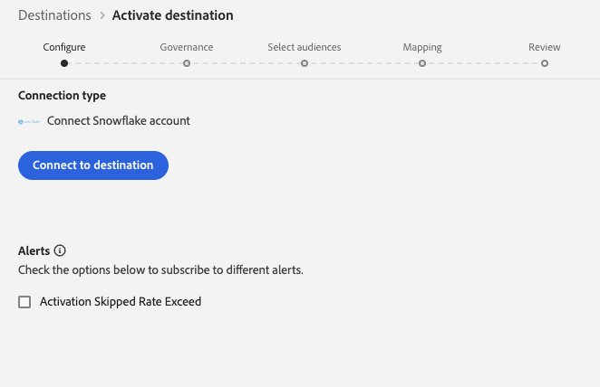
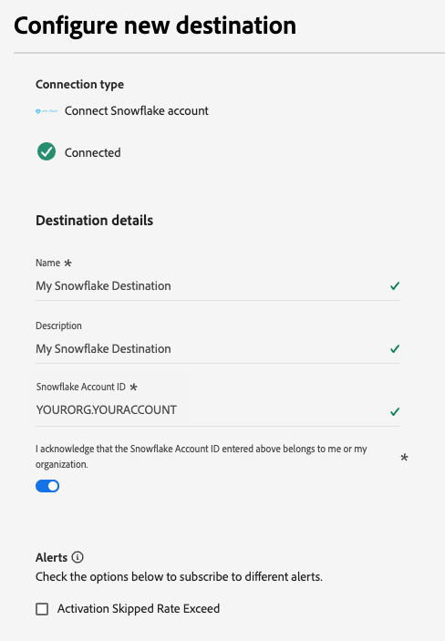
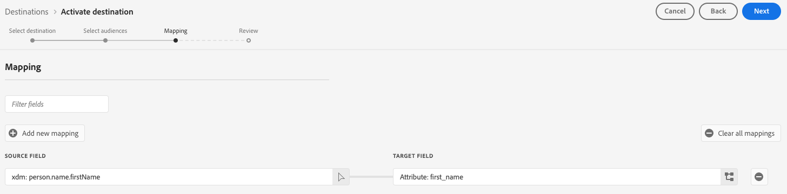
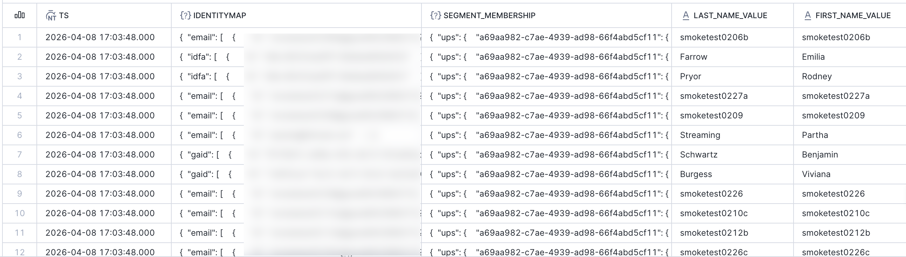

# Snowflake Streaming connection {#snowflake-destination}

>[!AVAILABILITY]
>
>この宛先コネクタは限定的に利用でき、[!DNL Real-Time CDP]VA7 リージョン [でプロビジョニングされた](/help/landing/multi-cloud.md#azure-regions)のUltimateのお客様のみが利用できます。

## 概要 {#overview}

Snowflake宛先コネクタを使用して、データをAdobeのSnowflake インスタンスに書き出します。Adobeは、次に[&#x200B; プライベートリスト &#x200B;](https://other-docs.snowflake.com/en/collaboration/collaboration-listings-about)を通じてインスタンスと共有します。

次の節では、Snowflakeの宛先の仕組みと、AdobeとSnowflake間でのデータの転送方法について説明します。

### Snowflakeの仕組み {#data-sharing}

この宛先は[!DNL Snowflake] データ共有を使用します。つまり、データは物理的にエクスポートされず、独自のSnowflake インスタンスに転送されません。 代わりに、Adobeでは、Adobe Snowflake環境内でホストされているライブテーブルへの読み取り専用アクセス権が付与されます。 この共有テーブルは、Snowflake アカウントから直接クエリできますが、そのテーブルを所有しておらず、指定した保持期間を超えて変更または保持することはできません。 Adobeは、共有テーブルのライフサイクルと構造を完全に管理します。

AdobeのSnowflake インスタンスから初めて自分のインスタンスにデータを共有する場合は、Adobeのプライベートリストを受け入れるよう求められます。

Snowflakeのプライベートリスト承認画面を示す

### データ保持とTTL （顧客生涯価値） {#ttl}

この統合を通じて共有されるすべてのデータには、7日間の固定有効期間（TTL）があります。 最後の書き出しから7日後、データフローがまだアクティブかどうかに関係なく、共有テーブルは自動的に期限切れになり、アクセスできなくなります。 データを7日以上保持する必要がある場合は、TTLの有効期限が切れる前に、独自のSnowflake インスタンスで所有しているテーブルにコンテンツをコピーする必要があります。

### オーディエンスの更新行動 {#audience-update-behavior}

オーディエンスが[&#x200B; バッチモード &#x200B;](../../../segmentation/methods/batch-segmentation.md)で評価された場合、共有テーブルのデータは24時間ごとに更新されます。 つまり、オーディエンスメンバーシップの変更と、それらの変更が共有テーブルに反映されるまでの間に、最大24時間の遅延が発生する可能性があります。

### 増分書き出しロジック {#incremental-export}

データフローがオーディエンスに対して初めて実行されると、バックフィルが実行され、現在選定されているすべてのプロファイルが共有されます。 この最初のバックフィルの後、増分更新のみが共有テーブルに反映されます。 つまり、オーディエンスに追加またはオーディエンスから削除されたプロファイルです。 このアプローチにより、効率的に更新し、共有テーブルを最新の状態に保つことができます。

## ストリーミングとバッチデータ共有 {#batch-vs-streaming}

[!DNL Adobe Experience Platform]には、[!DNL Snowflake]Snowflake ストリーミング [と](snowflake.md)Snowflake バッチ [の2種類の宛先が用意されています。](snowflake-batch.md)

次の表では、各データ共有方法が最も適切なシナリオを概説することで、使用する宛先を決定するのに役立ちます。

|  | 必要な場合は、[Snowflake バッチ &#x200B;](snowflake-batch.md)を選択してください | 必要な場合は、[Snowflake ストリーミング &#x200B;](snowflake.md)を選択してください |
|--------|-------------------|----------------------|
| **更新頻度** | 定期スナップショット | リアルタイムの継続的な更新 |
| **データ プレゼンテーション** | 過去のデータに代わる完全なオーディエンススナップショット | プロファイルの変更に基づく増分更新 |
| **ユースケースの焦点** | 待ち時間が重要ではない分析/マシンラーニングのワークロード | リアルタイムの更新が必要な即座のアクションシナリオ |
| **データ管理** | 常に最新の完全なスナップショットを表示 | オーディエンスメンバーシップの変更に基づく増分更新 |
| **シナリオ例** | ビジネスレポート、データ分析、マシンラーニングモデルのトレーニング | マーケティングキャンペーン抑制，リアルタイムのパーソナライゼーション |

バッチデータの共有について詳しくは、[Snowflake Batch connection](snowflake-batch.md)のドキュメントを参照してください。

## ユースケース {#use-cases}

ストリーミングデータ共有は、プロファイルがメンバーシップやその他の属性を変更したときに、すぐに更新が必要なシナリオに最適です。 これは、次のようなリアルタイムの応答を必要とするユースケースに不可欠です。

* **マーケティングキャンペーン抑制**：サービスへの登録や購入など、特定のアクションを実行したユーザーに対して、マーケティングキャンペーンを即座に抑制します
* **リアルタイムのパーソナライゼーション**：利用者がweb サイトにアクセスした場合、商品ページを閲覧した場合、ショッピングカートに商品を追加した場合など、プロファイル属性が変更された際に、ユーザーエクスペリエンスをすばやく更新します
* **即時のアクションシナリオ**: リアルタイムデータにもとづいて迅速な抑制とリターゲティングを実行し、遅延を減らし、マーケティングキャンペーンがより適切でタイムリーなものにします
* **効率性とニュアンス**: ユーザーの行動の変化に素早く対応できるようにすることで、マーケティング活動の効率性とニュアンスを向上させます
* **リアルタイムのカスタマージャーニー最適化**：セグメントメンバーシップまたはプロファイル属性が変更されたときにすぐに顧客体験を更新します

ストリーミングデータ共有は、セグメントの変更、ID マップの変更、属性の変更などにもとづいて継続的に更新されるため、低遅延が重要な場合に適しています。

## 前提条件 {#prerequisites}

Snowflake接続を設定する前に、次の前提条件を満たしていることを確認してください。

* [!DNL Snowflake] アカウントにアクセスできます。
* お客様の[!DNL Snowflake] アカウントはプライベートリストに登録されています。 [!DNL Snowflake]のアカウント管理者権限を持つ会社のユーザーまたはユーザーが、これを設定できます。
* 宛先に接続する際にドロップダウンから選択する[!DNL Snowflake] アカウント領域を理解しています。

必要な権限について詳しくは、[[!DNL Snowflake]  ドキュメント &#x200B;](https://docs.snowflake.com/en/collaboration/consumer-listings-access#access-a-private-listing)を参照してください。

## サポートされるオーディエンス {#supported-audiences}

この節では、この宛先に書き出すことができるオーディエンスのタイプについて説明します。 以下の2つの表は、このコネクタがサポートするオーディエンスを示しています。オーディエンスの由来&#x200B;_と_ オーディエンスに含まれるプロファイルタイプ _:_

| オーディエンスの由来 | サポートあり | 説明 |
|---------|----------|----------|
| [!DNL Segmentation Service] | ○ | [!DNL Adobe Experience Platform] [&#x200B; セグメント化サービス &#x200B;](../../../segmentation/home.md)を通じて生成されたオーディエンス。 |
| その他すべてのオーディエンスの生成元 | ○ | このカテゴリには、[!DNL Segmentation Service]を通じて生成されたオーディエンス以外のすべてのオーディエンスのオリジンが含まれます。 [様々なオーディエンスの起源](/help/segmentation/ui/audience-portal.md#customize)について読みます。 次に例を示します。 <ul><li> カスタムアップロードオーディエンス [がCSV ファイルから](../../../segmentation/ui/audience-portal.md#import-audience)に[!DNL Adobe Experience Platform]をインポートしました。</li><li> 類似オーディエンス， </li><li> 連合オーディエンス， </li><li> [!DNL Adobe Experience Platform]などの他の[!DNL Adobe Journey Optimizer] アプリで生成されたオーディエンス， </li><li> その他。 </li></ul> |

{style="table-layout:auto"}

オーディエンスのデータタイプ別にサポートされるオーディエンス：

| オーディエンスのデータタイプ | サポートあり | 説明 | ユースケース |
|--------------------|-----------|-------------|-----------|
| [人物オーディエンス &#x200B;](/help/segmentation/types/people-audiences.md) | ○ | 顧客プロファイルにもとづいて、マーケティング施策の特定のグループをターゲットにすることができます。 | 買い物客やカートの放棄が多い |
| [&#x200B; アカウントオーディエンス &#x200B;](/help/segmentation/types/account-audiences.md) | × | アカウントベースドマーケティング戦略のために、特定の組織内の個人をターゲットにします。 | B2B マーケティング |
| [見込みオーディエンス &#x200B;](/help/segmentation/types/prospect-audiences.md) | × | まだ顧客ではないが、ターゲットオーディエンスと特徴を共有する個人をターゲットにします。 | サードパーティデータによる見込み顧客の開拓 |
| [&#x200B; データセットの書き出し](/help/catalog/datasets/overview.md) | × | [!DNL Adobe Experience Platform] データ レイクに保存されている構造化データのコレクション。 | レポート，データサイエンスワークフロー |

{style="table-layout:auto"}

## 書き出しのタイプと頻度 {#export-type-frequency}

宛先の書き出しのタイプと頻度について詳しくは、以下の表を参照してください。

| 項目 | タイプ | メモ |
|---------|----------|---------|
| 書き出しタイプ | **[!UICONTROL Audience export]** | [!DNL Snowflake] 宛先で使用される識別子（氏名、電話番号など）を使用して、オーディエンスのすべてのメンバーを書き出します。 |
| 書き出し頻度 | **[!UICONTROL Streaming]** | ストリーミングの宛先は常に、API ベースの接続です。オーディエンス評価に基づいて[!DNL Adobe Experience Platform]でプロファイルが更新されるとすぐに、コネクターは更新をダウンストリームの宛先プラットフォームに送信します。 詳しくは、[ストリーミングの宛先](/help/destinations/destination-types.md#streaming-destinations)を参照してください。 |

{style="table-layout:auto"}

## 宛先への接続 {#connect}

>[!IMPORTANT]
>
>宛先に接続するには、**[!UICONTROL View Destinations]**&#x200B;および&#x200B;**[!UICONTROL Manage Destinations]** [&#x200B; アクセス制御権限](/help/access-control/home.md#permissions)が必要です。 詳しくは、[アクセス制御の概要](/help/access-control/ui/overview.md)または製品管理者に問い合わせて、必要な権限を取得してください。

この宛先に接続するには、[宛先設定のチュートリアル](../../ui/connect-destination.md)の手順に従ってください。宛先の設定ワークフローで、以下の 2 つのセクションにリストされているフィールドに入力します。

### 宛先に対する認証 {#authenticate}

宛先に対する認証を行うには、**[!UICONTROL Connect to destination]**&#x200B;を選択します。

宛先への認証方法を示す

### 宛先の詳細の入力 {#destination-details}

>[!CONTEXTUALHELP]
>id="platform_destinations_snowflake_accountID"
>title="Snowflake アカウント ID を入力"
>abstract="アカウントが組織にリンクされている場合は、次の形式を使用します：`OrganizationName.AccountName`   アカウントが組織にリンクされていない場合は、次の形式を使用します：`AccountName`"

宛先の詳細を設定するには、以下の必須フィールドとオプションフィールドに入力します。UI のフィールドの横のアスタリスクは、そのフィールドが必須であることを示します。

宛先の詳細を入力する方法を示す

* **[!UICONTROL Name]**：今後この宛先を認識する際に使用する名前。
* **[!UICONTROL Description]**：今後この宛先を特定するのに役立つ説明です。
* **[!UICONTROL Snowflake Account ID]**: Snowflake アカウント ID。 アカウントが組織にリンクされているかどうかに応じて、次のアカウント ID形式を使用します。
   * アカウントが組織にリンクされている場合：`OrganizationName.AccountName`。
   * アカウントが組織にリンクされていない場合：`AccountName`。
* **[!UICONTROL Account acknowledgment]**: Snowflake アカウント ID確認書を切り替えて、アカウント IDが正しく、自分に属していることを確認します。

>[!NOTE]
>
> 宛先を作成した後、**[!UICONTROL Snowflake Account ID]**&#x200B;宛先を編集[&#x200B; ワークフローで](../../ui/edit-destination.md)を編集することはできません。 別のアカウントを使用するには、[新しい宛先接続を作成します](../../ui/connect-destination.md)。

>[!IMPORTANT]
>
> 宛先名と[!DNL Adobe Experience Platform] サンドボックス名で使用されている特殊文字は、`_`のアンダースコア （[!DNL Snowflake]）に自動的に変換されます。 混乱を避けるために、宛先名とサンドボックス名に特殊文字を使用しないでください。

### アラートの有効化 {#enable-alerts}

アラートを有効にすると、宛先へのデータフローのステータスに関する通知を受け取ることができます。リストからアラートを選択して、データフローのステータスに関する通知を受け取るよう登録します。アラートについて詳しくは、[UI を使用した宛先アラートの購読](../../ui/alerts.md)に関するガイドを参照してください。

宛先接続の詳細の提供が完了したら、**[!UICONTROL Next]**&#x200B;を選択します。

## この宛先に対してオーディエンスをアクティブ化 {#activate}

>[!IMPORTANT]
>
>* データをアクティブ化するには、**[!UICONTROL View Destinations]**、**[!UICONTROL Activate Destinations]**、**[!UICONTROL View Profiles]**&#x200B;および&#x200B;**[!UICONTROL View Segments]** [&#x200B; アクセス制御権限](/help/access-control/home.md#permissions)が必要です。 [アクセス制御の概要](/help/access-control/ui/overview.md)を参照するか、製品管理者に問い合わせて必要な権限を取得してください。
>* *ID*&#x200B;をエクスポートするには、**[!UICONTROL View Identity Graph]** [&#x200B; アクセス制御権限](/help/access-control/home.md#permissions)が必要です。  {width="100" zoomable="yes"}

この宛先にオーディエンスをアクティベートする手順は、[ストリーミングオーディエンスの書き出し宛先へのプロファイルとオーディエンスのアクティベート](/help/destinations/ui/activate-segment-streaming-destinations.md)を参照してください。

### 属性のマップ {#map}

Snowflakeの宛先では、プロファイル属性とカスタム属性のマッピングがサポートされています。

ターゲット属性は、**[!UICONTROL Attribute name]** フィールドで指定した属性名を使用して、Snowflakeで自動的に作成されます。

## 書き出されたデータ／データ書き出しの検証 {#exported-data}

データは、共有テーブルを介してSnowflake アカウントに共有されます。 Snowflake アカウントを確認して、データが正しく書き出されたことを確認します。

次の例は、共有テーブルのサンプル行を示しています。一部の列にはIDとセグメントメンバーシップがJSONとして保存され、マッピングされたプロファイル属性は別の文字列列として表示されます。

 {align="center" zoomable="yes"}

### データ構造 {#data-structure}

上のスクリーンショットは、次の列を示しています。

* **IDENTITYMAP**: プロファイル ID マップごとにJSON オブジェクト。
* **SEGMENT_MEMBERSHIP**: データフローでアクティブ化された各オーディエンスのJSON オブジェクト。 値には`lastQualificationTime`と`status`が含まれます（プロファイルがセグメントに適格な場合は`realized`など）。
* **マッピング属性**：アクティベーションワークフロー中に選択したすべてのマッピング属性は、[!DNL Snowflake]の列ヘッダーとして表されます。

## データの使用とガバナンス {#data-usage-governance}

[!DNL Adobe Experience Platform] のすべての宛先は、データを処理する際のデータ使用ポリシーに準拠しています。[!DNL Adobe Experience Platform] がどのように データガバナンスを実施するかについて詳しくは、[データガバナンスの概要](/help/data-governance/home.md)を参照してください。
