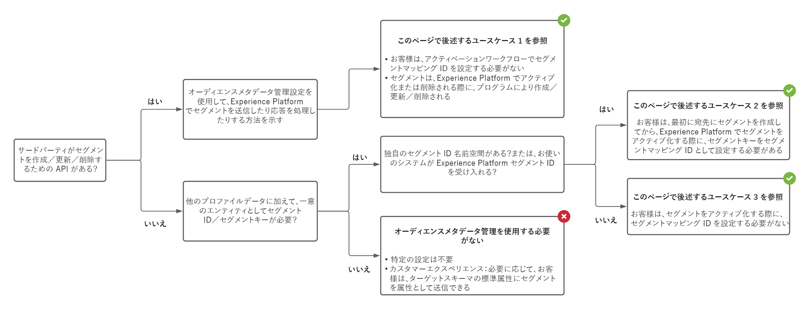

# オーディエンスメタデータの管理 {#audience-metadata-management}

## 概要 {#overview}

オーディエンスメタデータテンプレートを使用して、宛先のオーディエンスをプログラムで作成、更新または削除します。アドビは、マーケティング API の仕様に基づいて設定できる、拡張可能なオーディエンスメタデータテンプレートを提供します。設定を定義、テスト、送信すると、アドビはこの設定を使用して、宛先への API 呼び出しを構造化します。

`/authoring/audience-templates` API エンドポイントを使用して、このドキュメントで説明する機能を設定できます。エンドポイントで実行できる操作の完全なリストについては、[Audience metadata endpoint API の操作](./audience-metadata-api.md)をお読みください。

## オーディエンスメタデータ管理エンドポイントを使用するタイミング {#when-to-use}

API の設定に応じて、Experience Platform で宛先を設定する際に、オーディエンスメタデータ管理エンドポイントを使用する必要がある場合と必要がない場合があります。以下の決定ツリー図を使用して、オーディエンスメタデータエンドポイントを使用するタイミングと、宛先に対するオーディエンスメタデータテンプレートの設定方法を理解します。



## オーディエンスメタデータ管理でサポートされるユースケース {#use-cases}

Destination SDK でのオーディエンスメタデータのサポートを使用すると、Experience Platform の宛先を設定する際に、Platform ユーザーがセグメントをマッピングし、宛先に対してアクティブ化する際に、複数あるオプションの 1 つを指定できます。[宛先設定](./destination-configuration.md#segment-mapping)のセグメントマッピングセクションのパラメーターで、ユーザーが利用できるオプションを制御することができます。

### ユースケース 1 - サードパーティの API を使用しており、ユーザーはマッピング ID を入力する必要がない場合

セグメントやオーディエンスを作成、更新、削除する API エンドポイントがある場合は、オーディエンスメタデータテンプレートを使用して、セグメントの作成、更新、削除エンドポイントの仕様に合わせて Destination SDK を設定できます。Experience Platform は、セグメントをプログラムで作成、更新、削除して、メタデータを Experience Platform に同期できます。

Experience Platform ユーザーインターフェイス（UI）で宛先に対してセグメントをアクティブ化する際に、アクティベーションワークフローのセグメントマッピング ID フィールドに手動で入力する必要はありません。

### ユースケース 2 - ユーザーは最初に宛先でセグメントを作成する必要があり、マッピング ID を手動で入力する必要がある場合

セグメントや他のメタデータをパートナーやユーザーが手動で宛先に作成する必要がある場合は、ユーザーはアクティベーションワークフローのセグメントマッピング ID フィールドに手動で入力し、宛先と Experience Platform の間でセグメントメタデータを同期します。


### ユースケース 3 - 宛先が Experience Platform セグメント ID を受け入れ、ユーザーがマッピング ID を手動で入力する必要がない場合

宛先のシステムで Experience Platform セグメント ID を使用できる場合、オーディエンスメタデータテンプレートで設定できます。ユーザーは、セグメントをアクティブ化する際に、セグメントマッピング ID を入力する必要はありません。

## 汎用で拡張可能なオーディエンステンプレート {#generic-and-extensible}

前述の使用例をサポートするために、アドビでは、API の仕様に合わせてカスタマイズできる汎用テンプレートを提供しています。

お使いの API が次をサポートしている場合、汎用テンプレートを使用して[新しいオーディエンステンプレートを作成](./audience-metadata-api.md#create)できます。

* HTTP メソッド：POST、GET、PUT、DELETE、PATCH。
* 認証タイプは、OAuth 1、OAuth 2（更新トークン）、OAuth 2（Bearer トークン）です。
* 関数は、オーディエンスの作成、オーディエンスの更新、オーディエンスの取得、オーディエンスの削除、資格情報の検証を行うことができます。

アドビのエンジニアリングチームが協力して、カスタムフィールドを含む汎用テンプレートを拡張できます（使用例が必要な場合）。

## 設定例 {#configuration-examples}

この節では、参照用に 3 つの汎用オーディエンスメタデータ設定の例と、設定の主要セクションを説明します。URL、ヘッダー、リクエストおよび応答本文は、3 つの設定例でどのように異なるかに注意してください。 これは、3 つのサンプルプラットフォームのマーケティング API の仕様が異なるためです。

一部の例では、`{{authData.accessToken}}` または `{{segment.name}}` などのマクロフィールドは URL で、その他の例ではヘッダーまたはリクエスト本文で使用されます。実際の動作はマーケティング API の仕様によって異なります。

| テンプレートセクション | 説明 |
|--- |--- |
| `create` | API への HTTP 呼び出しに必要なすべてのコンポーネント（URL、HTTP メソッド、ヘッダー、リクエストおよび応答本文）を含めて、プラットフォームのセグメントやオーディエンスをプログラムで作成し、情報を Adobe Experience Platform に同期します。 |
| `update` | API への HTTP 呼び出しに必要なすべてのコンポーネント（URL、HTTP メソッド、ヘッダー、リクエストおよび応答本文）を含めて、プラットフォームのセグメントやオーディエンスをプログラムで更新し、情報を Adobe Experience Platform に同期します。 |
| `delete` | API への HTTP 呼び出しに必要なすべてのコンポーネント（URL、HTTP メソッド、ヘッダー、リクエストおよび応答本文）を含めて、プラットフォームのセグメントやオーディエンスをプログラムで削除します。 |
| `validate` | パートナー API を呼び出す前に、テンプレート設定のすべてのフィールドの検証を実行します。例えば、ユーザーのアカウント ID が正しく入力されていることを検証できます。 |
| `notify` | ファイルベースの宛先にのみ適用されます。API への HTTP 呼び出しに必要なすべてのコンポーネント（URL、HTTP メソッド、ヘッダー、リクエストおよび応答本文）を含めて、ファイルの書き出しが正常に行われたことを通知します。 |

{style=&quot;table-layout:auto&quot;}

### ストリーミングの例 1 {#example-1}

```json
{
   "instanceId":"34ab9cc2-2536-44a5-9dc5-b2fea60b3bd6",
   "createdDate":"2021-07-26T19:30:52.012490Z",
   "lastModifiedDate":"2021-07-27T21:25:42.763478Z",
   "metadataTemplate":{
      "create":{
         "url":"https://adsapi.moviestar.com/v1/adaccounts/{{customerData.accountId}}/segments",
         "httpMethod":"POST",
         "headers":[
            {
               "value":"application/json",
               "header":"Content-Type"
            },
            {
               "value":"Bearer {{oauth2ServiceAccessToken}}",
               "header":"Authorization"
            }
         ],
         "requestBody":{
            "json":{
               "segments":[
                  {
                     "name":"{{segment.name}}",
                     "description":"{{segment.description}}",
                     "source_type":"FIRST_PARTY",
                     "ad_account_id":"{{customerData.accountId}}",
                     "retention_in_days":180
                  }
               ]
            }
         },
         "responseFields":[
            {
               "value":"{{body.segments[0].segment.id}}",
               "name":"externalAudienceId"
            }
         ],
         "responseErrorFields":[
            {
               "value":"{{root}}",
               "name":"message"
            }
         ]
      },
      "update":{
         "url":"https://adsapi.moviestar.com/v1/adaccounts/{{customerData.accountId}}/segments/{{segment.alias}}",
         "httpMethod":"PUT",
         "headers":[
            {
               "value":"application/json",
               "header":"Content-Type"
            },
            {
               "value":"Bearer {{oauth2ServiceAccessToken}}",
               "header":"Authorization"
            }
         ],
         "requestBody":{
            "json":{
               "segments":[
                  {
                     "id":"{{segment.alias}}",
                     "name":"{{segment.name}}",
                     "description":"{{segment.description}}"
                  }
               ]
            }
         },
         "responseFields":[
            {
               "value":"{{body.segments[0].segment.id}}",
               "name":"externalAudienceId"
            }
         ],
         "responseErrorFields":[
            {
               "value":"{{root}}",
               "name":"message"
            }
         ]
      },
      "delete":{
         "url":"https://adsapi.moviestar.com/v1/adaccounts/{{customerData.accountId}}/segments/{{segment.alias}}",
         "httpMethod":"DELETE",
         "headers":[
            {
               "value":"application/json",
               "header":"Content-Type"
            },
            {
               "value":"Bearer {{oauth2ServiceAccessToken}}",
               "header":"Authorization"
            }
         ],
         "responseErrorFields":[
            {
               "value":"{{root}}",
               "name":"message"
            }
         ]
      },
      "name":"Moviestar destination audience template - Example 1"
   }
}
```

### ストリーミングの例 2 {#example-2}

```json
{
   "instanceId":"12c78017-5af3-4d4e-8f9c-d330c547c482",
   "createdDate":"2021-07-20T13:27:37.029490Z",
   "lastModifiedDate":"2021-07-20T18:53:03.622306Z",
   "metadataTemplate":{
      "create":{
         "url":"https://api.moviestar.com/v1.0/{{customerData.accountId}}/customaudiences?fields=name,description,account_id&subtype=CUSTOM&name={{segment.name}}&customer_file_source={{segment.metadata.customer_file_source}}&access_token={{authData.accessToken}}",
         "httpMethod":"POST",
         "headers":[
            {
               "value":"application/x-www-form-urlencoded",
               "header":"Content-Type"
            }
         ],
         "responseFields":[
            {
               "value":"{{response.id}}",
               "name":"externalAudienceId"
            }
         ],
         "responseErrorFields":[
            {
               "value":"{{error.message}}",
               "name":"message"
            }
         ]
      },
      "update":{
         "url":"https://api.moviestar.com/v1.0/{{segment.alias}}?field=name,description,account_id&access_token={{authData.accessToken}}&customerAudienceId={{segment.alias}}&&name={{segment.name}}&description={{segment.description}}&customer_file_source={{segment.metadata.customer_file_source}}",
         "httpMethod":"POST",
         "headers":[
            {
               "value":"application/x-www-form-urlencoded",
               "header":"Content-Type"
            }
         ],
         "responseFields":[
            {
               "value":"{{response.id}}",
               "name":"externalAudienceId"
            }
         ],
         "responseErrorFields":[
            {
               "value":"{{error.message}}",
               "name":"message"
            }
         ]
      },
      "delete":{
         "url":"https://api.moviestar.com/v1.0/{{segment.alias}}?fields=name,description,account_id&access_token={{authData.accessToken}}&customerAudienceId={{segment.alias}}",
         "httpMethod":"DELETE",
         "headers":[
            {
               "value":"application/x-www-form-urlencoded",
               "header":"Content-Type"
            }
         ],
         "responseErrorFields":[
            {
               "value":"{{error.message}}",
               "name":"message"
            }
         ]
      },
      "validate":{
         "url":"https://api.moviestar.com/v1.0/permissions?access_token={{authData.accessToken}}",
         "httpMethod":"GET",
         "headers":[
            {
               "value":"application/x-www-form-urlencoded",
               "header":"Content-Type"
            }
         ],
         "responseFields":[
            {
               "value":"{{response.data[0].permission}}",
               "name":"Id"
            }
         ],
         "responseErrorFields":[
            {
               "value":"{{error.message}}",
               "name":"message"
            }
         ]
      }
   }
}
```

### ストリーミングの例 3 {#example-3}

```json
{
   "instanceId":"12a3238f-b509-4a40-b8fb-0a5006e7901d",
   "createdDate":"2021-07-20T13:30:30.843054Z",
   "lastModifiedDate":"2021-07-21T16:33:05.787472Z",
   "metadataTemplate":{
      "create":{
         "url":"https://api.moviestar.com/v2/dmpSegments",
         "httpMethod":"POST",
         "headers":[
            {
               "value":"application/json",
               "header":"Content-Type"
            },
            {
               "value":"Bearer {{authData.accessToken}}",
               "header":"Authorization"
            }
         ],
         "requestBody":{
            "json":{
               "name":"{{segment.name}}",
               "type":"USER",
               "account":"{{customerData.accountId}}",
               "accessPolicy":"PRIVATE",
               "destinations":[
                  {
                     "destination":"MOVIESTAR"
                  }
               ],
               "sourcePlatform":"ADOBE"
            }
         },
         "responseFields":[
            {
               "value":"{{headers.x-moviestar-id}}",
               "name":"externalAudienceId"
            }
         ],
         "responseErrorFields":[
            {
               "value":"{{message}}",
               "name":"message"
            }
         ]
      },
      "update":{
         "url":"https://api.moviestar.com/v2/dmpSegments/{{segment.alias}}",
         "httpMethod":"POST",
         "headers":[
            {
               "value":"application/json",
               "header":"Content-Type"
            },
            {
               "value":"Bearer {{authData.accessToken}}",
               "header":"Authorization"
            }
         ],
         "requestBody":{
            "json":{
               "patch":{
                  "$set":{
                     "name":"{{segment.name}}"
                  }
               }
            }
         },
         "responseErrorFields":[
            {
               "value":"{{message}}",
               "name":"message"
            }
         ]
      },
      "delete":{
         "url":"https://api.moviestar.com/v2/dmpSegments/{{segment.alias}}",
         "httpMethod":"DELETE",
         "headers":[
            {
               "value":"application/json",
               "header":"Content-Type"
            },
            {
               "value":"Bearer {{authData.accessToken}}",
               "header":"Authorization"
            }
         ],
         "responseErrorFields":[
            {
               "value":"{{message}}",
               "name":"message"
            }
         ]
      },
      "name":"Moviestar audience template - Third example"
   }
}
```


### ファイルベースの例 {#example-file-based}

```json
{
   "instanceId":"34ab9cc2-2536-44a5-9dc5-b2fea60b3bd6",
   "createdDate":"2021-07-26T19:30:52.012490Z",
   "lastModifiedDate":"2021-07-27T21:25:42.763478Z",
   "metadataTemplate":{
      "create":{
         "url":"https://adsapi.moviestar.com/v1/adaccounts/{{customerData.accountId}}/segments",
         "httpMethod":"POST",
         "headers":[
            {
               "value":"application/json",
               "header":"Content-Type"
            },
            {
               "value":"Bearer {{oauth2ServiceAccessToken}}",
               "header":"Authorization"
            }
         ],
         "requestBody":{
            "json":{
               "segments":[
                  {
                     "name":"{{segment.name}}",
                     "description":"{{segment.description}}",
                     "source_type":"FIRST_PARTY",
                     "ad_account_id":"{{customerData.accountId}}",
                     "retention_in_days":180
                  }
               ]
            }
         },
         "responseFields":[
            {
               "value":"{{body.segments[0].segment.id}}",
               "name":"externalAudienceId"
            }
         ],
         "responseErrorFields":[
            {
               "value":"{{root}}",
               "name":"message"
            }
         ]
      },
      "update":{
         "url":"https://adsapi.moviestar.com/v1/adaccounts/{{customerData.accountId}}/segments/{{segment.alias}}",
         "httpMethod":"PUT",
         "headers":[
            {
               "value":"application/json",
               "header":"Content-Type"
            },
            {
               "value":"Bearer {{oauth2ServiceAccessToken}}",
               "header":"Authorization"
            }
         ],
         "requestBody":{
            "json":{
               "segments":[
                  {
                     "id":"{{segment.alias}}",
                     "name":"{{segment.name}}",
                     "description":"{{segment.description}}"
                  }
               ]
            }
         },
         "responseFields":[
            {
               "value":"{{body.segments[0].segment.id}}",
               "name":"externalAudienceId"
            }
         ],
         "responseErrorFields":[
            {
               "value":"{{root}}",
               "name":"message"
            }
         ]
      },
      "notify":{
         "url":"https://adsapi.moviestar.com/v1/adaccounts/{{customerData.accountId}}/segments/{{segment.alias}}",
         "httpMethod":"PUT",
         "headers":[
            {
               "value":"application/json",
               "header":"Content-Type"
            },
            {
               "value":"Bearer {{oauth2ServiceAccessToken}}",
               "header":"Authorization"
            }
         ],
         "requestBody":{
            "json":{
               "segments":[
                  {
                     "id":"{{segment.alias}}",
                     "name":"{{segment.name}}",
                     "description":"{{segment.description}}"
                  }
               ]
            }
         },
         "responseFields":[
            {
               "value":"{{body.segments[0].segment.id}}",
               "name":"externalAudienceId"
            }
         ],
         "responseErrorFields":[
            {
               "value":"{{root}}",
               "name":"message"
            }
         ]
      },
      "delete":{
         "url":"https://adsapi.moviestar.com/v1/adaccounts/{{customerData.accountId}}/segments/{{segment.alias}}",
         "httpMethod":"DELETE",
         "headers":[
            {
               "value":"application/json",
               "header":"Content-Type"
            },
            {
               "value":"Bearer {{oauth2ServiceAccessToken}}",
               "header":"Authorization"
            }
         ],
         "responseErrorFields":[
            {
               "value":"{{root}}",
               "name":"message"
            }
         ]
      },
      "name":"Moviestar destination audience template - Example 1"
   }
}
```

テンプレート内のすべてのパラメーターの説明については、[Audience metadata endpoint API の操作](./audience-metadata-api.md)のリファレンスドキュメントを参照してください。

## オーディエンスメタデータテンプレートで使用されるマクロ

Experience Platform と API の間でセグメント ID、アクセストークン、エラーメッセージなどの情報を渡すために、オーディエンステンプレートには使用できるマクロが含まれています。このページの 3 つの設定例で使用されるマクロの説明を以下に示します。

| マクロ | 説明 |
|--- |--- |
| `{{segment.alias}}` | Experience Platform でセグメントエイリアスにアクセスできるようにします。 |
| `{{segment.name}}` | Experience Platform でセグメント名にアクセスできるようにします。 |
| `{{segment.id}}` | Experience Platform でセグメント ID にアクセスできるようにします。 |
| `{{customerData.accountId}}` | 宛先設定で設定したアカウント ID フィールドにアクセスできるようにします。 |
| `{{oauth2ServiceAccessToken}}` | OAuth 2 の設定に基づいて、アクセストークンを動的に生成できるようにします。 |
| `{{authData.accessToken}}` | API エンドポイントにアクセストークンを渡すことができるようにします。Experience Platform が期限切れでないトークンを使用して宛先に接続する場合は、`{{authData.accessToken}}` を使用します。そうでない場合は、`{{oauth2ServiceAccessToken}}` を使用してアクセストークンを生成します。 |
| `{{body.segments[0].segment.id}}` | 作成されたオーディエンスの一意の ID をキー `externalAudienceId` の値として返します。 |
| `{{error.message}}` | Experience Platform UI でユーザーに表示されるエラーメッセージを返します。 |

{style=&quot;table-layout:auto&quot;}
