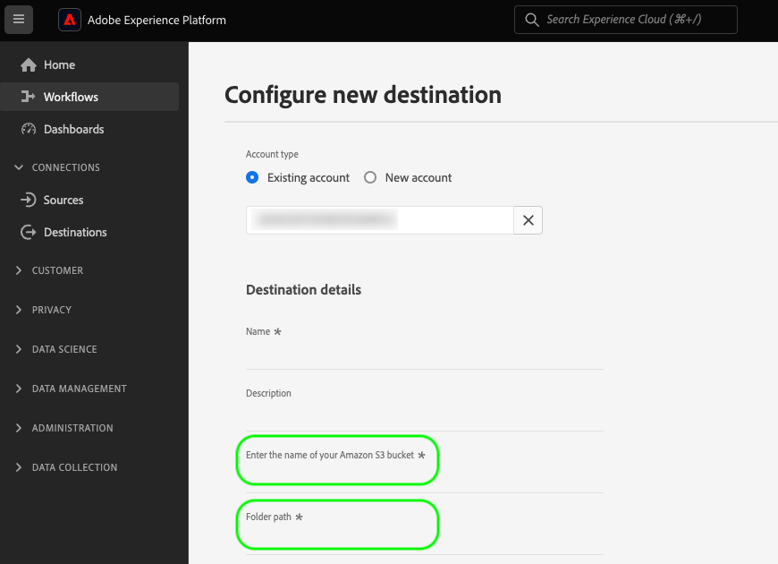

# 宛先設定の作成

このページでは、`/authoring/destinations` API エンドポイントを使用して、独自の宛先設定を作成するために使用できる API リクエストおよびペイロードの例を示します。

このエンドポイントを通じて設定できる機能について詳しくは、以下の記事を参照してください。

* [顧客認証設定](../../functionality/destination-configuration/customer-authentication.md)
* [OAuth 2 認証](../../functionality/destination-configuration/oauth2-authentication.md)
* [顧客データフィールド](../../functionality/destination-configuration/customer-data-fields.md)
* [UI 属性](../../functionality/destination-configuration/ui-attributes.md)
* [スキーマ設定](../../functionality/destination-configuration/schema-configuration.md)
* [ID 名前空間設定](../../functionality/destination-configuration/identity-namespace-configuration.md)
* [宛先配信](../../functionality/destination-configuration/destination-delivery.md)
* [オーディエンスメタデータ設定](../../functionality/destination-configuration/audience-metadata-configuration.md)
* [オーディエンスメタデータ設定](../../functionality/destination-configuration/audience-metadata-configuration.md)
* [集計ポリシー](../../functionality/destination-configuration/aggregation-policy.md)
* [バッチ設定](../../functionality/destination-configuration/batch-configuration.md)
* [プロファイル選定履歴](../../functionality/destination-configuration/historical-profile-qualifications.md)

>[!IMPORTANT]
>
>Destination SDK でサポートされているすべてのパラメーター名および値は、**大文字と小文字が区別**&#x200B;されます。大文字と小文字を区別することに関するエラーを避けるために、ドキュメントに示すように、パラメーター名および値を正確に使用してください。

## 宛先設定 API 操作の概要 {#get-started}

続行する前に、「[はじめる前に](../../getting-started.md)」を参照し、API の呼び出しを正常に行うために必要となる重要な情報（必要な宛先オーサリング権限および必要なヘッダーの取得方法など）を確認してください。

## 宛先設定の作成 {#create}

`/authoring/destinations` エンドポイントに POST リクエストを行うことで、新しい宛先設定を作成できます。

>[!TIP]
>
>**API エンドポイント**：`platform.adobe.io/data/core/activation/authoring/destinations`

**API 形式**

```http
POST /authoring/destinations
```

以下のリクエストは、ペイロードで提供されるパラメーター設定に基づいて、新しい [!DNL Amazon S3] 宛先設定を作成します。以下のペイロードには、`/authoring/destinations` エンドポイントで指定できる、ファイルベースの宛先のすべてのパラメーターが含まれます。

API 呼び出しにすべてのパラメーターを追加する必要はなく、ペイロードは API 要件に応じてカスタマイズできることに注意してください。

+++リクエスト

```shell
curl -X POST https://platform.adobe.io/data/core/activation/authoring/destinations \
 -H 'Authorization: Bearer {ACCESS_TOKEN}' \
 -H 'Content-Type: application/json' \
 -H 'x-gw-ims-org-id: {ORG_ID}' \
 -H 'x-api-key: {API_KEY}' \
 -H 'x-sandbox-name: {SANDBOX_NAME}' \
 -d '
{
   "name":"Amazon S3 destination with predefined CSV formatting options",
   "description":"Amazon S3 destination with predefined CSV formatting options",
   "status":"TEST",
   "customerAuthenticationConfigurations":[
      {
         "authType":"S3"
      }
   ],
   "customerDataFields":[
      {
         "name":"bucket",
         "title":"Enter the name of your Amazon S3 bucket",
         "description":"Amazon S3 bucket name",
         "type":"string",
         "isRequired":true,
         "readOnly":false,
         "hidden":false
      },
      {
         "name":"path",
         "title":"Enter the path to your S3 bucket folder",
         "description":"Enter the path to your S3 bucket folder",
         "type":"string",
         "isRequired":true,
         "pattern":"^[A-Za-z]+$",
         "readOnly":false,
         "hidden":false
      },
      {
         "name":"compression",
         "title":"Compression format",
         "description":"Select the desired file compression format.",
         "type":"string",
         "isRequired":true,
         "readOnly":false,
         "enum":[
            "SNAPPY",
            "GZIP",
            "DEFLATE",
            "NONE"
         ]
      },
      {
         "name":"fileType",
         "title":"Select a fileType",
         "description":"Select fileType",
         "type":"string",
         "isRequired":true,
         "readOnly":false,
         "hidden":false,
         "enum":[
            "csv",
            "json",
            "parquet"
         ],
         "default":"csv"
      }
   ],
   "uiAttributes":{
      "documentationLink":"https://www.adobe.com/go/destinations-amazon-s3-en",
      "category":"cloudStorage",
      "icon":{
         "key":"amazonS3"
      },
      "connectionType":"S3",
      "frequency":"Batch"
   },
   "destinationDelivery":[
      {
         "deliveryMatchers":[
            {
               "type":"SOURCE",
               "value":[
                  "batch"
               ]
            }
         ],
         "authenticationRule":"CUSTOMER_AUTHENTICATION",
         "destinationServerId":"{{destinationServerId}}"
      }
   ],
   "schemaConfig":{
      "profileRequired":true,
      "segmentRequired":true,
      "identityRequired":true
   },
   "batchConfig":{
      "allowMandatoryFieldSelection":true,
      "allowDedupeKeyFieldSelection":true,
      "defaultExportMode":"DAILY_FULL_EXPORT",
      "allowedExportMode":[
         "DAILY_FULL_EXPORT",
         "FIRST_FULL_THEN_INCREMENTAL"
      ],
      "allowedScheduleFrequency":[
         "DAILY",
         "EVERY_3_HOURS",
         "EVERY_6_HOURS",
         "EVERY_8_HOURS",
         "EVERY_12_HOURS",
         "ONCE"
      ],
      "defaultFrequency":"DAILY",
      "defaultStartTime":"00:00",
      "filenameConfig":{
         "allowedFilenameAppendOptions":[
            "SEGMENT_NAME",
            "DESTINATION_INSTANCE_ID",
            "DESTINATION_INSTANCE_NAME",
            "ORGANIZATION_NAME",
            "SANDBOX_NAME",
            "DATETIME",
            "CUSTOM_TEXT"
         ],
         "defaultFilenameAppendOptions":[
            "DATETIME"
         ],
         "defaultFilename":"%DESTINATION%_%SEGMENT_ID%"
      },
      "backfillHistoricalProfileData":true
   }
}'
```

| パラメーター | タイプ | 説明 |
|---------|----------|------|
| `name` | 文字列 | Experience Platform カタログ内の宛先のタイトルを示します。 |
| `description` | 文字列 | アドビが宛先カードの Experience Platform 宛先カタログで使用する説明を入力します。4 ～ 5 文以下を目指します。{width="100" zoomable="yes"} |
| `status` | 文字列 | 宛先カードのライフサイクルステータスを示します。指定できる値は、`TEST`、`PUBLISHED`、`DELETED` です。最初に宛先を設定する際は `TEST` を使用します。 |
| `customerAuthenticationConfigurations.authType` | 文字列 | 宛先サーバーに対して Experience Platform 顧客を認証するために使用される設定を示します。サポートされる認証タイプについて詳しくは、[顧客認証設定](../../functionality/destination-configuration/customer-authentication.md)を参照してください。 |
| `customerDataFields.name` | 文字列 | 導入するカスタムフィールドの名前を指定します。<br/><br/>これらの設定について詳しくは、[顧客データフィールド](../../functionality/destination-configuration/customer-data-fields.md)を参照してください。{width="100" zoomable="yes"} |
| `customerDataFields.type` | 文字列 | 導入するカスタムフィールドのタイプを示します。使用できる値は、`string`、`object`、`integer` です。<br/><br/>これらの設定について詳しくは、[顧客データフィールド](../../functionality/destination-configuration/customer-data-fields.md)を参照してください。 |
| `customerDataFields.title` | 文字列 | Experience Platform のユーザーインターフェイスで顧客に表示される、フィールドの名前を示します。<br/><br/>これらの設定について詳しくは、[顧客データフィールド](../../functionality/destination-configuration/customer-data-fields.md)を参照してください。 |
| `customerDataFields.description` | 文字列 | カスタムフィールドの説明を入力します。これらの設定について詳しくは、[顧客データフィールド](../../functionality/destination-configuration/customer-data-fields.md)を参照してください。 |
| `customerDataFields.isRequired` | ブール値 | このフィールドが宛先設定ワークフローで必須かどうかを示します。<br/><br/>これらの設定について詳しくは、[顧客データフィールド](../../functionality/destination-configuration/customer-data-fields.md)を参照してください。 |
| `customerDataFields.enum` | 文字列 | カスタムフィールドをドロップダウンメニューとしてレンダリングし、ユーザーが使用できるオプションを一覧表示します。<br/><br/>これらの設定について詳しくは、[顧客データフィールド](../../functionality/destination-configuration/customer-data-fields.md)を参照してください。 |
| `customerDataFields.default` | 文字列 | デフォルト値を `enum` リストから定義します。 |
| `customerDataFields.pattern` | 文字列 | 必要に応じて、カスタムフィールドのパターンを適用します。正規表現を使用して、パターンを適用します。例えば、顧客 ID に数字やアンダースコアが含まれない場合は、このフィールドに「`^[A-Za-z]+$`」と入力します。<br/><br/>これらの設定について詳しくは、[顧客データフィールド](../../functionality/destination-configuration/customer-data-fields.md)を参照してください。 |
| `uiAttributes.documentationLink` | 文字列 | 宛先用の[宛先のカタログ](https://experienceleague.adobe.com/docs/experience-platform/destinations/catalog/overview.html?lang=ja#catalog)にあるドキュメントページを参照します。`https://www.adobe.com/go/destinations-YOURDESTINATION-en` を使用します。ここでは、`YOURDESTINATION` は宛先の名前です。Moviestar という宛先の場合、`https://www.adobe.com/go/destinations-moviestar-en` を使用します。このリンクは、アドビが宛先をライブに設定してドキュメントが公開された後でのみ機能することに注意してください。<br/><br/>これらの設定について詳しくは、[UI 属性](../../functionality/destination-configuration/ui-attributes.md)を参照してください。{width="100" zoomable="yes"} |
| `uiAttributes.category` | 文字列 | Adobe Experience Platform で宛先に割り当てられたカテゴリを参照します。詳しくは、[宛先のカテゴリ](https://experienceleague.adobe.com/docs/experience-platform/rtcdp/destinations/destination-types.html?lang=ja#destination-categories)をお読みください。以下のいずれかの値を使用します：`adobeSolutions, advertising, analytics, cdp, cloudStorage, crm, customerSuccess, database, dmp, ecommerce, email, emailMarketing, enrichment, livechat, marketingAutomation, mobile, personalization, protocols, social, streaming, subscriptions, surveys, tagManagers, voc, warehouses, payments`。<br/><br/>これらの設定について詳しくは、[UI 属性](../../functionality/destination-configuration/ui-attributes.md)を参照してください。 |
| `uiAttributes.connectionType` | 文字列 | 宛先に応じた接続のタイプ。サポートされている値： <ul><li>`Server-to-server`</li><li>`Cloud storage`</li><li>`Azure Blob`</li><li>`Azure Data Lake Storage`</li><li>`S3`</li><li>`SFTP`</li><li>`DLZ`</li></ul> |
| `uiAttributes.frequency` | 文字列 | 宛先でサポートされているデータ書き出しのタイプを指します。API ベースの統合の場合は `Streaming` に設定し、宛先にファイルを書き出す場合は `Batch` に設定する。 |
| `identityNamespaces.externalId.acceptsAttributes` | ブール値 | 顧客が標準的なプロファイル属性を設定中の ID にマッピングできるかどうかを示します。 |
| `identityNamespaces.externalId.acceptsCustomNamespaces` | ブール値 | 顧客が[カスタム名前空間](/help/identity-service/namespaces.md#manage-namespaces)に属する ID を設定中の ID にマッピングできるかどうかを示します。 |
| `identityNamespaces.externalId.transformation` | 文字列 | _サンプル設定には表示されません_。例えば、[!DNL Platform] の顧客がプレーンなメールアドレスを属性として持っており、プラットフォームがハッシュ化されたメールのみを受け取る場合に使用します。ここで、適用する必要のある変換（例えば、メールを小文字に変換してからハッシュ化するなど）を行います。 |
| `identityNamespaces.externalId.acceptedGlobalNamespaces` | - | 設定中の ID に顧客がマッピングできる[標準的な ID 名前空間](/help/identity-service/namespaces.md#standard)（例えば、IDFA）を示します。<br> `acceptedGlobalNamespaces` を使用する場合、`"requiredTransformation":"sha256(lower($))"` を使用すれば、メールアドレスまたは電話番号を小文字に変換してハッシュ化できます。 |
| `destinationDelivery.authenticationRule` | 文字列 | [!DNL Platform] の顧客が宛先に接続する方法を示します。使用できる値は `CUSTOMER_AUTHENTICATION`、`PLATFORM_AUTHENTICATION`、`NONE`、<br> です。 <ul><li>Platform の顧客がユーザー名とパスワード、ベアラートークンまたは他の認証方法を使用して、お使いのシステムにログインする場合は、`CUSTOMER_AUTHENTICATION` を使用します。例えば、`customerAuthenticationConfigurations` で `authType: OAUTH2` や `authType:BEARER` も選択した場合、このオプションを選択することになります。 </li><li> アドビと宛先との間にグローバル認証システムがあり、[!DNL Platform] の顧客が宛先への接続に認証資格情報を提供する必要がない場合は、`PLATFORM_AUTHENTICATION` を使用します。この場合、[資格情報 API 設定](../../credentials-api/create-credential-configuration.md)を使用して、資格情報オブジェクトを作成する必要があります。 </li><li>宛先プラットフォームにデータを送信するために認証が必要ない場合は、`NONE` を使用します。 </li></ul> |
| `destinationDelivery.destinationServerId` | 文字列 | この宛先に使用される[宛先サーバーテンプレート](../destination-server/create-destination-server.md)の `instanceId`。 |
| `backfillHistoricalProfileData` | ブール値 | オーディエンスが宛先に対してアクティブ化された場合に、履歴プロファイルデータを書き出すかどうかを制御します。 常にこれを `true` に設定します。 |
| `segmentMappingConfig.mapUserInput` | ブール値 | 宛先アクティベーションワークフローのオーディエンスマッピング ID をユーザーが入力するかどうかを制御します。 |
| `segmentMappingConfig.mapExperiencePlatformSegmentId` | ブール値 | 宛先アクティベーションワークフローのオーディエンスマッピング ID がExperience Platformオーディエンス ID かどうかを制御します。 |
| `segmentMappingConfig.mapExperiencePlatformSegmentName` | ブール値 | 宛先アクティベーションワークフローのオーディエンスマッピング ID がExperience Platformオーディエンス名かどうかを制御します。 |
| `segmentMappingConfig.audienceTemplateId` | ブール値 | この宛先に使用される[オーディエンスメタデータテンプレート](../../metadata-api/create-audience-template.md)の `instanceId`。 |
| `schemaConfig.profileFields` | 配列 | 上記の設定に示すように、定義済みの `profileFields` を追加する際、ユーザーは Adobe Experience Platform 属性を宛先側の定義済み属性にマッピングするオプションを選択できます。 |
| `schemaConfig.profileRequired` | ブール値 | 上記の設定例に示すように、ユーザーが Experience Platform から宛先側のカスタム属性にプロファイル属性をマッピングできる場合、`true` を使用します。 |
| `schemaConfig.segmentRequired` | ブール値 | 常に `segmentRequired:true` を使用します。 |
| `schemaConfig.identityRequired` | ブール値 | ユーザーが、Adobe Experience Platform から目的のスキーマに ID 名前空間をマッピングできるようにする場合、`true` を使用します。 |

{style="table-layout:auto"}

+++

+++応答

応答が成功すると、HTTP ステータス 200 が、新しく作成された宛先設定の詳細と共に返されます。

+++

## API エラー処理

Destination SDK API エンドポイントは、一般的な Experience Platform API エラーメッセージの原則に従います。Platform トラブルシューティングガイドの [API ステータスコード](../../../../landing/troubleshooting.md#api-status-codes)および[リクエストヘッダーエラー](../../../../landing/troubleshooting.md#request-header-errors)を参照してください。

## 次の手順

このドキュメントでは、Destination SDK `/authoring/destinations` API エンドポイントを使用した、新しい宛先設定の作成方法を確認しました。

このエンドポイントでできることについて詳しくは、以下の記事を参照してください。

* [宛先設定の取得](retrieve-destination-configuration.md)
* [宛先設定の更新](update-destination-configuration.md)
* [宛先設定の削除](delete-destination-configuration.md)

このエンドポイントが宛先オーサリングプロセスのどこに適合するかを把握するには、以下の記事を参照してください。

* [Destination SDK を使用したストリーミング宛先の設定](../../guides/configure-destination-instructions.md#create-destination-configuration)
* [Destination SDK を使用したファイルベースの宛先の設定](../../guides/configure-file-based-destination-instructions.md#create-destination-configuration)
