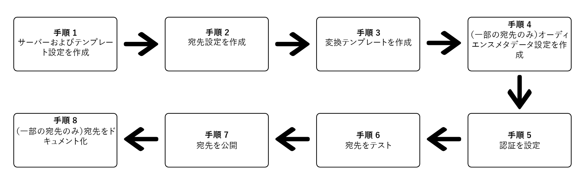

# Destination SDKを使用したストリーミング先の設定

## 概要 {#overview}

このページでは、 [宛先 SDK の設定オプション](./configuration-options.md) 他のDestination SDK機能および API リファレンスドキュメントで、 [ストリーミング先](/help/destinations/destination-types.md#streaming-destinations). 手順は、次の順に並べられます。

>[!NOTE]
>
>Destination SDKを使用したバッチ保存先の設定は、現在、サポートされていません。

## 前提条件 {#prerequisites}

以下に示す手順に進む前に、 [Destination SDKはじめに](./getting-started.md) Destination SDK API を使用するために必要なAdobe I/O認証資格情報およびその他の前提条件の取得に関する情報を含むページです。

## Destination SDKの設定オプションを使用して宛先を設定する手順 {#steps}



## 手順 1:サーバーとテンプレートの設定を作成する {#create-server-template-configuration}

まず、 `/destinations-server` endpoint （読み取り） [API リファレンス](./destination-server-api.md)) をクリックします。 サーバーとテンプレートの設定について詳しくは、 [サーバーとテンプレートの仕様](./configuration-options.md#server-and-template) を参照してください。

次に設定例を示します。 なお、 `requestBody.value` 手順 3 で指定したパラメータ [変換テンプレートを作成](./configure-destination-instructions.md#create-transformation-template).

```json
POST platform.adobe.io/data/core/activation/authoring/destination-servers

{
   "name":"Moviestar destination server",
   "destinationServerType":"URL_BASED",
   "urlBasedDestination":{
      "url":{
         "templatingStrategy":"PEBBLE_V1",
         "value":"https://api.moviestar.com/data/{{customerData.region}}/items"
      }
   },
   "httpTemplate":{
      "httpMethod":"POST",
      "requestBody":{
         "templatingStrategy":"PEBBLE_V1",
         "value":"insert after you create a template in step 3"
      },
      "contentType":"application/json"
   }
}
```

## 手順 2:宛先設定の作成 {#create-destination-configuration}

次に、を使用して作成された、宛先テンプレートの設定例を示します。 `/destinations` API エンドポイント。 このテンプレートについて詳しくは、 [宛先の設定](./destination-configuration.md).

手順 1 のサーバーとテンプレート設定をこの宛先設定に接続するには、サーバーのインスタンス ID とテンプレート設定を、 `destinationServerId` こちら。

>[!IMPORTANT]
>
>正しく設定された宛先を作成するには、次の手順を実行します。 *必須* 少なくとも 1 つのターゲット id をに追加する `identityNamespaces`、以下に示すように。 ターゲット ID が設定されていない場合、ユーザーは [マッピング手順](/help/destinations/ui/activate-segment-streaming-destinations.md#mapping) 」をクリックします。

```json
POST platform.adobe.io/data/core/activation/authoring/destinations
 
{
   "name":"Moviestar",
   "description":"Moviestar is a fictional destination, used for this example.",
   "status":"TEST",
   "customerAuthenticationConfigurations":[
      {
         "authType":"BEARER"
      }
   ],
   "customerDataFields":[
      {
         "name":"endpointsInstance",
         "type":"string",
         "title":"Select Endpoint",
         "description":"Moviestar manages several instances across the globe for REST endpoints that our customers are provisioned for. Select your endpoint in the dropdown list.",
         "isRequired":true,
         "enum":[
            "US",
            "EU",
            "APAC",
            "NZ"
         ]
      },
      {
         "name":"customerID",
         "type":"string",
         "title":"Moviestar Customer ID",
         "description":"Your customer ID in the Moviestar destination (e.g. abcdef).",
         "isRequired":true,
         "pattern":""
      }
   ],
   "uiAttributes":{
      "documentationLink":"http://www.adobe.com/go/destinations-moviestar-en",
      "category":"mobile",
      "connectionType":"Server-to-server",
      "frequency":"Streaming"
   },
   "identityNamespaces":{
      "external_id":{
         "acceptsAttributes":true,
         "acceptsCustomNamespaces":true
      },
      "another_id":{
         "acceptsAttributes":true,
         "acceptsCustomNamespaces":true
      }
   },
   "segmentMappingConfig":{
      "mapExperiencePlatformSegmentName":false,
      "mapExperiencePlatformSegmentId":false,
      "mapUserInput":false,
      "audienceTemplateId":"cbf90a70-96b4-437b-86be-522fbdaabe9c"
   },   
   "aggregation":{
      "aggregationType":"CONFIGURABLE_AGGREGATION",
      "configurableAggregation":{
         "aggregationPolicyId":null,
         "aggregationKey":{
            "includeSegmentId":true,
            "includeSegmentStatus":true,
            "includeIdentity":true,
            "oneIdentityPerGroup":true,
            "groups":null
         },
         "splitUserById":true,
         "maxBatchAgeInSecs":360,
         "maxNumEventsInBatch":100
      }
   },
   "destinationDelivery":[
      {
         "authenticationRule":"CUSTOMER_AUTHENTICATION",
         "destinationServerId":"9c77000a-4559-40ae-9119-a04324a3ecd4"
      }
   ]
}
```

## 手順 3:メッセージ変換テンプレートの作成 — テンプレート言語を使用して、メッセージの出力形式を指定します {#create-transformation-template}

宛先がサポートするペイロードに基づいて、AdobeXDM 形式から書き出されたデータの形式を、宛先でサポートされる形式に変換するテンプレートを作成する必要があります。 「 」セクションのテンプレートの例を参照してください [ID、属性、セグメントメンバーシップの変換にテンプレート言語を使用する](./message-format.md#using-templating) また、 [テンプレートオーサリングツール](./create-template.md) Adobe

自分に合ったメッセージ変換テンプレートを作成したら、そのテンプレートを手順 1 で作成したサーバーおよびテンプレート設定に追加します。

## 手順 4:オーディエンスメタデータ設定の作成 {#create-audience-metadata-configuration}

一部の宛先では、Destination SDKは、宛先のオーディエンスをプログラムで作成、更新、削除するように、オーディエンスメタデータ設定を設定する必要があります。 参照： [Audience metadata management](./audience-metadata-management.md) を参照してください。

オーディエンスメタデータ設定を使用する場合は、手順 2 で作成した宛先設定に接続する必要があります。 オーディエンスメタデータ設定のインスタンス ID を、 `audienceTemplateId`.

## 手順 5:資格情報の設定を作成/認証を設定 {#set-up-authentication}

次の項目を指定するかどうかに応じて、 `"authenticationRule": "CUSTOMER_AUTHENTICATION"` または `"authenticationRule": "PLATFORM_AUTHENTICATION"` 上記の宛先設定で、 `/destination` または `/credentials` endpoint.

* **最も一般的なケース**:選択した場合 `"authenticationRule": "CUSTOMER_AUTHENTICATION"` 宛先の設定で、宛先が OAuth 2 認証方式をサポートしている場合は、 [OAuth 2 認証](./oauth2-authentication.md).
* 選択した場合 `"authenticationRule": "PLATFORM_AUTHENTICATION"`（を参照） [認証設定](./authentication-configuration.md#when-to-use).

## 手順 6:宛先のテスト {#test-destination}

前の手順の設定エンドポイントを使用して宛先を設定した後、 [宛先テストツール](./test-destination.md) を使用して、Adobe Experience Platformと宛先の統合をテストします。

宛先をテストするプロセスの一部として、Experience PlatformUI を使用してセグメントを作成し、宛先に対してアクティブ化する必要があります。 Experience Platformでセグメントを作成する方法については、以下の 2 つのリソースを参照してください。

* [セグメントドキュメントの作成ページ](https://experienceleague.adobe.com/docs/experience-platform/segmentation/ui/overview.html?lang=en#create-segment)
* [セグメントビデオチュートリアルの作成](https://experienceleague.adobe.com/docs/platform-learn/tutorials/segments/create-segments.html?lang=en)

## 手順 7:宛先を公開 {#publish-destination}

宛先を設定およびテストした後、 [宛先公開 API](./destination-publish-api.md) 設定をレビュー用にAdobeに送信します。

## 手順 8:宛先のドキュメント化 {#document-destination}

独立系ソフトウェアベンダー (ISV) またはシステムインテグレータ (SI) の場合、 [製品化統合](./overview.md#productized-custom-integrations)、 [セルフサービスドキュメント化プロセス](./docs-framework/documentation-instructions.md) 宛先の製品ドキュメントページを [Experience Platform先カタログ](/help/destinations/catalog/overview.md).
