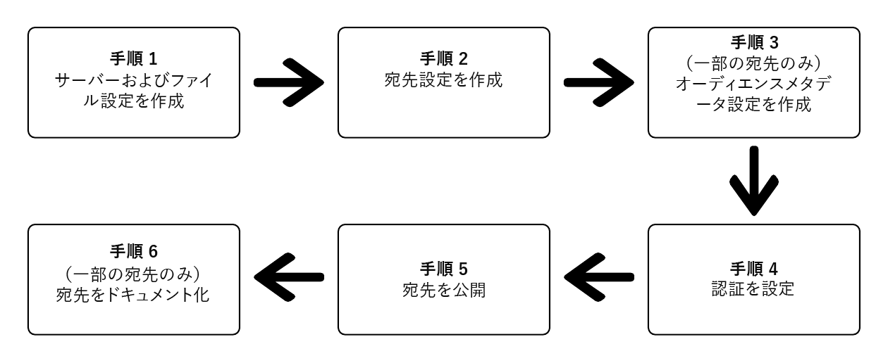

# （ベータ版）Destination SDK を使用したファイルベースの宛先の設定

## 概要 {#overview}

>[!IMPORTANT]
>
>Adobe Experience Platform Destination SDK を使用して、ファイルベースの宛先を構成および提出する機能は、現在ベータ版となっています。ドキュメントと機能は変更される場合があります。

このページでは、[Destinations SDK の設定オプション](./configuration-options.md)および他の Destination SDK 機能と API リファレンスドキュメントに記載された情報を使用して[ファイルベースの宛先](../../destinations/destination-types.md#file-based)を設定する方法を説明します。以下にその手順を、順を追って説明します。

## 前提条件 {#prerequisites}

以下に示す手順に進む前に、[Destination SDK の概要](./getting-started.md)ページを参照して、Adobe I/O 認証に必要な認証情報や、Destination SDK API を使用するためのその他の前提条件について確認してください。

## Destination SDK の構成オプションを使用して宛先を設定する手順 {#steps}



## 手順 1：サーバーとファイル設定の作成 {#create-server-file-configuration}

`/destinations-server` エンドポイントを使用して、サーバーおよびファイル設定を作成することから開始します（[API リファレンス](./destination-server-api.md)をお読みください）。

次に [!DNL Amazon S3] 宛先の設定例を示します。他のタイプのファイルベースの宛先を設定するには、対応する[サーバーの設定](server-and-file-configuration.md)を参照してください。

**API 形式**

```http
POST platform.adobe.io/data/core/activation/authoring/destination-servers
```

```json
{
    "name": "S3 destination",
    "destinationServerType": "FILE_BASED_S3",
    "fileBasedS3Destination": {
        "bucket": {
            "templatingStrategy": "PEBBLE_V1",
            "value": "{{customerData.bucket}}"
        },
        "path": {
            "templatingStrategy": "PEBBLE_V1",
            "value": "{{customerData.path}}"
        }
    },
    "fileConfigurations": {
        "compression": {
            "templatingStrategy": "PEBBLE_V1",
            "value": "{{customerData.compression}}"
        },
        "fileType": {
            "templatingStrategy": "PEBBLE_V1",
            "value": "{{customerData.fileType}}"
        },
        "csvOptions": {
            "quote": {
                "templatingStrategy": "NONE",
                "value": "\""
            },
            "quoteAll": {
                "templatingStrategy": "NONE",
                "value": "false"
            },
            "escape": {
                "templatingStrategy": "NONE",
                "value": "\\"
            },
            "escapeQuotes": {
                "templatingStrategy": "NONE",
                "value": "true"
            },
            "header": {
                "templatingStrategy": "NONE",
                "value": "true"
            },
            "ignoreLeadingWhiteSpace": {
                "templatingStrategy": "NONE",
                "value": "true"
            },
            "ignoreTrailingWhiteSpace": {
                "templatingStrategy": "NONE",
                "value": "true"
            },
            "nullValue": {
                "templatingStrategy": "NONE",
                "value": ""
            },
            "dateFormat": {
                "templatingStrategy": "NONE",
                "value": "yyyy-MM-dd"
            },
            "timestampFormat": {
                "templatingStrategy": "NONE",
                "value": "yyyy-MM-dd'T':mm:ss[.SSS][XXX]"
            },
            "charToEscapeQuoteEscaping": {
                "templatingStrategy": "NONE",
                "value": "\\"
            },
            "emptyValue": {
                "templatingStrategy": "NONE",
                "value": ""
            }
        }
    }
}
```

## 手順 2：宛先の構成の作成 {#create-destination-configuration}

次に、`/destinations` API エンドポイントを使用して作成された宛先の設定例を示します。この設定について詳しくは、[宛先の設定](./file-based-destination-configuration.md)を参照してください。

手順 1 のサーバーとファイル設定をこの宛先設定に接続するには、サーバーのインスタンス ID とテンプレート設定を `destinationServerId` のように追加します。

**API 形式**

```http
POST platform.adobe.io/data/core/activation/authoring/destinations
```

```json
{
    "name": "Amazon S3 destination",
    "description": "Amazon S3 destination is a fictional destination, used for this example.",
    "releaseNotes": "Test",
    "status": "Test",
    "customerAuthenticationConfigurations": [
        {
            "authType": "S3"
        }
    ],
    "customerEncryptionConfigurations": [],
    "customerDataFields": [
        {
            "name": "bucket",
            "title": "Amazon S3 bucket name",
            "description": "Enter the Amazon S3 Bucket name that will host the exported files.",
            "type": "string",
            "isRequired": true,
            "readOnly": false,
            "hidden": false
        },
        {
            "name": "path",
            "title": "Amazon S3 path",
            "description": "Enter Amazon S3 folder path",
            "type": "string",
            "isRequired": true,
            "pattern": "^[A-Za-z]+$",
            "readOnly": false,
            "hidden": false
        },
        {
            "name": "compression",
            "title": "Select compression type",
            "description": "Select the file compression type used by the exported files.",
            "type": "string",
            "isRequired": true,
            "readOnly": false,
            "enum": [
                "GZIP",
                "NONE",
                "bzip2",
                "lz4",
                "snappy",
                "deflate"
            ]
        },
        {
            "name": "fileType",
            "title": "Select a file format",
            "description": "Select the file format to be used by the exported files.",
            "type": "string",
            "isRequired": true,
            "readOnly": false,
            "hidden": false,
            "enum": [
                "csv",
                "json",
                "parquet"
            ],
            "default": "csv"
        }
    ],
    "uiAttributes": {
        "documentationLink": "https://www.adobe.io/apis/experienceplatform.html",
        "category": "S3",
        "iconUrl": "https://dc5tqsrhldvnl.cloudfront.net/2/90048/da276e30c730ce6cd666c8ca78360df21.png",
        "connectionType": "S3",
        "flowRunsSupported": true,
        "monitoringSupported": true,
        "frequency": "Batch"
    },
    "destinationDelivery": [
        {
            "deliveryMatchers": [
                {
                    "type": "SOURCE",
                    "value": [
                        "batch"
                    ]
                }
            ],
            "authenticationRule": "CUSTOMER_AUTHENTICATION",
            "destinationServerId": "eec25bde-4f56-4c02-a830-9aa9ec73ee9d"
        }
    ],
    "schemaConfig": {
        "profileRequired": true,
        "segmentRequired": true,
        "identityRequired": true
    },
    "batchConfig": {
        "allowMandatoryFieldSelection": true,
        "allowDedupeKeyFieldSelection": true,
        "defaultExportMode": "DAILY_FULL_EXPORT",
        "allowedExportMode": [
            "DAILY_FULL_EXPORT",
            "FIRST_FULL_THEN_INCREMENTAL"
        ],
        "allowedScheduleFrequency": [
            "DAILY",
            "EVERY_3_HOURS",
            "EVERY_6_HOURS",
            "EVERY_8_HOURS",
            "EVERY_12_HOURS",
            "ONCE"
        ],
        "defaultFrequency": "DAILY",
        "defaultStartTime": "00:00"
    },
    "backfillHistoricalProfileData": true
}
```

## 手順 3：オーディエンスメタデータ設定の作成 {#create-audience-metadata-configuration}

一部の宛先では、Destination SDK は、宛先のオーディエンスをプログラムで作成、更新、削除するように、オーディエンスメタデータを構成する必要があります。 この設定をセットアップする必要がある場合やその方法について詳しくは、[オーディエンスメタデータ管理](./audience-metadata-management.md)を参照してください。

オーディエンスメタデータの構成を使用する場合は、手順 2 で作成した宛先構成に接続する必要があります。 オーディエンスメタデータ設定のインスタンス ID を `audienceTemplateId` のように宛先設定に追加します。

## 手順 4：認証の設定 {#set-up-authentication}

前述した宛先設定で、`"authenticationRule": "CUSTOMER_AUTHENTICATION"` または `"authenticationRule": "PLATFORM_AUTHENTICATION"` を指定するかどうかに応じて、`/destination` または `/credentials` エンドポイントを使用して宛先の認証を設定できます。

* 宛先の設定で `"authenticationRule": "CUSTOMER_AUTHENTICATION"` を選択した場合、ファイルベースの宛先で Destination SDK によってサポートされる認証タイプについては、次の節を参照してください。

   * [Amazon S3 認証](authentication-configuration.md#s3)
   * [Azure Blob](authentication-configuration.md#blob)
   * [Azure Data Lake Storage](authentication-configuration.md#adls)
   * [Google Cloud Storage](authentication-configuration.md#gcs)
   * [SSH キーを使用した SFTP 認証](authentication-configuration.md#sftp-ssh)
   * [パスワードを使用した SFTP 認証](authentication-configuration.md#sftp-password)

* `"authenticationRule": "PLATFORM_AUTHENTICATION"` を選択した場合、[認証設定](./authentication-configuration.md#when-to-use)を参照してください。


<!-- ## Step 5: Test your destination {#test-destination}

After setting up your destination using the configuration endpoints in the previous steps, you can use the [destination testing tool](./create-template.md) to test the integration between Adobe Experience Platform and your destination.

As part of the process to test your destination, you must use the Experience Platform UI to create segments, which you will activate to your destination. Refer to the two resources below for instructions how to create segments in Experience Platform:

* [Create a segment documentation page](https://experienceleague.adobe.com/docs/experience-platform/segmentation/ui/overview.html?lang=en#create-segment)
* [Create a segment video walkthrough](https://experienceleague.adobe.com/docs/platform-learn/tutorials/segments/create-segments.html?lang=en) -->

## 手順 5：宛先を公開する {#publish-destination}

>[!NOTE]
>
>独自の用途でプライベートな宛先を作成し、他の顧客が使用できるように宛先カタログに公開しようとしない場合は、この手順は不要です。

宛先を設定およびテストした後、[宛先を公開する API](./destination-publish-api.md) を使用して設定をレビュー用にアドビに送信します。

## 手順 6：宛先のドキュメント化 {#document-destination}

>[!NOTE]
>
>独自の用途でプライベートな宛先を作成し、他の顧客が使用できるように宛先カタログに公開しようとしない場合は、この手順は不要です。

独立系ソフトウェアベンダー（ISV）またはシステムインテグレータ（SI）で[製品化統合](./overview.md#productized-custom-integrations)を作成する場合、[セルフサービスドキュメント化プロセス](./docs-framework/documentation-instructions.md)を使用して、宛先の製品ドキュメントページを [Experience Platform 宛先カタログ](/help/destinations/catalog/overview.md)に作成します。
