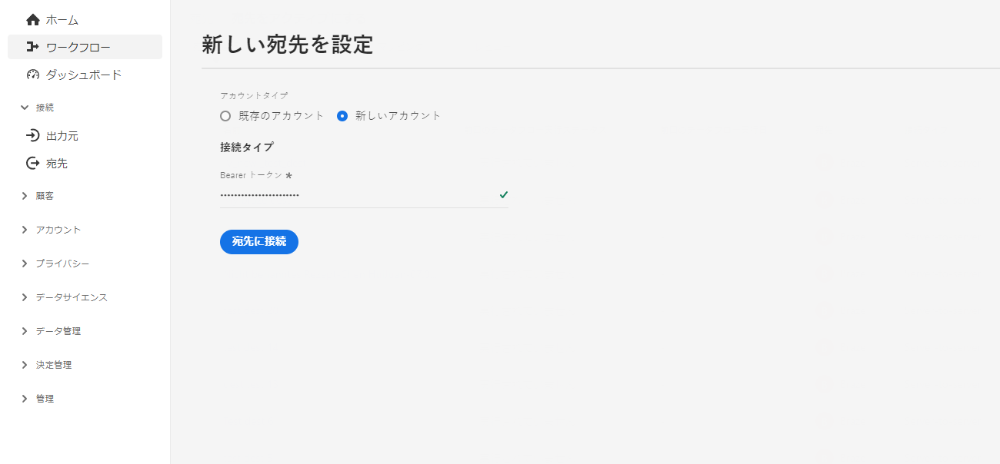
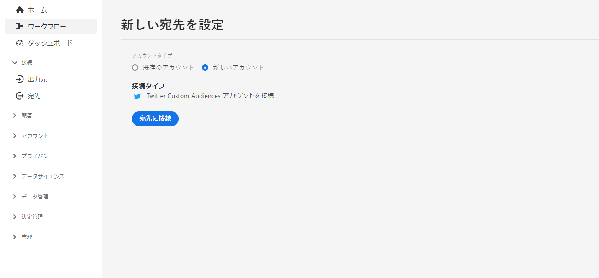

# ストリーミング先の構成 {#destination-configuration}

## 概要 {#overview}

この構成を使用すると、宛先名、カテゴリ、説明など、ストリーミング先に関する重要な情報を指定できます。 また、この構成での設定は、Experience Platform ユーザーが宛先に対して認証する方法、Experience Platform ユーザーインターフェイスに表示される方法、宛先に書き出すことができる ID も決定します。

宛先サーバーが動作するために必須である他の構成（宛先サーバーとオーディエンスメタデータ）も、この構成に接続されます。この 2 つの構成を参照する方法については、[下記の節](./destination-configuration.md#connecting-all-configurations)をお読みください。

このドキュメントで説明する機能は、`/authoring/destinations` API エンドポイントを用いて構成することができます。エンドポイントで実行できる操作の完全なリストには、[宛先 API エンドポイントの操作](./destination-configuration-api.md)をお読みください。

## ストリーミングの構成の例 {#example-configuration}

これは架空のストリーミング先である Moviestar の構成例です。同社には世界の 4 か所にエンドポイントがあります。 宛先は、モバイル宛先カテゴリに属しています。

```json
{
   "name":"Moviestar",
   "description":"Moviestar is a fictional destination, used for this example.",
   "status":"TEST",
   "customerAuthenticationConfigurations":[
      {
         "authType":"BEARER"
      }
   ],
   "customerDataFields":[
      {
         "name":"endpointRegion",
         "type":"string",
         "title":"Select Endpoint",
         "description":"Moviestar manages several instances across the globe for REST endpoints that our customers are provisioned for. Select your endpoint in the dropdown list.",
         "isRequired":true,
         "enum":[
            "US",
            "EU",
            "APAC",
            "NZ"
         ]
      },
      {
         "name":"customerID",
         "type":"string",
         "title":"Moviestar Customer ID",
         "description":"Your customer ID in the Moviestar destination (e.g. abcdef).",
         "isRequired":true,
         "pattern":"^[A-Za-z]+$"
      }
   ],
   "uiAttributes":{
      "documentationLink":"http://www.adobe.com/go/destinations-moviestar-en",
      "category":"mobile",
      "connectionType":"Server-to-server",
      "frequency":"Streaming"
   },
   "identityNamespaces":{
      "external_id":{
         "acceptsAttributes":true,
         "acceptsCustomNamespaces":true,
         "acceptedGlobalNamespaces":{
            "Email":{
               
            }
         }
      },
      "another_id":{
         "acceptsAttributes":true,
         "acceptsCustomNamespaces":true
      }
   },
   "schemaConfig":{
      "profileRequired":false,
      "segmentRequired":true,
      "identityRequired":true
   },
   "destinationDelivery":[
      {
         "authenticationRule":"CUSTOMER_AUTHENTICATION",
         "destinationServerId":"9c77000a-4559-40ae-9119-a04324a3ecd4"
      }
   ],
   "segmentMappingConfig":{
      "mapExperiencePlatformSegmentName":false,
      "mapExperiencePlatformSegmentId":false,
      "mapUserInput":false,
      "audienceTemplateId":"cbf90a70-96b4-437b-86be-522fbdaabe9c"
   },
   "aggregation":{
      "aggregationType":"CONFIGURABLE_AGGREGATION",
      "configurableAggregation":{
         "splitUserById":true,
         "maxBatchAgeInSecs":2400,
         "maxNumEventsInBatch":5000,
         "aggregationKey":{
            "includeSegmentId":true,
            "includeSegmentStatus":true,
            "includeIdentity":true,
            "oneIdentityPerGroup":true,
            "groups":[
               {
                  "namespaces":[
                     "IDFA",
                     "GAID"
                  ]
               },
               {
                  "namespaces":[
                     "EMAIL"
                  ]
               }
            ]
         }
      }
   },
   "backfillHistoricalProfileData":true
}
```

| パラメーター | タイプ | 説明 |
|---------|----------|------|
| `name` | 文字列 | Experience Platform カタログ内の宛先のタイトルを示します。 |
| `description` | 文字列 | Experience Platform 宛先カタログで、宛先カードの説明を提供します。4 ～ 5 文以下を目指します。 |
| `status` | 文字列 | 宛先カードのライフサイクルステータスを示します。 指定できる値は、`TEST`、`PUBLISHED`、`DELETED` です。最初に宛先を設定するときは、`TEST` を使用します。 |

{style="table-layout:auto"}

## 顧客認証の構成 {#customer-authentication-configurations}

宛先の構成内のこのセクションは、Experience Platform ユーザーインターフェイスの[新しい宛先の構成](/help/destinations/ui/connect-destination.md)ページを生成し、顧客が宛先で持っているアカウントに Experience Platform を接続します。`authType` フィールドで指定した認証オプションに応じて、次のようにユーザー用の Experience Platform ページが生成されます。

### ベアラー認証

ベアラー認証タイプを設定する場合、ユーザーは接続先から取得したベアラートークンを入力する必要があります。



### OAuth 2 認証

ユーザーが「**[!UICONTROL 宛先に接続]**」を選択すると、以下の Twitter カスタムオーディエンスの宛先の例のように、宛先への OAuth 2 認証フローがトリガーされます。宛先エンドポイントへの OAuth 2 認証の設定について詳しくは、専用の [Destination SDK OAuth 2 認証ページ](./oauth2-authentication.md)をお読みください。



| パラメーター | タイプ | 説明 |
|---------|----------|------|
| `customerAuthenticationConfigurations` | 文字列 | Experience Platform の顧客をサーバーで認証するために使用される構成を示します。 使用可能な値については、下記の `authType` を参照してください。 |
| `authType` | 文字列 | ストリーミング先として使用可能な値は、以下のとおりです。<ul><li>`BASIC`。宛先が基本認証をサポートしている場合は、 `"authType":"Basic"` および  `"authenticationRule":"CUSTOMER_AUTHENTICATION"` 内 [宛先の配信セクション](./destination-configuration.md).</li><li>`BEARER`。宛先がベアラー認証をサポートしている場合、`"authType":"Bearer"` および `"authenticationRule":"CUSTOMER_AUTHENTICATION"` を[宛先の配信セクション](./destination-configuration.md)内に設定します。</li><li>`OAUTH2`。宛先が OAuth 2 認証をサポートしている場合は、`"authType":"OAUTH2"` を [Destination SDK OAuth 2 認証ページ](./oauth2-authentication.md)に記載されているように設定し、OAuth 2 の必須フィールドを追加します。さらに、`"authenticationRule":"CUSTOMER_AUTHENTICATION"` を[宛先配信セクション](./destination-configuration.md)に設定します。</li> |

{style="table-layout:auto"}

## 顧客データフィールド {#customer-data-fields}

Experience Platform UI で宛先に接続する際に、このセクションを使用して、宛先に固有のカスタムフィールドに入力するようユーザーに求めます。次に示すように、設定は認証フローに反映されます。


>[!TIP]
>
>顧客入力にアクセスし、テンプレートで顧客データフィールドから顧客入力を使用できます。 マクロを使用する `{{customerData.name}}`. 例えば、ユーザーに対し、 `userId`を使用すると、マクロを使用してテンプレートにアクセスできます `{{customerData.userId}}`. の API エンドポイントの URL で顧客データフィールドがどのように使用されているかの例を表示します [宛先サーバーの設定](/help/destinations/destination-sdk/server-and-template-configuration.md#server-specs).

| パラメーター | タイプ | 説明 |
|---------|----------|------|
| `name` | 文字列 | 導入するカスタムフィールドの名前を記入します。 |
| `type` | 文字列 | 導入するカスタムフィールドのタイプを示します。 使用できる値は `string`、`object`、`integer` です。 |
| `title` | 文字列 | Experience Platform のユーザーインターフェースで顧客に表示される、フィールドの名前を示します。 |
| `description` | 文字列 | カスタムフィールドの説明を入力します。 |
| `isRequired` | ブール値 | このフィールドが宛先設定ワークフローで必須かどうかを示します。 |
| `enum` | 文字列 | カスタムフィールドをドロップダウンメニューとしてレンダリングし、ユーザーが使用できるオプションを一覧表示します。 |
| `pattern` | 文字列 | 必要に応じて、カスタムフィールドのパターンを適用します。正規表現を使用して、パターンを適用します。 例えば、顧客 ID に数字やアンダースコアが含まれない場合は、このフィールドに「`^[A-Za-z]+$`」と入力します。 |

{style="table-layout:auto"}

## UI 属性 {#ui-attributes}

この節では、Adobe Experience Platform ユーザーインターフェイスで宛先に対してアドビが使用する、上記の設定の UI 要素について説明します。次を参照してください。


| パラメーター | タイプ | 説明 |
|---------|----------|------|
| `documentationLink` | 文字列 | 宛先用の[宛先のカタログ](https://experienceleague.adobe.com/docs/experience-platform/destinations/catalog/overview.html?lang=ja#catalog)にあるドキュメントページを参照します。`http://www.adobe.com/go/destinations-YOURDESTINATION-en` を使用します。ここでは、`YOURDESTINATION` は宛先の名前です。Moviestar という宛先の場合、`http://www.adobe.com/go/destinations-moviestar-en` を使用します。。このリンクは、Adobeが宛先をライブに設定し、ドキュメントが公開された後にのみ機能します。 |
| `category` | 文字列 | Adobe Experience Platform で宛先に割り当てられたカテゴリを参照します。 詳しくは、[宛先のカテゴリ](https://experienceleague.adobe.com/docs/experience-platform/destinations/destination-types.html?lang=ja)をお読みください。次のいずれかの値を使用します：`adobeSolutions, advertising, analytics, cdp, cloudStorage, crm, customerSuccess, database, dmp, ecommerce, email, emailMarketing, enrichment, livechat, marketingAutomation, mobile, personalization, protocols, social, streaming, subscriptions, surveys, tagManagers, voc, warehouses, payments`<br> 現在、宛先ごとに 1 つのカテゴリのみを選択できます。 |
| `connectionType` | 文字列 | `Server-to-server` は現在利用可能な唯一のオプションです。 |
| `frequency` | 文字列 | 宛先でサポートされているデータ書き出しのタイプを指します。 サポートされている値。 <ul><li>`Streaming`</li><li>`Batch`</li></ul> |

{style="table-layout:auto"}

## マッピングステップのスキーマ構成 {#schema-configuration}


`schemaConfig` のパラメーターを使用して、宛先のアクティベーションのワークフローのマッピングステップを有効にします。以下に説明するパラメーターを使用することで、Experience Platform ユーザーがプロファイル属性や ID を宛先側の目的のスキーマにマッピングできるかどうかを判断できます。

| パラメーター | タイプ | 説明 |
|---------|----------|------|
| `profileFields` | 配列 | *上記の構成例では示されていません。* 定義済みの `profileFields`を追加する場合、Experience Platform ユーザーは、Platform 属性を宛先側の事前定義済み属性にマッピングするオプションがあります。 |
| `profileRequired` | ブール値 | 上記の設定例に示すように、ユーザーが Experience Platform から宛先側のカスタム属性にプロファイル属性をマッピングできる場合、`true` を使用します。 |
| `segmentRequired` | ブール値 | 常に `segmentRequired:true` を使用します。 |
| `identityRequired` | ブール値 | ユーザーが、Experience Platform から希望のスキーマに ID 名前空間をマッピングできるようにする場合、`true` を使用します。 |

{style="table-layout:auto"}

## ID と属性 {#identities-and-attributes}

このセクションのパラメーターは、宛先がどの ID を受け入れるかを決定します。また、この構成は、Experience Platform ユーザーインターフェースの[マッピングステップ](/help/destinations/ui/activate-segment-streaming-destinations.md#mapping)で、ユーザーが XDM スキーマから宛先のスキーマに ID や属性をマッピングする際のターゲット ID や属性にも入力されます。

どの [!DNL Platform] ID の顧客が宛先に書き出すことができるかを示す必要があります。例として、[!DNL Experience Cloud ID]、ハッシュ化されたメール、デバイス ID（[!DNL IDFA]、[!DNL GAID]）などがあります。これらの値は、[!DNL Platform] ID 名前空間であり、宛先から顧客が ID 名前空間にマッピングできます。また、顧客が宛先 (`acceptsCustomNamespaces: true`) と、お客様が、標準の XDM 属性を、宛先 (`acceptsAttributes: true`) をクリックします。

ID 名前空間は、[!DNL Platform] と宛先が 1 対 1 で対応している必要はありません。
例えば、顧客は [!DNL Platform] [!DNL IDFA] 名前空間を宛先からの [!DNL IDFA] 名前空間にマッピングすることができ、また顧客は同じ [!DNL Platform] [!DNL IDFA] 名前空間を宛先の [!DNL Customer ID] 名前空間にマッピングすることもできます。

詳しくは、 [ID 名前空間の概要](/help/identity-service/namespaces.md).


| パラメーター | タイプ | 説明 |
|---------|----------|------|
| `acceptsAttributes` | ブール値 | お客様が、設定中の ID に標準プロファイル属性をマッピングできるかどうかを示します。 |
| `acceptsCustomNamespaces` | ブール値 | 顧客が宛先でカスタム名前空間を設定できるかどうかを示します。 |
| `transformation` | 文字列 | *サンプル設定には表示されません*。例えば、[!DNL Platform] の顧客が属性としてプレーンなメールアドレスを持っており、プラットフォームがハッシュ化されたメールのみを受け取る場合に使用します。 このオブジェクトでは、適用する必要のある変換（例えば、メールを小文字に変換してからハッシュ化する）を実施できます。 例については、`requiredTransformation` を参照してください（[宛先設定 API リファレンス](./destination-configuration-api.md#update)内）。 |
| `acceptedGlobalNamespaces` | - | どれが [標準 id 名前空間](/help/identity-service/namespaces.md#standard) （例えば、IDFA）のお客様は、設定中の ID にマッピングできます。 <br> `acceptedGlobalNamespaces` を使用する場合、`"requiredTransformation":"sha256(lower($))"` を使用すれば、メールアドレスまたは電話番号を小文字に変換してハッシュ化できます。 |

{style="table-layout:auto"}

## 宛先配信 {#destination-delivery}

| パラメーター | タイプ | 説明 |
|---------|----------|------|
| `authenticationRule` | 文字列 | [!DNL Platform] の顧客が宛先に接続する方法を示します。使用できる値は `CUSTOMER_AUTHENTICATION`、`PLATFORM_AUTHENTICATION`、`NONE`、<br> です。 <ul><li>Platform の顧客がユーザー名とパスワード、ベアラートークン、または他の認証方法を使用してシステムにログインする場合は、`CUSTOMER_AUTHENTICATION` を使用します。例えば、`customerAuthenticationConfigurations` で `authType: OAUTH2` や `authType:BEARER` も選択した場合、このオプションを選択することになります。 </li><li> アドビと接続先との間にグローバル認証システムがあり、[!DNL Platform] の顧客が接続先に認証資格情報を提供する必要がない場合は、`PLATFORM_AUTHENTICATION` を使用してください。この場合、[資格情報](./credentials-configuration-api.md)の構成を使用して、資格情報オブジェクトを作成する必要があります。 </li><li>宛先プラットフォームにデータを送信するために認証が必要ない場合は、`NONE` を使用します。 </li></ul> |
| `destinationServerId` | 文字列 | `instanceId`：この宛先に使用される[宛先サーバー構成](./destination-server-api.md)。 |

{style="table-layout:auto"}

## セグメントマッピングの構成 {#segment-mapping}


宛先設定の当該セクションは、セグメント名や ID などのセグメントメタデータを Experience Platform と宛先間で共有する方法に関する内容です。

また、`audienceTemplateId` を通じて、このセクションはこの構成と[オーディエンスメタデータの構成](./audience-metadata-management.md)を結びつけています。

上記の構成で示されたパラメーターは、[宛先エンドポイント API リファレンス](./destination-configuration-api.md)に記載されています。

## 集計ポリシー {#aggregation}


このセクションでは、Experience Platform がデータを書き出す際に使用する集計ポリシーを設定できます。

集計ポリシーは、書き出されたプロファイルがデータの書き出しでどのように結合されるかを決定します。 利用可能なオプションは次のとおりです。
* ベストエフォート集計
* 構成可能な集計（上記の構成を参照）

[テンプレートの使用](./message-format.md#using-templating)に関する節と[集計の主な例](./message-format.md#template-aggregation-key)を読んで、選択した集約ポリシーに基づいてメッセージ変換テンプレートに集約ポリシーを含める方法を理解します。

### ベストエフォート集計 {#best-effort-aggregation}

>[!TIP]
>
>API エンドポイントが 1 回の API 呼び出しで受け入れるプロファイルが 100 個未満の場合、このオプションを使用します。

このオプションでは、リクエストあたりのプロファイル数が少ないほうが好まれ、多くのデータで少ない数のリクエストを受けるよりも、少ないデータで多くのリクエストを受けることを希望する宛先に最適です。

`maxUsersPerRequest` パラメータを使用して、宛先がリクエストで受け取ることができるプロファイルの最大数を指定します。

### 構成可能な集計 {#configurable-aggregation}

このオプションは、同じ呼び出しに何千ものプロファイルを含む、大きなバッチを取りたい場合に最適です。また、このオプションを使用すると、複雑な集計ルールに基づいて、書き出されたプロファイルを集計できます。

このオプションを使用すると、次のことが可能です。

* 宛先に対する API 呼び出しが行われるまでの最大時間およびプロファイルの最大数を集計するように設定します。
* 次の条件に基づいて、宛先にマッピングされた書き出し済みのプロファイルを集計します。
   * セグメント ID：
   * セグメントのステータス：
   * ID または ID のグループ。

>[!NOTE]
>
>宛先に設定可能な集計オプションを使用する場合は、2 つのパラメーターに使用できる最小値と最大値に注意してください `maxBatchAgeInSecs` （1,800 以上 3,600 以下） `maxNumEventsInBatch` （最小 1,000、最大 10,000）。

集計パラメータの詳細な説明は、[Destinations API エンドポイントの操作](./destination-configuration-api.md)のリファレンスページで各パラメータの説明を参照してください。

## プロファイル選定履歴 {#profile-backfill}

宛先の設定にある `backfillHistoricalProfileData` パラメーターを使用すると、履歴プロファイルの選定を宛先に書き出す必要があるかどうかを決定することができます。

| パラメーター | タイプ | 説明 |
|---------|----------|------|
| `backfillHistoricalProfileData` | ブール値 | 宛先に対してセグメントをアクティブ化する際に、履歴プロファイルデータを書き出すかどうかを制御します。 <br> <ul><li> `true`：[!DNL Platform] は、セグメントがアクティブ化される前に、セグメントに適格となる履歴ユーザープロファイルを送信します。 </li><li> `false`：[!DNL Platform] には、セグメントがアクティブ化された後にセグメントに適格となるユーザープロファイルのみが含まれます。 </li></ul> |

{style="table-layout:auto"}

## この構成が宛先に必要なすべての情報をどのように接続するか {#connecting-all-configurations}

宛先設定の一部は、[宛先サーバー](./server-and-template-configuration.md)または[オーディエンスメタデータの構成](./audience-metadata-management.md)で構成する必要があります。ここで説明する宛先の構成は、以下のように他の 2 つの構成を参照することで、これらの設定をすべて接続するものです。

* `destinationServerId` を使用して、宛先サーバーと宛先に設定されたテンプレート構成を参照します。
* `audienceMetadataId` を使用して、宛先に設定されたオーディエンスメタデータの構成を参照します。