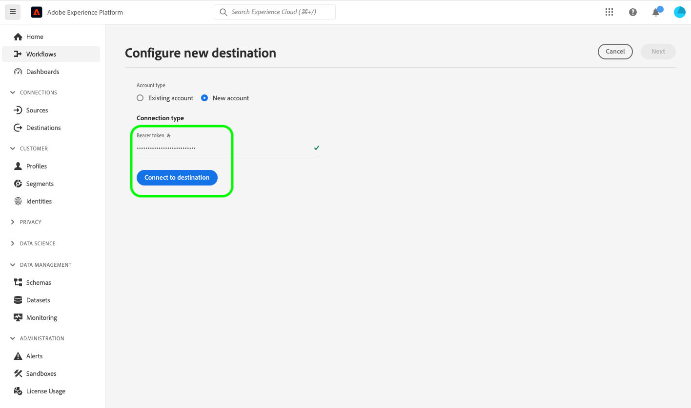
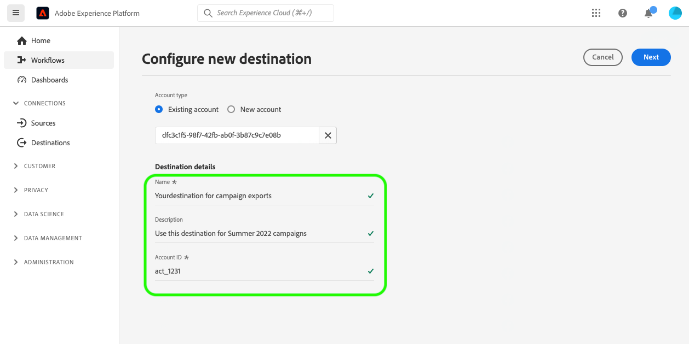

# YourDestination connection {#your-destination}

*このテンプレートを使用する際に、斜体のすべての段落（この段落から始まる）を置き換えるか削除します。*

*最初に、ページ上部のメタデータ（タイトルと説明）を更新します。 このページのUICONTROLのすべてのインスタンスを無視してください。 これは、機械翻訳プロセスが適切にサポートする複数の言語にページを翻訳するのに役立つタグです。 ドキュメントを送信すると、ドキュメントにタグが追加されます。*

>[!IMPORTANT]
>
>* このテンプレートのすべてのセクションを、テンプレートで概説されている順序で入力します。
>* パートナーからのフィードバックにもとづいて、このテンプレートは頻繁に更新されます。 宛先用のドキュメントのオーサリングを開始する前に、[テンプレートの最新バージョン](../assets/docs-framework/yourdestination-template.zip)をダウンロードしていることを確認してください。

## 概要 {#overview}

*顧客に提供する価値を含め、会社の概要を簡単に説明します。 製品ドキュメントのホームページへのリンクを追加して、詳細をご覧ください。*

>[!IMPORTANT]
>
>この宛先コネクタとドキュメント ページは、*YourDestination* チームによって作成および管理されています。 お問い合わせやアップデートのリクエストについては、*リンクまたはメールアドレスを挿入してアップデートを行ってください（例：`support@YourDestination.com`.*）。

## ユースケース {#use-cases}

*YourDestination*&#x200B;宛先を使用する方法とタイミングをより深く理解するために、[!DNL Adobe Experience Platform]のお客様がこの宛先を使用して解決できるユースケースの例を次に示します。

### ユースケース #1 {#use-case-1}

*モバイルメッセージングプラットフォームの場合：*

*住宅レンタルおよび販売プラットフォームは、顧客のAndroidおよびiOS デバイスにモバイル通知をプッシュして、以前にレンタルを検索した地域に100件の更新リストがあることを知らせたいと考えています。*

### ユースケース #2 {#use-case-2}

*ソーシャルネットワーク プラットフォームの場合：*

*スポーツウェア企業が、ソーシャルメディアのアカウントを通じて既存顧客にリーチしようとしている。 アパレル企業は、自社のCRMから[!DNL Adobe Experience Platform]にメールアドレスを取り込み、自社のオフラインデータからオーディエンスを構築し、これらのオーディエンスをYourDestinationに送信して、顧客のソーシャルメディアフィードに広告を表示することができます。*

## 前提条件 {#prerequisites}

*このセクションでは、[!DNL Adobe Experience Platform] ユーザーインターフェイスで宛先の設定を開始する前に、お客様が認識しておく必要があるすべての情報を追加します。 次の程度である可能性があります：*

* *様は許可リストに追加する必要があります*
* *電子メールハッシュの要件*
* *お客様の側にあるアカウントの詳細*
* *プラットフォームに接続するためのAPI キーを取得する方法*

*お客様にとって有益な場合は、関連ドキュメントにリンクすることができます。*

## サポートされている ID {#supported-identities}

*宛先でサポートされているIDに関する情報をこのセクションに追加します。 テーブルに標準値が事前に入力されています。 宛先に適用されない値を削除するか、事前入力されていない値を追加します。*

*YourDestination*&#x200B;は、次の表に示すIDのアクティブ化をサポートしています。 [ID](/help/identity-service/features/namespaces.md) についての詳細情報。

| ターゲット ID | 説明 | 注意点 |
|---|---|---|
| GAID | GOOGLE ADVERTISING ID | ソース IDがGAID名前空間である場合は、GAID ターゲット IDを選択します。 |
| IDFA | Apple の広告主 ID | ソース IDがIDFA名前空間の場合は、IDFA ターゲット IDを選択します。 |
| ECID | Experience Cloud ID | ECIDを表す名前空間。 この名前空間は、「Adobe Marketing Cloud ID」、「[!DNL Adobe Experience Cloud] ID」、「[!DNL Adobe Experience Platform] ID」というエイリアスでも参照できます。 詳しくは、[ECID](/help/identity-service/features/ecid.md)に関する次のドキュメントを参照してください。 |
| phone_sha256 | SHA256 アルゴリズムでハッシュ化された電話番号 | プレーンテキストとSHA256 ハッシュ化された電話番号の両方が[!DNL Adobe Experience Platform]でサポートされています。 ソースフィールドにハッシュ化されていない属性が含まれている場合は、**[!UICONTROL Apply transformation]** オプションをチェックして、[!DNL Experience Platform]がアクティベーション時にデータを自動的にハッシュします。 |
| email_lc_sha256 | SHA256 アルゴリズムでハッシュ化されたメールアドレス | プレーンテキストとSHA256 ハッシュ化された電子メールアドレスの両方が[!DNL Adobe Experience Platform]でサポートされています。 ソースフィールドにハッシュ化されていない属性が含まれている場合は、**[!UICONTROL Apply transformation]** オプションをチェックして、[!DNL Experience Platform]がアクティベーション時にデータを自動的にハッシュします。 |
| extern_id | カスタムユーザーID | ソース IDがカスタム名前空間である場合は、このターゲット IDを選択します。 |

{style="table-layout:auto"}

## サポートされるオーディエンス {#supported-audiences}

*このセクションでは、宛先でサポートされているオーディエンスに関する情報を追加します。 テーブルには、いくつかの標準値が事前に入力されています。 `Yes`と`No`を使用して、この宛先でオーディエンスタイプがサポートされているかどうかをマークします。*

この節では、この宛先に書き出すことができるオーディエンスのタイプについて説明します。

| オーディエンスの由来 | サポートあり | 説明 |
|---------|----------|----------|
| [!DNL Segmentation Service] | ○ | Experience Platform [ セグメント化サービス ](../../../segmentation/home.md)を通じて生成されたオーディエンス。 |
| その他すべてのオーディエンスの生成元 | ○ | このカテゴリには、[!DNL Segmentation Service]を通じて生成されたオーディエンス以外のすべてのオーディエンスのオリジンが含まれます。 [様々なオーディエンスの起源](/help/segmentation/ui/audience-portal.md#customize)について読みます。 次に例を示します。 <ul><li> カスタムアップロードオーディエンス [がCSV ファイルからExperience Platformに](../../../segmentation/ui/audience-portal.md#import-audience)をインポートしました。</li><li> 類似オーディエンス， </li><li> 連合オーディエンス， </li><li> [!DNL Adobe Journey Optimizer]などの他のExperience Platform アプリで生成されたオーディエンス </li><li> その他。 </li></ul> |

{style="table-layout:auto"}

オーディエンスのデータタイプ別にサポートされるオーディエンス：

| オーディエンスのデータタイプ | サポートあり | 説明 | ユースケース |
|--------------------|-----------|-------------|-----------|
| [人物オーディエンス ](/help/segmentation/types/people-audiences.md) | ○ | 顧客プロファイルにもとづいて、マーケティング施策の特定のグループをターゲットにすることができます。 | 買い物客やカートの放棄が多い |
| [ アカウントオーディエンス ](/help/segmentation/types/account-audiences.md) | ○ | アカウントベースドマーケティング戦略のために、特定の組織内の個人をターゲットにします。 | B2B マーケティング |
| [見込みオーディエンス ](/help/segmentation/types/prospect-audiences.md) | ○ | まだ顧客ではないが、ターゲットオーディエンスと特徴を共有する個人をターゲットにします。 | サードパーティデータによる見込み顧客の開拓 |
| [ データセットの書き出し](/help/catalog/datasets/overview.md) | ○ | [!DNL Adobe Experience Platform] データ レイクに保存されている構造化データのコレクション。 | レポート，データサイエンスワークフロー |

{style="table-layout:auto"}

## 書き出しのタイプと頻度 {#export-type-frequency}

*テーブル内では、宛先に対応する行のみを保持します。 書き出しタイプには1行、書き出し頻度には1行を指定する必要があります。 宛先に適用されない値を削除します。*

宛先の書き出しのタイプと頻度について詳しくは、以下の表を参照してください。

| 項目 | タイプ | メモ |
|---------|----------|---------|
| 書き出しタイプ | **[!UICONTROL Audience export]** | *YourDestination*&#x200B;宛先で使用されている識別子（名前、電話番号など）を持つオーディエンスのすべてのメンバーを書き出しています。 |
| 書き出しタイプ | **[!UICONTROL Profile-based]** | [宛先アクティベーションワークフロー](/help/destinations/ui/activate-batch-profile-destinations.md#select-attributes)の「プロファイル属性を選択」画面で選択した目的のスキーマフィールド（電子メールアドレス、電話番号、姓など）と共に、オーディエンスのすべてのメンバーを書き出します。 |
| 書き出しタイプ | **[!UICONTROL Dataset export]** | 生のデータセットを書き出します。これらのデータセットは、オーディエンスの興味や資格によってグループ化または構造化されていません。 |
| 書き出し頻度 | **[!UICONTROL Streaming]** | ストリーミングの宛先は常に、API ベースの接続です。オーディエンス評価に基づいて Experience Platform 内でプロファイルが更新されるとすぐに、コネクタは更新を宛先プラットフォームに送信します。[ストリーミングの宛先](/help/destinations/destination-types.md#streaming-destinations)の詳細についてはこちらを参照してください。 |
| 書き出し頻度 | **[!UICONTROL Batch]** | バッチ宛先では、ファイルが 3 時間、6 時間、8 時間、12 時間、24 時間の単位でダウンストリームプラットフォームに書き出されます。 詳しくは、[バッチ（ファイルベース）宛先](/help/destinations/destination-types.md#file-based)を参照してください。 |

{style="table-layout:auto"}

## 宛先への接続 {#connect}

>[!IMPORTANT]
>
>宛先に接続するには、**[!UICONTROL View Destinations]**&#x200B;および&#x200B;**[!UICONTROL Manage Destinations]** [ アクセス制御権限](/help/access-control/home.md#permissions)が必要です。 詳しくは、[アクセス制御の概要](/help/access-control/ui/overview.md)または製品管理者に問い合わせて、必要な権限を取得してください。

この宛先に接続するには、[宛先設定のチュートリアル](../../ui/connect-destination.md)の手順に従ってください。宛先の設定ワークフローで、以下の 2 つのセクションにリストされているフィールドに入力します。

### 宛先に対する認証 {#authenticate}

*宛先に対する認証時に顧客が入力する必要があるフィールドを追加します。 これらのフィールドは宛先固有で、Destination SDKの設定に依存します。 宛先のフィールドは、以下に示すフィールドと異なる場合があります。 また、以下に示すサンプルのスクリーンショットと同様のスクリーンショットも含めてください。*

宛先に対して認証を行うには、必須フィールドに入力し、**[!UICONTROL Connect to destination]**&#x200B;を選択します。

宛先への認証方法を示す

* **[!UICONTROL Bearer token]**: ベアラートークンを入力して、宛先に対する認証を行います。

### 宛先の詳細の入力 {#destination-details}

*新しい宛先を設定する際に顧客が入力する必要があるフィールドを追加します。 これらのフィールドは宛先固有で、Destination SDKの設定に依存します。 宛先のフィールドは、以下に示すフィールドと異なる場合があります。 また、以下に示すサンプルのスクリーンショットと同様のスクリーンショットも含めてください。*

宛先の詳細を設定するには、以下の必須フィールドとオプションフィールドに入力します。UI のフィールドの横のアスタリスクは、そのフィールドが必須であることを示します。

宛先の詳細を入力する方法を示す

* **[!UICONTROL Name]**：今後この宛先を認識する際に使用する名前。
* **[!UICONTROL Description]**：今後この宛先を特定するのに役立つ説明です。
* **[!UICONTROL Account ID]**: *YourDestination* アカウント ID。

### アラートの有効化 {#enable-alerts}

アラートを有効にすると、宛先へのデータフローのステータスに関する通知を受け取ることができます。リストからアラートを選択して、データフローのステータスに関する通知を受け取るよう登録します。アラートについて詳しくは、[UI を使用した宛先アラートの購読](../../ui/alerts.md)に関するガイドを参照してください。

宛先接続の詳細の提供が完了したら、**[!UICONTROL Next]**&#x200B;を選択します。

## この宛先に対してオーディエンスをアクティブ化 {#activate}

>[!IMPORTANT]
>
>* データをアクティブ化するには、**[!UICONTROL View Destinations]**、**[!UICONTROL Activate Destinations]**、**[!UICONTROL View Profiles]**&#x200B;および&#x200B;**[!UICONTROL View Segments]** [ アクセス制御権限](/help/access-control/home.md#permissions)が必要です。 [アクセス制御の概要](/help/access-control/ui/overview.md)を参照するか、製品管理者に問い合わせて必要な権限を取得してください。
>* *ID*&#x200B;をエクスポートするには、**[!UICONTROL View Identity Graph]** [ アクセス制御権限](/help/access-control/home.md#permissions)が必要です。<br> {width="100" zoomable="yes"}

*必要に応じて削除 – 新しいストリーミング宛先を文書化する場合は、下の最初の段落を残します。 新しいファイルベースの宛先を文書化する場合は、2番目の段落を残します。 データセットを書き出す宛先を文書化する場合は、3番目の段落を残します。*

この宛先にオーディエンスをアクティベートする手順は、[ストリーミングオーディエンスの書き出し宛先へのプロファイルとオーディエンスのアクティベート](/help/destinations/ui/activate-segment-streaming-destinations.md)を参照してください。

この宛先に対してオーディエンスをアクティブ化する手順については、[バッチプロファイル書き出し宛先に対するオーディエンスデータのアクティブ化](/help/destinations/ui/activate-batch-profile-destinations.md)を参照してください。

データセットをこの宛先に書き出す詳細な手順については、[ （Beta）データセットの書き出し](/help/destinations/ui/export-datasets.md)を参照してください。

### 属性と ID のマッピング {#map}

*アクティベーション ワークフローのマッピング ステップで、ソース フィールドとターゲット フィールド間でサポートされているマッピングに関する情報を追加します。 宛先は、プロファイル属性、ID名前空間、またはその両方の書き出しをサポートしている場合があります。 一部のフィールドは必須の場合があります。 ターゲット属性は、定義済みまたはカスタムである場合があります。 重要な注意事項を説明し、スクリーンショットなどで例を使用します。 参照として使用できる宛先ページの2つの例は次のとおりです。*

* *[ペガ](/help/destinations/catalog/personalization/pega.md#mapping-example)*
* *[メダリア](/help/destinations/catalog/voice/medallia-connector.md#map)*

## 書き出されたデータ／データ書き出しの検証 {#exported-data}

*データを宛先に書き出す方法に関する段落を追加します。 これにより、顧客は宛先と正しく統合されていることを確認できます。 例えば、次のようなJSONのサンプルを指定できます。 または、宛先のインターフェイスからスクリーンショットと情報を提供して、顧客が宛先プラットフォームにオーディエンスが入力されることを期待する方法を示すこともできます。*

```json
{
  "person": {
    "email": "yourstruly@adobe.com"
  },
  "segmentMembership": {
    "ups": {
      "7841ba61-23c1-4bb3-a495-00d3g5fe1e93": {
        "lastQualificationTime": "2020-05-25T21:24:39Z",
        "status": "exited"
      },
      "59bd2fkd-3c48-4b18-bf56-4f5c5e6967ae": {
        "lastQualificationTime": "2020-05-25T23:37:33Z",
        "status": "realized"
      }
    }
  },
  "identityMap": {
    "ecid": [
      {
        "id": "14575006536349286404619648085736425115"
      },
      {
        "id": "66478888669296734530114754794777368480"
      }
    ],
    "email_lc_sha256": [
      {
        "id": "655332b5fa2aea4498bf7a290cff017cb4"
      },
      {
        "id": "66baf76ef9de8b42df8903f00e0e3dc0b7"
      }
    ]
  }
}
```

## データの使用とガバナンス {#data-usage-governance}

[!DNL Adobe Experience Platform] のすべての宛先は、データを処理する際のデータ使用ポリシーに準拠しています。[!DNL Adobe Experience Platform] がどのように データガバナンスを実施するかについて詳しくは、[データガバナンスの概要](/help/data-governance/home.md)を参照してください。

## その他のリソース {#additional-resources}

*製品ドキュメントや、お客様が成功するために重要と考えるその他のリソースへの詳細なリンクを提供できます。*
