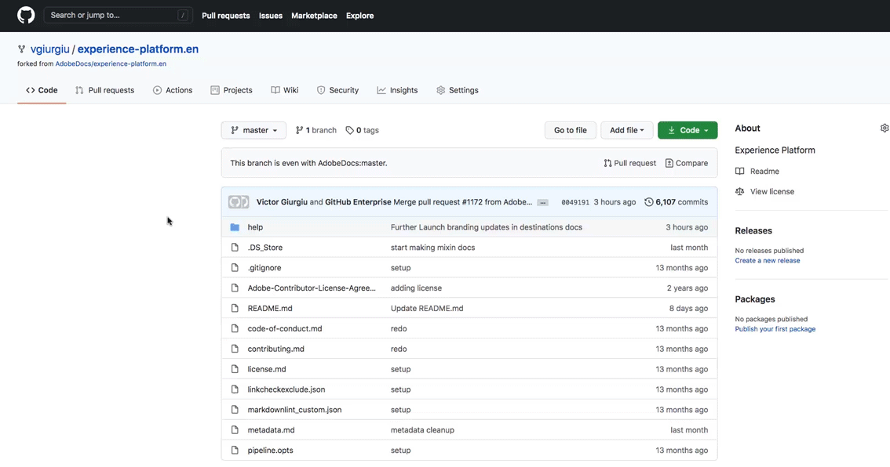
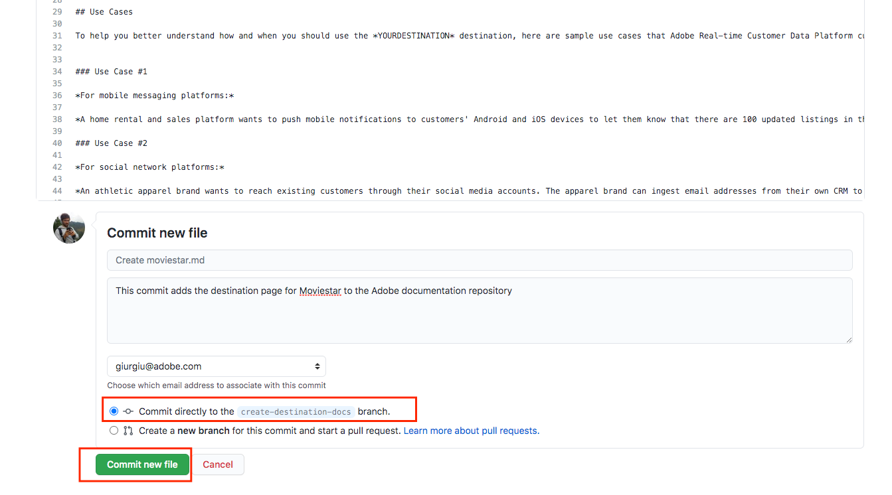

# GitHub web インターフェイスを使用した宛先ドキュメントページの作成 {#github-interface}

以下の手順では、GitHub web インターフェイスを使用してドキュメントを作成し、プルリクエスト（PR）を送信する方法について説明します。 ここで示す手順を実行する前に、[Adobe Experience Platformの宛先の宛先を文書化](./documentation-instructions.md)をお読みください。

>[!TIP]
>
>Adobeのコントリビューターガイドのサポートドキュメントも参照してください。
>
>* [GitおよびMarkdown オーサリングツールのインストール &#x200B;](https://experienceleague.adobe.com/docs/contributor/contributor-guide/setup/install-tools.html?lang=ja)
>* [&#x200B; ドキュメント用にGit リポジトリをローカルに設定](https://experienceleague.adobe.com/docs/contributor/contributor-guide/setup/local-repo.html?lang=ja)
>* [主要な変更に対するGitHub貢献度ワークフロー](https://experienceleague.adobe.com/docs/contributor/contributor-guide/setup/full-workflow.html?lang=ja)。

## GitHub オーサリング環境の設定 {#set-up-environment}

1. ブラウザーで、`https://github.com/AdobeDocs/experience-platform.ja-JP`に移動します。
1. リポジトリを[fork](https://experienceleague.adobe.com/docs/contributor/contributor-guide/setup/local-repo.html?lang=ja#fork-the-repository)するには、以下に示すように&#x200B;**Fork**&#x200B;をクリックします。 これにより、自分のGitHub アカウントにExperience Platform リポジトリのコピーが作成されます。

   

1. リポジトリのフォークで、次に示すように、プロジェクト用に新しいブランチを作成します。 この新しいブランチを作業に使用します。

   

1. フォークされたリポジトリのGitHub フォルダー構造で、`experience-platform.en/help/destinations/catalog/[...]`に移動します。ここで、`[...]`は宛先の目的のカテゴリです。 例えば、Experience Platformにパーソナライズの宛先を追加する場合は、`personalization` カテゴリを選択します。 **ファイルを追加/新しいファイルを作成**&#x200B;を選択します。

   

1. 宛先に`YOURDESTINATION.md`という名前を付けます。ここで、YOURDESTINATIONは[!DNL Adobe Experience Platform]の宛先の名前です。 例えば、会社の名前がMoviestarの場合、ファイルに`moviestar.md`という名前を付けます。

## 宛先のドキュメントページを作成する {#author-documentation}

1. [&#x200B; ドキュメントのセルフサービステンプレート &#x200B;](./self-service-template.md)に基づいて、宛先ページのコンテンツを作成します。 **[テンプレートをダウンロード](../assets/docs-framework/yourdestination-template.zip)**&#x200B;し、解凍して`.md` ファイルテンプレートを抽出します。
1. [dillinger.io](https://dillinger.io/)などのオンラインマークダウンエディターで、テンプレートのコンテンツを、宛先の関連情報と共に貼り付けて編集します。 テンプレートの指示に従って、入力する必要がある段落と削除できる段落の詳細を確認します。

   >[!TIP]
   >
   >ブラウザーのウィンドウはいつでも閉じることができ、後で再度開くことができます。 あなたの作品は自動的に保存され、ブラウザを再度開くときにあなたを待っています。
1. マークダウンエディターからGitHubの新しいファイルにコンテンツをコピーします。
1. 使用する予定のスクリーンショットや画像については、GitHub インターフェイスを使用してファイルを`experience-platform.en/help/destinations/assets/catalog/[...]`にアップロードします。ここで、`[...]`は目的のカテゴリーです。 例えば、Experience Platformにパーソナライズの宛先を追加する場合は、`personalization` カテゴリを選択します。 オーサリングするページから画像にリンクする必要があります。 [画像へのリンク方法の説明](https://experienceleague.adobe.com/docs/contributor/contributor-guide/writing-essentials/linking.html?lang=ja#link-to-images)を参照してください。

   にアップロード

1. 準備ができたら、ファイルをブランチに保存します。

   

## レビュー用にドキュメントを送信 {#submit-review}

>[!TIP]
>
>ここで壊れるものは何もありません。 このセクションの手順に従うと、ドキュメントの更新を提案するだけです。 提案された更新は、[!DNL Adobe Experience Platform] ドキュメントチームによって承認または編集されます。

1. ファイルを保存して目的の画像をアップロードしたら、プルリクエスト（PR）を開いて、作業ブランチをAdobe ドキュメントリポジトリのメインブランチに結合できます。 作業したブランチが選択されていることを確認し、**Contribute > Open pull request**&#x200B;を選択します。

   

1. 基本ブランチと比較ブランチが正しいことを確認します。 PRにメモを追加し、更新を説明して、**プルリクエストを作成**&#x200B;を選択します。 これにより、フォークの作業ブランチをAdobe リポジトリのメインブランチに結合するためのPRが開きます。

   >[!TIP]
   >
   >AdobeのドキュメントチームがPRの編集を行えるように、「**メンテナによる編集を許可する**」チェックボックスを選択したままにします。

   

1. この時点で、Adobe コントリビューターライセンス契約（CLA）への署名を求める通知が表示されます。 これは必須のステップです。 CLAに署名したら、PR ページを更新してプルリクエストを送信します。

1. プルリクエストが送信されたことを確認するには、**の「** プルリクエスト `https://github.com/AdobeDocs/experience-platform.ja-JP`」タブを調べます。

   

1. ご協力ありがとうございます。Adobeのドキュメントチームは、編集が必要な場合にはPRに連絡し、ドキュメントがいつ公開されるかをお知らせします。

>[!TIP]
>
>ドキュメントに画像やリンクを追加し、Markdownに関するその他の質問については、Adobeの共同編集ガイドの[Markdown](https://experienceleague.adobe.com/docs/contributor/contributor-guide/writing-essentials/markdown.html?lang=ja)の使用を参照してください。
