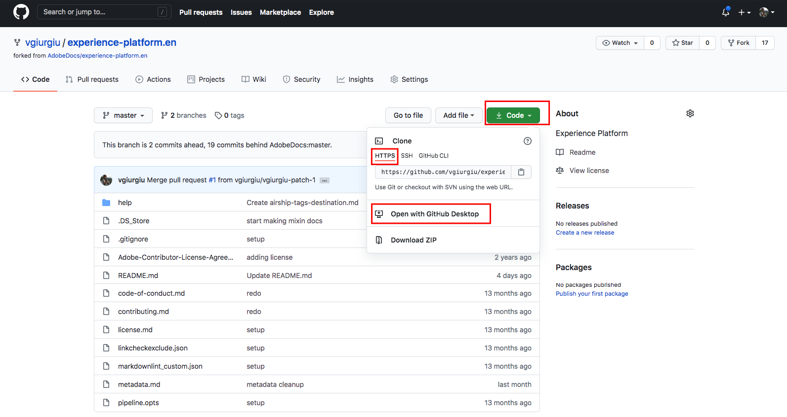
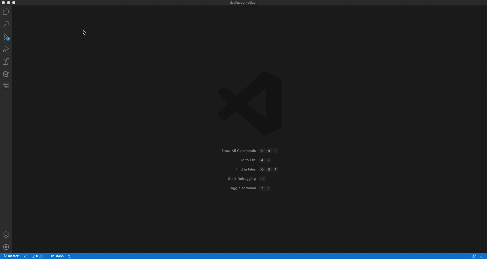

# ローカル環境でのテキストエディターを使用した宛先ドキュメントページの作成 {#local-authoring}

このページの手順では、テキストエディターを使用してローカル環境でドキュメントを作成し、プル要求 (PR) を送信する方法を示します。 ここで示す手順を実行する前に、必ず [Adobe Experience Platform Destinations での宛先のドキュメント化](./documentation-instructions.md).

>[!TIP]
>
>Adobeのコントリビューターガイドのサポートドキュメントも参照してください。
>* [Git および Markdown オーサリングツールのインストール](https://experienceleague.adobe.com/docs/contributor/contributor-guide/setup/install-tools.html)
>* [ドキュメント用のローカル Git リポジトリの設定](https://experienceleague.adobe.com/docs/contributor/contributor-guide/setup/local-repo.html)
>* [大きな変更をする際の GitHub コントリビューションワークフロー](https://experienceleague.adobe.com/docs/contributor/contributor-guide/setup/full-workflow.html).

## GitHub に接続し、ローカルのオーサリング環境を設定する {#set-up-environment}

1. ブラウザーで、に移動します。 `https://github.com/AdobeDocs/experience-platform.en`
2. 宛先 [フォーク](https://experienceleague.adobe.com/docs/contributor/contributor-guide/setup/local-repo.html#fork-the-repository) リポジトリで、 **分岐** 以下に示すように。 これにより、自分の GitHub アカウントにExperience Platformリポジトリのコピーが作成されます。

   

3. ローカルマシンにリポジトリのクローンを作成. 選択 **コード/ HTTPS / GitHub Desktop で開く**、以下に示すように。 次の条件を満たしていることを確認します。 [GitHub Desktop](https://desktop.github.com/) インストール済み 詳しくは、 [リポジトリのローカルクローンを作成](https://experienceleague.adobe.com/docs/contributor/contributor-guide/setup/local-repo.html#create-a-local-clone-of-the-repository) (Adobe投稿者ガイド )。

   

4. ローカルファイル構造内で、に移動します。 `experience-platform.en/help/destinations/catalog/[...]`です。 `[...]` は、宛先の目的のカテゴリです。 例えば、パーソナライゼーションの宛先をExperience Platformに追加する場合は、 `personalization` フォルダー。

## 宛先のドキュメントページのオーサリング {#author-documentation}

1. ドキュメントページは、 [セルフサービスの宛先テンプレート](../docs-framework/self-service-template.md). をダウンロードします。 [宛先テンプレート](../assets/docs-framework/yourdestination-template.zip). 解凍してファイルを展開します。 `yourdestination-template.md` を上記の手順 4 で説明したディレクトリに追加します。  ファイル名を変更 `YOURDESTINATION.md`:YOURDESTINATION は、Adobe Experience Platformでの宛先の名前です。 例えば、会社名が Moviestar の場合、ファイルにはという名前を付けます。 `moviestar.md`.
2. 新しいファイルを [選択したテキストエディター](https://experienceleague.adobe.com/docs/contributor/contributor-guide/setup/install-tools.html#understand-markdown-editors). Adobeでは、 [Visual Studio Code](https://code.visualstudio.com/) Markdown Authoring 拡張機能をAdobeします。 拡張機能をインストールするには、Visual Studio Code を開き、 **[!DNL Extensions]** 」タブをクリックし、 `adobe markdown authoring`. 拡張機能を選択し、「 **[!DNL Install]**.
   
3. 宛先に関する情報を使用してテンプレートを編集します。 テンプレートの指示に従います。
4. ドキュメントに追加する予定のスクリーンショットや画像については、に移動します。 `GitHub/experience-platform.en/help/destinations/assets/catalog/[...]`です。 `[...]` は、宛先の目的のカテゴリです。 例えば、パーソナライゼーションの宛先をExperience Platformに追加する場合は、 `personalization` フォルダー。 宛先の新しいフォルダーを作成し、ここに画像を保存します。 オーサリング中のページからリンクする必要があります。 詳しくは、 [画像へのリンク方法の説明](https://experienceleague.adobe.com/docs/contributor/contributor-guide/writing-essentials/linking.html#link-to-images).
5. 準備が整ったら、作業中のファイルを保存します。

## ドキュメントを送信してレビューします {#submit-review}

>[!TIP]
>
>ここで壊れるものは何もありません。 この節の手順に従うことで、単にドキュメントの更新を提案するだけです。 推奨される更新は、Adobe Experience Platformドキュメントチームが承認または編集します。

1. GitHub Desktop で、更新用の作業ブランチを作成し、「 」を選択します。 **ブランチを公開** をクリックして、ブランチを GitHub に公開します。

1. GitHub Desktop では、 [コミット](https://docs.github.com/en/free-pro-team@latest/github/getting-started-with-github/github-glossary#commit) 以下に示すように、作業内容。

   

1. GitHub Desktop では、 [プッシュ](https://docs.github.com/en/free-pro-team@latest/github/getting-started-with-github/github-glossary#push) あなたの仕事は [リモート](https://docs.github.com/en/free-pro-team@latest/github/getting-started-with-github/github-glossary#remote) ブランチに含めることができます。

   

1. GitHub Web インターフェイスで、プルリクエスト (PR) を開き、作業ブランチをAdobeドキュメントリポジトリの master ブランチに結合します。 作業中のブランチが選択されていることを確認し、「 」を選択します。 **貢献/プルリクエストを開く**.

   

1. ベースと比較ブランチが正しいことを確認します。 PR に、更新内容を説明するメモを追加し、「 」を選択します。 **プル要求の作成**. これにより、PR が開き、フォークの作業ブランチがAdobeリポジトリの master ブランチにマージされます。
   >[!TIP]
   >
   >を残します。 **メンテナーによる編集を許可する** チェックボックスがオンになっているので、Adobeドキュメントチームが PR を編集できます。

   

1. この時点で、Adobeコントリビューター使用許諾契約 (CLA) に署名するよう求める通知が表示されます。 これは必須の手順です。 CLA に署名した後、PR ページを更新し、プル要求を送信します。

1. プルリクエストが送信されたことを確認するには、 **プル要求** タブ `https://github.com/AdobeDocs/experience-platform.en`.

1. ご協力ありがとうございます。Adobeドキュメントチームは、編集が必要な場合に備えて PR に問い合わせ、ドキュメントをいつ公開するかを知らせます。

>[!TIP]
>
>ドキュメントに画像やリンクを追加したり、Markdown に関するその他の質問については、以下を参照してください。 [Markdown の使用](https://experienceleague.adobe.com/docs/contributor/contributor-guide/writing-essentials/markdown.html) (Adobeのコラボレーション執筆ガイド )
