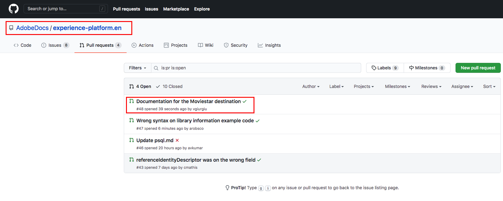

# ローカル環境でテキストエディターを使用した、宛先のドキュメントページの作成 {#local-authoring}

このページの手順では、テキストエディターを使用してローカル環境で作業し、ドキュメントを作成してプル要求(PR)を送信する方法を示します。 ここで示す手順を実行する前に、「[Adobe Experience Platformの宛先](./documentation-instructions.md)で宛先をドキュメント化する」を読んでください。

>[!TIP]
>
>Adobeのコントリビューターガイドのサポートドキュメントも参照してください。
>* [GitおよびMarkdownオーサリングツールのインストール](https://experienceleague.adobe.com/docs/contributor/contributor-guide/setup/install-tools.html?lang=en)
>* [ドキュメント用のローカル Git リポジトリの設定](https://experienceleague.adobe.com/docs/contributor/contributor-guide/setup/local-repo.html?lang=en)
>* [大きな変更をする際の GitHub コントリビューションワークフロー](https://experienceleague.adobe.com/docs/contributor/contributor-guide/setup/full-workflow.html?lang=en).

## GitHubに接続し、ローカルのオーサリング環境を設定する {#set-up-environment}

1. ブラウザーで、`https://github.com/AdobeDocs/experience-platform.en`に移動します。
2. リポジトリを[fork](https://experienceleague.adobe.com/docs/contributor/contributor-guide/setup/local-repo.html?lang=en#fork-the-repository)するには、スクリーンショットに示すように、「**Fork**」をクリックします。

   

3. ローカルマシンにリポジトリのクローンを作成. **コード/HTTPS/GitHub Desktopで開く**&#x200B;を次に示すように選択します。 [GitHub Desktop](https://desktop.github.com/)がインストールされていることを確認します。 詳しくは、Adobeコントリビューターガイドの[リポジトリのローカルクローンを作成する](https://experienceleague.adobe.com/docs/contributor/contributor-guide/setup/local-repo.html?lang=en#create-a-local-clone-of-the-repository)を参照してください。

   

4. ローカルファイル構造内で、 `experience-platform.en/help/destinations/catalog/[...]`に移動します。ここで、 `[...]`は宛先の目的のカテゴリです。 例えば、パーソナライゼーションの宛先をExperience Platformに追加する場合は、`personalization`フォルダーを選択します。

## 宛先のドキュメントページの作成 {#author-documentation}

1. ドキュメントページは、[セルフサービスの宛先テンプレート](./self-service-template.md)に基づいています。 [宛先テンプレート](assets/yourdestination-template.zip)をダウンロードします。 ファイルを解凍し、上記の手順4で示したディレクトリに`yourdestination-template.md`ファイルを展開します。  ファイル名を`YOURDESTINATION.md`に変更します。YOURDESTINATIONは、Adobe Experience Platformでの宛先の名前です。 例えば、会社の名前がMoviestarの場合、ファイルに`moviestar.md`という名前を付けます。
2. [任意のテキストエディター](https://experienceleague.adobe.com/docs/contributor/contributor-guide/setup/install-tools.html?lang=en#understand-markdown-editors)で新しいファイルを開きます。 Adobeでは、[Visual Studio Code](https://code.visualstudio.com/)を使用して、Markdown AuthoringAdobe拡張機能をインストールすることをお勧めします。 拡張機能をインストールするには、Visual Studio Codeを開き、画面左側の「**[!DNL Extensions]**」タブを選択して、「`adobe markdown authoring`」を検索します。 拡張機能を選択し、「**[!DNL Install]**」をクリックします。
   
3. 宛先の関連情報を使用して、テンプレートを編集します。 テンプレートの指示に従います。
4. ドキュメントに追加するスクリーンショットや画像については、`GitHub/experience-platform.en/help/destinations/assets/catalog/[...]`に移動します。`[...]`は目的のカテゴリです。 例えば、パーソナライゼーションの宛先をExperience Platformに追加する場合は、`personalization`フォルダーを選択します。 宛先の新しいフォルダーを作成し、ここに画像を保存します。 作成しているページからリンクする必要があります。 [画像へのリンク方法](https://experienceleague.adobe.com/docs/contributor/contributor-guide/writing-essentials/linking.html?lang=en#link-to-images)を参照してください。
5. 準備が整ったら、作業中のファイルを保存します。

## ドキュメントを送信してレビュー {#submit-review}

1. GitHub Desktopで、更新の作業ブランチを作成し、**Publish branch**&#x200B;を選択して、ブランチをGitHubに公開します。

1. GitHub Desktopで、次に示すように、作業を[コミット](https://docs.github.com/en/free-pro-team@latest/github/getting-started-with-github/github-glossary#commit)します。

   

1. GitHub Desktopで、次に示すように、 作業を[リモート](https://docs.github.com/en/free-pro-team@latest/github/getting-started-with-github/github-glossary#remote)ブランチにプッシュします。

   

1. GitHub Webインターフェイスで、プルリクエスト(PR)を開き、作業ブランチをAdobeドキュメントリポジトリのmasterブランチに結合します。 作業中のブランチが選択されていることを確認し、「**プルリクエスト**」を選択します。

   

1. ベースと比較ブランチが正しいことを確認します。 PRに、更新を説明するメモを追加し、「**プル要求を作成**」を選択します。 これにより、フォークの作業ブランチをAdobeリポジトリのmasterブランチにマージするPRが開きます。
   >[!TIP]
   >
   >AdobeドキュメントチームがPRを編集できるように、「**メンテナーによる編集を許可**」チェックボックスは選択したままにします。

   

1. この時点で、Adobe寄稿者使用許諾契約(CLA)に署名するよう求める通知が表示されます。 これは必須の手順です。 CLAに署名した後、PRページを更新し、プル要求を送信します。

1. プルリクエストが送信されたことを確認するには、`https://github.com/AdobeDocs/experience-platform.en`の「**プルリクエスト**」タブを調べます。

1. ご協力ありがとうございます。編集が必要な場合はAdobeドキュメントチームがPRに連絡し、ドキュメントの公開日を知らせます。

>[!TIP]
>
>ドキュメントに画像やリンクを追加したり、Markdownに関するその他の質問については、Adobeの共同執筆ガイドの「Markdown](https://experienceleague.adobe.com/docs/contributor/contributor-guide/writing-essentials/markdown.html?lang=en)の使用」を参照してください。[
