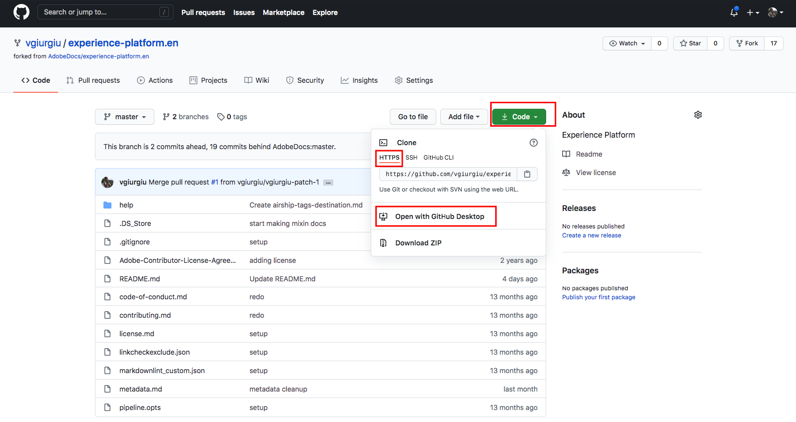
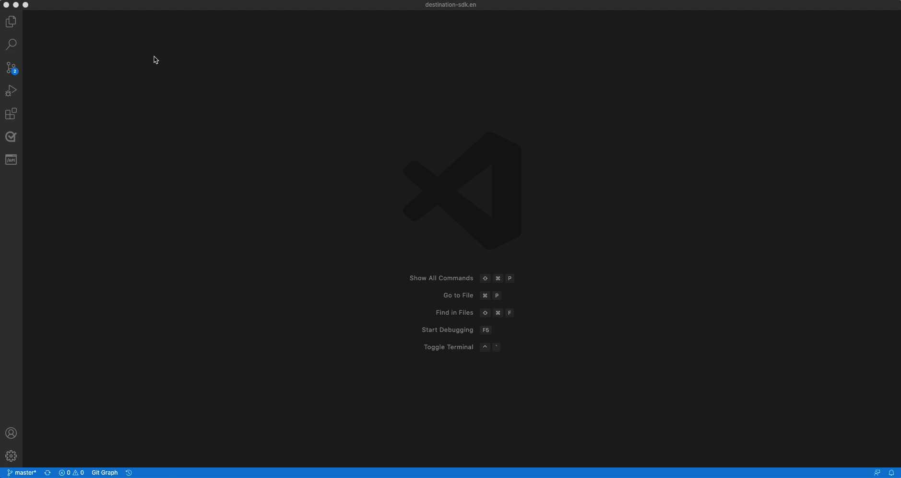
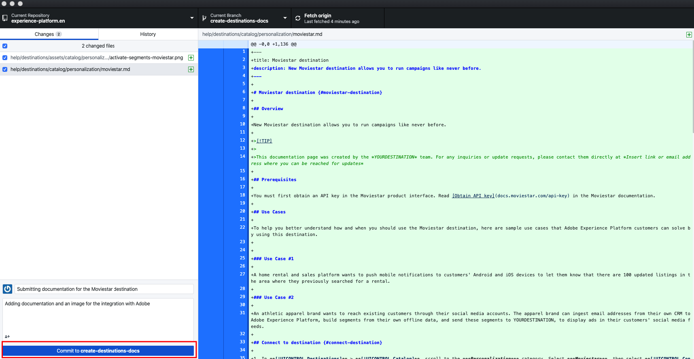
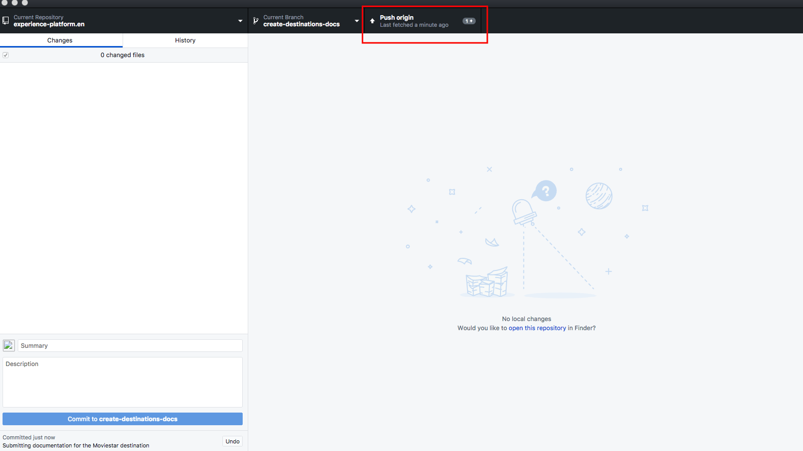
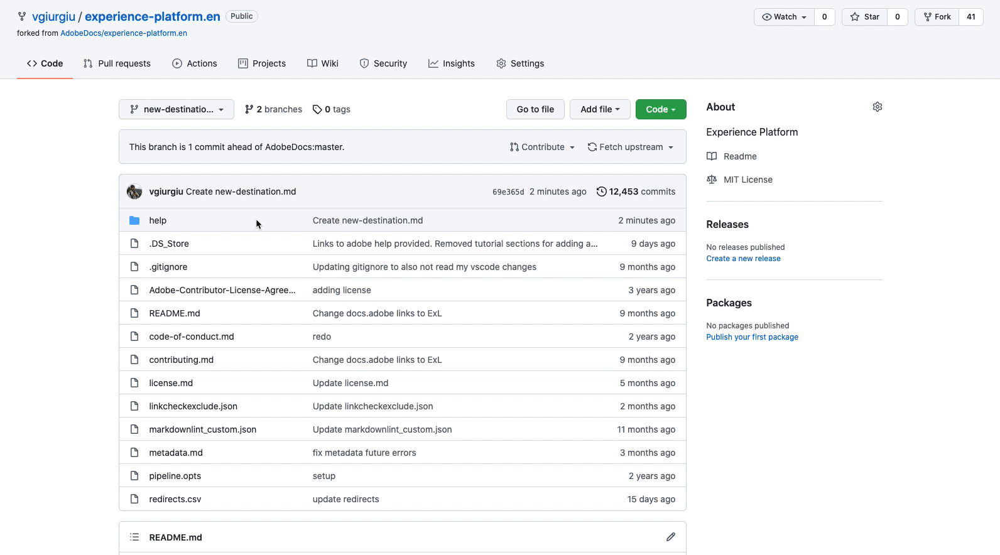
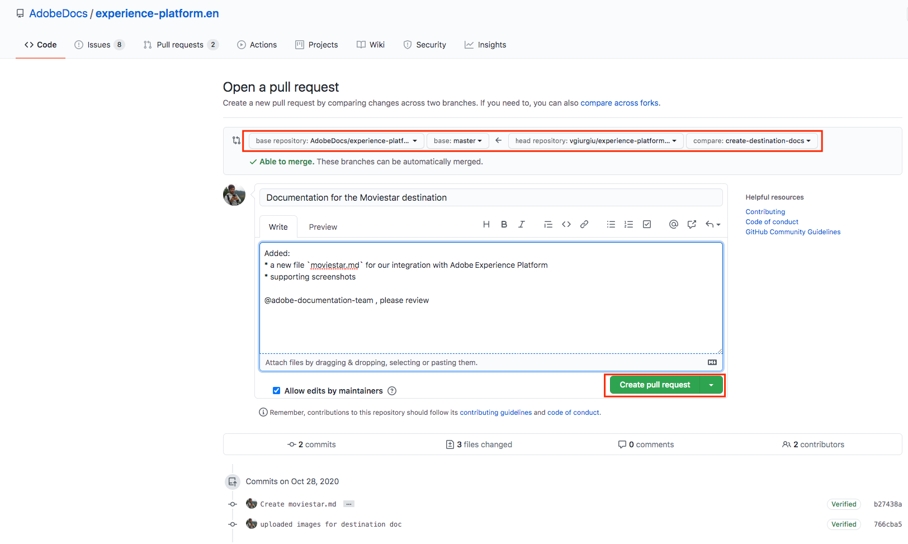
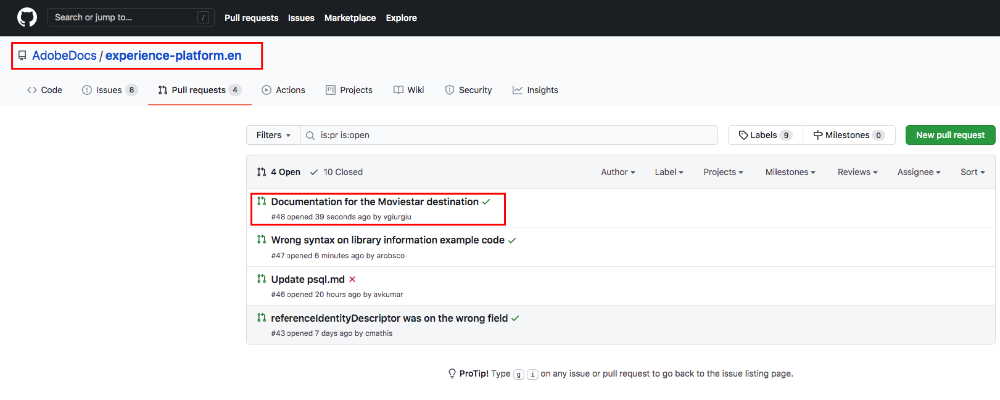

# ローカル環境でのテキストエディターを使用した宛先ドキュメントページの作成 {#local-authoring}

このページの手順では、テキストエディターを使用してローカル環境でドキュメントを作成し、プルリクエスト（PR）を送信する方法について説明します。 ここで示す手順を実行する前に、[Adobe Experience Platformの宛先の宛先を文書化](./documentation-instructions.md)をお読みください。

>[!TIP]
>
>Adobeのコントリビューターガイドのサポートドキュメントも参照してください。
>
>* [GitおよびMarkdown オーサリングツールのインストール &#x200B;](https://experienceleague.adobe.com/docs/contributor/contributor-guide/setup/install-tools.html?lang=ja)
>* [&#x200B; ドキュメント用にGit リポジトリをローカルに設定](https://experienceleague.adobe.com/docs/contributor/contributor-guide/setup/local-repo.html?lang=ja)
>* [主要な変更に対するGitHub貢献度ワークフロー](https://experienceleague.adobe.com/docs/contributor/contributor-guide/setup/full-workflow.html?lang=ja)。

## GitHubに接続し、ローカルオーサリング環境を設定する {#set-up-environment}

1. ブラウザーで、`https://github.com/AdobeDocs/experience-platform.ja-JP`に移動します
2. リポジトリを[fork](https://experienceleague.adobe.com/docs/contributor/contributor-guide/setup/local-repo.html?lang=ja#fork-the-repository)するには、以下に示すように&#x200B;**Fork**&#x200B;をクリックします。 これにより、自分のGitHub アカウントにExperience Platform リポジトリのコピーが作成されます。

   

3. リポジトリをローカルマシンに複製します。 次に示すように、**コード/HTTPS/GitHub Desktop**&#x200B;で開くを選択します。 [GitHub Desktop](https://desktop.github.com/)がインストールされていることを確認してください。 詳しくは、Adobe コントリビューターガイドの「[&#x200B; リポジトリのローカルクローンを作成する](https://experienceleague.adobe.com/docs/contributor/contributor-guide/setup/local-repo.html?lang=ja#create-a-local-clone-of-the-repository)」を参照してください。

   

4. ローカルファイル構造で、`experience-platform.en/help/destinations/catalog/[...]`に移動します。ここで、`[...]`は宛先の目的のカテゴリです。 例えば、Experience Platformにパーソナライゼーションの宛先を追加する場合は、`personalization` フォルダーを選択します。

## 宛先のドキュメントページを作成する {#author-documentation}

1. ドキュメント ページは、[&#x200B; セルフサービスの宛先テンプレート &#x200B;](../docs-framework/self-service-template.md)に基づいています。 [宛先テンプレート &#x200B;](../assets/docs-framework/yourdestination-template.zip)をダウンロードします。 ファイル `yourdestination-template.md`を解凍し、上記の手順4で説明したディレクトリに展開します。  ファイル `YOURDESTINATION.md`の名前を変更します。YOURDESTINATIONは[!DNL Adobe Experience Platform]の宛先の名前です。 例えば、会社の名前がMoviestarの場合、ファイルに`moviestar.md`という名前を付けます。
2. 新しいファイルを、選択した[&#x200B; テキストエディター](https://experienceleague.adobe.com/docs/contributor/contributor-guide/setup/install-tools.html?lang=ja#understand-markdown-editors)で開きます。 Adobeでは、[Visual Studio Code](https://code.visualstudio.com/)を使用して、Adobe Markdown オーサリング拡張機能をインストールすることをお勧めします。 拡張機能をインストールするには、Visual Studio Codeを開き、画面の左側にある「**[!DNL Extensions]**」タブを選択し、`adobe markdown authoring`を検索します。 拡張機能を選択し、**[!DNL Install]**&#x200B;をクリックします。
   
3. 宛先の関連情報を含むテンプレートを編集します。 テンプレートの指示に従います。
4. ドキュメントに追加する予定のスクリーンショットまたは画像については、`GitHub/experience-platform.en/help/destinations/assets/catalog/[...]`にアクセスしてください。ここで、`[...]`は目的のカテゴリーです。 例えば、Experience Platformにパーソナライゼーションの宛先を追加する場合は、`personalization` フォルダーを選択します。 宛先の新しいフォルダーを作成し、ここに画像を保存します。 オーサリングしているページからリンクする必要があります。 [画像へのリンク方法の説明](https://experienceleague.adobe.com/docs/contributor/contributor-guide/writing-essentials/linking.html?lang=ja#link-to-images)を参照してください。
5. 準備ができたら、作業中のファイルを保存します。

## レビュー用にドキュメントを送信 {#submit-review}

>[!TIP]
>
>ここで壊れるものは何もありません。 このセクションの手順に従うと、ドキュメントの更新を提案するだけです。 提案された更新は、[!DNL Adobe Experience Platform] ドキュメントチームによって承認または編集されます。

1. GitHub デスクトップで、更新のための作業ブランチを作成し、**ブランチを公開**&#x200B;を選択して、ブランチをGitHubに公開します。

1. GitHub デスクトップで、次に示すように、作業を[&#x200B; コミット &#x200B;](https://docs.github.com/en/free-pro-team@latest/github/getting-started-with-github/github-glossary#commit)します。

   

1. GitHub デスクトップで、次に示すように、[作業を](https://docs.github.com/en/free-pro-team@latest/github/getting-started-with-github/github-glossary#push)remote[&#x200B; ブランチに](https://docs.github.com/en/free-pro-team@latest/github/getting-started-with-github/github-glossary#remote) プッシュします。

   

1. GitHub web インターフェイスでプルリクエスト（PR）を開き、作業ブランチをAdobe ドキュメントリポジトリのメインブランチに結合します。 作業したブランチが選択されていることを確認し、**Contribute > Open pull request**&#x200B;を選択します。

   

1. 基本ブランチと比較ブランチが正しいことを確認します。 PRにメモを追加し、更新を説明して、**プルリクエストを作成**&#x200B;を選択します。 これにより、フォークの作業ブランチをAdobe リポジトリのメインブランチに結合するためのPRが開きます。

   >[!TIP]
   >
   >AdobeのドキュメントチームがPRの編集を行えるように、「**メンテナによる編集を許可する**」チェックボックスを選択したままにします。

   

1. この時点で、Adobe コントリビューターライセンス契約（CLA）への署名を求める通知が表示されます。 これは必須のステップです。 CLAに署名したら、PR ページを更新してプルリクエストを送信します。

1. プルリクエストが送信されたことを確認するには、**の「** プルリクエスト `https://github.com/AdobeDocs/experience-platform.ja-JP`」タブを調べます。

1. ご協力ありがとうございます。Adobeのドキュメントチームは、編集が必要な場合にはPRに連絡し、ドキュメントがいつ公開されるかをお知らせします。

>[!TIP]
>
>ドキュメントに画像やリンクを追加し、Markdownに関するその他の質問については、Adobeの共同編集ガイドの[Markdown](https://experienceleague.adobe.com/docs/contributor/contributor-guide/writing-essentials/markdown.html?lang=ja)の使用を参照してください。
