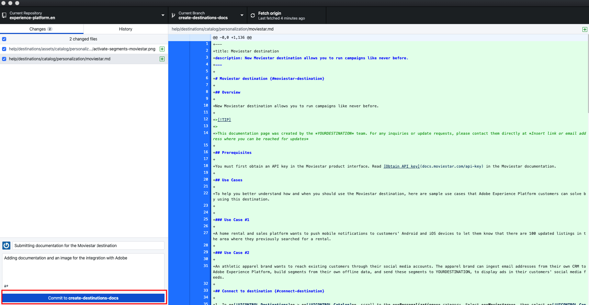

# ローカル環境でのテキストエディターを使用した宛先ドキュメントページの作成 {#local-authoring}

このページの手順では、テキストエディターを使用してローカル環境で作業し、ドキュメントを作成してプルリクエスト（PR）を送信する方法を示します。 ここに示す手順を実行する前に、[Adobe Experience Platformの宛先での宛先のドキュメント化 ](./documentation-instructions.md) を読んでください。

>[!TIP]
>
>Adobe投稿者ガイドのサポートドキュメントも参照してください。
>
>* [Git および Markdown オーサリングツールのインストール ](https://experienceleague.adobe.com/docs/contributor/contributor-guide/setup/install-tools.html)
>* [ ドキュメントを参照するために Git リポジトリをローカルに設定する ](https://experienceleague.adobe.com/docs/contributor/contributor-guide/setup/local-repo.html)
>* [ 大規模な変更点に対する GitHub 投稿ワークフロー ](https://experienceleague.adobe.com/docs/contributor/contributor-guide/setup/full-workflow.html)。

## GitHub に接続し、ローカルオーサリング環境を設定します {#set-up-environment}

1. ブラウザーで `https://github.com/AdobeDocs/experience-platform.en` に移動します。
2. リポジトリを [ 分岐 ](https://experienceleague.adobe.com/docs/contributor/contributor-guide/setup/local-repo.html#fork-the-repository) するには、次に示すように、「**分岐**」をクリックします。 これにより、Experience Platform リポジトリのコピーが独自の GitHub アカウントに作成されます。

   

3. ローカルマシンにリポジトリのクローンを作成します。 次に示すように、「**コード/HTTPS/GitHub デスクトップで開く**」を選択します。 [GitHub デスクトップ ](https://desktop.github.com/) がインストールされていることを確認します。 詳しくは、Adobe投稿者ガイドの [ リポジトリのローカルクローンを作成する ](https://experienceleague.adobe.com/docs/contributor/contributor-guide/setup/local-repo.html#create-a-local-clone-of-the-repository) を参照してください。

   

4. ローカルファイル構造で、`experience-platform.en/help/destinations/catalog/[...]` に移動します。ここで、`[...]` は宛先に必要なカテゴリです。 例えば、パーソナライゼーションの宛先をExperience Platformに追加する場合は、`personalization` フォルダーを選択します。

## 宛先に関するドキュメントページの作成 {#author-documentation}

1. ドキュメントページは、[ セルフサービス宛先テンプレート ](../docs-framework/self-service-template.md) に基づいています。 [ 宛先テンプレート ](../assets/docs-framework/yourdestination-template.zip) をダウンロードします。 それを解凍し、上記の手順 4 で説明したディレクトリに `yourdestination-template.md` ファイルを抽出します。  ファイル名を `YOURDESTINATION.md` に変更します。YOURDESTINATION は、Adobe Experience Platformの宛先の名前です。 例えば、会社の名前が Moviestar の場合は、ファイルに `moviestar.md` という名前を付けます。
2. 新しいファイルを任意の [ テキストエディター ](https://experienceleague.adobe.com/docs/contributor/contributor-guide/setup/install-tools.html#understand-markdown-editors) で開きます。 Adobeでは、[Visual Studio Code](https://code.visualstudio.com/) を使用し、Adobe Markdown オーサリング拡張機能をインストールすることをお勧めします。 拡張機能をインストールするには、Visual Studio Code を開き、画面の左側にある「**[!DNL Extensions]**」タブを選択して、`adobe markdown authoring` を検索します。 拡張機能を選択し、「**[!DNL Install]**」をクリックします。
   
3. 宛先に関連する情報を使用してテンプレートを編集します。 テンプレートの指示に従います。
4. ドキュメントに追加する予定のスクリーンショットまたは画像については、`GitHub/experience-platform.en/help/destinations/assets/catalog/[...]` に移動してください。`[...]` れは、宛先に必要なカテゴリです。 例えば、パーソナライゼーションの宛先をExperience Platformに追加する場合は、`personalization` フォルダーを選択します。 宛先の新しいフォルダーを作成して、ここに画像を保存します。 オーサリングしているページからリンクする必要があります。 [ 画像へのリンク方法 ](https://experienceleague.adobe.com/docs/contributor/contributor-guide/writing-essentials/linking.html#link-to-images) を参照してください。
5. 準備が整ったら、作業中のファイルを保存します。

## レビュー用にドキュメントを送信 {#submit-review}

>[!TIP]
>
>ここで壊れるものはないことに注意してください。 この節の手順に従うことで、ドキュメントのアップデートを提案するだけです。 提案した更新は、Adobe Experience Platform ドキュメントチームによって承認または編集されます。

1. GitHub デスクトップで、更新用の作業ブランチを作成し、「**ブランチを公開**」を選択して、ブランチを GitHub に公開します。

1. GitHub デスクトップで、以下に示すように、作業を [ コミット ](https://docs.github.com/en/free-pro-team@latest/github/getting-started-with-github/github-glossary#commit) します。

   

1. GitHub デスクトップで、以下に示すように [ 作業を ](https://docs.github.com/en/free-pro-team@latest/github/getting-started-with-github/github-glossary#push) リモート [ ブランチに ](https://docs.github.com/en/free-pro-team@latest/github/getting-started-with-github/github-glossary#remote) プッシュ」します。

   

1. GitHub web インターフェイスで、プルリクエスト（PR）を開いて、作業中のブランチをAdobe ドキュメントリポジトリのマスターブランチに結合します。 作業したブランチが選択されていることを確認し、**投稿/プルリクエストを開く** を選択します。

   

1. ベースおよび比較ブランチが正しいことを確認します。 更新を説明するメモを PR に追加し、「**プルリクエストを作成**」を選択します。 これにより、フォークの作業ブランチをAdobe リポジトリのマスターブランチに結合する PR が開きます。

   >[!TIP]
   >
   >Adobe ドキュメントチームが PR の編集を行えるように、「**メンテナーによる編集を許可**」チェックボックスを選択したままにします。

   

1. この時点で、Adobe投稿者使用許諾契約（CLA）への署名を求める通知が表示されます。 これは必須の手順です。 CLA に署名したら、PR ページを更新し、プルリクエストを送信します。

1. **の「** プルリクエスト `https://github.com/AdobeDocs/experience-platform.en`」タブを調べると、プルリクエストが送信されたことを確認できます。

1. ご協力ありがとうございます。Adobe ドキュメントチームは、編集が必要な場合は PR に連絡し、ドキュメントがいつ公開されるかを知らせます。

>[!TIP]
>
>画像やドキュメントへのリンクを追加する方法、および Markdown に関するその他の質問については、Adobe共同作業ライティングガイドの [Markdown の使用 ](https://experienceleague.adobe.com/docs/contributor/contributor-guide/writing-essentials/markdown.html) を参照してください。
