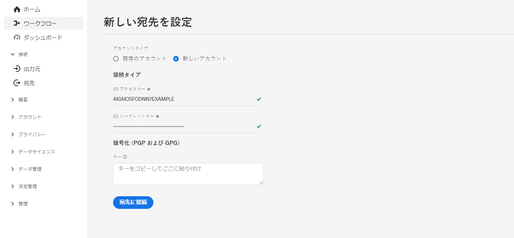
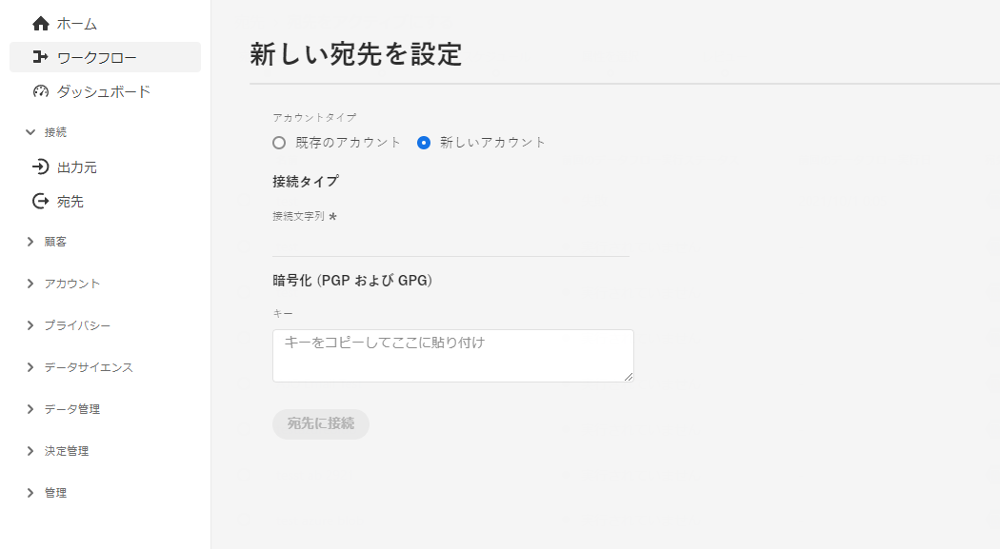
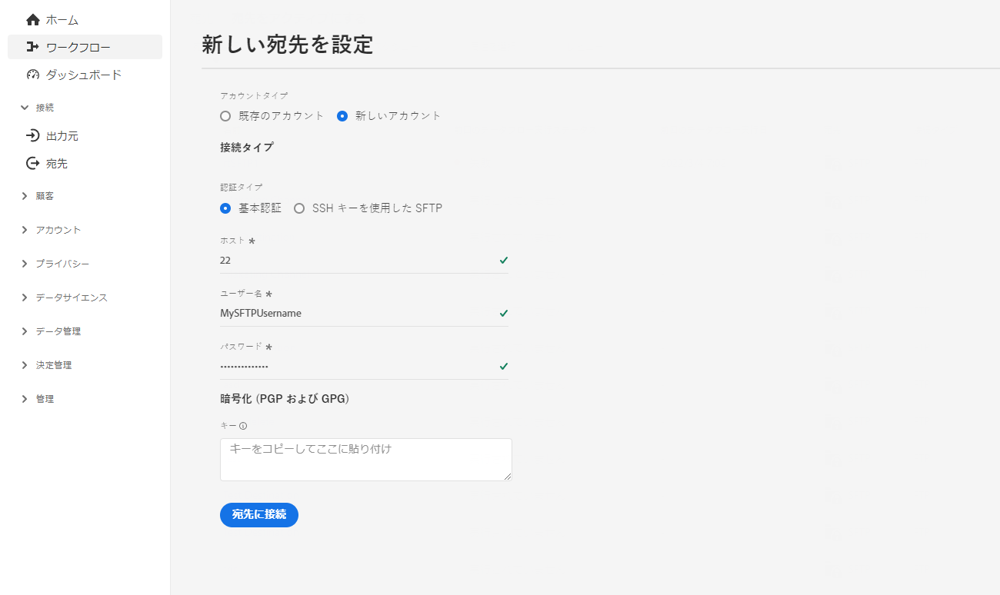
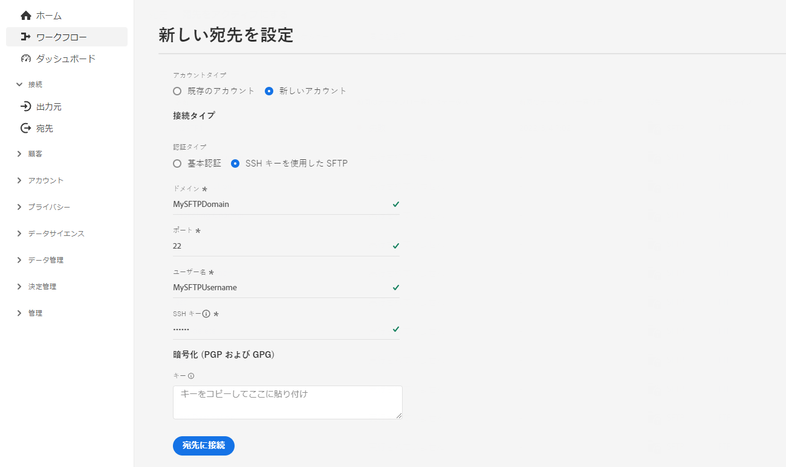

# （ベータ版）ファイルベースの宛先設定 {#destination-configuration}

## 概要 {#overview}

>[!IMPORTANT]
>
>現在、Adobe Experience Platform Destination SDK でのファイルベースの宛先のサポートはベータ版です。ドキュメントと機能は変更される場合があります。

この設定を使用すると、宛先名、カテゴリ、説明など、ファイルベースの宛先に関する重要な情報を指定できます。また、この構成での設定は、Experience Platform ユーザーが宛先に対して認証する方法、Experience Platform ユーザーインターフェイスに表示される方法、宛先に書き出すことができる ID も決定します。

宛先サーバーが動作するために必須である他の構成（宛先サーバーとオーディエンスメタデータ）も、この構成に接続されます。この 2 つの構成を参照する方法については、[下記の節](./destination-configuration.md#connecting-all-configurations)をお読みください。

このドキュメントで説明する機能は、`/authoring/destinations` API エンドポイントを用いて構成することができます。エンドポイントで実行できる操作の完全なリストには、[宛先 API エンドポイントの操作](./destination-configuration-api.md)をお読みください。

## Amazon S3 の宛先の設定例 {#batch-example-configuration}

```json
{
   "name":"S3 Destination with CSV Options",
   "description":"S3 Destination with CSV Options",
   "status":"TEST",
   "maxProfileAttributes":"2000",
   "maxIdentityAttributes":"10",
   "customerAuthenticationConfigurations":[
      {
         "authType":"S3"
      }
   ],
   "customerEncryptionConfigurations":[
      
   ],
   "customerDataFields":[
      {
         "name":"bucket",
         "title":"Amazon S3 bucket name",
         "description":"Enter your Amazon S3 bucket name",
         "type":"string",
         "isRequired":true,
         "readOnly":false,
         "hidden":false
      },
      {
         "name":"path",
         "title":"Amazon S3 bucket path",
         "description":"Enter your S3 bucket path",
         "type":"string",
         "isRequired":true,
         "pattern":"^[A-Za-z]+$",
         "readOnly":false,
         "hidden":false
      },
      {
         "name":"sep",
         "title":"Enter a separator for each field and value",
         "description":"Enter a separator character for each field and value",
         "type":"string",
         "isRequired":false,
         "readOnly":false,
         "hidden":false
      },
      {
         "name":"encoding",
         "title":"Specify encoding (charset) of saved CSV files",
         "description":"Select encoding of csv files",
         "type":"string",
         "enum":[
            "UTF-8",
            "UTF-16"
         ],
         "isRequired":false,
         "readOnly":false,
         "hidden":false
      },
      {
         "name":"quote",
         "title":"Select a single character used for escaping quoted values",
         "description":"Select single charachter for escaping quoted values",
         "type":"string",
         "isRequired":false,
         "readOnly":false,
         "hidden":false
      },
      {
         "name":"quoteAll",
         "title":"Escape all quoted values",
         "description":"Select whether to escape all quoted values",
         "type":"string",
         "enum":[
            "true",
            "false"
         ],
         "default":"true",
         "isRequired":true,
         "readOnly":false,
         "hidden":false
      },
      {
         "name":"escape",
         "title":"Select a single character used for escaping quotes",
         "description":"Select a single character used for escaping quotes inside an already quoted value",
         "type":"string",
         "isRequired":false,
         "readOnly":false,
         "hidden":false
      },
      {
         "name":"escapeQuotes",
         "title":"Escape quotes",
         "description":"A flag indicating whether values containing quotes should always be enclosed in quotes",
         "type":"string",
         "enum":[
            "true",
            "false"
         ],
         "isRequired":false,
         "default":"true",
         "readOnly":false,
         "hidden":false
      },
      {
         "name":"header",
         "title":"header",
         "description":"Writes the names of columns as the first line.",
         "type":"string",
         "isRequired":false,
         "enum":[
            "true",
            "false"
         ],
         "readOnly":false,
         "default":"true",
         "hidden":false
      },
      {
         "name":"ignoreLeadingWhiteSpace",
         "title":"Ignore leading white space",
         "description":"A flag indicating whether or not leading whitespaces from values being written should be skipped.",
         "type":"string",
         "isRequired":false,
         "enum":[
            "true",
            "false"
         ],
         "readOnly":false,
         "default":"true",
         "hidden":false
      },
      {
         "name":"nullValue",
         "title":"Select the string representation of a null value",
         "description":"Sets the string representation of a null value. ",
         "type":"string",
         "isRequired":false,
         "readOnly":false,
         "hidden":false
      },
      {
         "name":"dateFormat",
         "title":"Date format",
         "description":"Select the string that indicates a date format. ",
         "type":"string",
         "default":"yyyy-MM-dd",
         "isRequired":false,
         "readOnly":false,
         "hidden":false
      },
      {
         "name":"charToEscapeQuoteEscaping",
         "title":"Char to escape quote escaping",
         "description":"Sets a single character used for escaping the escape for the quote character",
         "type":"string",
         "isRequired":false,
         "readOnly":false,
         "hidden":false
      },
      {
         "name":"emptyValue",
         "title":"Select the string representation of an empty value",
         "description":"Select the string representation of an empty value",
         "type":"string",
         "isRequired":false,
         "readOnly":false,
         "default":"",
         "hidden":false
      },
      {
         "name":"compression",
         "title":"Select compression",
         "description":"Select compressiont",
         "type":"string",
         "isRequired":true,
         "readOnly":false,
         "enum":[
            "SNAPPY",
            "GZIP",
            "DEFLATE",
            "NONE"
         ]
      },
      {
         "name":"fileType",
         "title":"Select a fileType",
         "description":"Select fileType",
         "type":"string",
         "isRequired":true,
         "readOnly":false,
         "hidden":false,
         "enum":[
            "csv",
            "json",
            "parquet"
         ],
         "default":"csv"
      }
   ],
   "uiAttributes":{
      "documentationLink":"http://www.adobe.com/go/YOURDESTINATION-en",
      "category":"S3",
      "iconUrl":"https://dc5tqsrhldvnl.cloudfront.net/2/90048/da276e30c730ce6cd666c8ca78360df21.png",
      "connectionType":"S3",
      "flowRunsSupported":true,
      "monitoringSupported":true,
      "frequency":"Batch"
   },
   "destinationDelivery":[
      {
         "deliveryMatchers":[
            {
               "type":"SOURCE",
               "value":[
                  "batch"
               ]
            }
         ],
         "authenticationRule":"CUSTOMER_AUTHENTICATION",
         "destinationServerId":"{{destinationServerId}}"
      }
   ],
   "identityNamespaces":{
      "adobe_id":{
         "acceptsAttributes":true,
         "acceptsCustomNamespaces":true
      },
      "mobile_id":{
         "acceptsAttributes":true,
         "acceptsCustomNamespaces":true
      }
   },
   "segmentMappingConfig":{
      "mapExperiencePlatformSegmentName":false,
      "mapExperiencePlatformSegmentId":false,
      "mapUserInput":false,
      "audienceTemplateId":"cbf90a70-96b4-437b-86be-522fbdaabe9c"
   },
   "schemaConfig":{
      "profileFields":[
         {
            "name":"phoneNo",
            "title":"phoneNo",
            "description":"This is a fixed attribute on your destination side that customers can map profile attributes to. For example, the phoneNumber value in Experience Platform could be phoneNo on your side.",
            "type":"string",
            "isRequired":false,
            "readOnly":false,
            "hidden":false
         }
      ],
      "profileRequired":true,
      "segmentRequired":true,
      "identityRequired":true
   },
   "batchConfig":{
      "allowMandatoryFieldSelection":true,
      "allowDedupeKeyFieldSelection":true,
      "defaultExportMode":"DAILY_FULL_EXPORT",
      "allowedExportMode":[
         "DAILY_FULL_EXPORT",
         "FIRST_FULL_THEN_INCREMENTAL"
      ],
      "allowedScheduleFrequency":[
         "DAILY",
         "EVERY_3_HOURS",
         "EVERY_6_HOURS",
         "EVERY_8_HOURS",
         "EVERY_12_HOURS",
         "ONCE"
      ],
      "defaultFrequency":"DAILY",
      "defaultStartTime":"00:00",
      "filenameConfig":{
         "allowedFilenameAppendOptions":[
            "SEGMENT_NAME",
            "DESTINATION_INSTANCE_ID",
            "DESTINATION_INSTANCE_NAME",
            "ORGANIZATION_NAME",
            "SANDBOX_NAME",
            "DATETIME",
            "CUSTOM_TEXT"
         ],
         "defaultFilenameAppendOptions":[
            "DATETIME"
         ],
         "defaultFilename":"%DESTINATION%_%SEGMENT_ID%"
      },
      "backfillHistoricalProfileData":true
   }
```

| パラメーター | タイプ | 説明 |
|---------|----------|------|
| `name` | 文字列 | Experience Platform カタログ内の宛先のタイトルを示します。 |
| `description` | 文字列 | Experience Platform 宛先カタログで、宛先カードの説明を提供します。4 ～ 5 文以下を目指します。 |
| `status` | 文字列 | 宛先カードのライフサイクルステータスを示します。 指定できる値は、`TEST`、`PUBLISHED`、`DELETED` です。最初に宛先を設定する際は `TEST` を使用します。 |
| `maxProfileAttributes` | 文字列 | 顧客が宛先にエクスポートできるプロファイル属性の最大数を示します。デフォルト値は `2000` です。 |
| `maxIdentityAttributes` | 文字列 | 顧客が宛先にエクスポートできる ID 名前空間の最大数を示します。デフォルト値は `10` です。 |

{style=&quot;table-layout:auto&quot;}

## 顧客認証の構成 {#customer-authentication-configurations}

宛先設定のこのセクションは、Experience Platform ユーザーインターフェイスで[新しい宛先の設定](/help/destinations/ui/connect-destination.md)ページを生成し、ユーザーが持つ宛先のアカウントに Experience Platform を接続します。

```json
"customerAuthenticationConfigurations": [
        {
            "authType": "S3"
        }
    ],
```

`authType` フィールドに指定する[認証オプション](authentication-configuration.md##supported-authentication-types)に応じて、ユーザーに対して Experience Platform ページが次のように生成されます。

### Amazon S3 認証 {#s3}

Amazon S3 認証タイプを設定する際に、ユーザーは S3 資格情報を入力する必要があります。



### Azure Blob 認証  {#blob}

Azure Blob 認証タイプを設定する際に、ユーザーは接続文字列を入力する必要があります。



### パスワード認証を使用した SFTP

パスワード認証タイプで SFTP を設定する際に、ユーザーは SFTP のユーザー名とパスワード、SFTP ドメインとポート（デフォルトポートは 22）を入力する必要があります。



### SSH キー認証を使用した SFTP

SSH キー認証タイプで SFTP を設定する際に、ユーザーは SFTP のユーザー名と SSH キー、および SFTP ドメインとポート（デフォルトポートは 22）を入力する必要があります。



## 顧客データフィールド {#customer-data-fields}

Experience Platform UI で宛先に接続する際に、このセクションを使用して、宛先に固有のカスタムフィールドに入力するようユーザーに求めます。

次の例では、 `customerDataFields` ユーザーは、宛先の名前を入力し、 [!DNL Amazon S3] バケット名とフォルダーパス、および圧縮タイプ、ファイル形式、その他のいくつかのファイル書き出しオプション。

```json
 "customerDataFields":[
      {
         "name":"bucket",
         "title":"Amazon S3 bucket name",
         "description":"Enter your Amazon S3 bucket name",
         "type":"string",
         "isRequired":true,
         "readOnly":false,
         "hidden":false
      },
      {
         "name":"path",
         "title":"Amazon S3 bucket path",
         "description":"Enter your S3 bucket path",
         "type":"string",
         "isRequired":true,
         "pattern":"^[A-Za-z]+$",
         "readOnly":false,
         "hidden":false
      },
      {
         "name":"sep",
         "title":"Enter a separator for each field and value",
         "description":"Enter a separator character for each field and value",
         "type":"string",
         "isRequired":false,
         "readOnly":false,
         "hidden":false
      },
      {
         "name":"encoding",
         "title":"Specify encoding (charset) of saved CSV files",
         "description":"Select encoding of csv files",
         "type":"string",
         "enum":[
            "UTF-8",
            "UTF-16"
         ],
         "isRequired":false,
         "readOnly":false,
         "hidden":false
      },
      {
         "name":"quote",
         "title":"Select a single character used for escaping quoted values",
         "description":"Select single charachter for escaping quoted values",
         "type":"string",
         "isRequired":false,
         "readOnly":false,
         "hidden":false
      },
      {
         "name":"quoteAll",
         "title":"Escape all quoted values",
         "description":"Select whether to escape all quoted values",
         "type":"string",
         "enum":[
            "true",
            "false"
         ],
         "default":"true",
         "isRequired":true,
         "readOnly":false,
         "hidden":false
      },
      {
         "name":"escape",
         "title":"Select a single character used for escaping quotes",
         "description":"Select a single character used for escaping quotes inside an already quoted value",
         "type":"string",
         "isRequired":false,
         "readOnly":false,
         "hidden":false
      },
      {
         "name":"escapeQuotes",
         "title":"Escape quotes",
         "description":"A flag indicating whether values containing quotes should always be enclosed in quotes",
         "type":"string",
         "enum":[
            "true",
            "false"
         ],
         "isRequired":false,
         "default":"true",
         "readOnly":false,
         "hidden":false
      },
      {
         "name":"header",
         "title":"header",
         "description":"Writes the names of columns as the first line.",
         "type":"string",
         "isRequired":false,
         "enum":[
            "true",
            "false"
         ],
         "readOnly":false,
         "default":"true",
         "hidden":false
      },
      {
         "name":"ignoreLeadingWhiteSpace",
         "title":"Ignore leading white space",
         "description":"A flag indicating whether or not leading whitespaces from values being written should be skipped.",
         "type":"string",
         "isRequired":false,
         "enum":[
            "true",
            "false"
         ],
         "readOnly":false,
         "default":"true",
         "hidden":false
      },
      {
         "name":"nullValue",
         "title":"Select the string representation of a null value",
         "description":"Sets the string representation of a null value. ",
         "type":"string",
         "isRequired":false,
         "readOnly":false,
         "hidden":false
      },
      {
         "name":"dateFormat",
         "title":"Date format",
         "description":"Select the string that indicates a date format. ",
         "type":"string",
         "default":"yyyy-MM-dd",
         "isRequired":false,
         "readOnly":false,
         "hidden":false
      },
      {
         "name":"charToEscapeQuoteEscaping",
         "title":"Char to escape quote escaping",
         "description":"Sets a single character used for escaping the escape for the quote character",
         "type":"string",
         "isRequired":false,
         "readOnly":false,
         "hidden":false
      },
      {
         "name":"emptyValue",
         "title":"Select the string representation of an empty value",
         "description":"Select the string representation of an empty value",
         "type":"string",
         "isRequired":false,
         "readOnly":false,
         "default":"",
         "hidden":false
      },
      {
         "name":"compression",
         "title":"Select compression",
         "description":"Select compressiont",
         "type":"string",
         "isRequired":true,
         "readOnly":false,
         "enum":[
            "SNAPPY",
            "GZIP",
            "DEFLATE",
            "NONE"
         ]
      },
      {
         "name":"fileType",
         "title":"Select a fileType",
         "description":"Select fileType",
         "type":"string",
         "isRequired":true,
         "readOnly":false,
         "hidden":false,
         "enum":[
            "csv",
            "json",
            "parquet"
         ],
         "default":"csv"
      }
```

| パラメーター | タイプ | 説明 |
|---------|----------|------|
| `name` | 文字列 | 導入するカスタムフィールドの名前を記入します。 |
| `title` | 文字列 | Experience Platform のユーザーインターフェースで顧客に表示される、フィールドの名前を示します。 |
| `description` | 文字列 | カスタムフィールドの説明を入力します。 |
| `type` | 文字列 | 導入するカスタムフィールドのタイプを示します。 指定できる値は、`string`、`object`、`integer` です。 |
| `isRequired` | ブール値 | このフィールドが宛先設定ワークフローで必須かどうかを示します。 |
| `pattern` | 文字列 | 必要に応じて、カスタムフィールドのパターンを適用します。正規表現を使用して、パターンを適用します。 例えば、顧客 ID に数字やアンダースコアが含まれない場合は、このフィールドで `^[A-Za-z]+$` を入力します。 |
| `enum` | 文字列 | カスタムフィールドをドロップダウンメニューとしてレンダリングし、ユーザーが使用できるオプションを一覧表示します。 |
| `default` | 文字列 | デフォルト値を `enum` リストから定義します。 |

{style=&quot;table-layout:auto&quot;}

## UI 属性 {#ui-attributes}

この節では、Adobe Experience Platform ユーザーインターフェイスで宛先に対してアドビが使用する、上記の設定の UI 要素について説明します。

```json
"uiAttributes":{
      "documentationLink":"http://www.adobe.com/go/YOURDESTINATION-en",
      "category":"S3",
      "iconUrl":"https://dc5tqsrhldvnl.cloudfront.net/2/90048/da276e30c730ce6cd666c8ca78360df21.png",
      "connectionType":"S3",
      "flowRunsSupported":true,
      "monitoringSupported":true,
      "frequency":"Batch"
   }
```

| パラメーター | タイプ | 説明 |
|---------|----------|------|
| `documentationLink` | 文字列 | 宛先用の[宛先のカタログ](https://experienceleague.adobe.com/docs/experience-platform/destinations/catalog/overview.html?lang=ja#catalog)にあるドキュメントページを参照します。`http://www.adobe.com/go/destinations-YOURDESTINATION-en` を使用します。ここでは、`YOURDESTINATION` は宛先の名前です。Moviestar という宛先の場合、`http://www.adobe.com/go/destinations-moviestar-en` を使用します。。このリンクは、Adobeが宛先をライブに設定し、ドキュメントが公開された後にのみ機能します。 |
| `category` | 文字列 | Adobe Experience Platform で宛先に割り当てられたカテゴリを参照します。 詳しくは、[宛先のカテゴリ](https://experienceleague.adobe.com/docs/experience-platform/destinations/destination-types.html?lang=ja)をお読みください。次のいずれかの値を使用します：`adobeSolutions, advertising, analytics, cdp, cloudStorage, crm, customerSuccess, database, dmp, ecommerce, email, emailMarketing, enrichment, livechat, marketingAutomation, mobile, personalization, protocols, social, streaming, subscriptions, surveys, tagManagers, voc, warehouses, payments` |
| `iconUrl` | 文字列 | 宛先カタログのカードに表示するアイコンをホストした URL。 |
| `connectionType` | 文字列 | 宛先に応じた接続のタイプ。サポートされている値。 <ul><li>`Azure Blob`</li><li>`Azure Data Lake Storage`</li><li>`S3`</li><li>`SFTP`</li></ul> |
| `flowRunsSupported` | ブール値 | 宛先接続を[フロー実行 UI](../../dataflows/ui/monitor-destinations.md#monitoring-destinations-dashboard) に含めるかどうかを示します。この項目を `true` に設定すると、次のように動作します。 <ul><li>**[!UICONTROL 前回のデータフロー実行日]**&#x200B;および&#x200B;**[!UICONTROL 前回のデータフロー実行ステータス]**&#x200B;が宛先の参照ページに表示されます。</li><li>「**[!UICONTROL データフローの実行]**」タブおよび「**[!UICONTROL アクティベーションデータ]**」タブが宛先ビューページに表示されます。</li></ul> |
| `monitoringSupported` | ブール値 | 宛先接続を[モニタリング UI](../ui/destinations-workspace.md#browse) に含めるかどうかを示します。この項目を `true` に設定すると、「**[!UICONTROL モニタリングで表示]**」オプションが宛先の参照ページに表示されます。 |
| `frequency` | 文字列 | 宛先でサポートされているデータ書き出しのタイプを指します。 ファイルベースの宛先は `Batch` に設定します。 |

{style=&quot;table-layout:auto&quot;}

## 宛先配信 {#destination-delivery}

```json
 "destinationDelivery":[
      {
         "deliveryMatchers":[
            {
               "type":"SOURCE",
               "value":[
                  "batch"
               ]
            }
         ],
         "authenticationRule":"CUSTOMER_AUTHENTICATION",
         "destinationServerId":"{{destinationServerId}}"
      }
   ]
```

| パラメーター | タイプ | 説明 |
|---------|----------|------|
| `authenticationRule` | 文字列 | [!DNL Platform] の顧客が宛先に接続する方法を示します。指定できる値は、`CUSTOMER_AUTHENTICATION`、`PLATFORM_AUTHENTICATION`、`NONE`です。<br> <ul><li>Platform の顧客が次のいずれかの方法でシステムにログインする場合、`CUSTOMER_AUTHENTICATION` を使用します。 <ul><li>`"authType": "S3"`</li><li>`"authType":"AZURE_CONNECTION_STRING"`</li><li>`"authType":"AZURE_SERVICE_PRINCIPAL"`</li><li>`"authType":"SFTP_WITH_SSH_KEY"`</li><li>`"authType":"SFTP_WITH_PASSWORD"`</li></ul> </li><li> Adobe と宛先の間にグローバル認証システムがあり、宛先に接続するための認証資格情報を [!DNL Platform] の顧客が提供する必要がない場合は、`PLATFORM_AUTHENTICATION` を使用します。この場合、[資格情報](./credentials-configuration-api.md)の構成を使用して、資格情報オブジェクトを作成する必要があります。 </li><li>宛先プラットフォームにデータを送信するために認証が必要ない場合は、`NONE` を使用します。 </li></ul> |
| `destinationServerId` | 文字列 | `instanceId`：この宛先に使用される[宛先サーバー構成](./destination-server-api.md)。 |

{style=&quot;table-layout:auto&quot;}

## セグメントマッピングの構成 {#segment-mapping}

宛先設定の当該セクションは、セグメント名や ID などのセグメントメタデータを Experience Platform と宛先間で共有する方法に関する内容です。

このセクションでは、`audienceTemplateId` を通じて、この設定と[オーディエンスメタデータ設定](./audience-metadata-management.md)を結び付けています。

```json
   "segmentMappingConfig":{
       "mapExperiencePlatformSegmentName":false,
       "mapExperiencePlatformSegmentId":false,
       "mapUserInput":false,
       "audienceTemplateId":"cbf90a70-96b4-437b-86be-522fbdaabe9c"
   },
```

| パラメーター | タイプ | 説明 |
|---------|----------|------|
| `mapExperiencePlatformSegmentName` | ブール値 | 宛先のアクティベーションワークフローのセグメントマッピング ID が Adobe Experience Platform のセグメント名かどうかを制御します。 |
| `mapExperiencePlatformSegmentId` | ブール値 | 宛先のアクティベーションワークフローのセグメントマッピング ID が Adobe Experience Platform のセグメント ID かどうかを制御します。 |
| `mapUserInput` | ブール値 | 宛先のアクティベーションワークフローのセグメントマッピング ID をユーザーが入力するかどうかを制御します。 |
| `audienceTemplateId` | ブール値 | この宛先に使用される[オーディエンスメタデータテンプレート](./audience-metadata-management.md)の `instanceId`。オーディエンスメタデータテンプレートを設定するには、[オーディエンスメタデータ API リファレンス](./audience-metadata-api.md)を参照してください。 |

## マッピングステップのスキーマ構成 {#schema-configuration}

`schemaConfig` のパラメーターを使用して、宛先の有効化ワークフローのマッピング手順を有効にします。次に説明するパラメーターを使用すると、Experience Platform ユーザーがプロファイル属性や ID をファイルベースの宛先にマッピングできるかどうかを決定できます。

```json
"schemaConfig":{
      "profileFields":[
           {
              "name":"phoneNo",
              "title":"phoneNo",
              "description":"This is a fixed attribute on your destination side that customers can map profile attributes to. For example, the phoneNumber value in Experience Platform could be phoneNo on your side.",
              "type":"string",
              "isRequired":false,
              "readOnly":false,
              "hidden":false
           }
        ],
      "profileRequired":true,
      "segmentRequired":true,
      "identityRequired":true
}
```

| パラメーター | タイプ | 説明 |
|---------|----------|------|
| `profileFields` | 配列 | 定義済みの `profileFields` を追加すると、Experience Platform ユーザーは、Platform 属性を宛先の事前定義済み属性にマッピングするオプションを選択できます。 |
| `profileRequired` | ブール値 | 上記の設定例に示すように、ユーザーが Experience Platform から宛先側のカスタム属性にプロファイル属性をマッピングできる場合、`true` を使用します。 |
| `segmentRequired` | ブール値 | 常に `segmentRequired:true` を使用します。 |
| `identityRequired` | ブール値 | ユーザーが、Experience Platform から希望のスキーマに ID 名前空間をマッピングできるようにする場合、`true` を使用します。 |

{style=&quot;table-layout:auto&quot;}

### マッピング手順での動的スキーマ設定 {#dynamic-schema-configuration}

Adobe Experience Platform Destination SDK は、パートナー定義のスキーマをサポートします。パートナー定義のスキーマを使用すると、[ストリーミング宛先](destination-configuration.md#schema-configuration)ワークフローと同様に、ユーザーはプロファイル属性と ID を宛先のパートナーが定義したカスタムスキーマにマッピングできます。

`dynamicSchemaConfig` のパラメーターを使用して、Platform プロファイル属性や ID のマッピング先となる独自のスキーマを定義します。

```json
"schemaConfig":{
   "dynamicSchemaConfig":{
      "dynamicEnum": {
         "authenticationRule":"CUSTOMER_AUTHENTICATION",
         "destinationServerId":"{{destinationServerId}}",
         "value": "Schema Name",
         "responseFormat": "SCHEMA"
      }
   },
   "profileRequired":true,
   "segmentRequired":true,
   "identityRequired":true
}
```

| パラメーター | タイプ | 説明 |
|---------|----------|------|
| `profileRequired` | ブール値 | 上記の設定例に示すように、ユーザーが Experience Platform から宛先側のカスタム属性にプロファイル属性をマッピングできる場合、`true` を使用します。 |
| `segmentRequired` | ブール値 | 常に `segmentRequired:true` を使用します。 |
| `identityRequired` | ブール値 | ユーザーが Experience Platform の ID 名前空間を目的のスキーマにマッピングできる場合は、`true` を使用します。 |
| `destinationServerId` | 文字列 | この宛先に使用した[宛先サーバー設定](./destination-server-api.md)の `instanceId`。 |
| `authenticationRule` | 文字列 | [!DNL Platform] の顧客が宛先に接続する方法を示します。指定できる値は、`CUSTOMER_AUTHENTICATION`、`PLATFORM_AUTHENTICATION`、`NONE`です。<br> <ul><li>Platform の顧客が次のいずれかの方法でシステムにログインする場合、`CUSTOMER_AUTHENTICATION` を使用します。 <ul><li>`"authType": "S3"`</li><li>`"authType":"AZURE_CONNECTION_STRING"`</li><li>`"authType":"AZURE_SERVICE_PRINCIPAL"`</li><li>`"authType":"SFTP_WITH_SSH_KEY"`</li><li>`"authType":"SFTP_WITH_PASSWORD"`</li></ul> </li><li> Adobe と宛先の間にグローバル認証システムがあり、宛先に接続するための認証資格情報を [!DNL Platform] の顧客が提供する必要がない場合は、`PLATFORM_AUTHENTICATION` を使用します。この場合、[資格情報](./credentials-configuration-api.md)の構成を使用して、資格情報オブジェクトを作成する必要があります。 </li><li>宛先プラットフォームにデータを送信するために認証が必要ない場合は、`NONE` を使用します。 </li></ul> |
| `value` | 文字列 | マッピング手順で、Experience Platform ユーザーインターフェイスに表示されるスキーマの名前。 |
| `responseFormat` | 文字列 | カスタムスキーマを定義する際は、常に `SCHEMA` に設定します。 |

{style=&quot;table-layout:auto&quot;}

## ID と属性 {#identities-and-attributes}

このセクションのパラメーターは、宛先がどの ID を受け入れるかを決定します。また、この構成は、Experience Platform ユーザーインターフェースの[マッピングステップ](/help/destinations/ui/activate-segment-streaming-destinations.md#mapping)で、ユーザーが XDM スキーマから宛先のスキーマに ID や属性をマッピングする際のターゲット ID や属性にも入力されます。


```json
"identityNamespaces": {
        "adobe_id": {
            "acceptsAttributes": true,
            "acceptsCustomNamespaces": true
        },
        "mobile_id": {
            "acceptsAttributes": true,
            "acceptsCustomNamespaces": true
        }
    },
```

どの [!DNL Platform] ID の顧客が宛先に書き出すことができるかを示す必要があります。例として、[!DNL Experience Cloud ID]、ハッシュ化されたメール、デバイス ID（[!DNL IDFA]、[!DNL GAID]）などがあります。これらの値は、[!DNL Platform] ID 名前空間であり、宛先から顧客が ID 名前空間にマッピングできます。また、宛先でサポートされている ID に顧客がカスタム名前空間をマッピングできるかどうかを指定することもできます。

ID 名前空間は、[!DNL Platform] と宛先が 1 対 1 で対応している必要はありません。
例えば、顧客は [!DNL Platform] [!DNL IDFA] 名前空間を [!DNL IDFA] 名前空間に宛先からマッピングできます。または、同じ [!DNL Platform] [!DNL IDFA] 名前空間を [!DNL Customer ID] 名前空間に宛先でマッピングできます。

## バッチ設定 {#batch-configuration}

この節では、Adobe Experience Platform ユーザーインターフェイスの宛先に対してアドビが使用する、上記の設定のファイルのエクスポート設定について説明します。

```json
"batchConfig":{
   "allowMandatoryFieldSelection":true,
   "allowDedupeKeyFieldSelection":true,
   "defaultExportMode":"DAILY_FULL_EXPORT",
   "allowedExportMode":[
      "DAILY_FULL_EXPORT",
      "FIRST_FULL_THEN_INCREMENTAL"
   ],
   "allowedScheduleFrequency":[
      "DAILY",
      "EVERY_3_HOURS",
      "EVERY_6_HOURS",
      "EVERY_8_HOURS",
      "EVERY_12_HOURS",
      "ONCE"
   ],
   "defaultFrequency":"DAILY",
   "defaultStartTime":"00:00",
   "filenameConfig":{
         "allowedFilenameAppendOptions":[
            "SEGMENT_NAME",
            "DESTINATION_INSTANCE_ID",
            "DESTINATION_INSTANCE_NAME",
            "ORGANIZATION_NAME",
            "SANDBOX_NAME",
            "DATETIME",
            "CUSTOM_TEXT"
         ],
         "defaultFilenameAppendOptions":[
            "DATETIME"
         ],
         "defaultFilename":"%DESTINATION%_%SEGMENT_ID%"
      },
   }
```

| パラメーター | タイプ | 説明 |
|---------|----------|------|
| `allowMandatoryFieldSelection` | ブール値 | `true` に設定すると、顧客は必須のプロファイル属性を指定できます。デフォルト値は `false` です。詳しくは、[必須の属性](../ui/activate-batch-profile-destinations.md#mandatory-attributes)を参照してください。 |
| `allowDedupeKeyFieldSelection` | ブール値 | `true` に設定すると、顧客は重複排除キーを指定できます。デフォルト値は `false` です。詳しくは、[重複排除キー](../ui/activate-batch-profile-destinations.md#deduplication-keys)を参照してください。 |
| `defaultExportMode` | 列挙 | デフォルトのファイルのエクスポートモードを定義します。サポートされている値。<ul><li>`DAILY_FULL_EXPORT`</li><li>`FIRST_FULL_THEN_INCREMENTAL`</li></ul> デフォルト値は `DAILY_FULL_EXPORT` です。ファイルエクスポートのスケジューリングについて詳しくは、[バッチ有効化ドキュメント](../ui/activate-batch-profile-destinations.md#scheduling)を参照してください。 |
| `allowedExportModes` | リスト | 顧客が使用できるファイルのエクスポートモードを定義します。サポートされている値。<ul><li>`DAILY_FULL_EXPORT`</li><li>`FIRST_FULL_THEN_INCREMENTAL`</li></ul> |
| `allowedScheduleFrequency` | リスト | 顧客が使用できるファイルエクスポートの頻度を定義します。サポートされている値。<ul><li>`ONCE`</li><li>`EVERY_3_HOURS`</li><li>`EVERY_6_HOURS`</li><li>`EVERY_8_HOURS`</li><li>`EVERY_12_HOURS`</li><li>`DAILY`</li></ul> |
| `defaultFrequency` | 列挙 | デフォルトのファイルエクスポートの頻度を定義します。サポートされている値は次のとおりです。<ul><li>`ONCE`</li><li>`EVERY_3_HOURS`</li><li>`EVERY_6_HOURS`</li><li>`EVERY_8_HOURS`</li><li>`EVERY_12_HOURS`</li><li>`DAILY`</li></ul> デフォルト値は `DAILY` です。 |
| `defaultStartTime` | 文字列 | ファイルエクスポートのデフォルトの開始時間を定義します。24 時間のファイル形式を使用します。デフォルト値は「00:00」です。 |
| `filenameConfig.allowedFilenameAppendOptions` | 文字列 | *必須*。ユーザーが選択できるファイル名マクロのリスト。 これにより、書き出されるファイル名（セグメント ID、組織名、書き出しの日時など）に追加される項目が決まります。 設定時 `defaultFilename`の場合は、マクロの重複を避けてください。 <br><br>サポートされている値。 <ul><li>`DESTINATION`</li><li>`SEGMENT_ID`</li><li>`SEGMENT_NAME`</li><li>`DESTINATION_INSTANCE_ID`</li><li>`DESTINATION_INSTANCE_NAME`</li><li>`ORGANIZATION_NAME`</li><li>`SANDBOX_NAME`</li><li>`DATETIME`</li><li>`CUSTOM_TEXT`</li></ul>マクロを定義する順序に関係なく、Experience PlatformUI では常に、ここに示す順序で表示されます。 <br><br> If `defaultFilename` が空の場合、 `allowedFilenameAppendOptions` リストには少なくとも 1 つのマクロを含める必要があります。 |
| `filenameConfig.defaultFilenameAppendOptions` | 文字列 | *必須*。事前に選択されたデフォルトのファイル名マクロ（ユーザーがチェックを外すことができます）。<br><br> このリストのマクロは、 `allowedFilenameAppendOptions`. |
| `filenameConfig.defaultFilename` | 文字列 | *オプション*。書き出すファイルの既定のファイル名マクロを定義します。 これらをユーザーが上書きすることはできません。 <br><br>で定義された任意のマクロ `allowedFilenameAppendOptions` が `defaultFilename` マクロ。 <br><br>If `defaultFilename` が空の場合は、に少なくとも 1 つのマクロを定義する必要があります。 `allowedFilenameAppendOptions`. |

{style=&quot;table-layout:auto&quot;}

### ファイル名設定 {#file-name-configuration}

ファイル名設定マクロを使用して、書き出すファイル名を定義します。 次の表のマクロは、 [ファイル名設定](../ui/activate-batch-profile-destinations.md#file-names) 画面

ベストプラクティスとして、常に `SEGMENT_ID` マクロを書き出すファイル名に含めます。 セグメント ID は一意なので、ファイル名に含めるのが最適な方法で、ファイル名も一意にすることができます。

| マクロ | UI ラベル | 説明 | 例 |
|---|---|---|---|
| `DESTINATION` | [!UICONTROL 宛先] | UI での宛先名。 | Amazon S3 |
| `SEGMENT_ID` | [!UICONTROL Segment ID] | プラットフォームで生成された一意のセグメント ID | ce5c5482-2813-4a80-99bc-57113f6acde2 |
| `SEGMENT_NAME` | [!UICONTROL セグメント名] | ユーザー定義のセグメント名 | VIP subscriber |
| `DESTINATION_INSTANCE_ID` | [!UICONTROL 宛先 ID] | 宛先インスタンスの、プラットフォームで生成された一意の ID | 7b891e5f-025a-4f0d-9e73-1919e71da3b0 |
| `DESTINATION_INSTANCE_NAME` | [!UICONTROL 宛先名] | 宛先インスタンスのユーザー定義名。 | My 2022 Advertising Destination |
| `ORGANIZATION_NAME` | [!UICONTROL 組織名] | Adobe Experience Platformの顧客組織の名前。 | 組織名 |
| `SANDBOX_NAME` | [!UICONTROL サンドボックス名] | 顧客が使用するサンドボックスの名前。 | prod |
| `DATETIME` または `TIMESTAMP` | [!UICONTROL 日時] | `DATETIME` および `TIMESTAMP` どちらも、ファイルが生成された日時を定義しますが、形式は異なります。 <br><br><ul><li>`DATETIME` は次の形式を使用します。YYYYMMDD_HHMMSS です。</li><li>`TIMESTAMP` は 10 桁の Unix 形式を使用します。 </li></ul> `DATETIME` および `TIMESTAMP` は相互に排他的で、同時に使用することはできません。 | <ul><li>`DATETIME`:20220509_210543</li><li>`TIMESTAMP`:1652131584</li></ul> |
| `CUSTOM_TEXT` | [!UICONTROL カスタムテキスト] | ファイル名に含めるユーザ定義のカスタムテキスト。 では使用できません `defaultFilename`. | My_Custom_Text |
| `TIMESTAMP` | [!UICONTROL 日時] | ファイルが生成された時刻の 10 桁のタイムスタンプ（UNIX 形式）。 | 1652131584 |

{style=&quot;table-layout:auto&quot;}


上の図に示す例では、次のファイル名マクロ設定を使用しています。

```json
"filenameConfig":{
   "allowedFilenameAppendOptions":[
      "CUSTOM_TEXT",
      "SEGMENT_ID",
      "DATETIME"
   ],
   "defaultFilenameAppendOptions":[
      "SEGMENT_ID",
      "DATETIME"
   ],
   "defaultFilename": "%DESTINATION%"
}
```


## プロファイル選定履歴 {#profile-backfill}

宛先の設定にある `backfillHistoricalProfileData` パラメーターを使用すると、履歴プロファイルの選定を宛先に書き出す必要があるかどうかを決定することができます。

```json
   "backfillHistoricalProfileData":true
```

| パラメーター | タイプ | 説明 |
|---------|----------|------|
| `backfillHistoricalProfileData` | ブール値 | 宛先に対してセグメントをアクティブ化する際に、履歴プロファイルデータを書き出すかどうかを制御します。 <br> <ul><li> `true`：[!DNL Platform] は、セグメントがアクティブ化される前に、セグメントに適格となる履歴ユーザープロファイルを送信します。 </li><li> `false`：[!DNL Platform] には、セグメントがアクティブ化された後にセグメントに適格となるユーザープロファイルのみが含まれます。 </li></ul> |

{style=&quot;table-layout:auto&quot;}

## この構成が宛先に必要なすべての情報をどのように接続するか {#connecting-all-configurations}

宛先設定の一部は、[宛先サーバー](./server-and-file-configuration.md)または[オーディエンスメタデータの構成](./audience-metadata-management.md)で構成する必要があります。ここで説明する宛先の構成は、以下のように他の 2 つの構成を参照することで、これらの設定をすべて接続するものです。

* `destinationServerId` を使用して、宛先サーバーと宛先に設定されたテンプレート構成を参照します。
* `audienceMetadataId` を使用して、宛先に設定されたオーディエンスメタデータの構成を参照します。
