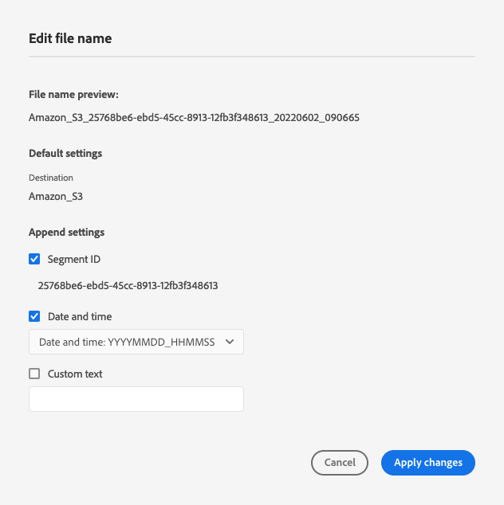

# バッチ設定 {#batch-configuration}

Destination SDKのバッチ設定オプションを使用して、書き出されるファイル名をカスタマイズし、好みに応じて書き出しスケジュールを設定できます。

Destination SDKを使用してファイルベースの宛先を作成する場合、デフォルトのファイルの命名および書き出しスケジュールを設定したり、ユーザーに Platform UI からこれらの設定を指定したりできます。 例えば、次のような動作を設定できます。

* ファイル名に特定の情報を含める（セグメント ID、宛先 ID、カスタム情報など）。
* ユーザーが Platform UI からファイルの命名をカスタマイズできるようにします。
* 設定された時間間隔でファイルエクスポートを設定します。
* ユーザーが Platform UI で表示できるファイルの命名および書き出しスケジュールのカスタマイズオプションを定義します。

バッチ設定は、ファイルベースの宛先の宛先設定の一部です。

Destination SDKを使用して作成された統合で、このコンポーネントがどこに適合するかを把握するには、 [設定オプション](../configuration-options.md) ドキュメントを参照するか、 [Destination SDKを使用したファイルベースの宛先の設定](../../guides/configure-file-based-destination-instructions.md#create-server-file-configuration).

ファイルの命名と書き出しのスケジュール設定は、 `/authoring/destinations` endpoint. このページに示すコンポーネントを設定できる API 呼び出しの詳細な例については、次の API リファレンスページを参照してください。

* [宛先設定の作成](../../authoring-api/destination-configuration/create-destination-configuration.md)
* [宛先設定の更新](../../authoring-api/destination-configuration/update-destination-configuration.md)

この記事では、宛先に使用できる、サポートされるすべてのバッチ設定オプションについて説明し、Platform UI で顧客に表示される内容を示します。

>[!IMPORTANT]
>
>Destination SDKでサポートされるすべてのパラメーター名と値は **大文字と小文字を区別**. 大文字と小文字の区別に関するエラーを避けるには、ドキュメントに示すように、パラメーターの名前と値を正確に使用してください。

## サポートされる統合のタイプ {#supported-integration-types}

このページで説明する機能をサポートする統合のタイプについて詳しくは、次の表を参照してください。

| 統合タイプ | 機能をサポート |
|---|---|
| リアルタイム（ストリーミング）統合 | いいえ |
| ファイルベース（バッチ）の統合 | ○ |

## サポートされているパラメーター {#supported-parameters}

ここで設定した値は、 [セグメントの書き出しをスケジュール](../../../ui/activate-batch-profile-destinations.md#scheduling) ファイルベースの宛先のアクティベーションワークフローの手順です。

```json
"batchConfig":{
   "allowMandatoryFieldSelection":true,
   "allowDedupeKeyFieldSelection":true,
   "defaultExportMode":"DAILY_FULL_EXPORT",
   "allowedExportMode":[
      "DAILY_FULL_EXPORT",
      "FIRST_FULL_THEN_INCREMENTAL"
   ],
   "allowedScheduleFrequency":[
      "DAILY",
      "EVERY_3_HOURS",
      "EVERY_6_HOURS",
      "EVERY_8_HOURS",
      "EVERY_12_HOURS",
      "ONCE"
   ],
   "defaultFrequency":"DAILY",
   "defaultStartTime":"00:00",
   "filenameConfig":{
         "allowedFilenameAppendOptions":[
            "SEGMENT_NAME",
            "DESTINATION_INSTANCE_ID",
            "DESTINATION_INSTANCE_NAME",
            "ORGANIZATION_NAME",
            "SANDBOX_NAME",
            "DATETIME",
            "CUSTOM_TEXT"
         ],
         "defaultFilenameAppendOptions":[
            "DATETIME"
         ],
         "defaultFilename":"%DESTINATION%_%SEGMENT_ID%"
      },
   }
```

| パラメーター | タイプ | 説明 |
|---------|----------|------|
| `allowMandatoryFieldSelection` | ブール値 | `true` に設定すると、顧客は必須のプロファイル属性を指定できます。デフォルト値は `false` です。詳しくは、[必須の属性](../../../ui/activate-batch-profile-destinations.md#mandatory-attributes)を参照してください。 |
| `allowDedupeKeyFieldSelection` | ブール値 | `true` に設定すると、顧客は重複排除キーを指定できます。デフォルト値は `false` です。詳しくは、[重複排除キー](../../../ui/activate-batch-profile-destinations.md#deduplication-keys)を参照してください。 |
| `defaultExportMode` | 列挙 | デフォルトのファイルのエクスポートモードを定義します。サポートされている値。<ul><li>`DAILY_FULL_EXPORT`</li><li>`FIRST_FULL_THEN_INCREMENTAL`</li></ul> デフォルト値は `DAILY_FULL_EXPORT` です。ファイルエクスポートのスケジューリングについて詳しくは、[バッチ有効化ドキュメント](../../../ui/activate-batch-profile-destinations.md#scheduling)を参照してください。 |
| `allowedExportModes` | リスト | 顧客が使用できるファイルのエクスポートモードを定義します。サポートされている値。<ul><li>`DAILY_FULL_EXPORT`</li><li>`FIRST_FULL_THEN_INCREMENTAL`</li></ul> |
| `allowedScheduleFrequency` | リスト | 顧客が使用できるファイルエクスポートの頻度を定義します。サポートされている値。<ul><li>`ONCE`</li><li>`EVERY_3_HOURS`</li><li>`EVERY_6_HOURS`</li><li>`EVERY_8_HOURS`</li><li>`EVERY_12_HOURS`</li><li>`DAILY`</li></ul> |
| `defaultFrequency` | 列挙 | デフォルトのファイルエクスポートの頻度を定義します。サポートされている値は次のとおりです。<ul><li>`ONCE`</li><li>`EVERY_3_HOURS`</li><li>`EVERY_6_HOURS`</li><li>`EVERY_8_HOURS`</li><li>`EVERY_12_HOURS`</li><li>`DAILY`</li></ul> デフォルト値は `DAILY` です。 |
| `defaultStartTime` | 文字列 | ファイルエクスポートのデフォルトの開始時間を定義します。24 時間のファイル形式を使用します。デフォルト値は「00:00」です。 |
| `filenameConfig.allowedFilenameAppendOptions` | 文字列 | *必須*。ユーザーが選択できるファイル名マクロのリスト。 これにより、書き出されるファイル名（セグメント ID、組織名、書き出しの日時など）に追加される項目が決まります。 設定時 `defaultFilename`の場合は、マクロの重複を避けてください。 <br><br>サポートされている値。 <ul><li>`DESTINATION`</li><li>`SEGMENT_ID`</li><li>`SEGMENT_NAME`</li><li>`DESTINATION_INSTANCE_ID`</li><li>`DESTINATION_INSTANCE_NAME`</li><li>`ORGANIZATION_NAME`</li><li>`SANDBOX_NAME`</li><li>`DATETIME`</li><li>`CUSTOM_TEXT`</li></ul>マクロを定義する順序に関係なく、Experience PlatformUI では常に、ここに示す順序で表示されます。 <br><br> If `defaultFilename` が空の場合、 `allowedFilenameAppendOptions` リストには少なくとも 1 つのマクロを含める必要があります。 |
| `filenameConfig.defaultFilenameAppendOptions` | 文字列 | *必須*。事前に選択されたデフォルトのファイル名マクロ（ユーザーがチェックを外すことができます）。<br><br> このリストのマクロは、 `allowedFilenameAppendOptions`. |
| `filenameConfig.defaultFilename` | 文字列 | *オプション*。書き出すファイルの既定のファイル名マクロを定義します。 これらをユーザーが上書きすることはできません。 <br><br>で定義された任意のマクロ `allowedFilenameAppendOptions` が `defaultFilename` マクロ。 <br><br>If `defaultFilename` が空の場合は、に少なくとも 1 つのマクロを定義する必要があります。 `allowedFilenameAppendOptions`. |

{style="table-layout:auto"}

## ファイル名設定 {#file-name-configuration}

ファイル名設定マクロを使用して、書き出すファイル名を定義します。 次の表のマクロは、 [ファイル名設定](../../../ui/activate-batch-profile-destinations.md#file-names) 画面

>[!TIP]
> 
>ベストプラクティスとして、常に `SEGMENT_ID` マクロを書き出すファイル名に含めます。 セグメント ID は一意なので、ファイル名に含めるのが最適な方法で、ファイル名も一意にすることができます。

| マクロ | UI ラベル | 説明 | 例 |
|---|---|---|---|
| `DESTINATION` | [!UICONTROL 宛先] | UI での宛先名。 | Amazon S3 |
| `SEGMENT_ID` | [!UICONTROL Segment ID] | プラットフォームで生成された一意のセグメント ID | ce5c5482-2813-4a80-99bc-57113f6acde2 |
| `SEGMENT_NAME` | [!UICONTROL セグメント名] | ユーザー定義のセグメント名 | VIP subscriber |
| `DESTINATION_INSTANCE_ID` | [!UICONTROL 宛先 ID] | 宛先インスタンスの、プラットフォームで生成された一意の ID | 7b891e5f-025a-4f0d-9e73-1919e71da3b0 |
| `DESTINATION_INSTANCE_NAME` | [!UICONTROL 宛先名] | 宛先インスタンスのユーザー定義名。 | My 2022 Advertising Destination |
| `ORGANIZATION_NAME` | [!UICONTROL 組織名] | Adobe Experience Platformの顧客組織の名前。 | 組織名 |
| `SANDBOX_NAME` | [!UICONTROL サンドボックス名] | 顧客が使用するサンドボックスの名前。 | prod |
| `DATETIME` または `TIMESTAMP` | [!UICONTROL 日時] | `DATETIME` および `TIMESTAMP` どちらも、ファイルが生成された日時を定義しますが、形式は異なります。 <br><br><ul><li>`DATETIME` は次の形式を使用します。YYYYMMDD_HHMMSS です。</li><li>`TIMESTAMP` は 10 桁の Unix 形式を使用します。 </li></ul> `DATETIME` および `TIMESTAMP` は相互に排他的で、同時に使用することはできません。 | <ul><li>`DATETIME`: 20220509_210543</li><li>`TIMESTAMP`: 1652131584</li></ul> |
| `CUSTOM_TEXT` | [!UICONTROL カスタムテキスト] | ファイル名に含めるユーザ定義のカスタムテキスト。 では使用できません `defaultFilename`. | My_Custom_Text |
| `TIMESTAMP` | [!UICONTROL 日時] | ファイルが生成された時刻の 10 桁のタイムスタンプ（UNIX 形式）。 | 1652131584 |

{style="table-layout:auto"}

### ファイル名の設定例

次の設定例は、API 呼び出しで使用される設定と UI に表示されるオプションとの対応を示しています。

```json
"filenameConfig":{
   "allowedFilenameAppendOptions":[
      "CUSTOM_TEXT",
      "SEGMENT_ID",
      "DATETIME"
   ],
   "defaultFilenameAppendOptions":[
      "SEGMENT_ID",
      "DATETIME"
   ],
   "defaultFilename": "%DESTINATION%"
}
```



## 次の手順 {#next-steps}

この記事を読むと、ファイルベースの宛先のファイルの命名および書き出しのスケジュールを設定する方法をより深く理解できるようになります。

その他の宛先コンポーネントについて詳しくは、次の記事を参照してください。

* [顧客認証設定](customer-authentication.md)
* [OAuth 2 認証](oauth2-authentication.md)
* [顧客データフィールド](customer-data-fields.md)
* [UI 属性](ui-attributes.md)
* [スキーマ設定](schema-configuration.md)
* [ID 名前空間の設定](identity-namespace-configuration.md)
* [サポートされるマッピング設定](supported-mapping-configurations.md)
* [宛先配信](destination-delivery.md)
* [オーディエンスメタデータの設定](audience-metadata-configuration.md)
* [集計ポリシー](aggregation-policy.md)
* [プロファイル選定履歴](historical-profile-qualifications.md)