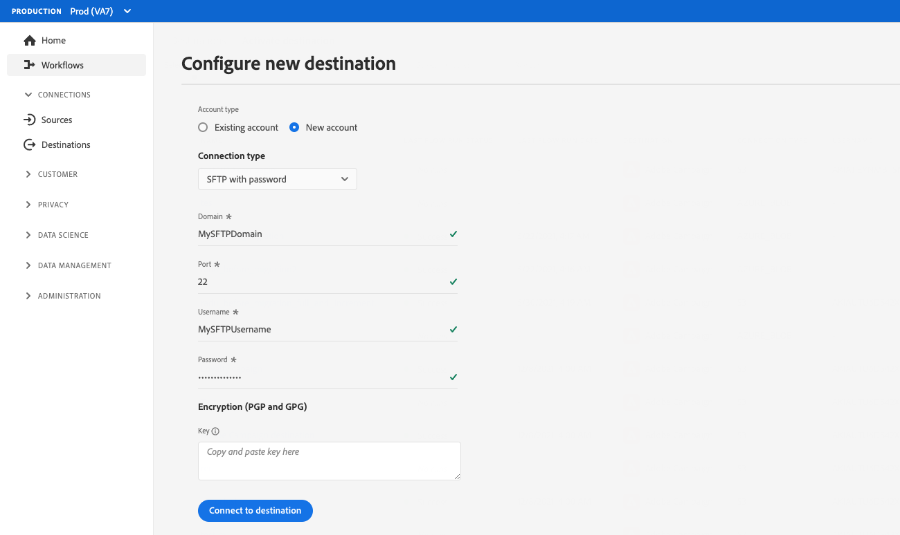

# 顧客認証設定

Experience Platformは、パートナーやお客様が利用できる認証プロトコルを柔軟に提供します。 などの業界標準の認証方法をサポートするように宛先を設定できます。 [!DNL OAuth2]、bearer トークン認証、パスワード認証など。

このページでは、優先認証方式を使用して宛先を設定する方法について説明します。 宛先の作成時に使用する認証設定に基づき、Experience PlatformUI で宛先に接続すると、様々な種類の認証ページが表示されます。

Destination SDKを使用して作成された統合で、このコンポーネントがどこに適合するかを把握するには、 [設定オプション](../configuration-options.md) ドキュメントを参照するか、次の宛先設定の概要ページを参照してください。

* [Destination SDK を使用したストリーミングの宛先の設定](../../guides/configure-destination-instructions.md#create-destination-configuration)
* [Destination SDK を使用したファイルベースの宛先の設定](../../guides/configure-file-based-destination-instructions.md#create-destination-configuration)

お客様が Platform から宛先にデータを書き出す前に、 [宛先接続](../../../ui/connect-destination.md) チュートリアル

条件 [宛先の作成](../../authoring-api/destination-configuration/create-destination-configuration.md) Destination SDK `customerAuthenticationConfigurations` セクションは、顧客に表示する内容を定義します [認証画面](../../../ui/connect-destination.md#authenticate). 宛先の認証タイプに応じて、次のような様々な認証の詳細を指定する必要があります。

* を使用する宛先の場合 [基本認証](#basic)の場合、ユーザーはユーザー UI 認証ページで直接ユーザー名とパスワードを入力する必要がありますExperience Platform。
* を使用する宛先の場合 [ベアラー認証](#bearer)の場合、ユーザーは bearer トークンを提供する必要があります。
* を使用する宛先の場合 [OAuth2 認証](#oauth2)の場合、ユーザーはログインページにリダイレクトされ、自分の資格情報でログインできます。
* の場合 [Amazon S3](#s3) 宛先、ユーザーは、 [!DNL Amazon S3] アクセスキーと秘密鍵。
* の場合 [Azure Blob](#blob) 宛先、ユーザーは、 [!DNL Azure Blob] 接続文字列。

顧客認証の詳細は、 `/authoring/destinations` endpoint. このページに示すコンポーネントを設定できる API 呼び出しの詳細な例については、次の API リファレンスページを参照してください。

* [宛先設定の作成](../../authoring-api/destination-configuration/create-destination-configuration.md)
* [宛先設定の更新](../../authoring-api/destination-configuration/update-destination-configuration.md)

この記事では、宛先に使用できる、サポートされるすべての顧客認証設定について説明し、宛先に設定した認証方法に基づいて、Experience PlatformUI で顧客に表示される内容を示します。

>[!IMPORTANT]
>
>顧客認証設定では、パラメーターを設定する必要はありません。 このページに表示されるスニペットを API 呼び出しでコピー&amp;ペーストできます。 [作成中](../../authoring-api/destination-configuration/create-destination-configuration.md) または [更新中](../../authoring-api/destination-configuration/update-destination-configuration.md) 宛先設定が作成され、ユーザーに対応する認証画面が Platform UI に表示されます。

>[!IMPORTANT]
>
>Destination SDKでサポートされるすべてのパラメーター名と値は **大文字と小文字を区別**. 大文字と小文字の区別に関するエラーを避けるには、ドキュメントに示すように、パラメーターの名前と値を正確に使用してください。

## サポートされる統合のタイプ {#supported-integration-types}

このページで説明する機能をサポートする統合のタイプについて詳しくは、次の表を参照してください。

| 統合タイプ | 機能をサポート |
|---|---|
| リアルタイム（ストリーミング）統合 | ○ |
| ファイルベース（バッチ）の統合 | ○ |

## 認証ルールの設定 {#authentication-rule}

このページで説明するいずれかの顧客認証設定を使用する場合、 `authenticationRule` パラメーター [宛先の配信](destination-delivery.md) から `"CUSTOMER_AUTHENTICATION"`、以下に示すように。

```json {line-numbers="true" highlight="4"
{
   "destinationDelivery":[
      {
         "authenticationRule":"CUSTOMER_AUTHENTICATION",
         "destinationServerId":"{{destinationServerId}}"
      }
   ]
}
```

## 基本認証 {#basic}

基本認証は、Experience Platformでのリアルタイム（ストリーミング）統合に対してサポートされます。

基本認証タイプを設定する場合、ユーザーは宛先に接続するためのユーザー名とパスワードを入力する必要があります。


宛先の基本認証を設定するには、 `customerAuthenticationConfigurations` セクション ( `/destinations` エンドポイントに次のように表示されます。

```json
"customerAuthenticationConfigurations":[
   {
      "authType":"BASIC"
   }
]
```

## ベアラー認証 {#bearer}

ベアラー認証タイプを設定する場合、ユーザーは接続先から取得したベアラートークンを入力する必要があります。


宛先に bearer タイプの認証を設定するには、 `customerAuthenticationConfigurations` セクション ( `/destinations` エンドポイントに次のように表示されます。

```json
"customerAuthenticationConfigurations":[
   {
      "authType":"BEARER"
   }
]
```

## OAuth 2 認証 {#oauth2}

ユーザーが「**[!UICONTROL 宛先に接続]**」を選択すると、以下の Twitter カスタムオーディエンスの宛先の例のように、宛先への OAuth 2 認証フローがトリガーされます。宛先エンドポイントへの OAuth 2 認証の設定について詳しくは、専用の [Destination SDK OAuth 2 認証ページ](oauth2-authentication.md)をお読みください。


次の手順でを設定します。 [!DNL OAuth2] 宛先の認証について、 `customerAuthenticationConfigurations` セクション ( `/destinations` エンドポイントに次のように表示されます。

```json
"customerAuthenticationConfigurations":[
   {
      "authType":"OAUTH2"
   }
]
```

## Amazon S3 認証 {#s3}

Experience Platform では、[!DNL Amazon S3] 認証がファイルベースの宛先に対してサポートされています。

Amazon S3 認証タイプを設定する場合、ユーザーは S3 資格情報を入力する必要があります。


次の手順でを設定します。 [!DNL Amazon S3] 宛先の認証について、 `customerAuthenticationConfigurations` セクション ( `/destinations` エンドポイントに次のように表示されます。

```json
"customerAuthenticationConfigurations":[
   {
      "authType":"S3"
   }
]
```

## Azure Blob 認証  {#blob}

Experience Platform では、[!DNL Azure Blob Storage] 認証がファイルベースの宛先に対してサポートされています。

Azure Blob 認証タイプを設定する際に、ユーザーは接続文字列を入力する必要があります。


[!DNL Azure Blob] 認証を宛先に設定するには、エンドポイント `/destinations` の `customerAuthenticationConfigurations` パラメーターを次のように設定します。

```json
"customerAuthenticationConfigurations":[
   {
      "authType":"AZURE_CONNECTION_STRING"
   }
]
```

## [!DNL Azure Data Lake Storage] 認証 {#adls}

Experience Platform では、[!DNL Azure Data Lake Storage] 認証がファイルベースの宛先に対してサポートされています。

次を設定する場合、 [!DNL Azure Data Lake Storage] 認証の種類。ユーザーは、Azure Service Principal の資格情報とそのテナント情報を入力する必要があります。

![[!DNL Azure Data Lake Storage] 認証を使用した UI レンダリング](../../assets/functionality/destination-configuration/adls-authentication-ui.png)

[!DNL Azure Data Lake Storage]（ADLS）認証を宛先に設定するには、エンドポイント `/destinations` の `customerAuthenticationConfigurations` パラメーターを次のように設定します。

```json
"customerAuthenticationConfigurations":[
   {
      "authType":"AZURE_SERVICE_PRINCIPAL"
   }
]
```

## パスワード認証を使用した SFTP

Experience Platform では、パスワードを使用した [!DNL SFTP] 認証がファイルベースの宛先に対してサポートされています。

パスワード認証タイプで SFTP を設定する際に、ユーザーは SFTP のユーザー名とパスワード、SFTP ドメインとポート（デフォルトポートは 22）を入力する必要があります。



パスワードを使用した SFTP 認証を宛先に設定するには、エンドポイント `/destinations` の `customerAuthenticationConfigurations` パラメーターを次のように設定します。

```json
"customerAuthenticationConfigurations":[
   {
      "authType":"SFTP_WITH_PASSWORD"
   }
]
```

## SSH キー認証を使用した SFTP

Experience Platform では、[!DNL SSH] キーを使用した [!DNL SFTP] 認証がファイルベースの宛先に対してサポートされています。

SSH キー認証タイプで SFTP を設定する際に、ユーザーは SFTP のユーザー名と SSH キー、および SFTP ドメインとポート（デフォルトポートは 22）を入力する必要があります。


SSH キーを使用した SFTP 認証を宛先に設定するには、エンドポイント `/destinations` の `customerAuthenticationConfigurations` パラメーターを次のように設定します。

```json
"customerAuthenticationConfigurations":[
   {
      "authType":"SFTP_WITH_SSH_KEY"
   }
]
```

## [!DNL Google Cloud Storage] 認証 {#gcs}

Experience Platform では、[!DNL Google Cloud Storage] 認証がファイルベースの宛先に対してサポートされています。

次を設定する場合、 [!DNL Google Cloud Storage] 認証タイプ、ユーザーは、 [!DNL Google Cloud Storage] [!UICONTROL アクセスキー ID] および [!UICONTROL 秘密アクセスキー].


[!DNL Google Cloud Storage] 認証を宛先に設定するには、エンドポイント `/destinations` の `customerAuthenticationConfigurations` パラメーターを次のように設定します。

```json
"customerAuthenticationConfigurations":[
   {
      "authType":"GOOGLE_CLOUD_STORAGE"
   }
]
```

## 次の手順 {#next-steps}

この記事を読むと、宛先プラットフォームへのユーザー認証の設定方法をより深く理解できるようになります。

その他の宛先コンポーネントについて詳しくは、次の記事を参照してください。

* [OAuth 2 認証](oauth2-authentication.md)
* [顧客データフィールド](customer-data-fields.md)
* [UI 属性](ui-attributes.md)
* [スキーマ設定](schema-configuration.md)
* [ID 名前空間の設定](identity-namespace-configuration.md)
* [サポートされるマッピング設定](supported-mapping-configurations.md)
* [宛先配信](destination-delivery.md)
* [オーディエンスメタデータの設定](audience-metadata-configuration.md)
* [集計ポリシー](aggregation-policy.md)
* [バッチ設定](batch-configuration.md)
* [プロファイル選定履歴](historical-profile-qualifications.md)