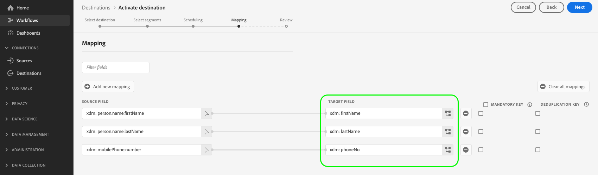

# パートナースキーマ設定

Experience Platform では、スキーマを使用して、一貫性のある再利用可能な方法でデータの構造を記述します。データは、Platform に取り込まれる際に、XDM スキーマに従って構造化されます。 デザインの原則やベストプラクティスなど、スキーマ構成モデルについて詳しくは、[スキーマ構成の基本](../../../../xdm/schema/composition.md)を参照してください。

宛先を使用して宛先を作成する場合、Destination SDKプラットフォームで使用する独自のパートナースキーマを定義できます。 これにより、ユーザーは、Platform UI 内で、Platform のプロファイル属性を、宛先プラットフォームで認識される特定のフィールドにマッピングできます。

宛先に対してパートナースキーマを設定する場合、次のように、宛先プラットフォームでサポートされるフィールドマッピングを微調整できます。

* ユーザーが `phoneNumber` XDM 属性の `phone` 属性は、宛先プラットフォームでサポートされています。
* Experience Platformが動的に呼び出す動的なパートナースキーマを作成して、宛先内でサポートされているすべての属性のリストを取得します。
* 宛先プラットフォームで必要な必須フィールドマッピングを定義します。

Destination SDKを使用して作成された統合で、このコンポーネントがどこに適合するかを把握するには、 [設定オプション](../configuration-options.md) ドキュメントを参照するか、 [Destination SDKを使用したファイルベースの宛先の設定](../../guides/configure-file-based-destination-instructions.md#create-server-file-configuration).

スキーマ設定は、 `/authoring/destinations` endpoint. このページに示すコンポーネントを設定できる API 呼び出しの詳細な例については、次の API リファレンスページを参照してください。

* [宛先設定の作成](../../authoring-api/destination-configuration/create-destination-configuration.md)
* [宛先設定の更新](../../authoring-api/destination-configuration/update-destination-configuration.md)

この記事では、宛先に使用できる、サポートされるすべてのスキーマ設定オプションについて説明し、Platform UI で顧客に表示される内容を示します。

>[!IMPORTANT]
>
>Destination SDKでサポートされるすべてのパラメーター名と値は **大文字と小文字を区別**. 大文字と小文字の区別に関するエラーを避けるには、ドキュメントに示すように、パラメーターの名前と値を正確に使用してください。

## サポートされる統合のタイプ {#supported-integration-types}

このページで説明する機能をサポートする統合のタイプについて詳しくは、次の表を参照してください。

| 統合タイプ | 機能をサポート |
|---|---|
| リアルタイム（ストリーミング）統合 | ○ |
| ファイルベース（バッチ）の統合 | ○ |

## サポートされるスキーマ設定 {#supported-schema-types}

Destination SDKは、次の複数のスキーマ設定をサポートします。

* 静的スキーマは、 `profileFields` 配列を `schemaConfig` 」セクションに入力します。 静的スキーマでは、 `profileFields` 配列。 スキーマを更新する必要がある場合は、 [宛先設定の更新](../../authoring-api/destination-configuration/update-destination-configuration.md).
* 動的スキーマは、 [動的スキーマサーバー](../../authoring-api/destination-server/create-destination-server.md)を使用して、独自の API に基づいて動的にスキーマを生成します。 動的スキーマでは、 `profileFields` 配列。 スキーマを更新する必要がある場合、 [宛先設定の更新](../../authoring-api/destination-configuration/update-destination-configuration.md). 代わりに、動的スキーマサーバーが API から更新されたスキーマを取得します。
* スキーマ設定内で、必要な（または定義済みの）マッピングを追加するオプションがあります。 これらは、ユーザーが Platform UI で表示できるマッピングですが、宛先への接続を設定する際に変更することはできません。 例えば、常に宛先に送信される電子メールアドレスフィールドを適用できます。

この `schemaConfig` セクションでは、次の節で示すように、必要なスキーマのタイプに応じて、複数の設定パラメーターを使用します。

## 静的スキーマの作成 {#attributes-schema}

プロファイル属性を持つ静的スキーマを作成するには、 `profileFields` 配列を指定します。

```json
"schemaConfig":{
      "profileFields":[
           {
              "name":"phoneNo",
              "title":"phoneNo",
              "description":"This is a fixed attribute on your destination side that customers can map profile attributes to. For example, the mobilePhone.number value in Experience Platform could be phoneNo on your side.",
              "type":"string",
              "isRequired":false,
              "readOnly":false,
              "hidden":false
           },
                      {
              "name":"firstName",
              "title":"firstName",
              "description":"This is a fixed attribute on your destination side that customers can map profile attributes to. For example, the person.name.firstName value in Experience Platform could be firstName on your side.",
              "type":"string",
              "isRequired":false,
              "readOnly":false,
              "hidden":false
           },
                      {
              "name":"lastName",
              "title":"lastName",
              "description":"This is a fixed attribute on your destination side that customers can map profile attributes to. For example, the person.name.lastName value in Experience Platform could be phoneNo on your side.",
              "type":"string",
              "isRequired":false,
              "readOnly":false,
              "hidden":false
           }
        ],
      "useCustomerSchemaForAttributeMapping":false,
      "profileRequired":true,
      "segmentRequired":true,
      "identityRequired":true
}
```

| パラメーター | タイプ | 必須／オプション | 説明 |
|---------|----------|------|---|
| `profileFields` | 配列 | オプション | 宛先プラットフォームで受け入れられるターゲット属性の配列を定義します。この配列には、顧客がプロファイル属性をマッピングできます。 を使用する場合 `profileFields` 配列の場合は、省略できます `useCustomerSchemaForAttributeMapping` パラメーターを完全に使用します。 |
| `useCustomerSchemaForAttributeMapping` | ブール値 | オプション | 顧客スキーマから `profileFields` 配列。 <ul><li>次に設定した場合： `true`の場合、ユーザーはマッピングフィールドにソース列のみ表示されます。 `profileFields` この場合、は適用されません。</li><li>次に設定した場合： `false`を使用すると、ユーザーは、ソース属性をスキーマから、 `profileFields` 配列。</li></ul> デフォルト値は `false` です。 |
| `profileRequired` | ブール値 | オプション | 用途 `true` ユーザーが、宛先プラットフォーム上のExperience Platformからカスタム属性にプロファイル属性をマッピングできる場合。 |
| `segmentRequired` | ブール値 | 必須 | このパラメーターはDestination SDKで必要で、常にに設定する必要があります。 `true`. |
| `identityRequired` | ブール値 | 必須 | に設定 `true` マッピングが可能か [id タイプ](identity-namespace-configuration.md) Experience Platformから `profileFields` 配列を使用します。 |

{style="table-layout:auto"}

結果の UI エクスペリエンスは、次の画像に表示されます。

ユーザーがターゲットマッピングを選択すると、 `profileFields` 配列。


属性を選択すると、ターゲットフィールド列に表示されます。



## 動的スキーマの作成 {#dynamic-schema-configuration}

Destination SDKは、動的パートナースキーマの作成をサポートします。 動的スキーマは、静的スキーマとは異なり、 `profileFields` 配列。 代わりに、動的スキーマは、スキーマ設定を取得する独自の API に接続する動的スキーマサーバーを使用します。

>[!IMPORTANT]
>
>動的スキーマを作成する前に、次の操作を行う必要があります [動的スキーマサーバーの作成](../../authoring-api/destination-server/create-destination-server.md).

動的スキーマ設定では、 `profileFields` 配列が `dynamicSchemaConfig` 」セクションに表示されます。

```json
"schemaConfig":{
   "dynamicSchemaConfig":{
      "dynamicEnum": {
         "authenticationRule":"CUSTOMER_AUTHENTICATION",
         "destinationServerId":"DYNAMIC_SCHEMA_SERVER_ID",
         "value": "Schema Name",
         "responseFormat": "SCHEMA"
      }
   },
   "profileRequired":true,
   "segmentRequired":true,
   "identityRequired":true
}
```

| パラメーター | タイプ | 必須／オプション | 説明 |
|---------|----------|------|---|
| `dynamicEnum.authenticationRule` | 文字列 | 必須 | [!DNL Platform] の顧客が宛先に接続する方法を示します。使用できる値は `CUSTOMER_AUTHENTICATION`、`PLATFORM_AUTHENTICATION`、`NONE`、<br> です。 <ul><li>用途 `CUSTOMER_AUTHENTICATION` Platform のお客様が、以下に説明するいずれかの認証方法を使用してシステムにログインした場合 [ここ](customer-authentication.md). </li><li> アドビと接続先との間にグローバル認証システムがあり、[!DNL Platform] の顧客が接続先に認証資格情報を提供する必要がない場合は、`PLATFORM_AUTHENTICATION` を使用してください。この場合、 [credentials オブジェクトの作成](../../credentials-api/create-credential-configuration.md) 資格情報 API を使用します。 </li><li>宛先プラットフォームにデータを送信するために認証が必要ない場合は、`NONE` を使用します。 </li></ul> |
| `dynamicEnum.destinationServerId` | 文字列 | 必須 | この `instanceId` 動的スキーマサーバーの この宛先サーバーには、動的スキーマを取得するためにExperience Platformが呼び出す API エンドポイントが含まれています。 |
| `dynamicEnum.value` | 文字列 | 必須 | 動的スキーマサーバー設定で定義された、動的スキーマの名前。 |
| `dynamicEnum.responseFormat` | 文字列 | 必須 | 常にに設定 `SCHEMA` 動的スキーマを定義する際に使用します。 |
| `profileRequired` | ブール値 | オプション | 用途 `true` ユーザーが、宛先プラットフォーム上のExperience Platformからカスタム属性にプロファイル属性をマッピングできる場合。 |
| `segmentRequired` | ブール値 | 必須 | このパラメーターはDestination SDKで必要で、常にに設定する必要があります。 `true`. |
| `identityRequired` | ブール値 | 必須 | に設定 `true` マッピングが可能か [id タイプ](identity-namespace-configuration.md) Experience Platformから `profileFields` 配列を使用します。 |

{style="table-layout:auto"}

## 必須マッピング {#required-mappings}

スキーマ設定内で、静的または動的スキーマに加えて、必要な（または定義済みの）マッピングを追加するオプションがあります。 これらは、ユーザーが Platform UI で表示できるマッピングですが、宛先への接続を設定する際に変更することはできません。

例えば、常に宛先に送信される電子メールアドレスフィールドを適用できます。

>[!NOTE]
>
>現在、必要なマッピングの次の組み合わせがサポートされています。
>* 必須のソースフィールドと必須の宛先フィールドを設定できます。 この場合、ユーザーは 2 つのフィールドのいずれかを編集または選択できず、選択した項目のみを表示できます。
>* 必須の宛先フィールドのみを設定できます。 この場合、ユーザーは、宛先にマッピングするためのソースフィールドを選択できます。
>
> 現在、必須のソースフィールドのみを設定しています *not* サポート対象。

必要なマッピングを含むスキーマ設定の例と、 [バッチ保存先へのデータのアクティブ化ワークフロー](../../../ui/activate-batch-profile-destinations.md).


>[!BEGINTABS]

>[!TAB 必要なソースおよび宛先のマッピング]

次の例は、必要なソースマッピングと宛先マッピングの両方を示しています。 ソースフィールドと宛先フィールドの両方が必須マッピングとして指定されている場合、ユーザーは 2 つのフィールドのいずれかを選択または編集できず、事前定義された選択のみを表示できます。

```json
"schemaConfig": {
    "requiredMappingsOnly": true,
    "requiredMappings": [
      {
        "sourceType": "text/x.schema-path",
        "source": "personalEmail.address",
        "destination": "personalEmail.address"
      }
    ] 
}
```

| パラメーター | タイプ | 必須／オプション | 説明 |
|---|---|---|---|
| `requiredMappingsOnly` | ブール値 | オプション | これが true に設定されている場合、ユーザーは、 `requiredMappings` 配列。 |
| `requiredMappings.sourceType` | 文字列 | 必須 | のタイプを示します `source` フィールドに入力します。 サポートされている値。 <ul><li>`text/x.schema-path`:この値は、 `source` フィールドは、XDM スキーマのプロファイル属性です。</li><li>`text/x.aep-xl`:この値は、 `source` フィールドは、正規表現で定義されます。 例：`iif(segmentMembership.ups.aep_seg_id.status==\"exited\", \"1\", \"0\")`</li><li>`text/plain`:この値は、 `source` フィールドは、マクロテンプレートによって定義されます。 現在、サポートされているマクロテンプレートは次のみです。 `metadata.segment.alias`.</li></ul> |
| `requiredMappings.source` | 文字列 | 必須 | ソースフィールドの値を示します。 サポートされている値のタイプ： <ul><li>XDM プロファイル属性。 例：`personalEmail.address`ソース属性が XDM プロファイル属性の場合、 `sourceType` パラメータ `text/x.schema-path`.</li><li>正規表現. 例：`iif(segmentMembership.ups.aep_seg_id.status==\"exited\", \"1\", \"0\")`ソース属性が正規表現の場合、 `sourceType` パラメータ `text/x.aep-xl`.</li><li>マクロテンプレート。 例：`metadata.segment.alias`ソース属性がマクロテンプレートの場合は、 `sourceType` パラメータ `text/plain`. 現在、サポートされているマクロテンプレートは次のみです。 `metadata.segment.alias`.</li></ul> |
| `requiredMappings.destination` | 文字列 | 必須 | ターゲットフィールドの値を示します。 ソースフィールドと宛先フィールドの両方が必要なマッピングとして指定されている場合、ユーザーは 2 つのフィールドのいずれかを選択または編集できず、選択した項目のみを表示できます。 |

{style="table-layout:auto"}

その結果、 **[!UICONTROL ソースフィールド]** および **[!UICONTROL ターゲットフィールド]** Platform UI のセクションはグレー表示されます。


>[!TAB 必要な宛先マッピング]

次の例は、必要な宛先マッピングを示しています。 必要に応じて宛先フィールドのみを指定した場合、ユーザーは、マッピングするソースフィールドを選択できます。

```json
"schemaConfig": {
    "requiredMappingsOnly": true,
    "requiredMappings": [
      {
        "destination": "identityMap.ExamplePartner_ID",
        "mandatoryRequired": true,
        "primaryKeyRequired": true
      }
    ] 
}
```

| パラメーター | タイプ | 必須／オプション | 説明 |
|---|---|---|---|
| `requiredMappingsOnly` | ブール値 | オプション | これが true に設定されている場合、ユーザーは、 `requiredMappings` 配列。 |
| `requiredMappings.destination` | 文字列 | 必須 | ターゲットフィールドの値を示します。 宛先フィールドのみを指定した場合、ユーザーは、宛先にマッピングするためのソースフィールドを選択できます。 |
| `mandatoryRequired` | ブール値 | オプション | マッピングを [必須属性](../../../ui/activate-batch-profile-destinations.md#mandatory-attributes). |
| `primaryKeyRequired` | ブール値 | オプション | マッピングを [重複排除キー](../../../ui/activate-batch-profile-destinations.md#deduplication-keys). |

{style="table-layout:auto"}

その結果、 **[!UICONTROL ターゲットフィールド]** Platform UI のセクションはグレー表示になり、 **[!UICONTROL ソースフィールド]** セクションがアクティブになり、ユーザーは操作できます。 この **[!UICONTROL 必須キー]** および **[!UICONTROL 重複排除キー]** オプションはアクティブで、ユーザーは変更できません。


>[!ENDTABS]

## 次の手順 {#next-steps}

この記事を読むと、Destination SDKでサポートされるスキーマの種類と、スキーマの設定方法をより深く理解できるようになります。

その他の宛先コンポーネントについて詳しくは、次の記事を参照してください。

* [顧客認証](customer-authentication.md)
* [OAuth 2 認証](oauth2-authentication.md)
* [UI 属性](ui-attributes.md)
* [顧客データフィールド](customer-data-fields.md)
* [ID 名前空間の設定](identity-namespace-configuration.md)
* [サポートされるマッピング設定](supported-mapping-configurations.md)
* [宛先配信](destination-delivery.md)
* [オーディエンスメタデータの設定](audience-metadata-configuration.md)
* [集計ポリシー](aggregation-policy.md)
* [バッチ設定](batch-configuration.md)
* [プロファイル選定履歴](historical-profile-qualifications.md)