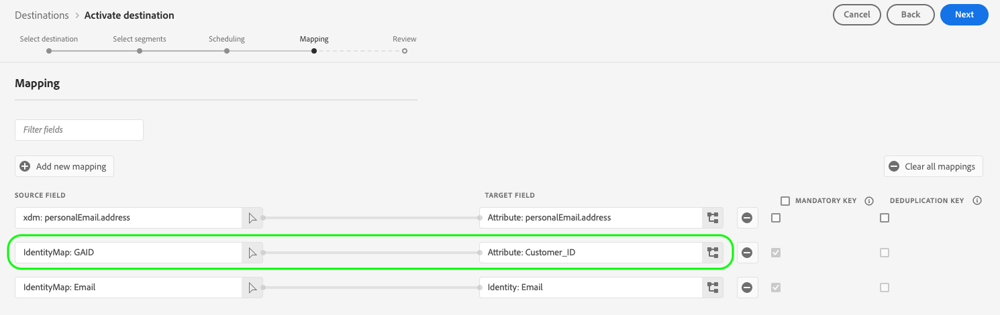

# サポートされるマッピング設定

Destination SDK で作成された宛先は、宛先タイプに基づいて、特定の ID 名前空間および属性マッピング設定をサポートします。

この記事では、宛先を設定する際に使用できる、サポートされるすべてのマッピング設定について説明します。

>[!WARNING]
>
>この記事で説明されていない任意のマッピング設定は、Destination SDK でサポートされていません。

宛先を作成する場合、このページで説明されているいずれかのマッピング設定に応じて、スキーマおよび ID 名前空間を設定します。

>[!IMPORTANT]
>
>Destination SDK でサポートされているすべてのパラメーター名および値は、**大文字と小文字が区別**&#x200B;されます。大文字と小文字を区別することに関するエラーを避けるために、ドキュメントに示すように、パラメーター名および値を正確に使用してください。

## ストリーミング宛先でサポートされるマッピング {#streaming-mappings}

Destination SDK で作成されたリアルタイム（ストリーミング）宛先は、以下の表で説明されているマッピング設定をサポートします。

| ソースフィールド | ターゲットフィールド |
| --- | --- |
| XDM 属性 | カスタム属性 |
| ID 名前空間 | ID 名前空間 |

以下の設定例を使用すると、お客様は、上記の表の両方のマッピングを使用できます。

```json
"schemaConfig":{
   "profileRequired":true,
   "segmentRequired":true,
   "identityRequired":true
},
"identityNamespaces":{
   "Customer_contact":{
      "acceptsAttributes":false,
      "acceptsCustomNamespaces":true,
      "acceptedGlobalNamespaces":{
         "Email":{
            
         },
         "Phone":{
            
         }
      }
   }
},
```

### XDM 属性のカスタム属性へのマッピング {#streaming-xdm-to-custom}

ユーザーは、ソース XDM プロファイルから宛先側のカスタム属性に属性をマッピングできます。

ユーザーは、ターゲットフィールドマッピングを選択する際に、ターゲットのカスタム属性の名前を手動で入力する必要があります。


以下の画像に、結果の UI エクスペリエンスを示します。


### ID 名前空間のパートナー ID 名前空間へのマッピング {#streaming-identity-to-identity}

ユーザーは、Platform からユーザーが定義した ID 名前空間に、カスタムまたはグローバル ID 名前空間をマッピングできます。

以下の画像に、結果の UI エクスペリエンスを示します。


## ファイルベースの宛先でサポートされるマッピング {#batch-mappings}

Destination SDK で作成されたファイルベースの宛先は、以下の表で説明されているマッピング設定をサポートします。詳細なマッピングの例については、次の節を参照してください。

| ソースフィールド | ターゲットフィールド |
| --- | --- |
| XDM 属性 | 属性／カスタム属性 |
| ID 名前空間 | 属性／カスタム属性 |
| ID 名前空間 | ID 名前空間 |

以下の設定例を使用すると、お客様は、上記の表からすべてのマッピングを使用できます。

```json
"schemaConfig":{
   "profileRequired":true,
   "segmentRequired":true,
   "identityRequired":true
},
"identityNamespaces":{
   "Customer_contact":{
      "acceptsAttributes":false,
      "acceptsCustomNamespaces":true,
      "acceptedGlobalNamespaces":{
         "Email":{
         },
         "Phone":{
         }
      }
   }
},
```

### XDM 属性のカスタム属性へのマッピング {#batch-xdm-to-custom}

ユーザーは、ソース XDM プロファイルから宛先側のカスタム属性に属性をマッピングできます。

ファイルベースの宛先の場合、ターゲットフィールドは、ソースフィールドと同じ名前のデフォルトの属性で自動的に設定されます。

以下の画像に、結果の UI エクスペリエンスを示します。


ユーザーは、デフォルトの名前のままでも、ターゲットフィールドの選択画面でカスタム属性名を入力することもできます。


### ID 名前空間のカスタム属性へのマッピング {#batch-identity-to-custom}

ユーザーは、Platform から宛先側のカスタム属性にカスタムまたはグローバル ID 名前空間をマッピングできます。

ID 名前空間をソースフィールドとして選択する場合、ターゲットフィールドは、同等の ID 名前空間に自動的に設定されます。ターゲットフィールドをカスタム属性に置き換えるには、ユーザーは、ターゲットフィールドの選択画面でカスタム属性名を入力する必要があります。


以下の画像に、結果の UI エクスペリエンスを示します。



### ID 名前空間のパートナー ID 名前空間へのマッピング {#batch-identity-to-identity}

ユーザーは、Platform から同等の ID 名前空間に、カスタムまたはグローバル ID 名前空間をマッピングできます。

ID 名前空間をソースフィールドとして選択する場合、ターゲットフィールドは、同等の ID 名前空間に自動的に設定されます。

以下の画像に、結果の UI エクスペリエンスを示します。


## 次の手順 {#next-steps}

この記事を読むことで、Destination SDK で作成された宛先でサポートされているマッピングについて、理解を深めることができました。

その他の宛先コンポーネントについて詳しくは、以下の記事を参照してください。

* [顧客認証](customer-authentication.md)
* [OAuth 2 認証](oauth2-authentication.md)
* [顧客データフィールド](customer-data-fields.md)
* [UI 属性](ui-attributes.md)
* [スキーマ設定](schema-configuration.md)
* [ID 名前空間設定](identity-namespace-configuration.md)
* [宛先配信](destination-delivery.md)
* [オーディエンスメタデータ設定](audience-metadata-configuration.md)
* [集計ポリシー](aggregation-policy.md)
* [バッチ設定](batch-configuration.md)
* [プロファイル選定履歴](historical-profile-qualifications.md)
