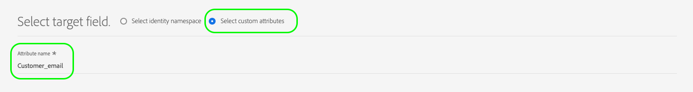

# サポートされるマッピング設定

Destination SDKを使用して構築された宛先は、宛先タイプに基づいて、特定の ID 名前空間と属性マッピング設定をサポートします。

この記事では、宛先を設定する際に使用できる、サポートされるすべてのマッピング設定について説明します。

>[!WARNING]
>
>この記事に記載されていないマッピング設定は、Destination SDKではサポートされていません。

宛先を構築する際は、このページで説明しているマッピング設定の 1 つに従って、スキーマと ID 名前空間を設定します。

>[!IMPORTANT]
>
>Destination SDKでサポートされるすべてのパラメーター名と値は **大文字と小文字を区別**. 大文字と小文字の区別に関するエラーを避けるには、ドキュメントに示すように、パラメーターの名前と値を正確に使用してください。

## ストリーミング宛先のサポートされるマッピング {#streaming-mappings}

Destination SDKで構築されたリアルタイム（ストリーミング）の宛先は、次の表で説明するマッピング設定をサポートします。

| ソースフィールド | ターゲットフィールド |
| --- | --- |
| XDM 属性 | カスタム属性 |
| ID 名前空間 | ID 名前空間 |

次の設定例では、上記の表で両方のマッピングを使用できます。

```json
"schemaConfig":{
   "profileRequired":true,
   "segmentRequired":true,
   "identityRequired":true
},
"identityNamespaces":{
   "Customer_contact":{
      "acceptsAttributes":false,
      "acceptsCustomNamespaces":true,
      "acceptedGlobalNamespaces":{
         "Email":{
            
         },
         "Phone":{
            
         }
      }
   }
},
```

### XDM 属性のカスタム属性へのマッピング {#streaming-xdm-to-custom}

ユーザーは、ソース XDM プロファイルの属性を、宛先の側のカスタム属性にマッピングできます。

ターゲットフィールドマッピングを選択する際は、ターゲットカスタム属性の名前を手動で入力する必要があります。



結果の UI エクスペリエンスは、次の画像に表示されます。


### ID 名前空間をパートナー ID 名前空間にマッピングする {#streaming-identity-to-identity}

ユーザーは、カスタム ID 名前空間またはグローバル ID 名前空間を Platform から、定義した ID 名前空間にマッピングできます。

結果の UI エクスペリエンスは、次の画像に表示されます。


## ファイルベースの宛先に対してサポートされるマッピング {#batch-mappings}

Destination SDKで構築されたファイルベースの宛先では、次の表で説明するマッピング設定をサポートしています。 詳細なマッピングの例については、次の節を参照してください。

| ソースフィールド | ターゲットフィールド |
| --- | --- |
| XDM 属性 | 属性/カスタム属性 |
| ID 名前空間 | 属性/カスタム属性 |
| ID 名前空間 | ID 名前空間 |

次の設定例では、上記の表のすべてのマッピングを使用できます。

```json
"schemaConfig":{
   "profileRequired":true,
   "segmentRequired":true,
   "identityRequired":true
},
"identityNamespaces":{
   "Customer_contact":{
      "acceptsAttributes":false,
      "acceptsCustomNamespaces":true,
      "acceptedGlobalNamespaces":{
         "Email":{
         },
         "Phone":{
         }
      }
   }
},
```

### XDM 属性のカスタム属性へのマッピング {#batch-xdm-to-custom}

ユーザーは、ソース XDM プロファイルの属性を、宛先の側のカスタム属性にマッピングできます。

ファイルベースの宛先の場合、ターゲットフィールドには、ソースフィールドと同じ名前のデフォルト属性が自動的に入力されます。

結果の UI エクスペリエンスは、次の画像に表示されます。


ユーザーは、デフォルトの名前をそのまま使用するか、ターゲットフィールドの選択画面にカスタム属性名を入力できます。


### ID 名前空間をカスタム属性にマッピングする {#batch-identity-to-custom}

ユーザーは、カスタム ID 名前空間またはグローバル ID 名前空間を Platform から宛先の側のカスタム属性にマッピングできます。

ID 名前空間をソースフィールドとして選択すると、ターゲットフィールドには、同等の ID 名前空間が自動的に入力されます。 ターゲットフィールドをカスタム属性で置き換えるには、ユーザーは、ターゲットフィールドの選択画面にカスタム属性名を入力する必要があります。


結果の UI エクスペリエンスは、次の画像に表示されます。


### ID 名前空間をパートナー ID 名前空間にマッピングする {#batch-identity-to-identity}

ユーザーは、カスタム ID 名前空間またはグローバル ID 名前空間を Platform から同等の ID 名前空間にマッピングできます。

ID 名前空間をソースフィールドとして選択すると、ターゲットフィールドには、同等の ID 名前空間が自動的に入力されます。

結果の UI エクスペリエンスは、次の画像に表示されます。


## 次の手順 {#next-steps}

この記事を読んだ後、Destination SDKで構築された宛先でサポートされるマッピングについて、より深く理解する必要があります。

その他の宛先コンポーネントについて詳しくは、次の記事を参照してください。

* [顧客認証](customer-authentication.md)
* [OAuth 2 認証](oauth2-authentication.md)
* [顧客データフィールド](customer-data-fields.md)
* [UI 属性](ui-attributes.md)
* [スキーマ設定](schema-configuration.md)
* [ID 名前空間の設定](identity-namespace-configuration.md)
* [宛先配信](destination-delivery.md)
* [オーディエンスメタデータの設定](audience-metadata-configuration.md)
* [集計ポリシー](aggregation-policy.md)
* [バッチ設定](batch-configuration.md)
* [プロファイル選定履歴](historical-profile-qualifications.md)