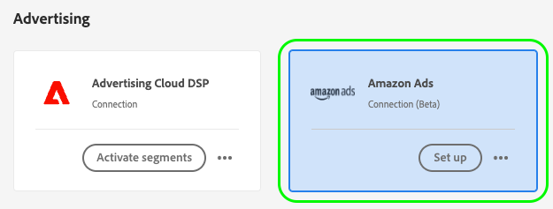

# UI 属性

UI 属性は、宛先プラットフォームのロゴ、ドキュメントページへのリンク、宛先の説明、そのカテゴリとタイプなど、Adobe Experience Platformユーザーインターフェイスの宛先カードに対してAdobeが表示するビジュアル要素を定義します。

Destination SDKを使用して作成された統合で、このコンポーネントがどこに適合するかを把握するには、 [設定オプション](../configuration-options.md) ドキュメントを参照するか、次の宛先設定の概要ページを参照してください。

* [Destination SDK を使用したストリーミングの宛先の設定](../../guides/configure-destination-instructions.md#create-destination-configuration)
* [Destination SDK を使用したファイルベースの宛先の設定](../../guides/configure-file-based-destination-instructions.md#create-destination-configuration)

条件 [宛先の作成](../../authoring-api/destination-configuration/create-destination-configuration.md) Destination SDK `uiAttributes` 「 」セクションでは、宛先カードの次の視覚的プロパティを定義します。

* ( [宛先カタログ](../../../catalog/overview.md).
* 宛先カタログのカードに表示するアイコンをホストした URL。
* 宛先が Platform UI に表示されるカテゴリです。
* 宛先のデータエクスポート頻度。
* 宛先の接続タイプ (Amazon S3、Azure Blob など )。

UI 属性は、 `/authoring/destinations` endpoint. このページに示すコンポーネントを設定できる API 呼び出しの詳細な例については、次の API リファレンスページを参照してください。

* [宛先設定の作成](../../authoring-api/destination-configuration/create-destination-configuration.md)
* [宛先設定の更新](../../authoring-api/destination-configuration/update-destination-configuration.md)

この記事では、宛先に使用できる、サポートされるすべての UI 属性について説明し、Experience PlatformUI で顧客に表示される内容を示します。


>[!IMPORTANT]
>
>Destination SDKでサポートされるすべてのパラメーター名と値は **大文字と小文字を区別**. 大文字と小文字の区別に関するエラーを避けるには、ドキュメントに示すように、パラメーターの名前と値を正確に使用してください。

## サポートされる統合のタイプ {#supported-integration-types}

このページで説明する機能をサポートする統合のタイプについて詳しくは、次の表を参照してください。

| 統合タイプ | 機能をサポート |
|---|---|
| リアルタイム（ストリーミング）統合 | ○ |
| ファイルベース（バッチ）の統合 | ○ |

## サポートされているパラメーター {#supported-parameters}

```json
"uiAttributes":{
      "documentationLink":"http://www.adobe.com/go/YOURDESTINATION-en",
      "category":"cloudStorage",
      "connectionType":"S3",
      "frequency":"batch",
      "isBeta":"true"
   }
```

### `documentationLink` {#documentation-link}

`documentationLink` は、 [宛先カタログ](../../../catalog/overview.md) を設定します。 Adobe Experience Platformで製品化されたすべての宛先には、対応するドキュメントページが必要です。 [宛先ドキュメントページの作成方法を説明します](../../docs-framework/documentation-instructions.md) を設定します。 これは、プライベート/カスタムの宛先には必要ありません。

次の形式を使用します。 `http://www.adobe.com/go/destinations-YOURDESTINATION-en`で、 `YOURDESTINATION` は、宛先の名前です。 Moviestar という宛先の場合、`http://www.adobe.com/go/destinations-moviestar-en` を使用します。

ユーザーは、UI の宛先カタログページからドキュメントリンクを表示してアクセスできます。 リンク先のカードを参照してから、「 」を選択する必要があります。 **[!UICONTROL その他のアクション]**、 **[!UICONTROL ドキュメントを表示]**（下の画像を参照）。


>[!NOTE]
>
>このリンクは、Adobeが宛先をライブに設定し、ドキュメントが公開された後にのみ機能します。

### `category` {#category}

`category` は、Adobe Experience Platformの宛先に割り当てられたカテゴリを参照する文字列パラメーターです。 詳しくは、[宛先のカテゴリ](../../../destination-types.md)をお読みください。次のいずれかの値を使用します：`adobeSolutions, advertising, analytics, cdp, cloudStorage, crm, customerSuccess, database, dmp, ecommerce, email, emailMarketing, enrichment, livechat, marketingAutomation, mobile, personalization, protocols, social, streaming, subscriptions, surveys, tagManagers, voc, warehouses, payments`

ユーザーは、次の画像に示すように、宛先カタログの画面の左側に、宛先カテゴリのリストを表示できます。


<!-- ### `iconUrl` {#icon-url}

`iconUrl` is a string parameter that refers to the URL where you hosted the icon to be displayed in the destinations catalog card. For private custom integrations, this is not required. For productized configurations, you need to share an icon with the Adobe team when you [submit the destination for review](../../guides/submit-destination.md#logo).

Users can see the icon on your destination card, as shown in the image below.

 -->

### `connectionType` {#connection-type}

`connectionType` は、宛先に応じて接続のタイプを参照する文字列パラメーターです。 サポートされている値。 <ul><li>`Server-to-server`</li><li>`Cloud storage`</li><li>`Azure Blob`</li><li>`Azure Data Lake Storage`</li><li>`S3`</li><li>`SFTP`</li><li>`DLZ`</li></ul>

ユーザーは、宛先の接続タイプを [参照](../../../ui/destinations-workspace.md#browse) 「宛先」ワークスペースの「 」タブ


### `frequency` {#frequency}

`frequency` は、宛先でサポートされているデータ書き出しのタイプを参照する文字列パラメーターです。 に設定 `Streaming` （API ベースの統合の場合）、または `Batch` を使用して、宛先にファイルを書き出す場合。

頻度のタイプは、 **[!UICONTROL データフローの実行]** 各宛先接続のページ。


### `isBeta` {#isbeta}

Destination SDKを使用して作成する宛先が限られた数の顧客に対して使用できる場合、宛先カタログの宛先カードをベータ版としてマークすることができます。

これをおこなうには、 `isBeta: "true"` パラメーターを使用して、宛先カードに適切なマークを付ける必要があります。



## 次の手順 {#next-steps}

この記事を読むと、宛先に設定できる UI 属性と、ユーザーが Platform UI でそれらを表示する場所について、より深く理解できるようになります。

その他の宛先コンポーネントについて詳しくは、次の記事を参照してください。

* [顧客認証](customer-authentication.md)
* [OAuth 2 認証](oauth2-authentication.md)
* [顧客データフィールド](customer-data-fields.md)
* [スキーマ設定](schema-configuration.md)
* [ID 名前空間の設定](identity-namespace-configuration.md)
* [宛先配信](destination-delivery.md)
* [オーディエンスメタデータの設定](audience-metadata-configuration.md)
* [集計ポリシー](aggregation-policy.md)
* [バッチ設定](batch-configuration.md)
* [プロファイル選定履歴](historical-profile-qualifications.md)