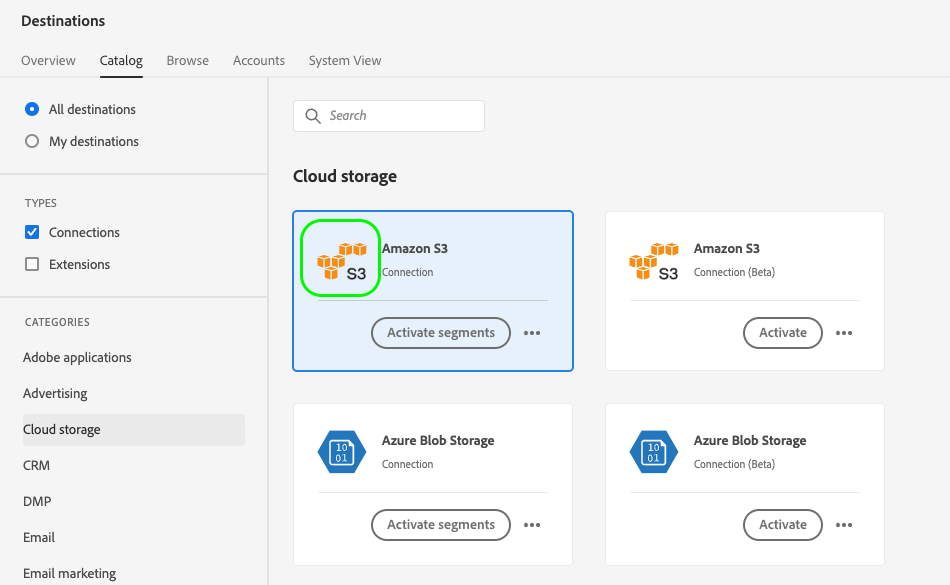

# UI 属性

UI 属性は、Adobe Experience Platform ユーザーインターフェイスでアドビが宛先カードに表示する必要がある視覚要素（宛先プラットフォームロゴ、ドキュメントページへのリンク、宛先の説明とそのカテゴリおよびタイプなど）を定義します。

このコンポーネントが Destination SDK で作成される統合のどこに適合するかを把握するには、[設定オプション](../configuration-options.md)ドキュメントの図を参照するか、以下の宛先設定の概要ページを参照してください。

* [Destination SDK を使用したストリーミング宛先の設定](../../guides/configure-destination-instructions.md#create-destination-configuration)
* [Destination SDK を使用したファイルベースの宛先の設定](../../guides/configure-file-based-destination-instructions.md#create-destination-configuration)

Destination SDK を使用して[宛先を作成](../../authoring-api/destination-configuration/create-destination-configuration.md)する場合、`uiAttributes` セクションで宛先カードの以下のビジュアルプロパティを定義します。

* [宛先カタログ](../../../catalog/overview.md)の宛先ドキュメントページの URL。
* 宛先カタログのカードに表示するアイコンをホストした URL。
* Platform UI で宛先が表示されるカテゴリ。
* 宛先のデータ書き出し頻度。
* 宛先接続タイプ（Amazon S3、Azure Blob など）。

`/authoring/destinations` エンドポイントを介して UI 属性を設定できます。このページに表示されるコンポーネントを設定できる、詳細な API 呼び出しの例については、以下の API リファレンスページを参照してください。

* [宛先設定の作成](../../authoring-api/destination-configuration/create-destination-configuration.md)
* [宛先設定の更新](../../authoring-api/destination-configuration/update-destination-configuration.md)

この記事では、宛先に使用できる、サポートされるすべての UI 属性を説明し、Experience Platform UI で顧客に何が表示されるかを示します。


>[!IMPORTANT]
>
>Destination SDK でサポートされているすべてのパラメーター名および値は、**大文字と小文字が区別**&#x200B;されます。大文字と小文字を区別することに関するエラーを避けるために、ドキュメントに示すように、パラメーター名および値を正確に使用してください。

## サポートされる統合タイプ {#supported-integration-types}

このページで説明される機能をサポートする統合のタイプについて詳しくは、以下の表を参照してください。

| 統合タイプ | 機能のサポート |
|---|---|
| リアルタイム（ストリーミング）統合 | ○ |
| ファイルベースの（バッチ）統合 | ○ |

## サポートされるパラメーター {#supported-parameters}

```json
"uiAttributes":{
      "documentationLink":"http://www.adobe.com/go/YOURDESTINATION-en",
      "category":"cloudStorage",
      "connectionType":"S3",
      "frequency":"batch",
      "isBeta":"true"
   }
```

### `documentationLink` {#documentation-link}

`documentationLink` は、宛先用の[宛先のカタログ](../../../catalog/overview.md)にあるドキュメントページを参照する文字列パラメーターです。Adobe Experience Platform の製品化された各宛先は、対応するドキュメントページを持つ必要があります。宛先に関する[宛先ドキュメントページの作成方法を説明](../../docs-framework/documentation-instructions.md)します。プライベート／カスタムの宛先には、これは必須ではないことに注意してください。

`http://www.adobe.com/go/destinations-YOURDESTINATION-en` の形式を使用します（`YOURDESTINATION` は宛先の名前）。Moviestar という宛先の場合、`http://www.adobe.com/go/destinations-moviestar-en` を使用します。

ユーザーは、UI の宛先カタログページからドキュメントリンクを確認および訪問できます。以下の画像に示すように、宛先カードを参照してから、**[!UICONTROL その他のアクション]**&#x200B;を選択し、**[!UICONTROL ドキュメントを表示]**&#x200B;を選択する必要があります。


>[!NOTE]
>
>このリンクは、アドビが宛先をライブに設定してドキュメントが公開された後でのみ機能します。

### `category` {#category}

`category` は、Adobe Experience Platform で宛先に割り当てられたカテゴリを参照する文字列パラメーターです。詳しくは、[宛先のカテゴリ](../../../destination-types.md)をお読みください。以下のいずれかの値を使用します：`adobeSolutions, advertising, analytics, cdp, cloudStorage, crm, customerSuccess, database, dmp, ecommerce, email, emailMarketing, enrichment, livechat, marketingAutomation, mobile, personalization, protocols, social, streaming, subscriptions, surveys, tagManagers, voc, warehouses, payments`。

以下の画像に示すように、ユーザーは、宛先カタログの画面の左側で、宛先カテゴリのリストを確認できます。


<!-- ### `iconUrl` {#icon-url}

`iconUrl` is a string parameter that refers to the URL where you hosted the icon to be displayed in the destinations catalog card. For private custom integrations, this is not required. For productized configurations, you need to share an icon with the Adobe team when you [submit the destination for review](../../guides/submit-destination.md#logo).

Users can see the icon on your destination card, as shown in the image below.

 -->

### `connectionType` {#connection-type}

`connectionType` は、宛先に応じて接続のタイプを参照する文字列パラメーターです。サポートされている値： <ul><li>`Server-to-server`</li><li>`Cloud storage`</li><li>`Azure Blob`</li><li>`Azure Data Lake Storage`</li><li>`S3`</li><li>`SFTP`</li><li>`DLZ`</li></ul>

ユーザーは、宛先ワークスペースの「[参照](../../../ui/destinations-workspace.md#browse)」タブで、宛先接続タイプを確認できます。


### `frequency` {#frequency}

`frequency` は、宛先でサポートされているデータ書き出しのタイプを参照する文字列パラメーターです。API ベースの統合の場合は `Streaming` に設定し、宛先にファイルを書き出す場合は `Batch` に設定する。

ユーザーは、各宛先接続の&#x200B;**[!UICONTROL データフロー実行]**&#x200B;ページで頻度タイプを確認できます。


### `isBeta` {#isbeta}

Destination SDK で作成中の宛先が限られた数の顧客に対して使用できるようになる場合、宛先カタログからの宛先カードをベータ版としてマークしてください。

これを行うには、宛先設定の UI 属性セクションで `isBeta: "true"` パラメーターを使用して、適切に宛先カードをマークできます。


## 次の手順 {#next-steps}

この記事を読むことで、宛先に設定できる UI 属性と、それが Platform UI で表示される場所について、理解を深めることができました。

その他の宛先コンポーネントについて詳しくは、以下の記事を参照してください。

* [顧客認証](customer-authentication.md)
* [OAuth 2 認証](oauth2-authentication.md)
* [顧客データフィールド](customer-data-fields.md)
* [スキーマ設定](schema-configuration.md)
* [ID 名前空間設定](identity-namespace-configuration.md)
* [宛先配信](destination-delivery.md)
* [オーディエンスメタデータ設定](audience-metadata-configuration.md)
* [集計ポリシー](aggregation-policy.md)
* [バッチ設定](batch-configuration.md)
* [プロファイル選定履歴](historical-profile-qualifications.md)
