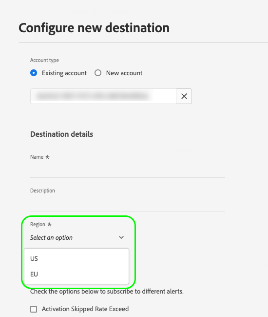

# Destination SDK で作成される宛先のサーバー仕様

宛先サーバー仕様は、Adobe Experience Platform からデータを受信する宛先プラットフォームのタイプと、Platform と宛先の間の通信パラメーターを定義します。以下に例を示します。

* [ストリーミング](#streaming-example)宛先サーバー仕様は、Platform から HTTP メッセージを受信する HTTP サーバーエンドポイントを定義します。エンドポイントに対する HTTP 呼び出しの書式設定方法については、[テンプレート仕様](templating-specs.md)ページを参照してください。
* [Amazon S3](#s3-example) 宛先サーバー仕様は、Platform がファイルを書き出す [!DNL S3] バケット名およびパスを定義します。
* [SFTP](#sftp-example) 宛先サーバー仕様は、Platform がファイルを書き出す SFTP サーバーのホスト名、ルートディレクトリ、通信ポートおよび暗号化タイプを定義します。

このコンポーネントが Destination SDK で作成される統合のどこに適合するかを把握するには、[設定オプション](../configuration-options.md)ドキュメントの図を参照するか、以下の宛先設定の概要ページを参照してください。

* [Destination SDK を使用したストリーミング宛先の設定](../../guides/configure-destination-instructions.md#create-server-template-configuratiom)
* [Destination SDK を使用したファイルベースの宛先の設定](../../guides/configure-file-based-destination-instructions.md#create-server-file-configuration)

`/authoring/destination-servers` エンドポイントを介して宛先サーバー仕様を設定できます。このページに表示されるコンポーネントを設定できる、詳細な API 呼び出しの例については、以下の API リファレンスページを参照してください。

* [宛先サーバー設定の作成](../../authoring-api/destination-server/create-destination-server.md)
* [宛先サーバー設定の更新](../../authoring-api/destination-server/update-destination-server.md)

このページには、Destination SDK でサポートされているすべての宛先サーバータイプが、すべての設定パラメーターと共に表示されます。宛先を作成する際に、パラメーター値が独自の値で置き換えられます。

>[!IMPORTANT]
>
>Destination SDK でサポートされているすべてのパラメーター名および値は、**大文字と小文字が区別**&#x200B;されます。大文字と小文字を区別することに関するエラーを避けるために、ドキュメントに示すように、パラメーター名および値を正確に使用してください。

## サポートされる統合タイプ {#supported-integration-types}

このページで説明される機能をサポートする統合のタイプについて詳しくは、以下の表を参照してください。

| 統合タイプ | 機能のサポート |
|---|---|
| リアルタイム（ストリーミング）統合 | ○ |
| ファイルベースの（バッチ）統合 | ○ |

宛先サーバーを[作成](../../authoring-api/destination-server/create-destination-server.md)または[更新](../../authoring-api/destination-server/update-destination-server.md)する際に、このページで説明されているサーバータイプ設定のいずれかを使用します。統合要件に応じて、必ずこれらの例のサンプルパラメーター値を独自の値で置き換えてください。

## ハードコーディングされたフィールドとテンプレート化されたフィールドの比較 {#templatized-fields}

Destination SDK を通じて宛先サーバーを作成する場合、それらを設定にハードコーディングするか、またはテンプレート化されたフィールドを使用することで、設定パラメーター値を定義できます。テンプレート化されたフィールドを使用すると、Platform UI からユーザー指定の値を読み取ることができます。

宛先サーバーパラメーターには、2 つの設定可能なフィールドがあります。これらのオプションは、ハードコーディングされた値とテンプレート化された値のどちらを使用しているかを示します。

| パラメーター | タイプ | 説明 |
|---|---|---|
| `templatingStrategy` | 文字列 | *必須。* `value` フィールドを介して提供されるハードコーディングされた値があるか、または UI でユーザーが設定可能な値があるかを定義します。サポートされている値： <ul><li>`NONE`：`value` パラメーター（次の行を参照）を介してパラメーター値をハードコーディングしている場合に、この値を使用します。例：`"value": "my-storage-bucket"`。</li><li>`PEBBLE_V1`：UI でユーザーにパラメーター値を指定させたい場合に、この値を使用します。例：`"value": "{{customerData.bucket}}"`。 </li></ul> |
| `value` | 文字列 | *必須*。パラメーター値を定義します。サポートされる値タイプを以下に示します。 <ul><li>**ハードコーディングされた値**：ユーザーに UI でパラメーター値を入力させる必要がない場合に、ハードコーディングされた値（`"value": "my-storage-bucket"` など）を使用します。値をハードコーディングする場合、`templatingStrategy` は、常に `NONE` に設定する必要があります。</li><li>**テンプレート化された値**：UI でユーザーにパラメーター値を指定させたい場合に、テンプレート化された値（`"value": "{{customerData.bucket}}"` など）を使用します。テンプレート化された値を使用する場合、`templatingStrategy` は、常に `PEBBLE_V1` に設定する必要があります。</li></ul> |

{style="table-layout:auto"}

### ハードコーディングされたフィールドとテンプレート化されたフィールドの、使用するタイミングの比較

ハードコーディングされたフィールドとテンプレート化されたフィールドには、それぞれ、作成している統合のタイプに応じて、Destination SDK での独自の使用法があります。

**ユーザー入力を伴わない宛先への接続**

ユーザーが Platform UI で[宛先に接続する](../../../ui/connect-destination.md)場合、ユーザー入力なしで宛先接続プロセスを処理してください。

これを行うには、宛先プラットフォーム接続パラメーターをサーバー仕様にハードコーディングします。宛先サーバー設定にハードコーディングされたパラメーター値を使用する場合、Adobe Experience Platform と宛先プラットフォームの間の接続は、ユーザーからの入力なしで処理されます。

以下の例では、パートナーは、`path.value` フィールドがハードコーディングされたデータランディングゾーン宛先サーバーを作成します。

```json
{
   "name":"Data Landing Zone destination server",
   "destinationServerType":"FILE_BASED_DLZ",
   "fileBasedDlzDestination":{
      "path":{
         "templatingStrategy":"NONE",
         "value":"Your/hardcoded/path/here"
      },
      "useCase": "Your use case"
   }
}
```

その結果、ユーザーが[宛先接続チュートリアル](../../../ui/connect-destination.md)を実行しても、[認証手順](../../../ui/connect-destination.md#authenticate)が表示されません。代わりに、以下の画像に示すように、認証が Platform によって処理されます。


**ユーザー入力を伴った宛先への接続**

Platform と宛先の間の接続が、Platform UI での特定のユーザー入力（API エンドポイントの選択やフィールド値の指定など）に従って確立される必要がある場合、サーバー仕様でテンプレート化されたフィールドを使用して、ユーザー入力を読み取り、宛先プラットフォームに接続できます。

以下の例では、パートナーは、[リアルタイム（ストリーミング）](#streaming-example)統合を作成し、`url.value` フィールドがテンプレート化されたパラメーター `{{customerData.region}}` を使用して、ユーザー入力に基づいて API エンドポイントの一部をパーソナライズします。

```json
{
   "name":"Templatized API endpoint example",
   "destinationServerType":"URL_BASED",
   "urlBasedDestination":{
      "url":{
         "templatingStrategy":"PEBBLE_V1",
         "value":"https://api.yourcompany.com/data/{{customerData.region}}/items"
      }
   }
}
```

ユーザーに Platform UI から値を選択するオプションを与えるには、以下に示すように、`region` パラメーターも、[宛先設定](../../authoring-api/destination-configuration/create-destination-configuration.md)で顧客データフィールドとして定義される必要があります。

```json
"customerDataFields":[
   {
      "name":"region",
      "title":"Region",
      "description":"Select an option",
      "type":"string",
      "isRequired":true,
      "readOnly":false,
      "enum":[
         "US",
         "EU"
      ]
   }
```

その結果、ユーザーが[宛先接続チュートリアル](../../../ui/connect-destination.md)を実行すると、宛先プラットフォームに接続する前に、地域を選択する必要があります。以下の画像に示すように、宛先に接続する際に、テンプレート化されたフィールド `{{customerData.region}}` は、ユーザーが UI で選択した値に置き換えられます。



## リアルタイム（ストリーミング）宛先サーバー {#streaming-example}

この宛先サーバータイプを使用すると、HTTP リクエストを介して Adobe Experience Platform から宛先にデータを書き出すことができます。サーバー設定には、メッセージを受信するサーバー（お客様側のサーバー）に関する情報が含まれています。

このプロセスは、ユーザーデータを一連の HTTP メッセージとして宛先プラットフォームに配信します。HTTP サーバー仕様のテンプレートとなるパラメーターを以下に示します。

以下のサンプルに、リアルタイム（ストリーミング）宛先用の宛先サーバー設定の例を示します。

```json
{
   "name":"Your destination server name",
   "destinationServerType":"URL_BASED",
   "urlBasedDestination":{
      "url":{
         "templatingStrategy":"PEBBLE_V1",
         "value":"{YOUR_API_ENDPOINT}"
      }
   }
}
```

| パラメーター | タイプ | 説明 |
|---|---|---|
| `name` | 文字列 | *必須。* サーバーのわかりやすい名前を表し、アドビにのみ表示されます。この名前は、パートナーや顧客には表示されません。例：`Moviestar destination server`。 |
| `destinationServerType` | 文字列 | *必須。* ストリーミング宛先の場合は、これを `URL_BASED` に設定します。 |
| `templatingStrategy` | 文字列 | *必須。* <ul><li>`value` フィールドに、ハードコーディングされた値ではなく、テンプレート化されたフィールドを使用している場合は、`PEBBLE_V1` を使用します。`https://api.moviestar.com/data/{{customerData.region}}/items` のようなエンドポイントがある場合は、このオプションを使用します（ユーザーは、Platform UI からエンドポイント地域を選択する必要があります）。 </li><li> アドビ側でのテンプレート化された変換が不要な場合（例えば、`NONE` のようなエンドポイントがある場合）は、`https://api.moviestar.com/data/items` を使用します。 </li></ul> |
| `value` | 文字列 | *必須。* Experience Platform が接続する API エンドポイントのアドレスを入力します。 |

{style="table-layout:auto"}

## [!DNL Amazon S3] 宛先サーバー {#s3-example}

この宛先サーバーを使用すると、Adobe Experience Platform データを含むファイルを Amazon S3 ストレージに書き出すことができます。

以下のサンプルに、Amazon S3 宛先用の宛先サーバー設定の例を示します。

```json
{
   "name":"Amazon S3 destination",
   "destinationServerType":"FILE_BASED_S3",
   "fileBasedS3Destination":{
      "bucket":{
         "templatingStrategy":"PEBBLE_V1",
         "value":"{{customerData.bucket}}"
      },
      "path":{
         "templatingStrategy":"PEBBLE_V1",
         "value":"{{customerData.path}}"
      }
   }
}
```

| パラメーター | タイプ | 説明 |
|---|---|---|
| `name` | 文字列 | 宛先サーバーの名前。 |
| `destinationServerType` | 文字列 | この値は、宛先プラットフォームに応じて設定します。[!DNL Amazon S3] バケットにファイルを書き出すには、これを `FILE_BASED_S3` に設定します。 |
| `fileBasedS3Destination.bucket.templatingStrategy` | 文字列 | *必須*。`bucket.value` フィールドで使用された値のタイプに応じて、この値を設定します。<ul><li>Experience Platform UI でユーザーに独自のバケット名を入力させたい場合は、この値を `PEBBLE_V1` に設定します。この場合は、`value` フィールドをテンプレート化して、ユーザーによって入力された[顧客データフィールド](../destination-configuration/customer-data-fields.md)から値を読み取る必要があります。このユースケースについては、上記の例を参照してください。</li><li>統合にハードコーディングされたバケット名（`"bucket.value":"MyBucket"` など）を使用している場合は、この値を `NONE` に設定します。</li></ul> |
| `fileBasedS3Destination.bucket.value` | 文字列 | この宛先が使用する [!DNL Amazon S3] バケット名。これは、（上記の例に示すような）ユーザーによって入力された[顧客データフィールド](../destination-configuration/customer-data-fields.md)から値を読み取るテンプレート化されたフィールドか、ハードコーディングされた値（`"value":"MyBucket"` など）のどちらかにできます。 |
| `fileBasedS3Destination.path.templatingStrategy` | 文字列 | *必須*。`path.value` フィールドで使用された値のタイプに応じて、この値を設定します。<ul><li>Experience Platform UI でユーザーに独自のパスを入力させたい場合は、この値を `PEBBLE_V1` に設定します。この場合は、`path.value` フィールドをテンプレート化して、ユーザーによって入力された[顧客データフィールド](../destination-configuration/customer-data-fields.md)から値を読み取る必要があります。このユースケースについては、上記の例を参照してください。</li><li>統合にハードコーディングされたパス（`"bucket.value":"/path/to/MyBucket"` など）を使用している場合は、この値を `NONE` に設定します。</li></ul> |
| `fileBasedS3Destination.path.value` | 文字列 | この宛先が使用する [!DNL Amazon S3] バケットへのパス。これは、（上記の例に示すような）ユーザーによって入力された[顧客データフィールド](../destination-configuration/customer-data-fields.md)から値を読み取るテンプレート化されたフィールドか、ハードコーディングされた値（`"value":"/path/to/MyBucket"` など）のどちらかにできます。 |

{style="table-layout:auto"}

## [!DNL SFTP] 宛先サーバー {#sftp-example}

この宛先サーバーを使用すると、Adobe Experience Platform データを含むファイルを [!DNL SFTP] ストレージサーバーに書き出すことができます。

以下のサンプルに、SFTP 宛先用の宛先サーバー設定の例を示します。

```json
{
   "name":"File-based SFTP destination server",
   "destinationServerType":"FILE_BASED_SFTP",
   "fileBasedSFTPDestination":{
      "rootDirectory":{
         "templatingStrategy":"PEBBLE_V1",
         "value":"{{customerData.rootDirectory}}"
      },
      "hostName":{
         "templatingStrategy":"PEBBLE_V1",
         "value":"{{customerData.hostName}}"
      },
      "port":22,
      "encryptionMode":"PGP"
   }
}
```

| パラメーター | タイプ | 説明 |
|---|---|---|
| `name` | 文字列 | 宛先サーバーの名前。 |
| `destinationServerType` | 文字列 | この値は、宛先プラットフォームに応じて設定します。[!DNL SFTP] 宛先にファイルを書き出すには、これを `FILE_BASED_SFTP` に設定します。 |
| `fileBasedSFTPDestination.rootDirectory.templatingStrategy` | 文字列 | *必須*。`rootDirectory.value` フィールドで使用された値のタイプに応じて、この値を設定します。<ul><li>Experience Platform UI でユーザーに独自のルートディレクトリパスを入力させたい場合は、この値を `PEBBLE_V1` に設定します。この場合は、`rootDirectory.value` フィールドをテンプレート化して、ユーザーによって入力された[顧客データフィールド](../destination-configuration/customer-data-fields.md)からユーザー指定の値を読み取る必要があります。このユースケースについては、上記の例を参照してください。</li><li>統合にハードコーディングされたルートディレクトリパス（`"rootDirectory.value":"Storage/MyDirectory"` など）を使用している場合は、この値を `NONE` に設定します。</li></ul> |
| `fileBasedSFTPDestination.rootDirectory.value` | 文字列 | 書き出されたファイルをホストするディレクトリへのパス。これは、（上記の例に示すような）ユーザーによって入力された[顧客データフィールド](../destination-configuration/customer-data-fields.md)から値を読み取るテンプレート化されたフィールドか、ハードコーディングされた値（`"value":"Storage/MyDirectory"` など）のどちらかにできます。 |
| `fileBasedSFTPDestination.hostName.templatingStrategy` | 文字列 | *必須*。`hostName.value` フィールドで使用された値のタイプに応じて、この値を設定します。<ul><li>Experience Platform UI でユーザーに独自のホスト名を入力させたい場合は、この値を `PEBBLE_V1` に設定します。この場合は、`hostName.value` フィールドをテンプレート化して、ユーザーによって入力された[顧客データフィールド](../destination-configuration/customer-data-fields.md)からユーザー指定の値を読み取る必要があります。このユースケースについては、上記の例を参照してください。</li><li>統合にハードコーディングされたホスト名（`"hostName.value":"my.hostname.com"` など）を使用している場合は、この値を `NONE` に設定します。</li></ul> |
| `fileBasedSFTPDestination.hostName.value` | 文字列 | SFTP サーバーのホスト名。これは、（上記の例に示すような）ユーザーによって入力された[顧客データフィールド](../destination-configuration/customer-data-fields.md)から値を読み取るテンプレート化されたフィールドか、ハードコーディングされた値（`"hostName.value":"my.hostname.com"` など）のどちらかにできます。 |
| `port` | 整数 | SFTP ファイルサーバーのポート。 |
| `encryptionMode` | 文字列 | ファイルの暗号化を使用するかどうかを示します。サポートされている値： <ul><li>PGP</li><li>なし</li></ul> |

{style="table-layout:auto"}

## [!DNL Azure Data Lake Storage]（[!DNL ADLS]）宛先サーバー {#adls-example}

この宛先サーバーを使用すると、Adobe Experience Platform データを含むファイルを [!DNL Azure Data Lake Storage] アカウントに書き出すことができます。

以下のサンプルに、[!DNL Azure Data Lake Storage] 宛先用の宛先サーバー設定の例を示します。

```json
{
   "name":"ADLS destination server",
   "destinationServerType":"FILE_BASED_ADLS_GEN2",
   "fileBasedAdlsGen2Destination":{
      "path":{
         "templatingStrategy":"PEBBLE_V1",
         "value":"{{customerData.path}}"
      }
   }
}
```

| パラメーター | タイプ | 説明 |
|---|---|---|
| `name` | 文字列 | 宛先接続の名前。 |
| `destinationServerType` | 文字列 | この値は、宛先プラットフォームに応じて設定します。[!DNL Azure Data Lake Storage] の宛先の場合、これを `FILE_BASED_ADLS_GEN2` に設定します。 |
| `fileBasedAdlsGen2Destination.path.templatingStrategy` | 文字列 | *必須*。`path.value` フィールドで使用された値のタイプに応じて、この値を設定します。<ul><li>Experience Platform UI でユーザーに [!DNL ADLS] フォルダーパスを入力させたい場合は、この値を `PEBBLE_V1` に設定します。この場合は、`path.value` フィールドをテンプレート化して、ユーザーによって入力された[顧客データフィールド](../destination-configuration/customer-data-fields.md)から値を読み取る必要があります。このユースケースについては、上記の例を参照してください。</li><li>統合にハードコーディングされたパス（`"abfs://<file_system>@<account_name>.dfs.core.windows.net/<path>/"` など）を使用している場合は、この値を `NONE` に設定します。</li></ul> |
| `fileBasedAdlsGen2Destination.path.value` | 文字列 | [!DNL ADLS] ストレージフォルダーへのパス。これは、（上記の例に示すような）ユーザーによって入力された[顧客データフィールド](../destination-configuration/customer-data-fields.md)から値を読み取るテンプレート化されたフィールドか、ハードコーディングされた値（`abfs://<file_system>@<account_name>.dfs.core.windows.net/<path>/` など）のどちらかにできます。 |

{style="table-layout:auto"}

## [!DNL Azure Blob Storage] 宛先サーバー {#blob-example}

この宛先サーバーを使用すると、Adobe Experience Platform データを含むファイルを [!DNL Azure Blob Storage] コンテナに書き出すことができます。

以下のサンプルに、[!DNL Azure Blob Storage] 宛先用の宛先サーバー設定の例を示します。

```json
{
   "name":"Blob destination server",
   "destinationServerType":"FILE_BASED_AZURE_BLOB",
   "fileBasedAzureBlobDestination":{
      "path":{
         "templatingStrategy":"PEBBLE_V1",
         "value":"{{customerData.path}}"
      },
      "container":{
         "templatingStrategy":"PEBBLE_V1",
         "value":"{{customerData.container}}"
      }
   }
}
```

| パラメーター | タイプ | 説明 |
|---|---|---|
| `name` | 文字列 | 宛先接続の名前。 |
| `destinationServerType` | 文字列 | この値は、宛先プラットフォームに応じて設定します。[!DNL Azure Blob Storage] の宛先の場合、これを `FILE_BASED_AZURE_BLOB` に設定します。 |
| `fileBasedAzureBlobDestination.path.templatingStrategy` | 文字列 | *必須*。`path.value` フィールドで使用された値のタイプに応じて、この値を設定します。<ul><li>Experience Platform UI でユーザーに独自の [!DNL Azure Blob] [ストレージアカウント URI](https://learn.microsoft.com/ja-jp/azure/storage/blobs/storage-blobs-introduction) を入力させたい場合は、この値を `PEBBLE_V1` に設定します。この場合は、`path.value` フィールドをテンプレート化して、ユーザーによって入力された[顧客データフィールド](../destination-configuration/customer-data-fields.md)から値を読み取る必要があります。このユースケースについては、上記の例を参照してください。</li><li>統合にハードコーディングされたパス（`"path.value": "https://myaccount.blob.core.windows.net/"` など）を使用している場合は、この値を `NONE` に設定します。 |
| `fileBasedAzureBlobDestination.path.value` | 文字列 | [!DNL Azure Blob] ストレージへのパス。これは、（上記の例に示すような）ユーザーによって入力された[顧客データフィールド](../destination-configuration/customer-data-fields.md)から値を読み取るテンプレート化されたフィールドか、ハードコーディングされた値（`https://myaccount.blob.core.windows.net/` など）のどちらかにできます。 |
| `fileBasedAzureBlobDestination.container.templatingStrategy` | 文字列 | *必須*。`container.value` フィールドで使用された値のタイプに応じて、この値を設定します。<ul><li>Experience Platform UI でユーザーに独自の [!DNL Azure Blob] [コンテナ名](https://learn.microsoft.com/ja-jp/azure/storage/blobs/storage-blobs-introduction)を入力させたい場合は、この値を `PEBBLE_V1` に設定します。この場合は、`container.value` フィールドをテンプレート化して、ユーザーによって入力された[顧客データフィールド](../destination-configuration/customer-data-fields.md)から値を読み取る必要があります。このユースケースについては、上記の例を参照してください。</li><li>統合にハードコーディングされたコンテナ名（`"path.value: myContainer"` など）を使用している場合は、この値を `NONE` に設定します。 |
| `fileBasedAzureBlobDestination.container.value` | 文字列 | Azure Blob Storage コンテナの名前 to be used for this destination.これは、（上記の例に示すような）ユーザーによって入力された[顧客データフィールド](../destination-configuration/customer-data-fields.md)から値を読み取るテンプレート化されたフィールドか、ハードコーディングされた値（`myContainer` など）のどちらかにできます。 |

{style="table-layout:auto"}

## [!DNL Data Landing Zone]（[!DNL DLZ]）宛先サーバー {#dlz-example}

この宛先サーバーを使用すると、Platform データを含むファイルを [[!DNL Data Landing Zone]](../../../catalog/cloud-storage/data-landing-zone.md) ストレージに書き出すことができます。

以下のサンプルに、[!DNL Data Landing Zone]（[!DNL DLZ]）宛先用の宛先サーバー設定の例を示します。

```json
{
   "name":"Data Landing Zone destination server",
   "destinationServerType":"FILE_BASED_DLZ",
   "fileBasedDlzDestination":{
      "path":{
         "templatingStrategy":"PEBBLE_V1",
         "value":"{{customerData.path}}"
      },
      "useCase": "Your use case"
   }
}
```

| パラメーター | タイプ | 説明 |
|---|---|---|
| `name` | 文字列 | 宛先接続の名前。 |
| `destinationServerType` | 文字列 | この値は、宛先プラットフォームに応じて設定します。[!DNL Data Landing Zone] の宛先の場合、これを `FILE_BASED_DLZ` に設定します。 |
| `fileBasedDlzDestination.path.templatingStrategy` | 文字列 | *必須*。`path.value` フィールドで使用された値のタイプに応じて、この値を設定します。<ul><li>Experience Platform UI でユーザーに独自の [!DNL Data Landing Zone] アカウントを入力させたい場合は、この値を `PEBBLE_V1` に設定します。この場合は、`path.value` フィールドをテンプレート化して、ユーザーによって入力された[顧客データフィールド](../destination-configuration/customer-data-fields.md)から値を読み取る必要があります。このユースケースについては、上記の例を参照してください。</li><li>統合にハードコーディングされたパス（`"path.value": "https://myaccount.blob.core.windows.net/"` など）を使用している場合は、この値を `NONE` に設定します。 |
| `fileBasedDlzDestination.path.value` | 文字列 | 書き出したファイルをホストする保存先フォルダーのパス。 |

{style="table-layout:auto"}

## [!DNL Google Cloud Storage] 宛先サーバー {#gcs-example}

この宛先サーバーを使用すると、Platform データを含むファイルを [!DNL Google Cloud Storage] アカウントに書き出すことができます。

以下のサンプルに、[!DNL Google Cloud Storage] 宛先用の宛先サーバー設定の例を示します。

```json
{
   "name":"Google Cloud Storage Server",
   "destinationServerType":"FILE_BASED_GOOGLE_CLOUD",
   "fileBasedGoogleCloudStorageDestination":{
      "bucket":{
         "templatingStrategy":"PEBBLE_V1",
         "value":"{{customerData.bucket}}"
      },
      "path":{
         "templatingStrategy":"PEBBLE_V1",
         "value":"{{customerData.path}}"
      }
   }
}
```

| パラメーター | タイプ | 説明 |
|---|---|---|
| `name` | 文字列 | 宛先接続の名前。 |
| `destinationServerType` | 文字列 | この値は、宛先プラットフォームに応じて設定します。[!DNL Google Cloud Storage] の宛先の場合、これを `FILE_BASED_GOOGLE_CLOUD` に設定します。 |
| `fileBasedGoogleCloudStorageDestination.bucket.templatingStrategy` | 文字列 | *必須*。`bucket.value` フィールドで使用された値のタイプに応じて、この値を設定します。<ul><li>Experience Platform UI でユーザーに独自の [!DNL Google Cloud Storage] バケット名を入力させたい場合は、この値を `PEBBLE_V1` に設定します。この場合は、`bucket.value` フィールドをテンプレート化して、ユーザーによって入力された[顧客データフィールド](../destination-configuration/customer-data-fields.md)から値を読み取る必要があります。このユースケースについては、上記の例を参照してください。</li><li>統合にハードコーディングされたバケット名（`"bucket.value": "my-bucket"` など）を使用している場合は、この値を `NONE` に設定します。 |
| `fileBasedGoogleCloudStorageDestination.bucket.value` | 文字列 | この宛先が使用する [!DNL Google Cloud Storage] バケット名。これは、（上記の例に示すような）ユーザーによって入力された[顧客データフィールド](../destination-configuration/customer-data-fields.md)から値を読み取るテンプレート化されたフィールドか、ハードコーディングされた値（`"value": "my-bucket"` など）のどちらかにできます。 |
| `fileBasedGoogleCloudStorageDestination.path.templatingStrategy` | 文字列 | *必須*。`path.value` フィールドで使用された値のタイプに応じて、この値を設定します。<ul><li>Experience Platform UI でユーザーに独自の [!DNL Google Cloud Storage] バケットパスを入力させたい場合は、この値を `PEBBLE_V1` に設定します。この場合は、`path.value` フィールドをテンプレート化して、ユーザーによって入力された[顧客データフィールド](../destination-configuration/customer-data-fields.md)から値を読み取る必要があります。このユースケースについては、上記の例を参照してください。</li><li>統合にハードコーディングされたパス（`"path.value": "/path/to/my-bucket"` など）を使用している場合は、この値を `NONE` に設定します。</li></ul> |
| `fileBasedGoogleCloudStorageDestination.path.value` | 文字列 | この宛先が使用する [!DNL Google Cloud Storage] フォルダーへのパス。これは、（上記の例に示すような）ユーザーによって入力された[顧客データフィールド](../destination-configuration/customer-data-fields.md)から値を読み取るテンプレート化されたフィールドか、ハードコーディングされた値（`"value": "/path/to/my-bucket"` など）のどちらかにできます。 |

{style="table-layout:auto"}

## 次の手順 {#next-steps}

この記事を読むことで、宛先サーバー仕様とは何か、およびどのように設定できるかについて、理解を深めることができました。

その他の宛先サーバーコンポーネントについて詳しくは、以下の記事を参照してください。

* [テンプレートの仕様](templating-specs.md)
* [メッセージ形式](message-format.md)
* [ファイル形式設定](file-formatting.md)
