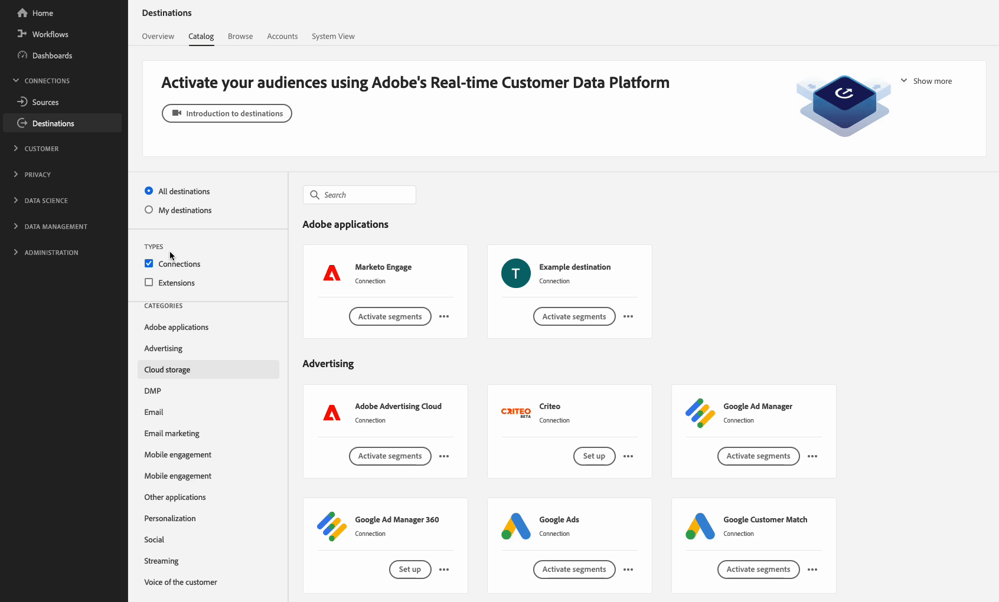
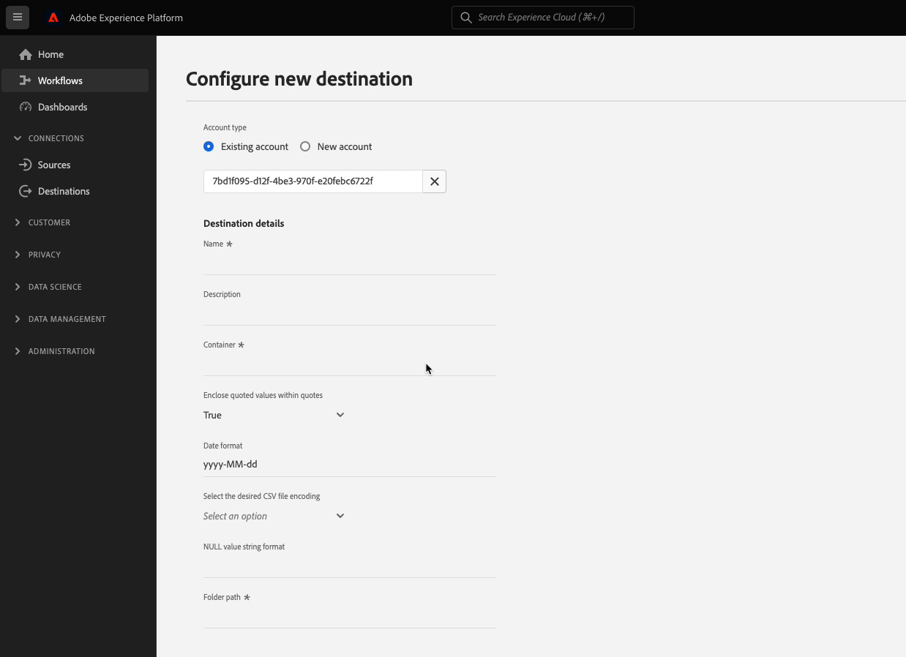
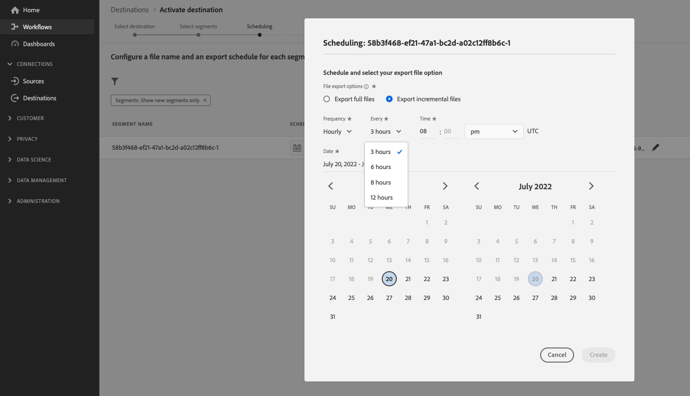
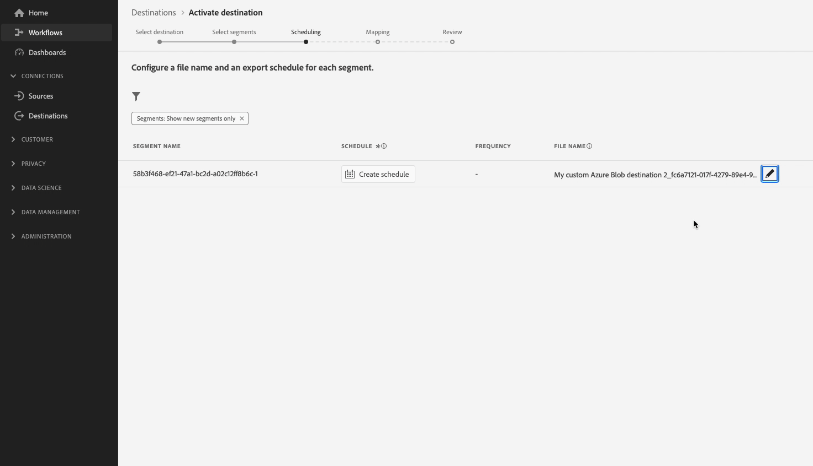

# カスタムのファイル名とファイル形式オプションを使用した Amazon S3 の宛先の設定

## 概要 {#overview}

このページでは、Destination SDKを使用して、カスタム [&#x200B; ファイル形式オプション &#x200B;](configure-file-formatting-options.md)とカスタム [&#x200B; ファイル名設定](../../functionality/destination-configuration/batch-configuration.md#file-name-configuration)を使用してAmazon S3の宛先を設定する方法について説明します。

このページでは、Amazon S3宛先で使用できるすべての設定オプションを示します。 必要に応じて、以下の手順に示す設定を編集したり、設定の特定の部分を削除したりできます。

以下で使用するパラメーターの詳細については、「宛先SDK[の](../../functionality/configuration-options.md)設定オプション」を参照してください。

## 前提条件 {#prerequisites}

以下の手順に進む前に、[Destination SDK入門](../../getting-started.md) ページで、Destination SDK APIを操作するために必要なAdobe I/O認証情報およびその他の前提条件を取得する方法を参照してください。

## 手順 1：サーバーとファイル設定の作成 {#create-server-file-configuration}

最初に、`/destination-server` エンドポイントを使用して、[&#x200B; サーバーとファイル設定](../../authoring-api/destination-server/create-destination-server.md)を作成します。

**API 形式**

```http
POST platform.adobe.io/data/core/activation/authoring/destination-servers
```

**リクエスト**

次のリクエストは、ペイロードで指定されたパラメーターで設定された新しい宛先サーバー設定を作成します。
以下のペイロードには、一般的なAmazon S3設定が含まれており、ユーザーがExperience Platform UIで定義できるカスタム [CSV ファイル形式](../../functionality/destination-server/file-formatting.md)設定パラメーターが含まれています。

```shell
curl -X POST https://platform.adobe.io/data/core/activation/authoring/destination-server \
 -H 'Authorization: Bearer {ACCESS_TOKEN}' \
 -H 'Content-Type: application/json' \
 -H 'x-gw-ims-org-id: {ORG_ID}' \
 -H 'x-api-key: {API_KEY}' \
 -H 'x-sandbox-name: {SANDBOX_NAME}' \
 -d ' {
   "name":"Amazon S3 destination server with custom file formatting options",
   "destinationServerType":"FILE_BASED_S3",
   "fileBasedS3Destination":{
      "bucket":{
         "templatingStrategy":"PEBBLE_V1",
         "value":"{{customerData.bucketName}}"
      },
      "path":{
         "templatingStrategy":"PEBBLE_V1",
         "value":"{{customerData.path}}"
      }
   },
   "fileConfigurations":{
      "compression":{
         "templatingStrategy":"PEBBLE_V1",
         "value":"{{customerData.compression}}"
      },
      "fileType":{
         "templatingStrategy":"PEBBLE_V1",
         "value":"{{customerData.fileType}}"
      },
      "csvOptions":{
         "sep":{
            "templatingStrategy":"PEBBLE_V1",
            "value":"{{customerData.sep}}"
         },
         "encoding":{
            "templatingStrategy":"PEBBLE_V1",
            "value":"{{customerData.encoding}}"
         },
         "quote":{
            "templatingStrategy":"PEBBLE_V1",
            "value":"{{customerData.quote}}"
         },
         "quoteAll":{
            "templatingStrategy":"PEBBLE_V1",
            "value":"{{customerData.quoteAll}}"
         },
         "escape":{
            "templatingStrategy":"PEBBLE_V1",
            "value":"{{customerData.escape}}"
         },
         "escapeQuotes":{
            "templatingStrategy":"PEBBLE_V1",
            "value":"{{customerData.escapeQuotes}}"
         },
         "header":{
            "templatingStrategy":"PEBBLE_V1",
            "value":"{{customerData.header}}"
         },
         "ignoreLeadingWhiteSpace":{
            "templatingStrategy":"PEBBLE_V1",
            "value":"{{customerData.ignoreLeadingWhiteSpace}}"
         },
         "nullValue":{
            "templatingStrategy":"PEBBLE_V1",
            "value":"{{customerData.nullValue}}"
         },
         "dateFormat":{
            "templatingStrategy":"PEBBLE_V1",
            "value":"{{customerData.dateFormat}}"
         },
         "charToEscapeQuoteEscaping":{
            "templatingStrategy":"PEBBLE_V1",
            "value":"{{customerData.charToEscapeQuoteEscaping}}"
         },
         "emptyValue":{
            "templatingStrategy":"PEBBLE_V1",
            "value":"{{customerData.dateFormat}}"
         }
      }
   }
}'
```

応答が成功すると、設定の一意の識別子（`instanceId`）を含む、新しい宛先サーバー設定が返されます。 この値は、次の手順で必要に応じて保存します。

## 手順 2：宛先の構成の作成 {#create-destination-configuration}

前の手順で宛先サーバーとファイル形式の設定を作成した後、`/destinations` API エンドポイントを使用して宛先設定を作成できるようになりました。

[手順1](#create-server-file-configuration)のサーバー設定をこの宛先設定に接続するには、以下のAPI リクエストの`destinationServerId`値を、[手順1](#create-server-file-configuration)で宛先サーバーを作成する際に取得した値に置き換えます。

**API 形式**

```http
POST platform.adobe.io/data/core/activation/authoring/destinations
```

**リクエスト**

```shell
curl -X POST https://platform.adobe.io/data/core/activation/authoring/destinations \
 -H 'Authorization: Bearer {ACCESS_TOKEN}' \
 -H 'Content-Type: application/json' \
 -H 'x-gw-ims-org-id: {ORG_ID}' \
 -H 'x-api-key: {API_KEY}' \
 -H 'x-sandbox-name: {SANDBOX_NAME}' \
 -d '
{
   "name":"Amazon S3 destination with custom file formatting options and custom file name configuration",
   "description":"Amazon S3 destination with custom file formatting options and custom file name configuration",
   "status":"TEST",
   "customerAuthenticationConfigurations":[
      {
         "authType":"S3"
      }
   ],
   "customerEncryptionConfigurations":[
      
   ],
   "customerDataFields":[
      {
         "name":"bucketName",
         "title":"Enter the name of your Amazon S3 bucket",
         "description":"Amazon S3 bucket name",
         "type":"string",
         "isRequired":true,
         "pattern": "(?=^.{3,63}$)(?!^(\\d+\\.)+\\d+$)(^(([a-z0-9]|[a-z0-9][a-z0-9\\-]*[a-z0-9])\\.)*([a-z0-9]|[a-z0-9][a-z0-9\\-]*[a-z0-9])$)",
         "readOnly":false,
         "hidden":false
      },
      {
         "name":"path",
         "title":"Enter the path to your S3 bucket folder",
         "description":"Enter the path to your S3 bucket folder",
         "type":"string",
         "isRequired":true,
         "pattern": "^[0-9a-zA-Z\\/\\!\\-_\\.\\*\\''\\(\\)]*((\\%SEGMENT_(NAME|ID)\\%)?\\/?)+$",
         "readOnly":false,
         "hidden":false
      },
      {
         "name":"sep",
         "title":"Enter your desired separator for each field and value",
         "description":"Enter your desired separator for each field and value",
         "type":"string",
         "isRequired":false,
         "readOnly":false,
         "hidden":false
      },
      {
         "name":"encoding",
         "title":"Select the desired CSV file encoding",
         "description":"Select the desired CSV file encoding",
         "type":"string",
         "enum":[
            "UTF-8",
            "UTF-16"
         ],
         "isRequired":false,
         "readOnly":false,
         "hidden":false
      },
      {
         "name":"quote",
         "title":"Quoted values escape character",
         "description":"Enter the desired character to be used for escaping quoted values.",
         "type":"string",
         "isRequired":false,
         "readOnly":false,
         "hidden":false
      },
      {
         "name":"quoteAll",
         "title":"Escape all quoted values",
         "description":"Select whether to escape all quoted values.",
         "type":"string",
         "enum":[
            "true",
            "false"
         ],
         "default":"true",
         "isRequired":true,
         "readOnly":false,
         "hidden":false
      },
      {
         "name":"escape",
         "title":"Quote escaping character",
         "description":"Enter the desired character to be used for escaping quotes inside an already quoted value.",
         "type":"string",
         "isRequired":false,
         "readOnly":false,
         "hidden":false
      },
      {
         "name":"escapeQuotes",
         "title":"Enclose quoted values within quotes",
         "description":"Select whether values containing quotes should always be enclosed in quotes.",
         "type":"string",
         "enum":[
            "true",
            "false"
         ],
         "isRequired":false,
         "default":"true",
         "readOnly":false,
         "hidden":false
      },
      {
         "name":"header",
         "title":"Generate file header.",
         "description":"Select whether to write the names of columns as the first line of the exported files.",
         "type":"string",
         "isRequired":false,
         "enum":[
            "true",
            "false"
         ],
         "readOnly":false,
         "default":"true",
         "hidden":false
      },
      {
         "name":"ignoreLeadingWhiteSpace",
         "title":"Ignore leading white space",
         "description":"Select whether leading whitespaces should be trimmed from exported values.",
         "type":"string",
         "isRequired":false,
         "enum":[
            "true",
            "false"
         ],
         "readOnly":false,
         "default":"true",
         "hidden":false
      },
      {
         "name":"nullValue",
         "title":"NULL value string format",
         "description":"Enter the string representation of a NULL value. ",
         "type":"string",
         "isRequired":false,
         "readOnly":false,
         "hidden":false
      },
      {
         "name":"dateFormat",
         "title":"Date format",
         "description":"Enter the desired date format. ",
         "type":"string",
         "default":"yyyy-MM-dd",
         "isRequired":false,
         "readOnly":false,
         "hidden":false
      },
      {
         "name":"charToEscapeQuoteEscaping",
         "title":"Quote escaping escape character",
         "description":"Enter the desired character to be used for escaping the escaping of a quote character.",
         "type":"string",
         "isRequired":false,
         "readOnly":false,
         "hidden":false
      },
      {
         "name":"emptyValue",
         "title":"Empty value string format",
         "description":"Enter the string representation of an empty value.",
         "type":"string",
         "isRequired":false,
         "readOnly":false,
         "default":"",
         "hidden":false
      },
      {
         "name":"compression",
         "title":"Compression format",
         "description":"Select the desired file compression format.",
         "type":"string",
         "isRequired":true,
         "readOnly":false,
         "enum":[
            "SNAPPY",
            "GZIP",
            "DEFLATE",
            "NONE"
         ]
      },
      {
         "name":"fileType",
         "title":"File type",
         "description":"Select the exported file type.",
         "type":"string",
         "isRequired":true,
         "readOnly":false,
         "hidden":false,
         "enum":[
            "csv",
            "json",
            "parquet"
         ],
         "default":"csv"
      }
   ],
   "uiAttributes":{
      "documentationLink":"https://www.adobe.com/go/destinations-amazon-s3-en",
      "category":"cloudStorage",
      "connectionType":"S3",
      "flowRunsSupported":true,
      "monitoringSupported":true,
      "frequency":"Batch"
   },
   "destinationDelivery":[
      {
         "deliveryMatchers":[
            {
               "type":"SOURCE",
               "value":[
                  "batch"
               ]
            }
         ],
         "authenticationRule":"CUSTOMER_AUTHENTICATION",
         "destinationServerId":"{{destinationServerId}}"
      }
   ],
   "schemaConfig":{
      "profileRequired":true,
      "segmentRequired":true,
      "identityRequired":true
   },
   "batchConfig":{
      "allowMandatoryFieldSelection":true,
      "allowDedupeKeyFieldSelection":true,
      "defaultExportMode":"DAILY_FULL_EXPORT",
      "allowedExportMode":[
         "DAILY_FULL_EXPORT",
         "FIRST_FULL_THEN_INCREMENTAL"
      ],
      "allowedScheduleFrequency":[
         "DAILY",
         "EVERY_3_HOURS",
         "EVERY_6_HOURS",
         "EVERY_8_HOURS",
         "EVERY_12_HOURS",
         "ONCE"
      ],
      "defaultFrequency":"DAILY",
      "defaultStartTime":"00:00",
      "filenameConfig":{
         "allowedFilenameAppendOptions":[
            "SEGMENT_NAME",
            "DESTINATION_INSTANCE_ID",
            "DESTINATION_INSTANCE_NAME",
            "ORGANIZATION_NAME",
            "SANDBOX_NAME",
            "DATETIME",
            "CUSTOM_TEXT"
         ],
         "defaultFilenameAppendOptions":[
            "DATETIME"
         ],
         "defaultFilename":"%DESTINATION%_%SEGMENT_ID%"
      },
      "backfillHistoricalProfileData":true
   }
}'
```

応答が成功すると、設定の一意の識別子（`instanceId`）を含む、新しい宛先設定が返されます。 宛先設定を更新するためにさらにHTTP リクエストを行う必要がある場合は、必要に応じてこの値を保存します。

## 手順3:Experience Platform UIの確認 {#verify-ui}

上記の設定に基づいて、Experience Platform カタログに新しいプライベート宛先カードが表示されるようになりました。



以下の画像と録画では、ファイルベースの宛先の[&#x200B; アクティベーションワークフロー](../../../ui/activate-batch-profile-destinations.md)のオプションが、宛先設定で選択したオプションとどのように一致しているかを確認してください。

宛先に関する詳細を入力する際に、フィールドが設定で設定したカスタムデータフィールドであることが表示されます。

>[!TIP]
>
>カスタムデータフィールドを宛先設定に追加した順序は、UIには反映されません。 カスタムデータフィールドは、以下の画面記録に表示される順序で常に表示されます。



書き出し間隔をスケジュールする際に、表示されるフィールドが、`batchConfig`設定で設定したフィールドであることに注意してください。


ファイル名設定オプションを表示する際に、フィールドが表示され、設定で設定した`filenameConfig` オプションがどのように表示されるかに注目してください。


上記のいずれかのフィールドを調整する場合は、[手順1](#create-server-file-configuration)と[2](#create-destination-configuration)を繰り返して、必要に応じて設定を変更します。

## 手順4:（オプション）宛先の公開 {#publish-destination}

>[!NOTE]
>
>この手順は、自分で使用するプライベート宛先を作成しており、他の顧客が使用するために宛先カタログで公開することを検討していない場合は必要ありません。

宛先を設定した後、[destination publishing API](../../publishing-api/create-publishing-request.md)を使用して、レビュー用にAdobeに設定を送信します。

## 手順5:（オプション）宛先を文書化する {#document-destination}

>[!NOTE]
>
>この手順は、自分で使用するプライベート宛先を作成しており、他の顧客が使用するために宛先カタログで公開することを検討していない場合は必要ありません。

独立系ソフトウェアベンダー（ISV）またはシステムインテグレータ（SI）で[製品化統合](../../overview.md#productized-custom-integrations)を作成する場合、[セルフサービスドキュメント化プロセス](../../docs-framework/documentation-instructions.md)を使用して、宛先の製品ドキュメントページを [Experience Platform 宛先カタログ](../../../catalog/overview.md)に作成します。

## 次の手順 {#next-steps}

Destination SDKを使用してカスタム [!DNL Amazon S3]宛先をオーサリングする方法を理解しました。 次に、チームはファイルベースの宛先[の](../../../ui/activate-batch-profile-destinations.md) アクティベーションワークフローを使用して、宛先にデータを書き出すことができます。
