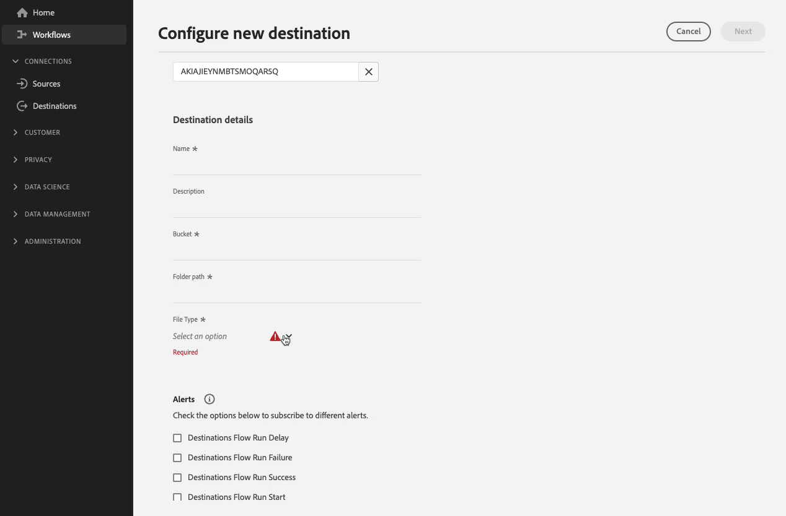
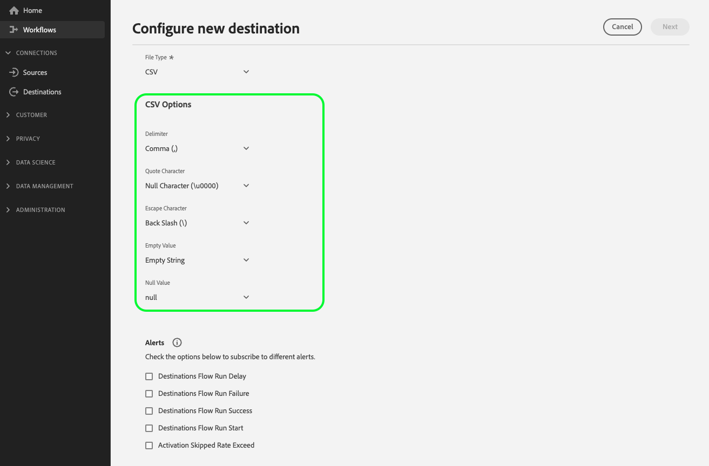
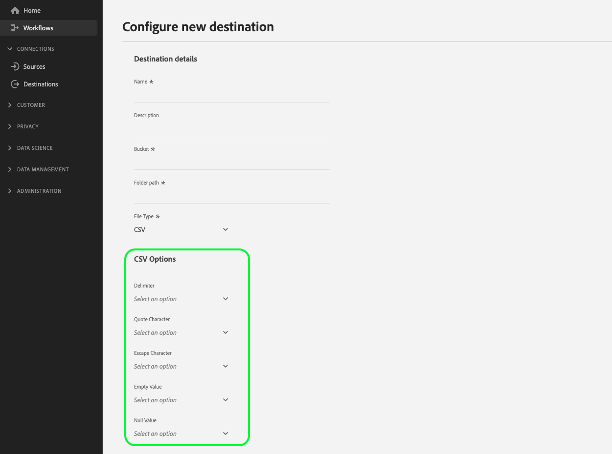
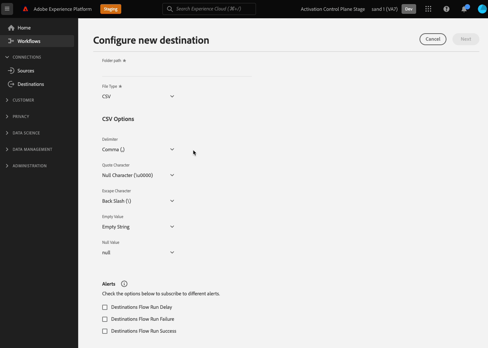
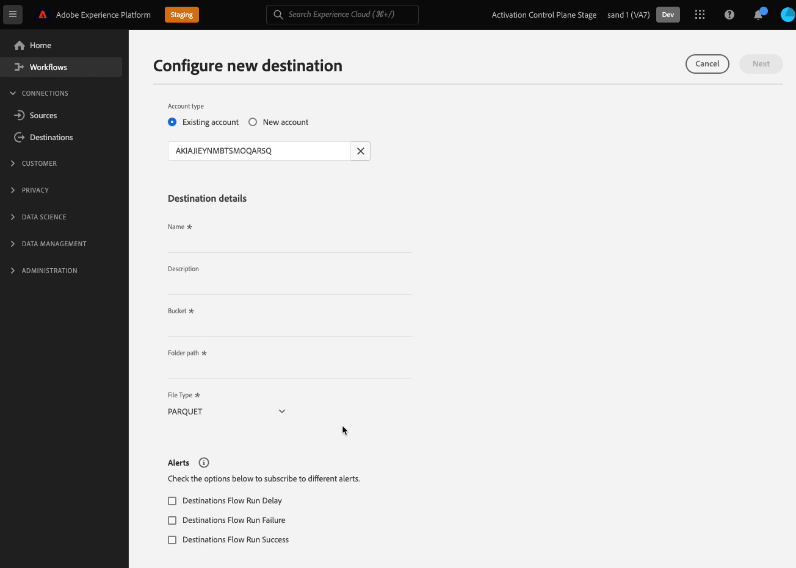

# ファイルベースの宛先に対するファイル形式オプションの設定

## 概要 {#overview}

Destination SDKでは、書き出したファイルの書式設定と圧縮オプションを、保存場所の下流の要件に合わせて幅広く調整できます。

このページでは、Destination SDKを使用して、ファイルベースの宛先にファイル形式オプションを設定する方法について説明します。

## 前提条件 {#prerequisites}

以下の手順に進む前に、[Destination SDK入門](../../getting-started.md) ページを参照して、Destination SDK APIを操作するために必要なAdobe I/O認証情報およびその他の前提条件を取得する方法を確認してください。

Adobeでは、次のドキュメントを読んでから先に進むことをお勧めします。

* 使用可能なすべてのファイル形式オプションは、[ ファイル形式設定](../../functionality/destination-server/file-formatting.md) セクションに詳細が記載されています。
* Destination SDKを使用してファイルベースの宛先[を](../../guides/configure-file-based-destination-instructions.md)設定する手順を完了します。

## サーバーとファイル設定の作成 {#create-server-file-configuration}

まず、`/destination-server` エンドポイントを使用して、書き出したファイルに設定するファイル書式設定オプションを決定します。

以下は、複数のファイル形式オプションを選択した[!DNL Amazon S3]宛先の宛先サーバー設定の例です。

**API 形式**

```http
POST platform.adobe.io/data/core/activation/authoring/destination-servers
```

**リクエスト**

```shell
curl -X POST https://platform.adobe.io/data/core/activation/authoring/destination-server \
 -H 'Authorization: Bearer {ACCESS_TOKEN}' \
 -H 'Content-Type: application/json' \
 -H 'x-gw-ims-org-id: {ORG_ID}' \
 -H 'x-api-key: {API_KEY}' \
 -H 'x-sandbox-name: {SANDBOX_NAME}' \
 -d '
{
{
  "name": "Amazon S3 Server with several CSV Options",
  "destinationServerType": "FILE_BASED_S3",
  "fileBasedS3Destination": {
    "bucket": {
      "templatingStrategy": "PEBBLE_V1",
      "value": "{{customerData.bucket}}"
    },
    "path": {
      "templatingStrategy": "PEBBLE_V1",
      "value": "{{customerData.path}}"
    }
  },
  "fileConfigurations": {
    "compression": {
      "templatingStrategy": "PEBBLE_V1",
      "value": "{{customerData.compression}}NONE"
    },
    "fileType": {
      "templatingStrategy": "PEBBLE_V1",
      "value": "{{customerData.fileType}}"
    },
    "csvOptions": {
      "sep": {
        "templatingStrategy": "PEBBLE_V1",
        "value": "{{customerData.csvOptions.delimiter}},"
      },
      "quote": {
        "templatingStrategy": "PEBBLE_V1",
        "value": "{{customerData.csvOptions.quote}}\""
      },
      "escape": {
        "templatingStrategy": "PEBBLE_V1",
        "value": "{{customerData.csvOptions.escape}}\\"
      },
      "nullValue": {
        "templatingStrategy": "PEBBLE_V1",
        "value": "{{customerData.csvOptions.nullValue}}null"
      },
      "emptyValue": {
        "templatingStrategy": "PEBBLE_V1",
        "value": "{{customerData.csvOptions.emptyValue}}"
      }
    }
  }
}
}'
```

## ファイル形式オプションを宛先設定に追加する {#create-destination-configuration}

>[!TIP]
>
>**Experience Platform UI**&#x200B;を確認します。 以下の節で示す設定を使用してファイル形式オプションを設定する際は、Experience Platform UIでこれらのオプションのレンダリング方法を確認する必要があります。

前の手順で目的のファイル形式オプションを宛先サーバーとファイル形式設定に追加した後、`/destinations` API エンドポイントを使用して、顧客データフィールドとして目的のフィールドを宛先設定に追加できるようになりました。

>[!IMPORTANT]
>
>この手順はオプションで、Experience Platform UIでユーザーに表示するファイル形式オプションを指定するだけです。 顧客データフィールドとしてファイル形式オプションを設定しない場合、ファイルの書き出しは、[ サーバーとファイル設定](#create-server-file-configuration)で設定されたデフォルト値に進みます。

この手順では、表示されるオプションを任意の順序でグループ化できます。また、選択したファイルタイプに基づいて、カスタムグループ化、ドロップダウンフィールド、条件付きグループ化を作成できます。 これらの設定はすべて、録画と以下のセクションに表示されます。



### ファイル形式オプションの順序 {#ordering}

宛先設定の顧客データフィールドとしてファイル形式オプションを追加した順序は、UIに反映されます。 例えば、以下の設定はUIに適切に反映され、オプションは&#x200B;**[!UICONTROL Delimiter]**、**[!UICONTROL Quote Character]**、**[!UICONTROL Escape Character]**、**[!UICONTROL Empty Value]**、**[!UICONTROL Null Value]**&#x200B;の順序で表示されます。



```json
        {
            "name": "csvOptions",
            "title": "CSV Options",
            "description": "Select your CSV options",
            "type": "object",
            "properties": [
                {
                    "name": "delimiter",
                    "title": "Delimiter",
                    "description": "Select your Delimiter",
                    "type": "string",
                    "isRequired": false,
                    "default": ",",
                    "namedEnum": [
                        {
                            "name": "Comma (,)",
                            "value": ","
                        },
                        {
                            "name": "Tab (\\t)",
                            "value": "\t"
                        }
                    ],
                    "readOnly": false,
                    "hidden": false
                },
                {
                    "name": "quote",
                    "title": "Quote Character",
                    "description": "Select your Quote character",
                    "type": "string",
                    "isRequired": false,
                    "default": "\u0000",
                    "namedEnum": [
                        {
                            "name": "Double Quotes (\")",
                            "value": "\""
                        },
                        {
                            "name":"Null Character (\u0000)",
                            "value": ""
                        }
                    ],
                    "readOnly": false,
                    "hidden": false
                },
                {
                    "name": "escape",
                    "title": "Escape Character",
                    "description": "Select your Escape character",
                    "type": "string",
                    "isRequired": false,
                    "default": "\\",
                    "namedEnum": [
                        {
                            "name": "Back Slash (\\)",
                            "value": "\\"
                        },
                        {
                            "name": "Single Quote (')",
                            "value": "'"
                        }
                    ],
                    "readOnly": false,
                    "hidden": false
                },
                {
                    "name": "emptyValue",
                    "title": "Empty Value",
                    "description": "Select the output value of blank fields",
                    "type": "string",
                    "isRequired": false,
                    "default": "",
                    "namedEnum": [
                        {
                            "name": "Empty String",
                            "value": ""
                        },
                        {
                            "name": "\"\"",
                            "value": "\"\""
                        },
                        {
                            "name": "null",
                            "value": "null"
                        }
                    ],
                    "readOnly": false,
                    "hidden": false
                },
                {
                    "name": "nullValue",
                    "title": "Null Value",
                    "description": "Select the output value of 'null' fields",
                    "type": "string",
                    "isRequired": false,
                    "default": "null",
                    "namedEnum": [
                        {
                            "name": "Empty String",
                            "value": ""
                        },
                        {
                            "name": "\"\"",
                            "value": "\"\""
                        },
                        {
                            "name": "null",
                            "value": "null"
                        }
                    ],
                    "readOnly": false,
                    "hidden": false
                }
```

### ファイル形式オプションのグループ化 {#grouping}

1つのセクション内で複数のファイル形式オプションをグループ化できます。 UIで宛先への接続を設定する際に、ユーザーは類似したフィールドの視覚的なグループ化を確認し、メリットを得ることができます。

これを行うには、`"type": "object"`を使用してグループを作成し、グループ化`properties`が強調表示されている次の例に示すように、**[!UICONTROL CSV Options]** パラメーター内に目的のファイル形式オプションを収集します。

```json {line-numbers="true" start-number="100" highlight="106-128"}
"customerDataFields":[
[...]
{
   "name":"csvOptions",
   "title":"CSV Options",
   "description":"Select your CSV options",
   "type":"object",
   "properties":[
      {
         "name":"delimiter",
         "title":"Delimiter",
         "description":"Select your Delimiter",
         "type":"string",
         "isRequired":false,
         "default":",",
         "namedEnum":[
            {
               "name":"Comma (,)",
               "value":","
            },
            {
               "name":"Tab (\\t)",
               "value":"\t"
            }
         ],
         "readOnly":false,
         "hidden":false
      },
      [...]
   ]
}
[...]
]
```



### ファイル形式オプション用のドロップダウンセレクターの作成 {#dropdown-selectors}

ユーザーがいくつかのオプションから選択できるようにしたい状況（例えば、CSV ファイルのフィールドを区切るためにどの文字を使用するか）では、UI にドロップダウンフィールドを追加できます。

これを行うには、以下に示すように、`namedEnum` オブジェクトを使用して、ユーザーが選択できるオプションの `default` 値を設定します。

```json {line-numbers="true" start-number="100" highlight="114-124"}
[...]
"customerDataFields":[
[...]
{
   "name":"csvOptions",
   "title":"CSV Options",
   "description":"Select your CSV options",
   "type":"object",
   "properties":[
      {
         "name":"delimiter",
         "title":"Delimiter",
         "description":"Select your Delimiter",
         "type":"string",
         "isRequired":false,
         "default":",",
         "namedEnum":[
            {
               "name":"Comma (,)",
               "value":","
            },
            {
               "name":"Tab (\\t)",
               "value":"\t"
            }
         ],
         "readOnly":false,
         "hidden":false
      },
      [...]
   ]
}
[...]
]
```



### 条件付きファイル形式オプションの作成 {#conditional-options}

条件付きファイル形式オプションを作成できます。このオプションは、ユーザーが書き出す特定のファイルタイプを選択した場合にのみ、アクティベーションワークフローに表示されます。 例えば、以下の設定では、CSV ファイルオプションの条件付きグループ化を作成します。 CSV ファイルオプションは、ユーザーが CSV を書き出し用のファイルタイプとして選択する場合にのみ表示されます。

フィールドを条件付きとして設定するには、以下に示すように、`conditional` パラメーターを使用します。

```json
            "conditional": {
                "field": "fileType",
                "operator": "EQUALS",
                "value": "CSV"
            }
```

より広いコンテキストでは、以下の宛先設定で、`fileType` 文字列とそれが定義されている `csvOptions` オブジェクトと共に `conditional` フィールドが使用されているのを確認できます。

```json
        {
            "name": "fileType",
            "title": "File Type",
            "description": "Select your file type",
            "type": "string",
            "isRequired": true,
            "enum": [
                "PARQUET",
                "CSV",
                "JSON"
            ],
            "readOnly": false,
            "hidden": false
        },
        {
            "name": "csvOptions",
            "title": "CSV Options",
            "description": "Select your CSV options",
            "type": "object",
            "conditional": {
                "field": "fileType",
                "operator": "EQUALS",
                "value": "CSV"
            },            
            "properties": [
                {
                    "name": "delimiter",
                    "title": "Delimiter",
                    "description": "Select your Delimiter",
                    "type": "string",
                    "isRequired": false,
                    "default": ",",
                    "namedEnum": [
                        {
                            "name": "Comma (,)",
                            "value": ","
                        },
                        {
                            "name": "Tab (\\t)",
                            "value": "\t"
                        }
                    ],
                    "readOnly": false,
                    "hidden": false
                },
                {
                    "name": "quote",
                    "title": "Quote Character",
                    "description": "Select your Quote character",
                    "type": "string",
                    "isRequired": false,
                    "default": "",
                    "namedEnum": [
                        {
                            "name": "Double Quotes (\")",
                            "value": "\""
                        },
                        {
                            "name":"Null Character (\u0000)",
                            "value": "\u0000"
                        }
                    ],
                    "readOnly": false,
                    "hidden": false
                },
                {
                    "name": "escape",
                    "title": "Escape Character",
                    "description": "Select your Escape character",
                    "type": "string",
                    "isRequired": false,
                    "default": "\\",
                    "namedEnum": [
                        {
                            "name": "Back Slash (\\)",
                            "value": "\\"
                        },
                        {
                            "name": "Single Quote (')",
                            "value": "'"
                        }
                    ],
                    "readOnly": false,
                    "hidden": false
                },
                {
                    "name": "emptyValue",
                    "title": "Empty Value",
                    "description": "Select the output value of blank fields",
                    "type": "string",
                    "isRequired": false,
                    "default": "",
                    "namedEnum": [
                        {
                            "name": "Empty String",
                            "value": ""
                        },
                        {
                            "name": "\"\"",
                            "value": "\"\""
                        },
                        {
                            "name": "null",
                            "value": "null"
                        }
                    ],
                    "readOnly": false,
                    "hidden": false
                },
                {
                    "name": "nullValue",
                    "title": "Null Value",
                    "description": "Select the output value of 'null' fields",
                    "type": "string",
                    "isRequired": false,
                    "default": "null",
                    "namedEnum": [
                        {
                            "name": "Empty String",
                            "value": ""
                        },
                        {
                            "name": "\"\"",
                            "value": "\"\""
                        },
                        {
                            "name": "null",
                            "value": "null"
                        }
                    ],
                    "readOnly": false,
                    "hidden": false
                }
            ],
            "isRequired": false,
            "readOnly": false,
            "hidden": false
        }
```

以下に、上記の設定に基づいた結果の UI 画面を確認できます。ユーザーがファイルタイプで CSV を選択すると、CSV ファイルタイプを参照する追加のファイル形式オプションが UI に表示されます。



### 上記のすべてのオプションを含む完全なAPI リクエスト {#complete-api-request}

以下のAPI リクエストは、上記のセクションで説明されているすべてのオプションを1つの設定にまとめます。

**リクエスト**

```shell
curl -X POST https://platform.adobe.io/data/core/activation/authoring/destinations \
 -H 'Authorization: Bearer {ACCESS_TOKEN}' \
 -H 'Content-Type: application/json' \
 -H 'x-gw-ims-org-id: {ORG_ID}' \
 -H 'x-api-key: {API_KEY}' \
 -H 'x-sandbox-name: {SANDBOX_NAME}' \
 -d '
{
  "name": "My S3 Destination",
  "description": "Test destination",
  "status": "TEST",
  "sources": [
    "UNIFIED_PROFILE"
  ],
  "customerAuthenticationConfigurations": [
    {
      "authType": "S3"
    }
  ],
  "customerDataFields": [
    {
      "name": "bucket",
      "type": "string",
      "title": "Bucket",
      "description": "Enter your S3 Bucket",
      "isRequired": true
    },
    {
      "name": "path",
      "type": "string",
      "title": "Path",
      "description": "Enter your S3 Path",
      "isRequired": true
    },
    {
      "name": "fileType",
      "type": "string",
      "enum": [
        "CSV",
        "JSON",
        "PARQUET"
      ],
      "title": "File Type",
      "description": "Select your file type",
      "isRequired": true
    },
    {
      "name": "csvOptions",
      "type": "object",
      "title": "CSV Options",
      "description": "Select your CSV options",
      "conditional": {
        "field": "fileType",
        "operator": "EQUALS",
        "value": "CSV"
      },
      "properties": [
        {
          "name": "delimiter",
          "type": "string",
          "title": "Delimiter",
          "description": "Select your Delimiter",
          "namedEnum": [
            {
              "name": "Comma (,)",
              "value": ","
            },
            {
              "name": "Tab (\\t)",
              "value": "\t"
            }
          ],
          "default": ","
        },
        {
          "name": "quote",
          "type": "string",
          "title": "Quote Character",
          "description": "Select your Quote character",
          "namedEnum": [
            {
              "name": "Double Quotes (\")",
              "value": "\""
            },
            {
              "name": "Null Character (\\u0000)",
              "value": "\u0000"
            }
          ],
          "default": "\u0000"
        },
        {
          "name": "escape",
          "type": "string",
          "title": "Escape Character",
          "description": "Select your Escape character",
          "namedEnum": [
            {
              "name": "Back Slash (\\)",
              "value": "\\"
            },
            {
              "name": "Single Quote (')",
              "value": "'"
            }
          ],
          "default": "\\"
        },
        {
          "name": "emptyValue",
          "type": "string",
          "title": "Empty Value",
          "description": "Select the output value of blank fields",
          "namedEnum": [
            {
              "name": "null",
              "value": "null"
            },
            {
              "name": "Empty String",
              "value": ""
            },
            {
              "name": "\"\"",
              "value": "\"\""
            }
          ],
          "default": ""
        },
        {
          "name": "nullValue",
          "type": "string",
          "title": "Null Value",
          "description": "Select the output value of 'null' fields",
          "namedEnum": [
            {
              "name": "null",
              "value": "null"
            },
            {
              "name": "Empty String",
              "value": ""
            },
            {
              "name": "\"\"",
              "value": "\"\""
            }
          ],
          "default": "null"
        }
      ]
    }
  ],
  "uiAttributes": {
    "documentationLink": "https://www.adobe.com/go/aep",
    "category": "cloudStorage",
    "connectionType": "Server-to-server",
    "frequency": "Batch",
    "monitoringSupported": true,
    "flowRunsSupported": true
  },
  "schemaConfig": {
    "profileRequired": true,
    "segmentRequired": true,
    "identityRequired": true
  },
  "batchConfig": {
    "allowMandatoryFieldSelection": true,
    "allowDedupeKeyFieldSelection": true,
    "defaultExportMode": "DAILY_FULL_EXPORT",
    "allowedExportMode": [
      "DAILY_FULL_EXPORT",
      "FIRST_FULL_THEN_INCREMENTAL"
    ],
    "allowedScheduleFrequency": [
      "DAILY",
      "EVERY_3_HOURS",
      "EVERY_6_HOURS",
      "EVERY_8_HOURS",
      "EVERY_12_HOURS",
      "ONCE"
    ],
    "defaultFrequency": "DAILY",
    "defaultStartTime": "00:00",
    "filenameConfig": {
      "allowedFilenameAppendOptions": [
        "SEGMENT_NAME",
        "DESTINATION_INSTANCE_ID",
        "DESTINATION_INSTANCE_NAME",
        "ORGANIZATION_NAME",
        "SANDBOX_NAME",
        "DATETIME",
        "CUSTOM_TEXT"
      ],
      "defaultFilenameAppendOptions": [
        "DATETIME"
      ],
      "defaultFilename": "%DESTINATION%_%SEGMENT_ID%"
    }
  },
  "destinationDelivery": [
    {
      "deliveryMatchers": [
        {
          "type": "SOURCE",
          "value": [
            "batch"
          ]
        }
      ],
      "authenticationRule": "CUSTOMER_AUTHENTICATION",
      "destinationServerId": "<server-id>"
    }
  ]
}'
```

応答が成功すると、設定の一意の識別子（`instanceId`）を含む宛先設定が返されます。

## 既知の制限事項 {#known-limitations}

ファイル形式オプションの特定の組み合わせは、望ましくないファイル書き出し結果につながる可能性があります。
Adobeでは、次のCSV オプションの組み合わせを選択しないことをお勧めします。

```properties
nullValue -> ""
quote -> "
emptyValue -> ""
```

制限の例を示すには、次の値を持つファイルの書き出しを検討します。

| 名 | 姓 | 国 | state |
|---------|----------|---------|--------|
| マイケル | ローズ | 米国 | NY |
| ジェームズ | スミス |  | null |

{style="table-layout:auto"}

この結果、次に示すように出力されます。 テーブルのnull値が、エスケープされた見積もりとして誤って書き出されることに注意してください。

```csv
Michael,Rose,USA,NY 
James,Smith,"","\"\""
```

## 次の手順 {#next-steps}

この記事では、Destination SDKを使用して、書き出したファイルのカスタムファイル形式オプションを設定する方法について説明します。 次に、チームはファイルベースの宛先[の](../../../ui/activate-batch-profile-destinations.md) アクティベーションワークフローを使用して、宛先にデータを書き出すことができます。
