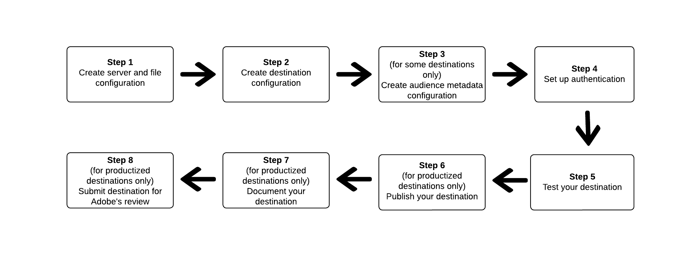

# Destination SDK を使用したファイルベースの宛先の設定

## 概要 {#overview}

このページでは、[Destinations SDK の設定オプション](../functionality/configuration-options.md)および他の Destination SDK 機能と API リファレンスドキュメントに記載された情報を使用して[ファイルベースの宛先](../../destination-types.md#file-based)を設定する方法を説明します。以下にその手順を、順を追って説明します。

## 前提条件 {#prerequisites}

以下に示す手順に進む前に、[Destination SDK入門](../getting-started.md) ページで、Destination SDK APIを操作するために必要なAdobe I/O認証情報およびその他の前提条件を取得する方法を確認してください。

## Destination SDK の構成オプションを使用して宛先を設定する手順 {#steps}



## 手順 1：サーバーとファイル設定の作成 {#create-server-file-configuration}

[&#x200B; エンドポイントを使用して](../authoring-api/destination-server/create-destination-server.md) サーバーとファイル設定`/destinations-server`を作成することから開始します。

次に [!DNL Amazon S3] 宛先の設定例を示します。設定で使用されるフィールドと、他のタイプのファイルベースの宛先を設定する方法について詳しくは、対応する[&#x200B; サーバー設定](../functionality/destination-server/server-specs.md)を参照してください。

**API 形式**

```shell
POST platform.adobe.io/data/core/activation/authoring/destination-servers
```

```json
{
    "name": "S3 destination",
    "destinationServerType": "FILE_BASED_S3",
    "fileBasedS3Destination": {
        "bucket": {
            "templatingStrategy": "PEBBLE_V1",
            "value": "{{customerData.bucketName}}"
        },
        "path": {
            "templatingStrategy": "PEBBLE_V1",
            "value": "{{customerData.path}}"
        }
    },
    "fileConfigurations": {
        "compression": {
            "templatingStrategy": "PEBBLE_V1",
            "value": "{{customerData.compression}}"
        },
        "fileType": {
            "templatingStrategy": "PEBBLE_V1",
            "value": "{{customerData.fileType}}"
        },
        "csvOptions": {
            "quote": {
                "templatingStrategy": "NONE",
                "value": "\""
            },
            "quoteAll": {
                "templatingStrategy": "NONE",
                "value": "false"
            },
            "escape": {
                "templatingStrategy": "NONE",
                "value": "\\"
            },
            "escapeQuotes": {
                "templatingStrategy": "NONE",
                "value": "true"
            },
            "header": {
                "templatingStrategy": "NONE",
                "value": "true"
            },
            "ignoreLeadingWhiteSpace": {
                "templatingStrategy": "NONE",
                "value": "true"
            },
            "ignoreTrailingWhiteSpace": {
                "templatingStrategy": "NONE",
                "value": "true"
            },
            "nullValue": {
                "templatingStrategy": "NONE",
                "value": ""
            },
            "dateFormat": {
                "templatingStrategy": "NONE",
                "value": "yyyy-MM-dd"
            },
            "timestampFormat": {
                "templatingStrategy": "NONE",
                "value": "yyyy-MM-dd'T':mm:ss[.SSS][XXX]"
            },
            "charToEscapeQuoteEscaping": {
                "templatingStrategy": "NONE",
                "value": "\\"
            },
            "emptyValue": {
                "templatingStrategy": "NONE",
                "value": ""
            }
        }
    }
}
```

## 手順 2：宛先の構成の作成 {#create-destination-configuration}

次に、`/destinations` API エンドポイントを使用して作成された宛先設定の例を示します。

手順1からこの宛先設定にサーバーとファイル設定を接続するには、サーバーとファイル設定の`instance ID`をここに`destinationServerId`として追加します。

**API 形式**

```http
POST platform.adobe.io/data/core/activation/authoring/destinations
```

```json {line-numbers="true" highlight="83"}
{
    "name": "Amazon S3 destination",
    "description": "Amazon S3 destination is a fictional destination, used for this example.",
    "status": "Test",
    "customerAuthenticationConfigurations": [
        {
            "authType": "S3"
        }
    ],
    "customerEncryptionConfigurations": [],
    "customerDataFields": [
        {
            "name": "bucketName",
            "title": "Amazon S3 bucket name",
            "description": "Enter the Amazon S3 Bucket name that will host the exported files.",
            "type": "string",
            "isRequired": true,
            "pattern": "(?=^.{3,63}$)(?!^(\\d+\\.)+\\d+$)(^(([a-z0-9]|[a-z0-9][a-z0-9\\-]*[a-z0-9])\\.)*([a-z0-9]|[a-z0-9][a-z0-9\\-]*[a-z0-9])$)",
            "readOnly": false,
            "hidden": false
        },
        {
            "name": "path",
            "title": "Amazon S3 path",
            "description": "Enter Amazon S3 folder path",
            "type": "string",
            "isRequired": true,
            "pattern": "^[0-9a-zA-Z\\/\\!\\-_\\.\\*\\''\\(\\)]*((\\%SEGMENT_(NAME|ID)\\%)?\\/?)+$",
            "readOnly": false,
            "hidden": false
        },
        {
            "name": "compression",
            "title": "Select compression type",
            "description": "Select the file compression type used by the exported files.",
            "type": "string",
            "isRequired": true,
            "readOnly": false,
            "enum": [
                "GZIP",
                "NONE",
                "bzip2",
                "lz4",
                "snappy",
                "deflate"
            ]
        },
        {
            "name": "fileType",
            "title": "Select a file format",
            "description": "Select the file format to be used by the exported files.",
            "type": "string",
            "isRequired": true,
            "readOnly": false,
            "hidden": false,
            "enum": [
                "csv",
                "json",
                "parquet"
            ],
            "default": "csv"
        }
    ],
    "uiAttributes": {
        "documentationLink": "https://www.adobe.com/go/destinations-YOURDESTINATION-en",
        "category": "S3",
        "connectionType": "S3",
        "flowRunsSupported": true,
        "monitoringSupported": true,
        "frequency": "Batch"
    },
    "destinationDelivery": [
        {
            "deliveryMatchers": [
                {
                    "type": "SOURCE",
                    "value": [
                        "batch"
                    ]
                }
            ],
            "authenticationRule": "CUSTOMER_AUTHENTICATION",
            "destinationServerId": "eec25bde-4f56-4c02-a830-9aa9ec73ee9d"
        }
    ],
    "schemaConfig": {
        "profileRequired": true,
        "segmentRequired": true,
        "identityRequired": true
    },
    "batchConfig": {
        "allowMandatoryFieldSelection": true,
        "allowDedupeKeyFieldSelection": true,
        "defaultExportMode": "DAILY_FULL_EXPORT",
        "allowedExportMode": [
            "DAILY_FULL_EXPORT",
            "FIRST_FULL_THEN_INCREMENTAL"
        ],
        "allowedScheduleFrequency": [
            "DAILY",
            "EVERY_3_HOURS",
            "EVERY_6_HOURS",
            "EVERY_8_HOURS",
            "EVERY_12_HOURS",
            "ONCE"
        ],
        "defaultFrequency": "DAILY",
        "defaultStartTime": "00:00",
       "filenameConfig":{
         "allowedFilenameAppendOptions":[
            "SEGMENT_NAME",
            "DESTINATION_INSTANCE_ID",
            "DESTINATION_INSTANCE_NAME",
            "ORGANIZATION_NAME",
            "SANDBOX_NAME",
            "DATETIME",
            "CUSTOM_TEXT"
         ],
         "defaultFilenameAppendOptions":[
            "DATETIME"
         ],
         "defaultFilename":"%DESTINATION%_%SEGMENT_ID%"
      }
    },
    "backfillHistoricalProfileData": true
}
```

## 手順 3：オーディエンスメタデータ設定の作成 {#create-audience-metadata-configuration}

一部の宛先では、Destination SDK は、宛先のオーディエンスをプログラムで作成、更新、削除するように、オーディエンスメタデータを構成する必要があります。 この設定を設定する必要があるタイミングとその方法については、[&#x200B; オーディエンスメタデータ管理](../functionality/audience-metadata-management.md)を参照してください。

オーディエンスメタデータの構成を使用する場合は、手順 2 で作成した宛先構成に接続する必要があります。 オーディエンスメタデータ設定のインスタンス ID を `audienceTemplateId` のように宛先設定に追加します。

```json {line-numbers="true" highlight="90"}
{
    "name": "Amazon S3 destination",
    "description": "Amazon S3 destination is a fictional destination, used for this example.",
    "status": "Test",
    "customerAuthenticationConfigurations": [
        {
            "authType": "S3"
        }
    ],
    "customerEncryptionConfigurations": [],
    "customerDataFields": [
        {
            "name": "bucketName",
            "title": "Amazon S3 bucket name",
            "description": "Enter the Amazon S3 Bucket name that will host the exported files.",
            "type": "string",
            "isRequired": true,
            "pattern": "(?=^.{3,63}$)(?!^(\\d+\\.)+\\d+$)(^(([a-z0-9]|[a-z0-9][a-z0-9\\-]*[a-z0-9])\\.)*([a-z0-9]|[a-z0-9][a-z0-9\\-]*[a-z0-9])$)",
            "readOnly": false,
            "hidden": false
        },
        {
            "name": "path",
            "title": "Amazon S3 path",
            "description": "Enter Amazon S3 folder path",
            "type": "string",
            "isRequired": true,
            "pattern": "^[0-9a-zA-Z\\/\\!\\-_\\.\\*\\''\\(\\)]*((\\%SEGMENT_(NAME|ID)\\%)?\\/?)+$",
            "readOnly": false,
            "hidden": false
        },
        {
            "name": "compression",
            "title": "Select compression type",
            "description": "Select the file compression type used by the exported files.",
            "type": "string",
            "isRequired": true,
            "readOnly": false,
            "enum": [
                "GZIP",
                "NONE",
                "bzip2",
                "lz4",
                "snappy",
                "deflate"
            ]
        },
        {
            "name": "fileType",
            "title": "Select a file format",
            "description": "Select the file format to be used by the exported files.",
            "type": "string",
            "isRequired": true,
            "readOnly": false,
            "hidden": false,
            "enum": [
                "csv",
                "json",
                "parquet"
            ],
            "default": "csv"
        }
    ],
    "uiAttributes": {
        "documentationLink": "http://www.adobe.com/go/destinations-YOURDESTINATION-en",
        "category": "S3",
        "connectionType": "S3",
        "flowRunsSupported": true,
        "monitoringSupported": true,
        "frequency": "Batch"
    },
    "destinationDelivery": [
        {
            "deliveryMatchers": [
                {
                    "type": "SOURCE",
                    "value": [
                        "batch"
                    ]
                }
            ],
            "authenticationRule": "CUSTOMER_AUTHENTICATION",
            "destinationServerId": "eec25bde-4f56-4c02-a830-9aa9ec73ee9d"
        }
    ],
    "segmentMappingConfig":{
        "mapExperiencePlatformSegmentName":false,
        "mapExperiencePlatformSegmentId":false,
        "mapUserInput":false
    },
    "audienceMetadataConfig":{
        "audienceTemplateId":"cbf90a70-96b4-437b-86be-522fbdaabe9c"
    },   
    "schemaConfig": {
        "profileRequired": true,
        "segmentRequired": true,
        "identityRequired": true
    },
    "batchConfig": {
        "allowMandatoryFieldSelection": true,
        "allowDedupeKeyFieldSelection": true,
        "defaultExportMode": "DAILY_FULL_EXPORT",
        "allowedExportMode": [
            "DAILY_FULL_EXPORT",
            "FIRST_FULL_THEN_INCREMENTAL"
        ],
        "allowedScheduleFrequency": [
            "DAILY",
            "EVERY_3_HOURS",
            "EVERY_6_HOURS",
            "EVERY_8_HOURS",
            "EVERY_12_HOURS",
            "ONCE"
        ],
        "defaultFrequency": "DAILY",
        "defaultStartTime": "00:00",
       "filenameConfig":{
         "allowedFilenameAppendOptions":[
            "SEGMENT_NAME",
            "DESTINATION_INSTANCE_ID",
            "DESTINATION_INSTANCE_NAME",
            "ORGANIZATION_NAME",
            "SANDBOX_NAME",
            "DATETIME",
            "CUSTOM_TEXT"
         ],
         "defaultFilenameAppendOptions":[
            "DATETIME"
         ],
         "defaultFilename":"%DESTINATION%_%SEGMENT_ID%"
      }
    },
    "backfillHistoricalProfileData": true
}
```

## 手順 4：認証の設定 {#set-up-authentication}

前述した宛先設定で、`"authenticationRule": "CUSTOMER_AUTHENTICATION"` または `"authenticationRule": "PLATFORM_AUTHENTICATION"` を指定するかどうかに応じて、`/destination` または `/credentials` エンドポイントを使用して宛先の認証を設定できます。

>[!NOTE]
>
>`CUSTOMER_AUTHENTICATION`は、2つの認証ルールの中で最も一般的なものであり、接続を設定してデータを書き出す前に、ユーザーが宛先に何らかの認証を提供する必要がある場合に使用するものです。

* 宛先の設定で `"authenticationRule": "CUSTOMER_AUTHENTICATION"` を選択した場合、ファイルベースの宛先で Destination SDK によってサポートされる認証タイプについては、次の節を参照してください。

   * [Amazon S3 認証](../functionality/destination-configuration/customer-authentication.md#s3)
   * [Azure Blob](../functionality/destination-configuration/customer-authentication.md#blob)
   * [Azure Data Lake Storage](../functionality/destination-configuration/customer-authentication.md#adls)
   * [Google Cloud Storage](../functionality/destination-configuration/customer-authentication.md#gcs)
   * [SSH キーを使用した SFTP 認証](../functionality/destination-configuration/customer-authentication.md#sftp-ssh-key-auth)
   * [パスワードを使用した SFTP 認証](../functionality/destination-configuration/customer-authentication.md#sftp-password-auth)

* `"authenticationRule": "PLATFORM_AUTHENTICATION"`を選択した場合、[資格情報設定](../credentials-api/create-credential-configuration.md)を作成し、`authenticationId`宛先配信[設定の](/help/destinations/destination-sdk/functionality/destination-configuration/destination-delivery.md#platform-authentication) パラメーターに資格情報オブジェクトのIDを渡す必要があります。

## 手順 5：宛先のテスト {#test-destination}

前の手順で設定エンドポイントを使用して宛先を設定した後、[宛先テストツール &#x200B;](../testing-api/batch-destinations/file-based-destination-testing-overview.md)を使用して、[!DNL Adobe Experience Platform]と宛先の統合をテストできます。

宛先をテストするプロセスの一環として、Experience Platform UIを使用してオーディエンスを作成し、宛先に対してアクティブ化する必要があります。 Experience Platformでオーディエンスを作成する方法については、次の2つのリソースを参照してください。

* [オーディエンスの作成 – ドキュメントページ](/help/segmentation/ui/audience-portal.md#create-audience)
* [&#x200B; オーディエンスの作成 – ビデオチュートリアル &#x200B;](https://experienceleague.adobe.com/docs/platform-learn/tutorials/segments/create-segments.html)

## 手順 6：宛先を公開する {#publish-destination}

>[!NOTE]
>
>この手順は、自分で使用するプライベート宛先を作成しており、他の顧客が使用するために宛先カタログで公開することを検討していない場合は必要ありません。

宛先を設定およびテストした後、[宛先を公開する API](../publishing-api/create-publishing-request.md) を使用して設定をレビュー用にアドビに送信します。

## 手順 7：宛先のドキュメント化 {#document-destination}

>[!NOTE]
>
>この手順は、自分で使用するプライベート宛先を作成しており、他の顧客が使用するために宛先カタログで公開することを検討していない場合は必要ありません。

独立系ソフトウェアベンダー（ISV）またはシステムインテグレータ（SI）で[製品化統合](../overview.md#productized-custom-integrations)を作成する場合、[セルフサービスドキュメント化プロセス](../docs-framework/documentation-instructions.md)を使用して、宛先の製品ドキュメントページを [Experience Platform 宛先カタログ](/help/destinations/catalog/overview.md)に作成します。

## 手順8:Adobeのレビュー用に送信先を送信する {#submit-for-review}

>[!NOTE]
>
>この手順は、自分で使用するプライベート宛先を作成しており、他の顧客が使用するために宛先カタログで公開することを検討していない場合は必要ありません。

最後に、宛先をExperience Platform カタログに公開し、すべてのExperience Platformのお客様に表示する前に、宛先をAdobeのレビュー用に正式に送信する必要があります。 Destination SDK[で作成された製品化された宛先をレビュー用に](../guides/submit-destination.md)送信する方法に関する詳細を確認します。
