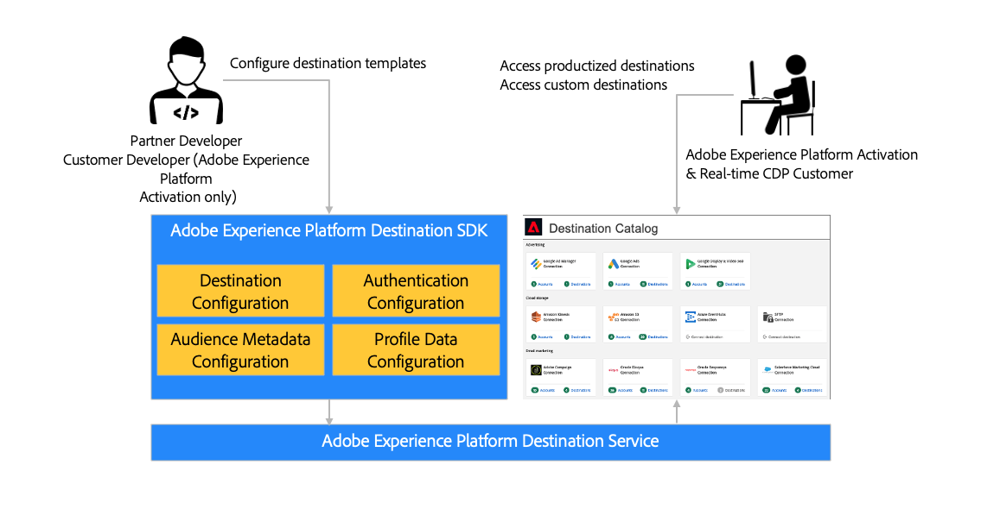

# [!DNL Adobe Experience Platform] Destination SDK

[!DNL Adobe Experience Platform] Destination SDKは、選択したデータと認証フォーマットに基づいて、エンドポイントまたはストレージの場所にオーディエンスデータとプロファイルデータを配信するようにExperience Platformの宛先統合パターンを設定できる一連の設定APIです。 設定は Experience Platform に保存され、API 経由で取得することで追加アップデートを入手できます。

Destination SDK ドキュメントでは、[!DNL Adobe Experience Platform] Destination SDKを使用して、[!DNL Adobe Experience Platform]との製品化された宛先の統合を設定、テストおよびリリースし、宛先を増え続ける宛先カタログの一部にするための手順を説明しています。 Destination SDKを使用すると、独自のカスタムプライベート宛先を作成して、ニーズに合わせたデータを書き出すこともできます。

## クイックスタート – 重要な情報を確認する {#quick-start}

以下のリンクにあるドキュメントを確認して、Destination SDKを使用した宛先の設定と送信をすばやく開始します。

>[!BEGINSHADEBOX]

<table style="border: 0;">
  <tbody>
    <tr>
        <td>
            
<b>設定ページ</b>

            <ul>
                <li><a href="/help/destinations/destination-sdk/functionality/configuration-options.md">すべての設定オプションの説明</a></li>
                <li> 宛先サーバー設定 – <a href="/help/destinations/destination-sdk/functionality/destination-server/server-specs.md"> サーバー仕様</a>および<a href="/help/destinations/destination-sdk/functionality/destination-server/templating-specs.md"> テンプレート仕様</a></li>
                <li><a href="/help/destinations/destination-sdk/functionality/destination-configuration/customer-data-fields.md">顧客データフィールドとその他の宛先設定コンポーネント</a></li>
                <li><a href="https://experienceleague.adobe.com/en/docs/experience-platform/destinations/destination-sdk/functionality/destination-server/message-format">テンプレート化とマクロ</a></li>
            </ul>
        </td>
        <td>
            
<b>ガイド</b>

            <ul>
                <li><a href="/help/destinations/destination-sdk/overview.md#process">高度な統合プロセス</a></li>
                <li><a href="/help/destinations/destination-sdk/guides/configure-destination-instructions.md">ストリーミング宛先の設定</a></li>
                <li><a href="/help/destinations/destination-sdk/guides/configure-file-based-destination-instructions.md">ファイルベースの宛先の設定</a></li>
                <li><a href="/help/destinations/destination-sdk/guides/batch/configure-prospect-audience-destination.md">見込み客プロファイルを書き出す宛先の設定</a></li>
                <li><a href="/help/destinations/destination-sdk/guides/submit-destination.md">公開用に送信先</a></li>
            </ul>
        </td>
                <td>
            
<b>API参照</b>

            <ul>
                <li><a href="https://developer.adobe.com/experience-platform-apis/references/destination-authoring/#tag/Destination-servers-and-templates">宛先サーバーエンドポイント API リファレンス</a></li>
                <li><a href="https://developer.adobe.com/experience-platform-apis/references/destination-authoring/#tag/Destination-configurations">宛先エンドポイント API リファレンス</a></li>
                <li><a href="https://developer.adobe.com/experience-platform-apis/references/destination-authoring/#tag/Audience-metadata-templates">Audience Metadata API リファレンス</a></li>
                <li><a href="https://developer.adobe.com/experience-platform-apis/references/destination-authoring/#tag/Destination-testing">API リファレンスのテスト</a></li>
                <li><a href="https://developer.adobe.com/experience-platform-apis/references/destination-authoring/#tag/Destination-publishing">宛先公開API リファレンス</a></li>
            </ul>
        </td>
    </tr>
  </tbody>
</table>

<table style="border: 0;">
  <tbody>
    <tr>
        <td>
            
<b>ストリーミング宛先の設定 – チートシート</b>

            <ul>
                <li><a href="/help/destinations/destination-sdk/guides/configure-destination-instructions.md">ストリーミング宛先エンドツーエンドガイドの設定</a></li>
                <li><a href="/help/destinations/destination-sdk/functionality/destination-server/message-format.md">Pebble テンプレートを使用したデータ変換について</a>および<a href="/help/destinations/destination-sdk/functionality/destination-server/supported-functions.md"> サポートされているテンプレート関数を表示</a></li>
                <li><a href="/help/destinations/destination-sdk/functionality/destination-configuration/aggregation-policy.md">データ集計ポリシーについて</a></li>
                <li><a href="https://experienceleague.adobe.com/en/docs/experience-platform/destinations/destination-sdk/functionality/destination-server/message-format">ライブ設定の例</a></li>
                <li><a href="/help/destinations/destination-sdk/testing-api/streaming-destinations/streaming-destination-testing-overview.md">ストリーミング宛先のテスト</a></li>
            </ul>
        </td>
        <td>
            
<b>ファイルベースの宛先の設定 – チートシート</b>

            <ul>
                <li><a href="/help/destinations/destination-sdk/guides/configure-file-based-destination-instructions.md">ファイルベースの宛先エンドツーエンドガイドの設定</a></li>
                <li><a href="/help/destinations/destination-sdk/guides/batch/configure-file-formatting-options.md">書き出したファイルのファイル形式の設定</a></li>
                <li><a href="/help/destinations/destination-sdk/guides/batch/configure-amazon-s3-destination-with-predefined-file-formatting.md">Amazon S3宛先のライブ設定の例</a></li>
                <li>ファイル書き出しスケジュールとファイル命名用の<a href="/help/destinations/destination-sdk/functionality/destination-configuration/batch-configuration.md"> バッチ設定</a></li>
                <li><a href="/help/destinations/destination-sdk/testing-api/batch-destinations/file-based-destination-testing-overview.md">ファイルベースの宛先をテストする</a></li>
            </ul>
        </td>
        <td>
            
<b>その他の重要情報</b>

            <ul>
                <li><a href="/help/destinations/destination-sdk/getting-started.md#obtain-authentication-credentials">APIを使用するために必要な認証情報を取得します</a></li>
                <li><a href="/help/destinations/destination-sdk/integration-prerequisites.md">統合の前提条件</a></li>
                <li><a href="/help/destinations/destination-sdk/glossary.md">Destination SDK用語</a></li>                
                <li><a href="/help/destinations/destination-sdk/functionality/rate-limiting-retry-policy.md">レート制限と再試行ポリシー</a></li>
                <li><a href="/help/destinations/destination-sdk/docs-framework/self-service-template.md">宛先を文書化するセルフサービステンプレート</a></li>
            </ul>
        </td>
    </tr>
  </tbody>
</table>

>[!ENDSHADEBOX]

## 製品化されたカスタム統合 {#productized-custom-integrations}

>[!IMPORTANT]
>
> プライベートカスタムの宛先を作成するこの機能は、[Adobe Real-Time Customer Data Platform Ultimate](https://helpx.adobe.com/jp/legal/product-descriptions/real-time-customer-data-platform.html)のお客様のみが利用できます。

Destination SDK のパートナーは、製品化された宛先を [Experience Platform カタログ](../catalog/overview.md)に追加することで、次のメリットを得ることができます。

1. 事前設定済みのパラメーターを使用して顧客全体で統合設定を標準化し、顧客の設定エクスペリエンスを簡素化できます。
2. Experience Platform の宛先カタログでブランド化した宛先カードを紹介できるため、顧客の設定の簡素化や認知の向上につながります。
3. [!DNL Adobe Experience Platform]とAdobe [!DNL Real-Time Customer Data Platform]の製品レベルの統合先として紹介されます。

Experience Platformをご利用のお客様は、アクティベーションのニーズに最適な独自のプライベートカスタム宛先を作成することもできます。

## サポートされる統合タイプ {#supported-integration-types}

### リアルタイム（ストリーミング）統合 {#real-time-integrations}

Destination SDKを通じて、[!DNL Adobe Experience Platform]はREST API エンドポイントを持つ宛先とのリアルタイム（ストリーミングとも呼ばれます）統合をサポートしています。 Experience Platform とのリアルタイム統合は、次のような機能をサポートします。

* メッセージの変換と集計
* プロファイルのバックフィル
* オーディエンス設定とデータ転送を初期化するための設定可能なメタデータ統合
* 設定可能な認証
* 宛先設定をテストして反復するためのテスト API および検証 API のスイート

### ファイルベースの統合 {#file-based-integrations}

Destination SDKでは、統合機能を設定して、選択した保存場所にファイルを定期的に書き出すこともできます。 Experience Platformとのファイルベースの統合では、次のような機能をサポートしています。

* サポートされている複数の形式（CSV、Parquet、JSON）でのファイル書き出し
* 設定できるファイル形式オプション。これにより、書き出されたファイルの形式を構造化して、下流の要件に対応させることができます。

[統合の前提条件](integration-prerequisites.md)の記事で宛先側の技術要件について説明し、[設定オプション ](functionality/configuration-options.md)の記事でサポートされているすべての設定について説明します

## Destination SDK へのアクセスの取得 {#get-access}

Destination SDKへのアクセスは、パートナーまたはExperience Platformのお客様のステータスによって異なります。[!DNL Real-Time CDP] 詳しくは、以下の表を参照してください。

| パートナーまたは顧客のタイプ | Destination SDK へのアクセス方法 |
|---------|----------|
| 独立系ソフトウェアベンダー（ISV） | [Adobe テクノロジーパートナープログラム ](https://partners.adobe.com/technologyprogram/experiencecloud.html)に参加して、Destination SDKにアクセスするためのExperience Platform サンドボックスのプロビジョニングをリクエストします。 |
| システムインテグレーター（SI） | Experience Platform サンドボックスをプロビジョニングしてDestination SDKにアクセスするには、[Adobe ソリューションパートナープログラム ](https://solutionpartners.adobe.com/home.html)のゴールドレベルまたはプラチナレベルである必要があります。 |
| [Real-Time CDP Ultimate パッケージ ](https://helpx.adobe.com/jp/legal/product-descriptions/real-time-customer-data-platform.html)のExperience Platformのお客様 | デフォルトでは、Experience Platform サンドボックスとDestination SDKにアクセスできるので、組織のプライベートな配信先を構築できます。 |

{style="table-layout:auto"}

## プロセスの概要 {#process}

Experience Platform で宛先を設定するプロセスの概要を次に示します。

1. ISVまたはSIの場合は、上記のセクションの[ アクセスの取得](#get-access)情報を参照してください。 [Real-Time CDP Ultimate パッケージ ](https://helpx.adobe.com/jp/legal/product-descriptions/real-time-customer-data-platform.html)のお客様は、この手順をスキップできます。
2. [Experience Platform サンドボックスのプロビジョニングをリクエスト](https://adobeexchangeec.zendesk.com/hc/en-us/articles/360037457812-Adobe-Experience-Platform-Sandbox-Accounts-Access-Adding-Users-and-Support)し、宛先オーサリング権限を有効にします。
3. 統合の構築。 製品ドキュメントの手順に従って、[ ストリーミング宛先](guides/configure-destination-instructions.md)または[ ファイルベースの宛先](guides/configure-file-based-destination-instructions.md)を設定します。
4. 統合のテスト。 製品ドキュメントの指示に従って、[ ストリーミング宛先](testing-api/streaming-destinations/streaming-destination-testing-overview.md)または[ ファイルベースの宛先](testing-api/batch-destinations/file-based-destination-testing-overview.md)をテストします。
5. ISVまたはSIが[製品化された統合](./overview.md#productized-custom-integrations)を作成している場合、[Adobeのレビュー用に統合](guides/submit-destination.md)を送信します（標準応答時間は5営業日です）。
6. ISVまたはSIが製品化された統合を作成している場合は、[ セルフサービスのドキュメントプロセス ](docs-framework/documentation-instructions.md)を使用して、宛先用のExperience Leagueで製品ドキュメントページを作成します。
7. 製品化された統合の場合、Adobeで承認されると、統合は[Experience Platform カタログ ](../catalog/overview.md)に表示されます。
8. 統合を更新する場合は、同じプロセスに従います。

## リファレンス {#reference}

アドビでは、次の Experience Platform ドキュメントを読んで理解を深めることをお勧めします。

* [Adobe Experience Platform 宛先の概要](https://experienceleague.adobe.com/docs/experience-platform/destinations/home.html?lang=ja)
* [XDM スキーマ構成の基本](https://experienceleague.adobe.com/docs/experience-platform/xdm/schema/composition.html?lang=ja)
* [ID 名前空間の概要](https://experienceleague.adobe.com/docs/experience-platform/identity/namespaces.html?lang=ja)
