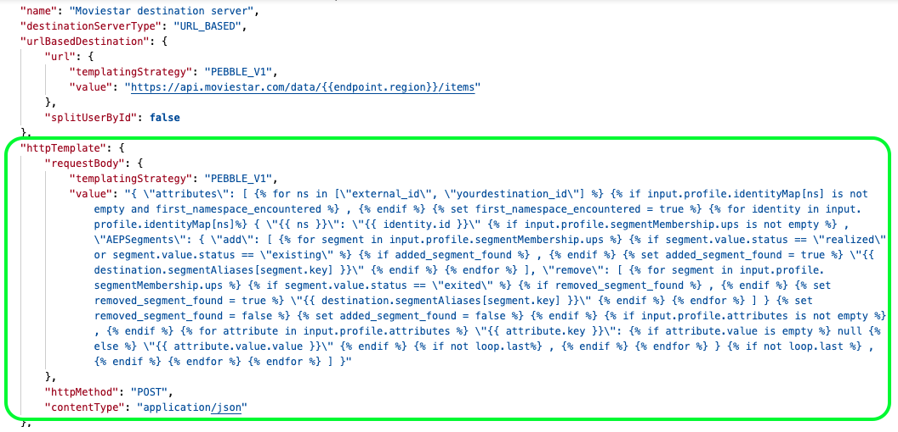

# サーバーおよびテンプレート仕様の構成オプション

## 概要 {#overview}

サーバーとテンプレートの仕様は、共通のエンドポイント `/authoring/destination-servers` を介してAdobe Experience Platform Destination SDK で設定できます。 エンドポイントで実行できる操作の完全なリストについては、[ 宛先 API エンドポイントの操作 ](./destination-server-api.md) をお読みください。

## 設定例 {#example-configuration}

```json
{
   "name":"Moviestar destination server",
   "destinationServerType":"URL_BASED",
   "urlBasedDestination":{
      "url":{
         "templatingStrategy":"PEBBLE_V1",
         "value":"https://api.moviestar.com/data/{{customerData.region}}/items"
      }
   },
   "httpTemplate":{
      "httpMethod":"POST",
      "requestBody":{
         "templatingStrategy":"PEBBLE_V1",
         "value":"{ \"attributes\": [   ,    { \"{{ ns }}\": \"{{ identity.id }}\"  , \"AEPSegments\": { \"add\": [    ,   \"{{ destination.segmentAliases[segment.key] }}\"   ], \"remove\": [    ,   \"{{ destination.segmentAliases[segment.key] }}\"   ] }     ,   \"{{ attribute.key }}\":  null  \"{{ attribute.value.value }}\"   ,   }  ,    ] }"
      },
      "contentType":"application/json"
   }
}
```

## サーバーの仕様 {#server-specs}


お客様は、HTTP エクスポートを使用して、Adobe Experience Platformから宛先にデータをアクティブ化できます。 サーバー設定には、メッセージを受信したサーバー（サイドのサーバー）に関する情報が含まれます。

このプロセスは、ユーザーデータを一連の HTTP メッセージとして宛先プラットフォームに配信します。 以下のパラメーターは、HTTP サーバー仕様テンプレートを形成します。

| パラメーター | タイプ | 説明 |
|---|---|---|
| `name` | 文字列 | *必須* サーバーのわかりやすい名前を表し、Adobeにのみ表示されます。この名前は、パートナーや顧客には表示されません。 例 `Moviestar destination server`. |
| `destinationServerType` | 文字列 | *必須* `URL_BASED` は現在、唯一のオプションです。 |
| `templatingStrategy` | 文字列 | *必須.* <ul><li>Adobeが下の `value` フィールドの URL を変換する必要がある場合は、`PEBBLE_V1` を使用します。 次のようなエンドポイントがある場合は、このオプションを使用します。`https://api.moviestar.com/data/{{customerData.region}}/items` </li><li> Adobe側に変換が必要ない場合は、`NONE` を使用します。例えば、次のようなエンドポイントがある場合などです。`https://api.moviestar.com/data/items` </li></ul> |
| `value` | 文字列 | *必須* Experience Platformが接続する API エンドポイントのアドレスを入力します。 |

{style=&quot;table-layout:auto&quot;}

<!--

|Parameter | Type | Description|
|---------|----------|------|
|`hostname` | String | This is the hostname of your server. Example `https://data-in.acmecompany.net`.  |
|`port` | integer | The server port of your destination, for example `443`, `80`. |
|`maxUsersPerRequest` | integer | Specifies the maximum number of users per request allowed for your server. |
|`path` | String | This represents the url path and parameters of your server. Example:  `/path/to/import` |
|`httpMethod` | String | The method that Adobe will use in calls to your server. Options are `GET`, `PUT`, `POST`, `DELETE`, `PATCH`, `OPTIONS`, `HEAD`. |
|`contentType` | String | Defines how to structure the content sent to your servers. Supported options are JSON and XML. |

-->

## テンプレート仕様 {#template-specs}



テンプレート仕様を使用すると、書き出したメッセージを宛先にフォーマットする方法を設定できます。 Adobeは、[Jinjer](https://jinja.palletsprojects.com/en/2.11.x/) と同様のテンプレート言語を使用して、XDM スキーマのフィールドを、宛先でサポートされる形式に変換します。 変換について詳しくは、以下のリンクを参照してください。

* [メッセージのフォーマット](./message-format.md)
* [ID、属性、セグメントメンバーシップ変換に対するテンプレート言語の使用 ](./message-format.md#using-templating)

>[!TIP]
>
>Adobeには、メッセージ変換テンプレートの作成とテストに役立つ [ 開発者ツール ](./create-template.md) が用意されています。

| パラメーター | タイプ | 説明 |
|---|---|---|
| `httpMethod` | 文字列 | *必須* サーバーへの呼び出しでAdobeが使用するメソッド。オプションは `GET`、`PUT`、`POST`、`DELETE`、`PATCH` です。 |
| `templatingStrategy` | 文字列 | *必須* 用途 `PEBBLE_V1`. |
| `value` | 文字列 | *必須* この文字列は、Platform の顧客のデータをサービスが想定する形式に変換する、文字エスケープバージョンです。<br> テンプレートの作成方法について詳しくは、テンプレートの使用の [節を参照してください](./message-format.md#using-templating)。<br> 文字のエスケープについて詳しくは、 [RFC JSON 標準の第 7 節](https://tools.ietf.org/html/rfc8259#section-7)を参照してください。<br> 単純な変換の例については、プロファイルのアトリビュート変換を参 [照して](./message-format.md#attributes) ください。 |
| `contentType` | 文字列 | *必須* サーバーが受け入れるコンテンツタイプ。この値は `application/json` である可能性が高いです。 |

{style=&quot;table-layout:auto&quot;}

<!--

|`requestBody` | String | The request body contains the data exported from Real-time CDP, activated to your destination. <br> We need to know which data format macros your destination should support. See [Outbound Template Macros](https://docs.adobe.com/content./en/audience-manager/user-guide/implementation-integration-guides/receiving-audience-data/batch-outbound-data-transfers/outbound-template-macros.html) and [Outbound Macro Examples](https://docs.adobe.com/content./en/audience-manager/user-guide/implementation-integration-guides/receiving-audience-data/batch-outbound-data-transfers/outbound-macro-examples.html) for examples from Adobe's DMP, Audience Manager. <br> See also, [Message format](#message-format) for further information.  |
|`queryParameters` | String | Request parameters defined as macros. See above.|


<br>&nbsp;

#### Example

A valid HTTP specs template could look like below:

```

{
  "name": "ACME company HTTP template",
  "type": "HTTP", 
  "httpTemplate": {
    "httpMethod": "POST",
    "requestBody": "{"AdvertiserId":"12345", "DataCenterId": 2, "SegmentID":"dfd215e4-8d6b-4fdb-90b9-fab4456f2c9d","Data":[{"Name":"4321"}]}",
    "queryParameters": "{"AdvertiserId":"12345", "DataCenterId": 2, "SegmentID":"dfd215e4-8d6b-4fdb-90b9-fab4456f2c9d","Data":[{"Name":"4321"}]}",
    "contentType": "JSON"
  }
}

```

// commenting out this part as these types of destination specs are not supported in phase one

### File specifications

File-based destinations deliver file exports containing segment qualifications and profile attributes to your preferred storage location. If you want to set up a batch file-based destination, the template we'll use will be as below:

## Server specs

The server configuration contains information about the server receiving the messages (the server on your side). 
Adobe Real-time CDP currently supports three types of server configurations:
* URL
* File-based SFTP
* File-based S3

For URL destinations, you would provide us your server's information, for File-based SFTP and File-based S3 you would provide information as to the storage locations where files should be delivered.
Provide us the necessary information about your server or storage locations, as shown in the sections below.


**urlBasedDestination**

|Parameter | Type | Description|
|---------|----------|------|
|`hostname` | String | This is the hostname of your server. Example `https://data-in.acmecompany.net`.  |
|`port` | integer | The server port of your destination, for example `443`, `80`. |
|`maxUsersPerRequest` | integer | Specifies the maximum number of users per request allowed for your server. |
|`path` | String | This represents the url path and parameters of your server. Example:  `/path/to/import` |


// commenting out this part as these types of destination specs are not supported in phase one

**SFTP Destinations**

For FTP destinations, we need the protocol details below:

Parameter | Type | 
---------|----------|
 hostname | String | 
 port | integer | 
 rootDirectory | String | 
 moveToWhenCompleted | integer | 
 tmpFileRename | integer | 
 encryptionMode | String |
 filenameSuffix | String | 

**Amazon S3 Destinations**

For Amazon S3 destinations, we need the protocol details below:

Parameter | Description | 
---------|----------|
 bucket | Your Amazon S3 bucket name | 
 path | Your Amazon S3 bucket path | 

-->
