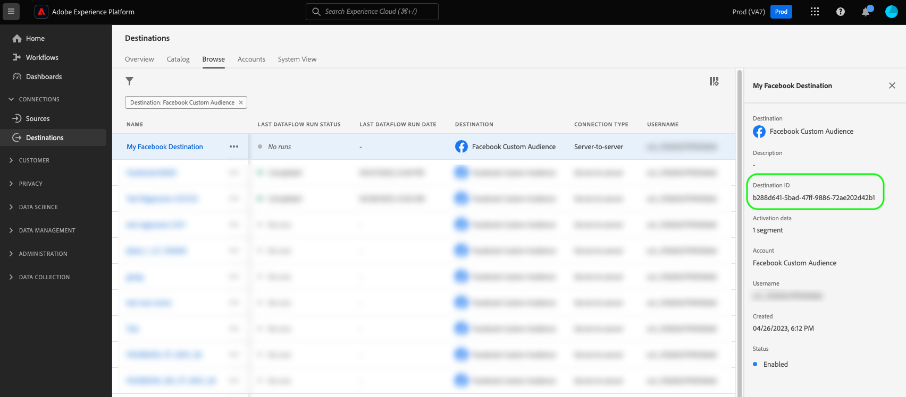

# テンプレート化された顧客フィールドの検証

## 概要 {#overview}

`/authoring/testing/template/render` エンドポイントは、宛先設定で定義された、テンプレート化された[顧客データフィールド](../../functionality/destination-configuration/customer-data-fields.md)の外観を視覚化するのに役立ちます。

このエンドポイントは、顧客データフィールド用にランダムな値を生成し、応答でそれらを返します。これは、顧客データフィールド（バケット名やフォルダーパスなど）のセマンティック構造を検証するのに役立ちます。

## はじめに {#getting-started}

続行する前に、必要な宛先オーサリング権限と必要なヘッダーを取得する方法など、APIを正常に呼び出すために知っておく必要がある重要な情報については、[入門ガイド &#x200B;](../../getting-started.md)を確認してください。

## 前提条件 {#prerequisites}

`/template/render` エンドポイントを使用する前に、以下の条件を満たしていることを確認してください。

* Destination SDK で作成した既存のファイルベースの宛先があり、[宛先カタログ](../../../ui/destinations-workspace.md)で確認できる。
* API リクエストを成功させるには、テストする宛先インスタンスに対応する宛先インスタンス ID が必要です。Experience Platform UIで宛先との接続を参照する際に、URLからAPI呼び出しで使用する宛先インスタンス IDを取得します。

  

## テンプレート化された顧客フィールドのレンダリング {#render-customer-fields}

**API 形式**

```http
POST /authoring/testing/template/render/destination
```

この API エンドポイントの動作を説明するために、以下の顧客データフィールド設定のファイルベースの宛先について見てみましょう。

```json
"fileBasedS3Destination":{
   "bucket":{
      "templatingStrategy":"PEBBLE_V1",
      "value":"{{customerData.bucket}}"
   },
   "path":{
      "templatingStrategy":"PEBBLE_V1",
      "value":"{{customerData.path}}"
   }
}
```

**リクエスト**

以下のリクエストは、`/authoring/testing/template/render` エンドポイントを呼び出し、前述の 2 つの顧客データフィールドに対してランダムに生成された値を含む応答を返します。

```shell
curl -X POST 'https://platform.adobe.io/data/core/activation/authoring/testing/template/render/destination' \
 -H 'Authorization: Bearer {ACCESS_TOKEN}' \
 -H 'Content-Type: application/json' \
 -H 'x-gw-ims-org-id: {IMS_ORG}' \
 -H 'x-api-key: {API_KEY}' \
 -H 'x-sandbox-name: {SANDBOX_NAME}' \
 -d '
 {
    "destinationId": "{DESTINATION_CONFIGURATION_ID}",
    "templates": {
        "bucket": "{{customerData.bucket}}",
        "path": "{{customerData.bucket}}/{{customerData.path}}"
    }
}'
```

| パラメーター | 説明 |
| -------- | ----------- |
| `destinationId` | テストしている[宛先設定](../../authoring-api/destination-configuration/retrieve-destination-configuration.md)の ID。 |
| `templates` | [宛先サーバー設定](../../authoring-api/destination-server/create-destination-server.md)で定義された、テンプレート化されたフィールド名。 |

{style="table-layout:auto"}

**応答**

応答が成功すると、`HTTP 200 OK` ステータスが返され、本文には、テンプレート化されたフィールドに対するランダムに生成された値が含まれます。

この応答は、顧客データフィールド（バケット名やフォルダーパスなど）の正しい構造を検証するのに役立ちます。


```json
{
    "results": {
        "bucket": "hfWpE-bucket",
        "path": "hfWpE-bucket/ceC"
    }
}
```

## API エラー処理 {#api-error-handling}

Destination SDK API エンドポイントは、一般的な Experience Platform API エラーメッセージの原則に従います。Experience Platform トラブルシューティングガイドの[API ステータスコード &#x200B;](../../../../landing/troubleshooting.md#api-status-codes)および[&#x200B; リクエストヘッダーエラー](../../../../landing/troubleshooting.md#request-header-errors)を参照してください。

## 次の手順 {#next-steps}

このドキュメントでは、[宛先サーバー](../../authoring-api/destination-server/create-destination-server.md)で定義された顧客データフィールド設定の検証方法を確認しました。
