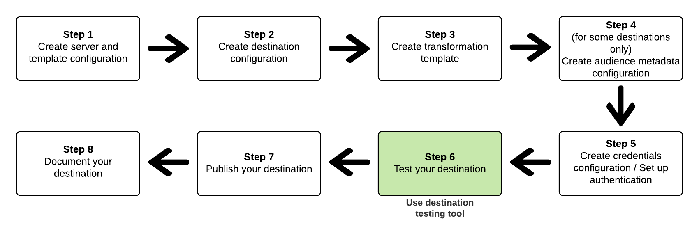

# ストリーミング宛先テスト API

Destination SDK の一部として、アドビは、宛先の設定およびテストを支援するためのデベロッパーツールを提供しています。このページでは、宛先設定のテスト方法を説明します。メッセージ変換テンプレートの作成方法について詳しくは、[メッセージ変換テンプレートの作成とテスト](../../testing-api/streaming-destinations/create-template.md)を参照してください。

**宛先が正しく設定されているかどうかをテストしたり、設定された宛先へのデータフローの整合性を検証したり**&#x200B;するには、*宛先テストツール*&#x200B;を使用します。このツールでは、REST API エンドポイントにメッセージを送信することで、宛先設定をテストできます。

以下の図に、宛先のテストが Destination SDK の[宛先設定ワークフロー](../../guides/configure-destination-instructions.md)にどのように適合するかを示します。



## 宛先テストツール - 目的と前提条件 {#destination-testing-tool}

宛先テストツールを使用して、[サーバー設定](../../authoring-api/destination-server/create-destination-server.md)で指定されたパートナーのエンドポイントにメッセージを送信することで、宛先サーバー設定をテストします。

ツールを使用する前に、以下を確認します。
* [宛先設定ワークフロー](../../authoring-api/destination-configuration/create-destination-configuration.md)で説明する手順に従うことで、宛先を設定する。
* [宛先インスタンス ID の取得方法](../../testing-api/streaming-destinations/destination-testing-api.md#get-destination-instance-id)で説明されているように、宛先への接続を確立する。

このツールを使用すると、宛先の設定後に、以下が可能です。
* 宛先が正しく設定されているかどうかをテストする。
* 設定された宛先へのデータフローの整合性を検証する。

### 使用方法 {#how-to-use}

>[!NOTE]
>
>完全な API リファレンスドキュメントについては、[宛先テスト API 操作](../../testing-api/streaming-destinations/destination-testing-api.md)を参照してください。

リクエスト時にプロファイルを追加してもしなくても、宛先テスト API エンドポイントへの呼び出しを行うことができます。

リクエスト時に任意のプロファイルを追加しない場合、アドビでは、ユーザーのためにこれらを内部で生成して、リクエストに追加します。プロファイルを生成してこのリクエストで使用したい場合は、[サンプルプロファイル生成 API リファレンス](../../testing-api/streaming-destinations/sample-profile-generation-api.md)を参照してください。[API リファレンス](../../testing-api/streaming-destinations/sample-profile-generation-api.md#generate-sample-profiles-source-schema)に示すように、ソース XDM スキーマに基づいてプロファイルを生成する必要があります。ソーススキーマは、使用している sandbox の[結合スキーマ](../../../../profile/ui/union-schema.md)であることに注意してください。

応答には、宛先リクエスト処理の結果が含まれます。リクエストには、3 つの主要セクションが含まれます。
* 宛先用にアドビによって生成されるリクエスト。
* 宛先から受け取った応答。
* リクエストで送信されるプロファイルのリスト（プロファイルは、[ユーザーによってリクエストに追加された](../../testing-api/streaming-destinations/destination-testing-api.md#test-with-added-profiles)ものか、[宛先テストリクエストの本文が空](../../testing-api/streaming-destinations/destination-testing-api.md#test-without-adding-profiles)の場合にアドビによって生成されたもの）。

>[!NOTE]
>
>アドビは、複数のリクエストと応答のペアを生成する可能性があります。例えば、`maxUsersPerRequest` 値が 7 の宛先に 10 個のプロファイルを送信する場合、7 個のプロファイルを含む 1 つのリクエストと 3 個のプロファイルを含む別のリクエストになります。

**本文にプロファイルパラメーターを含むリクエストのサンプル**

```shell
curl --location --request POST 'https://platform.adobe.io/data/core/activation/authoring/testing/destinationInstance/3e0ac39c-ef14-4101-9fd9-cf0909814510' \
--header 'Content-Type: application/json' \
--header 'Accept: application/json' \
--header 'x-api-key: {API_KEY}' \
--header 'Authorization: Bearer {ACCESS_TOKEN}' \
--header 'x-gw-ims-org-id: {ORG_ID}' \
--header 'x-sandbox-name: {SANDBOX_NAME}' \
--data-raw '{
   "profiles":[
      {
         "segmentMembership":{
            "ups":{
               "374a9a6c-c719-4cdb-a660-155a2838e6d6":{
                  "lastQualificationTime":"2021-05-13T12:16:27.248585Z",
                  "status":"realized"
               },
               "896f8776-9498-47b4-b994-51cb3f61c2c5":{
                  "lastQualificationTime":"2021-05-13T12:16:27.248605Z",
                  "status":"realized"
               }
            }
         },
         "identityMap":{
            "Email":[
               {
                  "id":"Email-iIyJc"
               }
            ],
            "IDFA":[
               {
                  "id":"IDFA-viPAW"
               }
            ],
            "GAID":[
               {
                  "id":"GAID-Bc6LE"
               }
            ],
            "Email_LC_SHA256":[
               {
                  "id":"Email_LC_SHA256-gEOdj"
               }
            ]
         },
         "attributes":{
            "key":{
               "value":"string"
            }
         }
      }
   ]
}'
```

**本文にプロファイルパラメーターを含まないリクエストのサンプル**


```shell
curl --location --request POST 'https://platform.adobe.io/data/core/activation/authoring/testing/destinationInstance/3e0ac39c-ef14-4101-9fd9-cf0909814510' \
--header 'Content-Type: application/json' \
--header 'Accept: application/json' \
--header 'x-api-key: {API_KEY}' \
--header 'Authorization: Bearer {ACCESS_TOKEN}' \
--header 'x-gw-ims-org-id: {ORG_ID}' \
--header 'x-sandbox-name: {SANDBOX_NAME}' \
--data-raw ''
```

**応答のサンプル**

`results.httpCalls` パラメーターのコンテンツは、お使いの REST API に特有であることに注意してください。

```json
{
   "results":[
      {
         "aggregationKey":{
            "destinationInstanceId":"string",
            "segmentId":"string",
            "segmentStatus":"realized",
            "identityNamespaces":[
               [
                  "email",
                  "phone"
               ]
            ]
         },
         "httpCalls":[
            {
               "traceId":"a06fec2d-a886-4219-8975-4e4b7ed26539",
               "request":{
                  "body":"{ \"attributes\": [  { \"external_id\": \"external_id-h29Fq\"  , \"AdobeExperiencePlatformSegments\": { \"add\": [  \"Nirvana fans\" ,  \"RHCP fans\"   ], \"remove\": [  ] }  ,  \"key\":  \"string\"    }  ] }",
                  "headers":[
                     {
                        "Content-Type":"application/json"
                     }
                  ],
                  "method":"POST",
                  "uri":"https://api.moviestar.com/users/track"
               },
               "response":{
                  "body":"{\"status\": \"success\"}",
                  "code":"200",
                  "headers":[
                     {
                        "Connection":"keep-alive"
                     },
                     {
                        "Content-Type":"application/json"
                     },
                     {
                        "Server":"nginx"
                     },
                     {
                        "Vary":"Origin,Accept-Encoding"
                     },
                     {
                        "transfer-encoding":"chunked"
                     }
                  ]
               }
            }
         ]
      }
   ],
   "inputProfiles":[
      {
         "segmentMembership":{
            "ups":{
               "03fb9938-8537-4b4c-87f9-9c4d413a0ee5":{
                  "lastQualificationTime":"2021-06-17T12:25:12.872039Z",
                  "status":"realized"
               },
               "27e05542-d6a3-46c7-9c8e-d59d50229530":{
                  "lastQualificationTime":"2021-06-17T12:25:12.872042Z",
                  "status":"realized"
               }
            }
         },
         "personalEmail":{
            "address":"john.smith@abc.com"
         },
         "identityMap":{
            "Email":[
               {
                  "id":"Email-iIyJc"
               }
            ],
            "IDFA":[
               {
                  "id":"IDFA-viPAW"
               }
            ],
            "GAID":[
               {
                  "id":"GAID-Bc6LE"
               }
            ],
            "Email_LC_SHA256":[
               {
                  "id":"Email_LC_SHA256-gEOdj"
               }
            ]
         },
         "person":{
            "name":{
               "firstName":"string"
            }
         }
      }
   ]
}
```

リクエストおよび応答パラメーターについて詳しくは、[宛先テスト API 操作](../../testing-api/streaming-destinations/destination-testing-api.md)を参照してください。

## 次の手順

宛先をテストして正しく設定されていることを確認したら、[宛先公開 API](../../publishing-api/create-publishing-request.md) を使用して設定をレビュー用にアドビに送信します。
