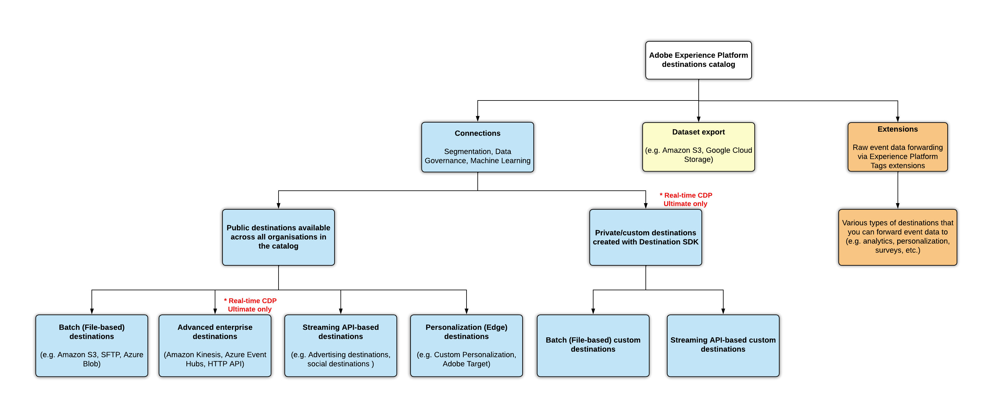
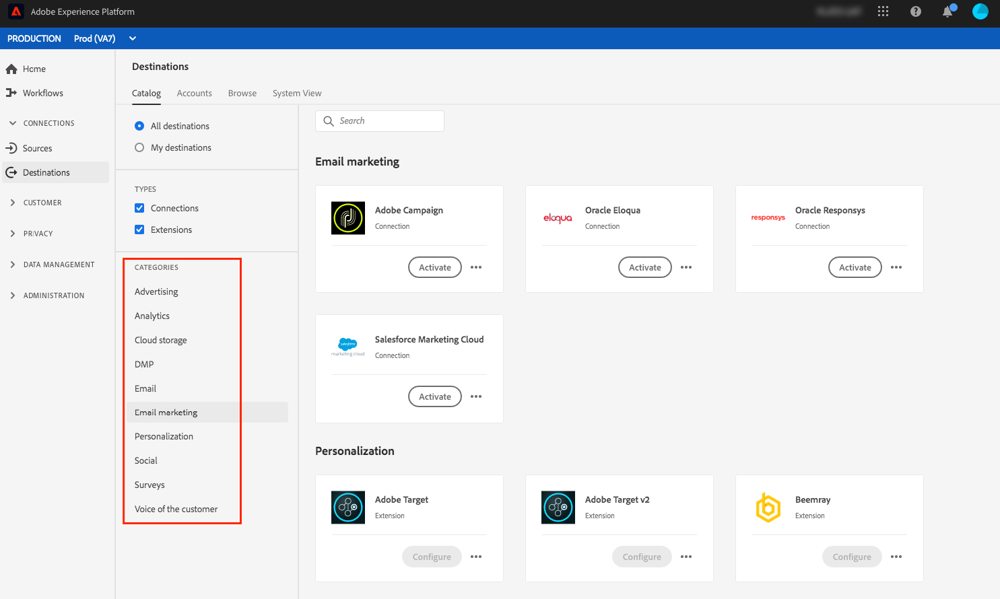

# 宛先のタイプとカテゴリ

このページでは、[!DNL Adobe Experience Platform]宛先の様々な種類とカテゴリについて説明します。

## 宛先のタイプ {#destination-types}

[!DNL Adobe Experience Platform]では、接続、データセット書き出し、拡張機能など、様々な宛先タイプを区別します。 接続先にはいくつかの種類があり、API ベースの宛先、ソーシャル宛先、CRM プラットフォームなどにデータを書き出すことができます。

最後に、宛先カタログ内のすべての組織で利用可能な公開宛先と、特定の書き出しユースケースを満たすために[!DNL Real-Time CDP]人のUltimateのお客様が作成できるプライベート宛先を区別することもできます。

>[!BEGINSHADEBOX]

{zoomable="yes"}

>[!ENDSHADEBOX]

## 接続 {#connections}

**[!UICONTROL Profile Export]**&#x200B;の&#x200B;**[!UICONTROL Streaming Audience Export]**、**[!DNL Edge Personalization]**&#x200B;および[!DNL Adobe Experience Platform]の宛先は、イベントデータを取得し、他のデータソースと組み合わせて[&#x200B; リアルタイム顧客プロファイル &#x200B;](../profile/home.md)を形成し、セグメンテーションを適用し、オーディエンスと適格プロファイルを宛先に書き出します。

## プロファイル書き出し宛先 {#profile-export}

プロファイル書き出し宛先は生データを受け取ります。その際、多くの場合、メールアドレスがプライマリキーとなります。Experience Platform では、現在、次の 2 種類のプロファイル書き出し宛先をサポートしています。

* [バッチ（ファイルベース）の宛先](#file-based)
* [高度なエンタープライズ宛先（ストリーミングプロファイル書き出し宛先）](#advanced-enterprise-destinations)

### 高度なエンタープライズ宛先（ストリーミングプロファイル書き出し宛先） {#advanced-enterprise-destinations}

>[!IMPORTANT]
>
>高度なエンタープライズ宛先またはストリーミングプロファイル書き出し宛先は、[Adobe Real-Time Customer Data Platform Ultimate](https://helpx.adobe.com/jp/legal/product-descriptions/real-time-customer-data-platform.html)のお客様のみが利用できます。

高度なエンタープライズ宛先データコネクタを使用して、Adobe [!DNL Real-Time Customer Data Platform] プロファイルをほぼリアルタイムで社内システムまたは他のサードパーティシステムに配信し、データの同期、分析、およびさらなるプロファイルエンリッチメントのユースケースを実現します。

これらの宛先は、Experience Platform データストリームとしてオーディエンスデータとプロファイルデータを受け取ります。

高度なエンタープライズ配信先は次のとおりです。

* [HTTP API 宛先](catalog/streaming/http-destination.md)
* [Amazon Kinesis](catalog/cloud-storage/amazon-kinesis.md)
* [Azure Event Hubs](catalog/cloud-storage/azure-event-hubs.md)
* [Snowflake ストリーミング](catalog/warehouses/snowflake.md)
* [Snowflake バッチ](catalog/warehouses/snowflake-batch.md)

>[!NOTE]
>
>Snowflakeの宛先は、現在、米国のお客様のみが利用できます。 米国以外でアクセスする必要がある場合は、Adobeのアカウントチームにお問い合わせください。

### バッチ（ファイルベース）宛先 {#file-based}

ファイルベース宛先は、プロファイルや属性を含んだ `.csv` ファイルを受け取ります。[Amazon S3](catalog/cloud-storage/amazon-s3.md) は、プロファイルの書き出しを含んだファイルを書き出せる宛先の例です。

## ストリーミングオーディエンスの書き出し先 {#streaming-destinations}

オーディエンス書き出し先は、Experience Platform オーディエンスデータを受け取ります。 これらの宛先では、オーディエンス IDまたはユーザーIDを使用します。 広告宛先やソーシャル宛先（[[!DNL Google Display & Video 360]](catalog/advertising/google-dv360.md)、[[!DNL Google Ads]](catalog/advertising/google-ads-destination.md)、[Facebook](catalog/social/facebook.md) など）は、このような宛先の例です。

## エッジパーソナライゼーション宛先 {#edge-personalization-destinations}

Experience Platform のエッジパーソナライゼーション宛先には、[Adobe Target](/help/destinations/catalog/personalization/adobe-target-connection.md) や[カスタムパーソナライゼーション宛先](/help/destinations/catalog/personalization/custom-personalization.md)が含まれます。これらの宛先を使用すると、同じページや次のページのパーソナライゼーションのユースケースを顧客に対して実現できます。

詳しくは、[同じページと次のページのパーソナライゼーション用にパーソナライゼーション宛先を設定](/help/destinations/ui/activate-edge-personalization-destinations.md)する方法を参照してください。

## プロファイル書き出しとオーディエンス書き出し先 – ビデオの概要 {#video}

次のビデオでは、次の 2 種類の宛先の詳細について説明します。

>[!VIDEO](https://video.tv.adobe.com/v/34116?captions=jpn&quality=12)

## 書き出されるオーディエンスの種類 {#exported-audiences-types}

Experience Platformから3種類のオーディエンスを様々な配信先に書き出すことができます。

* ピープルオーディエンス
* アカウントオーディエンス
* 見込み客オーディエンス

[様々なオーディエンスタイプ &#x200B;](/help/segmentation/types/account-audiences.md#terminology)について詳しく説明します。

宛先カードの記号は、各宛先に書き出すことができるオーディエンスの種類を示しています。

{zoomable="yes"}

## データセットの書き出し先 {#dataset-export-destinations}

宛先カタログ内の一部のクラウドストレージ宛先では、データセット書き出しをサポートしています。これらの宛先を使用すると、生のデータセットをクラウドストレージの場所に書き出すことができます。

詳しくは、[データセットを書き出す](/help/destinations/ui/export-datasets.md)方法を参照してください。

## 拡張機能 {#extensions}

Experience Platformでは、タグ管理の機能と柔軟性を活用して、UIでタグ拡張機能を設定できます。

>[!TIP]
>
>ユースケースやインターフェイスでタグ拡張機能を見つける方法など、タグ拡張機能について詳しくは、[タグ拡張機能の概要](./catalog/launch-extensions/overview.md)を参照してください。

タグ拡張機能では、生のイベントデータを複数の種類の宛先に転送します。この拡張機能は、**イベント転送**&#x200B;タイプの宛先であると考えることができます。これは、宛先プラットフォームと単純に統合された機能で、イベントの生データを転送するだけです。例としては、[Gainsight パーソナライズ機能拡張機能](./catalog/personalization/gainsight.md)や [Confirmit Voice of the Customer 拡張機能](./catalog/voice/confirmit-digital-feedback.md)などがあります。

## 接続と拡張機能を使用するタイミング {#when-to-use}

マーケターは、接続と拡張機能の組み合わせを使用して、お客様の使用例に対処できます。

つながりは、一元化された包括的な顧客プロファイルや、顧客オーディエンスを活用して活用する必要がある場合に役立ちます。 例えば、CRM データをアップロードして分析システムから行動データを結合し、パーソナライズされたメッセージを配信する前に特定のオーディエンスを対象としてユーザーを選定する場合は、接続を使用します。

拡張機能は、イベントデータをトリガーしたり、外部環境でセグメンテーションを実施したりする場合に役立ちます。 例えば、特定のユーザーについて、行動データをファイル上の他のデータソースと結合せずに、外部システムに転送する必要がある場合です。

## 宛先のカテゴリ {#categories}

[宛先カテゴリ](https://platform.adobe.com/destination/catalog)内の接続と拡張機能は、実現しようとしているマーケティングアクションに応じて、宛先カテゴリ（**広告**、**クラウドストレージ**、**調査プラットフォーム**、**メールマーケティング**&#x200B;など）別にグループ化されています。各カテゴリについて、および各カテゴリに含まれる宛先について詳しくは、[宛先カタログのドキュメント](./catalog/overview.md)を参照してください。

{zoomable="yes"}
