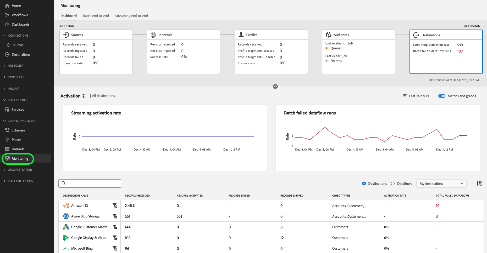

# [!DNL Destinations] の概要 {#overview}

**[!DNL Destinations]**&#x200B;は、[!DNL Adobe Experience Platform]からのデータのシームレスなアクティベーションを可能にする、宛先プラットフォームとの事前定義済みの統合です。 宛先を使用して、クロスチャネルマーケティングキャンペーン、メールキャンペーン、ターゲット広告、その他多くの使用事例に関する既知および不明なデータをアクティブ化できます。

## 宛先とソース {#destinations-and-sources}

Experience Platformの主な機能のひとつは、1st パーティデータを取り込み、ビジネスニーズに活用することです。 [sources](../sources/home.md)を使用してデータをExperience Platformに取り込み、宛先を使用してExperience Platformからデータを書き出します。

## 宛先の手順 {#steps}

* Experience Platformで利用可能なすべての宛先の[ セルフサービスカタログ ](./catalog/overview.md)から選択します。
* オーディエンスやデータセットを、MA （マーケティングオートメーション）プラットフォームやデジタル広告プラットフォームなどに送信できます。
* データを希望の宛先に定期的に書き出しするようにスケジュールします。

## コントロール {#controls}

[宛先ワークスペース ](./ui/destinations-workspace.md)のコントロールを使用して、以下を行います。

* データをアクティブ化できる宛先プラットフォームのカタログを参照する。
* カタログ内の宛先へのデータフローを作成、編集、アクティブ化、無効化する。
* ストレージの場所にアカウントを作成するか、Experience Platformを宛先プラットフォームのアカウントにリンクします。
* 宛先に対してアクティブ化するオーディエンスまたはデータセットを選択します。
* メールマーケティング宛先、CRM プラットフォーム、クラウドストレージの場所など、特定の宛先にオーディエンスをアクティブ化する際に書き出す[Experience Data Model （XDM）フィールド ](../xdm/home.md)を選択します。
* 様々なタイプのプロファイルとオーディエンスを、個人、アカウント、見込み客などの配信先で活用できます。

## 宛先のタイプとカテゴリ {#types-and-categories}

Experience Platform を使用すると、様々なタイプの宛先に対してデータをアクティブ化して、アクティブ化のユースケースを満たすことができます。宛先は、API ベースの統合、ファイル受信システムとの統合、プロファイル参照の宛先など、様々です。 利用可能なすべての宛先について詳しくは、[宛先タイプとカテゴリの概要](./destination-types.md)を参照してください。

## アドビが作成した宛先とパートナーが作成した宛先 {#adobe-and-partner-built-destinations}

Experience Platform 宛先カタログのコネクタには、アドビによって作成および管理されているものと、[Destination SDK](/help/destinations/destination-sdk/overview.md) を使用してパートナー企業によって作成および管理されているものがあります。宛先がパートナーによって作成および管理されている場合は、各パートナーが作成したコネクタに関するドキュメントページの上部にあるメモが呼び出されます。例えば、[Amazon S3 コネクタ](/help/destinations/catalog/cloud-storage/amazon-s3.md) はアドビが作成し、[TikTok コネクタ](/help/destinations/catalog/social/tiktok.md) は、TikTok チームが作成および管理しています。

パートナーが作成および管理するコネクタの場合、コネクタに関する問題をパートナーチームが解決する必要が生じる場合があります（ドキュメントページのメモに記載されている連絡先方法）。アドビが作成および管理するコネクタに関する問題については、アドビ担当者またはカスタマーケア担当者にお問い合わせください。

## 宛先とアクセス制御 {#access-controls}

Experience Platformの宛先機能は、[!DNL Adobe Experience Platform]個のアクセス制御権限で機能します。 ユーザーの権限レベルに応じて、宛先を表示、管理、アクティブ化できます。個々の権限について詳しくは、[Adobe Experience Platformでのアクセス制御](../access-control/home.md)に移動し、ページの下部にあるテーブルまでスクロールします。

次の表に、宛先に対して特定のアクションを実行するために必要な権限と権限の組み合わせの概要を示します。

| 権限レベル | 説明 |
| ---- | ---- |
| **[!UICONTROL View Destinations]** | Experience Platform UIの「宛先」タブにアクセスするには、**[!UICONTROL View Destinations]** [ アクセス制御権限](/help/access-control/home.md#permissions)が必要です。 |
| **[!UICONTROL View Destinations]**, **[!UICONTROL Manage Destinations]** | 宛先に接続するには、**[!UICONTROL View Destinations]**&#x200B;および&#x200B;**[!UICONTROL Manage Destinations]** [ アクセス制御権限](/help/access-control/home.md#permissions)が必要です。 |
| **[!UICONTROL View Destinations]**、**[!UICONTROL Activate Destinations]**、**[!UICONTROL View Profiles]**、および **[!UICONTROL View Segments]** | 宛先に対してオーディエンスをアクティブ化し、ワークフローの[ マッピング手順](ui/activate-batch-profile-destinations.md#mapping)を有効にするには、**[!UICONTROL View Destinations]**、**[!UICONTROL Activate Destinations]**、**[!UICONTROL View Profiles]**&#x200B;および&#x200B;**[!UICONTROL View Segments]**、[ アクセス制御権限](/help/access-control/home.md#permissions)が必要です。 |
| **[!UICONTROL View Destinations]**、**[!UICONTROL Activate Segments without Mapping]**、**[!UICONTROL View Profiles]**、および **[!UICONTROL View Segments]** | ワークフローの[ マッピング手順](ui/activate-batch-profile-destinations.md#mapping)にアクセスせずに既存のデータフローにオーディエンスを追加または削除するには、**[!UICONTROL View Destinations]**、**[!UICONTROL Activate Segments without Mapping]**、**[!UICONTROL View Profiles]**&#x200B;および&#x200B;**[!UICONTROL View Segments]**、[ アクセス制御権限](/help/access-control/home.md#permissions)が必要です。 |
| **[!UICONTROL View Destinations]**, **[!UICONTROL Manage and Activate Dataset Destinations]** | データセットを宛先にエクスポートするには、**[!UICONTROL View Destinations]**&#x200B;および&#x200B;**[!UICONTROL Manage and Activate Dataset Destinations]** [ アクセス制御権限](/help/access-control/home.md#permissions)が必要です。 |
| **[!UICONTROL View Identity Graph]** | *ID*&#x200B;を宛先にエクスポートするには、**[!UICONTROL View Identity Graph]** [ アクセス制御権限](/help/access-control/home.md#permissions)が必要です。  {width="100" zoomable="yes"} |

{style="table-layout:auto"}

次の図は、宛先で実行する操作に応じて、必要な権限を視覚的に示しています。

宛先に対して特定のアクションを実行するために必要な権限を示す

アクセス制御の詳細については、[アクセス制御ユーザーガイド](../access-control/ui/overview.md)を参照してください。

### 宛先の属性ベースのアクセス制御 {#attribute-based-access}

[!DNL Adobe Experience Platform]の属性ベースのアクセス制御により、管理者は属性に基づいて特定のオブジェクトや機能へのアクセスを制御できます。

属性ベースのアクセス制御を使用すると、権限を持つフィールドにマッピング設定を適用できます。さらに、データセット内のすべてのフィールドにアクセスできない場合は、宛先にデータを書き出すことはできません。

宛先が属性ベースのアクセス制御と連携する方法について詳しくは、[属性ベースのアクセス制御の概要](../access-control/abac/overview.md#destinations)を参照してください。

## 宛先からのプロファイルの削除 {#profile-removal}

宛先に対してアクティブ化されたオーディエンスからプロファイルが削除されると、そのプロファイルも宛先プラットフォームの対応するオーディエンスから削除されます。 例えば、以前にLinkedInにアクティベートされたオーディエンスからプロファイルが削除された場合、そのプロファイルは関連する[!UICONTROL LinkedIn Matched Audience]から削除されます。

プロファイルを宛先から削除する作業（セグメント化の解除とも呼ばれます）は、セグメント化と同じ頻度で行われます。 Experience Platformのオーディエンスからプロファイルが削除されるとすぐに、宛先への次にスケジュールされたデータフローにその変更が反映され、宛先オーディエンスからプロファイルが削除されます。

宛先プラットフォームでプロファイル削除が有効になる実際の速度は、宛先の取り込みと処理動作によって異なる場合があります。

## 宛先のモニタリング {#destinations-monitoring}

宛先への接続を確立し、アクティベーションワークフローを完了した後、受信システムへのデータの書き出しを監視できます。詳しくは、[UI での宛先へのデータフローのモニタリングに関するガイド](/help/dataflows/ui/monitor-destinations.md)を参照してください。

また、データが正常に宛先に送信されたかどうかを検証することもできます。 カタログ内のほとんどの宛先ドキュメントページには、*データ書き出しの検証セクション*&#x200B;があります。これは、Experience Platformからデータが正常に取り込まれていることを宛先プラットフォームで確認する方法を示します。 [Amazon Ads destination](/help/destinations/catalog/advertising/amazon-ads.md#exported-data)に関するこのセクションの例を表示します。

## 宛先へのデータのアクティブ化に関するデータガバナンスの制限 {#data-governance}

データガバナンスは、次の方法でExperience Platformの宛先に適用されます。

* 宛先の作成ワークフローで選択できる&#x200B;*マーケティングアクション*。
* 特定の使用ラベルを含むデータが、特定のマーケティングアクションを持つ宛先に対してアクティブ化されることを制限する&#x200B;*データ使用ポリシー*。

[ マーケティングアクション ](../data-governance/policies/overview.md)および[ データポリシー違反の解決](../data-governance/enforcement/auto-enforcement.md)について詳しくは、Experience Platformのデータガバナンスに関するドキュメントを参照してください。

宛先を作成ワークフローでマーケティングアクションを選択する方法について詳しくは、Experience Platformの様々な宛先タイプに関する次のページを参照してください。

* [広告の宛先 - Google アド マネージャー](./catalog/advertising/google-ad-manager.md)
* [広告の宛先 - Google 広告](./catalog/advertising/google-ads-destination.md)
* [広告の宛先 - Google ディスプレイ＆ビデオ 360](./catalog/advertising/google-dv360.md)
* [Advertising Account destinations - Bombora ABM Audience connection](./catalog/advertising/bombora.md)
* [Advertising アカウントの宛先 – Demandbase connection](./catalog/advertising/demandbase.md)
* [クラウドストレージの宛先](./catalog/cloud-storage/overview.md)
* [メールマーケティングの宛先](./catalog/email-marketing/overview.md)
* [ソーシャルの宛先](./catalog/social/overview.md)

オーディエンス アクティベーション ワークフローでのデータ ポリシー違反について詳しくは、次のガイドの&#x200B;**[!UICONTROL Review]** ステップを参照してください。

* [ストリーミングオーディエンス書き出し宛先に対するオーディエンスデータの有効化](./ui/activate-segment-streaming-destinations.md#review)
* [ストリーミングプロファイル書き出し宛先に対するオーディエンスデータの有効化](./ui/activate-streaming-profile-destinations.md#review)
* [プロファイル書き出しのバッチ宛先に対するオーディエンスデータの有効化](./ui/activate-batch-profile-destinations.md#review)

## 利用条件 {#terms-and-conditions}

ベータ版（「Beta」）としてラベル付けされた宛先のいずれかを使用することにより、お客様は、Betaが何らかの保証なしに&#x200B;***「現状のまま」提供されていることを了承するものとします***。

アドビは、ベータ版を維持、訂正、更新、変更、修正、またはその他の方法でサポートする義務を負いません。 お客様は、有益な情報を使用し、そのようなBetaおよび/または付随資料の正しい機能または性能に依存しないことをお勧めします。 ベータ版はアドビの機密情報と見なされます。

お客様がアドビに提供するあらゆる「フィードバック」（ベータ版の使用中に発生した問題や欠陥、提案、改善、レコメンデーションを含むがこれに限定されないベータ版に関する情報）は、このようなフィードバックに含まれる、およびフィードバックに対するすべての権利、所有権、利益を含め、アドビに帰属します。

公開フィードバックを送信するかサポートチケットを作成して、お客様の提案を共有したりバグを報告したりして、機能強化にご協力ください。