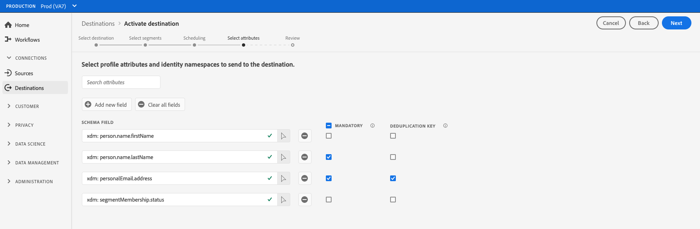

# プロファイルの一括書き出し先へのオーディエンスデータのアクティブ化

## 概要 {#overview}

この記事では、クラウドストレージや電子メールマーケティングの宛先など、Adobe Experience Platformの一括プロファイルベースの宛先でオーディエンスデータをアクティブ化するために必要なワークフローについて説明します。

## 前提条件 {#prerequisites}

宛先へのデータをアクティブ化するには、宛先](./connect-destination.md)に[接続している必要があります。 まだの場合は、[宛先カタログ](../catalog/overview.md)に移動し、サポートされている宛先を参照して、使用する宛先を設定します。

## 宛先の選択 {#select-destination}

1. **[!UICONTROL 接続/宛先]**&#x200B;に移動し、「**[!UICONTROL カタログ]**」タブを選択します。

   

1. 次の図に示すように、セグメントをアクティブ化する宛先に対応するカードで、「**[!UICONTROL セグメントをアクティブ化]**」を選択します。

   

1. セグメントのアクティブ化に使用する宛先接続を選択し、「**[!UICONTROL 次へ]**」を選択します。

   

1. 次のセクションに移動して[セグメントを選択します](#select-segments)。

## セグメントの選択 {#select-segments}

セグメント名の左側にあるチェックボックスを使用して、宛先に対してアクティブ化するセグメントを選択し、「**[!UICONTROL 次へ]**」を選択します。


## スケジュールセグメントの書き出し {#scheduling}

[!DNL Adobe Experience Platform] 電子メールマーケティングおよびクラウドストレージの宛先のデータをファイルの形式で書き [!DNL CSV] 出します。**[!UICONTROL スケジュール]**&#x200B;ページで、エクスポートする各セグメントのスケジュールとファイル名を設定できます。 スケジュールの設定は必須ですが、ファイル名の設定はオプションです。

>[!IMPORTANT]
> 
>[!DNL Adobe Experience Platform] は、エクスポートファイルを1ファイルあたり500万レコード（行）に自動的に分割します。各行は、1つのプロファイルを表します。
>
>分割ファイル名には、ファイルが大きなエクスポートの一部であることを示す数字が付加されます。例：`filename.csv`、`filename_2.csv`、`filename_3.csv`。

宛先に送信するセグメントに対応する「**[!UICONTROL スケジュール]**&#x200B;を作成」ボタンを選択します。


### 完全なファイルの書き出し {#export-full-files}

「**[!UICONTROL 完全なファイルをエクスポート]**」を選択して、選択したセグメントのすべてのプロファイル認定の完全なスナップショットを含むファイルのエクスポートをトリガーします。


1. **[!UICONTROL 頻度]**&#x200B;セレクターを使用して、書き出し頻度を選択します。

   * **[!UICONTROL 1回]**:1回のオンデマンドフルファイルエクスポートのスケジュールを設定します。
   * **[!UICONTROL 毎日]**:指定した時刻に、1日に1回、ファイル全体のエクスポートをスケジュールします。

1. **[!UICONTROL 時間]**&#x200B;セレクターを使用して、エクスポートを実行する時刻を[!DNL UTC]形式で選択します。

   >[!IMPORTANT]
   >
   >内部Experience Platform処理の設定方法により、最初の増分ファイル書き出しまたは完全ファイル書き出しにすべてのバックフィルデータが含まれていない場合があります。<br> <br> 完全ファイルと増分ファイルの両方に対して完全で最新のバックフィルデータの書き出しを確実におこなうために、Adobeでは、次の日の午後12時(GMT)以降の最初のファイル書き出し時間を設定することをお勧めします。この制限は、今後のリリースで対処される予定です。

1. **[!UICONTROL 日付]**&#x200B;セレクターを使用して、エクスポートを実行する日または間隔を選択します。
   >[!TIP]
   >
   > 日別のエクスポートの場合は、開始日と終了日を、ダウンストリームプラットフォームのキャンペーン期間に合わせて設定します。
1. 「**[!UICONTROL 作成]**」を選択してスケジュールを保存します。


### 増分ファイルの書き出し {#export-incremental-files}

「**[!UICONTROL 増分ファイルを書き出し]**」を選択して書き出しをトリガーします。最初のファイルは、選択したセグメントのすべてのプロファイル認定の完全なスナップショットで、以降のファイルは、前回の書き出し以降の増分プロファイル認定です。

>[!IMPORTANT]
>
>最初に書き出された増分ファイルには、セグメントの対象として認定されるすべてのプロファイルが含まれ、バックフィルとして機能します。


1. **[!UICONTROL 頻度]**&#x200B;セレクターを使用して、書き出し頻度を選択します。

   * **[!UICONTROL 毎日]**:増分ファイルエクスポートのスケジュールを、指定した時刻に毎日1回設定します。
   * **[!UICONTROL 1時間ごと]**:3、6、8、12時間ごとに差分ファイルエクスポートをスケジュールします。

1. **[!UICONTROL 時間]**&#x200B;セレクターを使用して、エクスポートを実行する時刻を[!DNL UTC]形式で選択します。

   >[!IMPORTANT]
   >
   >内部Experience Platform処理の設定方法により、最初の増分ファイル書き出しまたは完全ファイル書き出しにすべてのバックフィルデータが含まれていない場合があります。<br> <br> 完全ファイルと増分ファイルの両方に対して完全で最新のバックフィルデータの書き出しを確実におこなうために、Adobeでは、次の日の午後12時(GMT)以降の最初のファイル書き出し時間を設定することをお勧めします。この制限は、今後のリリースで対処される予定です。

1. **[!UICONTROL 日付]**&#x200B;セレクターを使用して、エクスポートを実行する日または間隔を選択します。
   >[!TIP]
   >
   >ダウンストリームプラットフォームでのキャンペーン期間に合わせて、開始日と終了日を設定します。
1. 「**[!UICONTROL 作成]**」を選択してスケジュールを保存します。

### ファイル名の設定 {#file-names}

デフォルトのファイル名は、宛先名、セグメントID、日時インジケーターで構成されます。 例えば、エクスポートしたファイル名を編集して、異なるキャンペーンを区別したり、データのエクスポート時間をファイルに追加したりできます。

鉛筆アイコンを選択してモーダルウィンドウを開き、ファイル名を編集します。 ファイル名は255文字までに制限されています。


ファイル名エディターで、別のコンポーネントを選択してファイル名に追加できます。


宛先名とセグメントIDは、ファイル名から削除できません。 これらに加えて、次を追加できます。

* **[!UICONTROL セグメント名]**:ファイル名にセグメント名を追加できます。
* **[!UICONTROL 日時]**:ファイルが生成され `MMDDYYYY_HHMMSS` た時刻の形式またはUnixの10桁のタイムスタンプを追加するかを選択します。各増分エクスポートで生成される動的ファイル名をファイルに含める場合は、これらのオプションの1つを選択します。
* **[!UICONTROL カスタムテキスト]**:ファイル名にカスタムテキストを追加します。

「**[!UICONTROL 変更を適用]**」を選択して、選択を確定します。

>[!IMPORTANT]
> 
>**[!UICONTROL 日時]**&#x200B;コンポーネントを選択しない場合、ファイル名は静的になり、新しく書き出されたファイルによって、保存場所にある以前のファイルが書き出しごとに上書きされます。 ストレージの場所から電子メールマーケティングプラットフォームに繰り返しインポートジョブを実行する場合は、このオプションをお勧めします。

すべてのセグメントの設定が完了したら、「**[!UICONTROL 次へ]**」を選択して続行します。

## プロファイル属性の選択 {#select-attributes}

プロファイルベースの宛先の場合、ターゲットの宛先に送信するプロファイル属性を選択する必要があります。


1. **[!UICONTROL 属性を選択]**&#x200B;ページで、「**[!UICONTROL 新しいフィールドを追加]**」を選択します。

   

1. 「**[!UICONTROL スキーマフィールド]**」エントリの右側にある矢印を選択します。

   

1. **[!UICONTROL フィールド]**&#x200B;を選択ページで、宛先に送信するXDM属性を選択し、「**[!UICONTROL 選択]**」を選択します。

   

1. マッピングをさらに追加するには、手順1 ～ 3を繰り返します。

>[!NOTE]
>
> Adobe Experience Platformは、スキーマの4つの推奨される、一般的に使用される属性を使用して、選択内容を事前入力します。`person.name.firstName`、`person.name.lastName`、`personalEmail.address`、`segmentMembership.status`。

ファイルのエクスポート方法は、`segmentMembership.status`が選択されているかどうかによって異なります。
* 「`segmentMembership.status`」フィールドを選択した場合、エクスポートされるファイルには、最初のフルスナップショットの「**[!UICONTROL アクティブ]**」メンバーと、後続の増分エクスポートの「**[!UICONTROL アクティブ]**」および「**[!UICONTROL 期限切れ]**」メンバーが含まれます。
* 「 `segmentMembership.status` 」フィールドが選択されていない場合、エクスポートされるファイルには、最初の完全なスナップショットとそれ以降の増分エクスポートで、**[!UICONTROL アクティブ]**&#x200B;メンバーのみが含まれます。



### 必須属性 {#mandatory-attributes}

>[!CONTEXTUALHELP]
>id="platform_destinations_activate_mandatorykey"
>title="必須属性について"
>abstract="書き出されたすべてのプロファイルに含める必要があるXDMスキーマ属性を選択します。 必須キーのないプロファイルは、宛先にエクスポートされません。 必須キーを選択しない場合、属性に関係なく、対象となるすべてのプロファイルがエクスポートされます。"
>additional-url="http://www.adobe.com/go/destinations-mandatory-attributes-en" text="詳しくは、ドキュメントを参照してください。"

必須属性は、選択した属性がすべてのプロファイルレコードに含まれるようにする、ユーザーが有効なチェックボックスです。 例：書き出されるすべてのプロファイルには、電子メールアドレスが含まれ&#x200B;ます。

[!DNL Platform]が特定の属性を含むプロファイルのみを書き出すように、属性を必須としてマークできます。 その結果、追加のフィルタリング形式として使用できます。 属性を必須としてマークする必要は&#x200B;**ありません**。

必須の属性を選択しない場合、属性に関係なく、すべての適合済みプロファイルがエクスポートされます。

属性の1つを、スキーマの[一意の識別子](../../destinations/catalog/email-marketing/overview.md#identity)にすることをお勧めします。 必須属性について詳しくは、[Eメールマーケティングの宛先](../../destinations/catalog/email-marketing/overview.md#identity)ドキュメントのIDに関する節を参照してください。

### 重複排除キー {#deduplication-keys}

>[!CONTEXTUALHELP]
>id="platform_destinations_activate_deduplicationkey"
>title="重複排除キーについて"
>abstract="重複排除キーを選択することで、エクスポートファイル内の同じプロファイルの複数のレコードを排除します。 1つの名前空間または最大2つのXDMスキーマ属性を重複排除キーとして選択します。 重複排除キーを選択しないと、エクスポートファイルでプロファイルエントリが重複する場合があります。"
>additional-url="http://www.adobe.com/go/destinations-deduplication-keys-en" text="詳しくは、ドキュメントを参照してください。"

重複排除キーは、ユーザー定義のプライマリキーで、ユーザーがプロファイルの重複を排除するIDを決定しま&#x200B;す。

重複排除キーを使用すると、同じプロファイルの複数のレコードが 1 つのエクスポートファイルに含まれる可能性がなくなります。

[!DNL Platform]で重複排除キーを使用する方法は3つあります。

* 単一のID名前空間を[!UICONTROL 重複排除キー]として使用
* [!DNL XDM]プロファイルの単一のプロファイル属性を[!UICONTROL 重複排除キー]として使用
* [!DNL XDM]プロファイルの2つのプロファイル属性の組み合わせを複合キーとして使用する

>[!IMPORTANT]
>
> 単一のID名前空間を宛先に書き出すことができ、名前空間は重複排除キーとして自動的に設定されます。 宛先への複数の名前空間の送信はサポートされていません。
> 
> ID名前空間とプロファイル属性の組み合わせを重複排除キーとして使用することはできません。

### 重複排除の例 {#deduplication-example}

次の例は、選択した重複排除キーに応じた重複排除の仕組みを示しています。

次の2つのプロファイルについて考えてみましょう。

**プロファイルA**

```json
{
  "identityMap": {
    "Email": [
      {
        "id": "johndoe_1@example.com"
      },
      {
        "id": "johndoe_2@example.com"
      }
    ]
  },
  "segmentMembership": {
    "ups": {
      "fa5c4622-6847-4199-8dd4-8b7c7c7ed1d6": {
        "status": "existing",
        "lastQualificationTime": "2021-03-10 10:03:08"
      }
    }
  },
  "person": {
    "name": {
      "lastName": "Doe",
      "firstName": "John"
    }
  },
  "personalEmail": {
    "address": "johndoe@example.com"
  }
}
```

**プロファイルB**

```json
{
  "identityMap": {
    "Email": [
      {
        "id": "johndoe_1@example.com"
      },
      {
        "id": "johndoe_2@example.com"
      }
    ]
  },
  "segmentMembership": {
    "ups": {
      "fa5c4622-6847-4199-8dd4-8b7c7c7ed1d6": {
        "status": "existing",
        "lastQualificationTime": "2021-04-10 11:33:28"
      }
    }
  },
  "person": {
    "name": {
      "lastName": "D",
      "firstName": "John"
    }
  },
  "personalEmail": {
    "address": "johndoe@example.com"
  }
}
```

### 重複排除の使用例1:重複排除なし {#deduplication-use-case-1}

重複排除を使用しない場合、エクスポートファイルには次のエントリが含まれます。

| personalEmail | firstName | lastName |
|---|---|---|
| johndoe@example.com | John | Doe |
| johndoe@example.com | John | D |


### 重複排除の使用例2:id名前空間に基づく重複排除 {#deduplication-use-case-2}

[!DNL Email]名前空間による重複排除を想定すると、書き出しファイルには次のエントリが含まれます。 プロファイルBはセグメントに適合する最新のものなので、書き出されるのはプロファイルBのみです。

| メール* | personalEmail | firstName | lastName |
|---|---|---|---|
| johndoe_1@example.com | johndoe@example.com | John | D |
| johndoe_2@example.com | johndoe@example.com | John | D |

### 重複排除の使用例3:単一のプロファイル属性に基づく重複排除 {#deduplication-use-case-3}

`personal Email`属性による重複排除を想定すると、書き出しファイルには次のエントリが含まれます。 プロファイルBはセグメントに適合する最新のものなので、書き出されるのはプロファイルBのみです。

| personalEmail* | firstName | lastName |
|---|---|---|
| johndoe@example.com | John | D |


### 重複排除の使用例4:2つのプロファイル属性に基づく重複排除 {#deduplication-use-case-4}

複合キー`personalEmail + lastName`による重複排除を想定すると、エクスポートファイルには次のエントリが含まれます。

| personalEmail* | lastName* | firstName |
|---|---|---|
| johndoe@example.com | D | John |
| johndoe@example.com | Doe | John |


Adobeでは、すべてのプロファイルレコードが一意に識別されるように、[!DNL CRM ID]やEメールアドレスなどのID名前空間を重複排除キーとして選択することをお勧めします。

>[!NOTE]
> 
>データセット内の特定のフィールドに（データセット全体ではなく）データ使用ラベルが適用されている場合、アクティブ化時にこれらのフィールドレベルのラベルが適用されます。
>
>* これらのフィールドは、セグメント定義で使用されます。
>* フィールドは、ターゲット先の予測属性として設定されます。

>
> 例えば、フィールド`person.name.firstName`に、宛先のマーケティングアクションと競合する特定のデータ使用ラベルが含まれている場合、レビュー手順でデータ使用ポリシー違反が表示されます。 詳しくは、「[Adobe Experience Platformのデータガバナンス](../../rtcdp/privacy/data-governance-overview.md#destinations)」を参照してください。

## レビュー {#review}

「**[!UICONTROL 確認]**」ページには、選択の概要が表示されます。「**[!UICONTROL キャンセル]**」を選択してフローを分割するか、「**[!UICONTROL 戻る]**」を選択して設定を変更する、または、「**[!UICONTROL 完了]**」を選択して確定し、宛先へのデータの送信を開始します。

>[!IMPORTANT]
>
>この手順では、Adobe Experience Platformはデータ使用ポリシーの違反を確認します。 次に、ポリシーに違反する例を示します。 違反を解決するまで、セグメントのアクティベーションワークフローを完了することはできません。 ポリシー違反の解決方法について詳しくは、データガバナンスのドキュメントの節の「[ポリシーの適用](../../rtcdp/privacy/data-governance-overview.md#enforcement)」を参照してください。


ポリシー違反が検出されなかった場合は、「**[!UICONTROL 完了]**」を選択して選択内容を確認し、宛先へのデータの送信を開始します。


## セグメントのアクティベーションの検証 {#verify}


電子メールマーケティングの宛先とクラウドストレージの宛先の場合、Adobe Experience Platformはストレージの指定した場所にタブ区切りの`.csv`ファイルを作成します。 新しいファイルはストレージの場所に毎日作成されます。デフォルトのファイル形式は次のとおりです。
`<destinationName>_segment<segmentID>_<timestamp-yyyymmddhhmmss>.csv`

3 日連続で受け取るファイルは次のようになります。

```console
Salesforce_Marketing_Cloud_segment12341e18-abcd-49c2-836d-123c88e76c39_20200408061804.csv
Salesforce_Marketing_Cloud_segment12341e18-abcd-49c2-836d-123c88e76c39_20200409052200.csv
Salesforce_Marketing_Cloud_segment12341e18-abcd-49c2-836d-123c88e76c39_20200410061130.csv
```

これらのファイルがストレージの場所に存在すれば、アクティベーションは成功しています。書き出されたファイルの構造を理解するには、サンプルの.csvファイル](../assets/common/sample_export_file_segment12341e18-abcd-49c2-836d-123c88e76c39_20200408061804.csv)を[ダウンロードします。 このサンプルファイルには、プロファイル属性`person.firstname`、`person.lastname`、`person.gender`、`person.birthyear`、`personalEmail.address`が含まれます。
