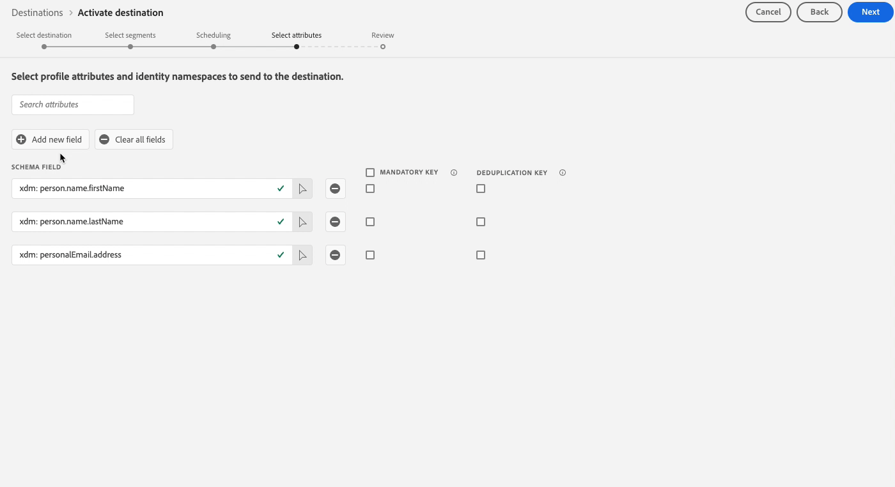

# バッチプロファイルの書き出し宛先に対してオーディエンスをアクティブ化する

>[!IMPORTANT]
> 
> * オーディエンスをアクティブ化して [マッピング手順](#mapping) ワークフローの「 **[!UICONTROL 宛先の管理]**, **[!UICONTROL 宛先のアクティブ化]**, **[!UICONTROL プロファイルの表示]**、および **[!UICONTROL セグメントを表示]** [アクセス制御権限](/help/access-control/home.md#permissions).
> * を経由せずにオーディエンスをアクティブ化するには [マッピング手順](#mapping) ワークフローの「 **[!UICONTROL 宛先の管理]**, **[!UICONTROL マッピングなしでセグメントをアクティブ化]**, **[!UICONTROL プロファイルの表示]**、および **[!UICONTROL セグメントを表示]** [アクセス制御権限](/help/access-control/home.md#permissions).
>* 書き出す *id*、 **[!UICONTROL ID グラフを表示]** [アクセス制御権限](/help/access-control/home.md#permissions). <br> {width="100" zoomable="yes"}
> 
> 詳しくは、[アクセス制御の概要](/help/access-control/ui/overview.md)または製品管理者に問い合わせて、必要な権限を取得してください。

## 概要 {#overview}

この記事では、クラウドストレージや電子メールマーケティングの宛先など、Adobe Experience Platformのバッチプロファイルベースの宛先でオーディエンスをアクティブ化するために必要なワークフローについて説明します。

## 前提条件 {#prerequisites}

オーディエンスを宛先に対してアクティブ化するには、次の条件を満たす必要があります。 [宛先に接続されている](./connect-destination.md). まだ接続していない場合は、[宛先カタログ](../catalog/overview.md)に移動し、サポートされている宛先を参照し、使用する宛先を設定します。

## 宛先の選択 {#select-destination}

1. **[!UICONTROL 接続／宛先]**&#x200B;に移動し、「**[!UICONTROL カタログ]**」タブを選択します。

   

1. 選択 **[!UICONTROL オーディエンスをアクティブ化]** オーディエンスをアクティブ化する宛先に対応するカード（下図を参照）。

   

1. オーディエンスのアクティブ化に使用する宛先接続を選択し、「 」を選択します。 **[!UICONTROL 次へ]**.

   

1. 次のセクションに移動： [オーディエンスを選択](#select-audiences).

## オーディエンスを選択 {#select-audiences}

宛先に対してアクティブ化するオーディエンスを選択するには、オーディエンス名の左側にあるチェックボックスを使用して、 **[!UICONTROL 次へ]**.

オリジンに応じて、複数のタイプのオーディエンスから選択できます。

* **[!UICONTROL セグメント化サービス]**：セグメント化サービスによってExperience Platform内で生成されたオーディエンス。 詳しくは、 [セグメント化ドキュメント](../../segmentation/ui/overview.md) を参照してください。
* **[!UICONTROL カスタムアップロード]**：オーディエンスがExperience Platform外で生成され、CSV ファイルとして Platform にアップロードされた。 外部オーディエンスについて詳しくは、 [オーディエンスのインポート](../../segmentation/ui/overview.md#import-audience).
* 他のタイプのオーディエンス ( 例：他のAdobeソリューションからのもの ) [!DNL Audience Manager].


>[!TIP]
>
>元のオーディエンスの選択 **[!UICONTROL カスタムアップロード]** を自動的に有効にする [エンリッチメント属性を選択](#select-enrichment-attributes) 手順

## オーディエンスの書き出しをスケジュール {#scheduling}

>[!CONTEXTUALHELP]
>id="platform_destinations_activate_schedule"
>title="スケジュール"
>abstract="鉛筆アイコンを使用して、ファイルの書き出しタイプ（完全なファイルまたは増分ファイル）と書き出し頻度を設定します。"

[!DNL Adobe Experience Platform] は、メールマーケティングおよびクラウドストレージの宛先のデータを [!DNL CSV] ファイルの形式で書き出します。Adobe Analytics の **[!UICONTROL スケジュール]** ページでは、書き出す各オーディエンスのスケジュールおよびファイル名を設定できます。 スケジュールの設定は必須ですが、ファイル名の設定はオプションです。

>[!IMPORTANT]
>
>[!DNL Adobe Experience Platform] は、書き出しファイルを1 ファイルあたり 500 万件のレコード（行）で自動的に分割します。各行は 1 つのプロファイルを表します。
>
>`filename.csv`、`filename_2.csv`、`filename_3.csv` のように、分割ファイル名には、ファイルが大きな書き出しの一部であることを示す数字が付加されます。

を選択します。 **[!UICONTROL スケジュールを作成]** ボタンをクリックします。


### 完全ファイルを書き出し {#export-full-files}

>[!CONTEXTUALHELP]
>id="platform_destinations_activate_exportoptions"
>title="ファイルの書き出しオプション"
>abstract="「**完全ファイルを書き出し**」を選択して、オーディエンスに該当するすべてのプロファイルの完全なスナップショットを書き出します。「**増分ファイルの書き出し**」を選択して、前回の書き出し以降にオーディエンスの対象として認定されたプロファイルのみを書き出します。<br> 最初の増分ファイルの書き出しには、オーディエンスに該当するすべてのプロファイルが含まれ、バックフィルとして機能します。それ以後の増分ファイルには、最初の増分ファイル書き出し以降にオーディエンスに該当したプロファイルのみが含まれます。"
>additional-url="https://experienceleague.adobe.com/docs/experience-platform/destinations/ui/activate/activate-batch-profile-destinations.html?lang=ja#export-incremental-files" text="増分ファイルの書き出し"

>[!CONTEXTUALHELP]
>id="platform_destinations_activationchaining_aftersegmentevaluation"
>title="オーディエンス評価後にアクティベート"
>abstract="アクティベーションは、毎日のセグメント化ジョブが完了した直後に実行されます。 これにより、最新のプロファイルが確実に書き出されます。"

>[!CONTEXTUALHELP]
>id="platform_destinations_activationchaining_scheduled"
>title="スケジュールされたアクティベーション"
>abstract="アクティベーションが特定の時刻に実行されます。"

選択 **[!UICONTROL 完全なファイルを書き出し]** ：選択したオーディエンスに対するすべてのプロファイル認定の完全なスナップショットを含むファイルの書き出しをトリガーします。


1. 「**[!UICONTROL 頻度]**」セレクターを使用して、書き出しの頻度を選択します。

   * **[!UICONTROL 1 回]**：オンデマンドによる 1 回限りの完全ファイルの書き出しをスケジュールします。
   * **[!UICONTROL 毎日]**：指定した時刻に、毎日 1 回、完全ファイルの書き出しをスケジュールします。

1. 以下を使用します。 **[!UICONTROL 時間]** オーディエンス評価の直後に書き出しを実行するか、スケジュールに沿って、指定した時間に書き出しを実行するかを選択します。 「**[!UICONTROL スケジュール済み]**」オプションを選択すると、セレクターを使用して書き出しを実行する時刻を [!DNL UTC] 形式で選択できます。

   >[!NOTE]
   >
   >The **[!UICONTROL セグメント評価後]** 以下に説明するオプションは、一部のベータ版のお客様のみが利用できます。

   「**[!UICONTROL セグメントの評価後]**」オプションを使用して、毎日の Platform バッチセグメント化ジョブが完了した直後にアクティベーションジョブをを実行します。このオプションを使用すると、アクティベーションジョブを実行する際に、最新のプロファイルが確実に宛先に書き出されます。

   <!-- Batch segmentation currently runs at {{insert time of day}} and lasts for an average {{x hours}}. Adobe reserves the right to modify this schedule. -->

   
「**[!UICONTROL スケジュール済み]**」オプションを使用して、特定の時間にアクティベーションジョブを実行します。 このオプションを使用すると、Experience Platformプロファイルデータが毎日同時に書き出されます。 ただし、アクティベーションジョブが開始される前にバッチセグメントジョブが完了しているかどうかによっては、書き出すプロファイルが最新でない場合があります。

   

1. 「**[!UICONTROL 日付]**」セレクターを使用して、書き出しを実行する日または間隔を選択します。日常の書き出しでのベストプラクティスは、開始日と終了日を、ダウンストリームプラットフォームのキャンペーンの期間に合わせて設定することです。

   >[!IMPORTANT]
   >
   > 書き出し間隔を選択する場合、その間隔の最終日は書き出しに含まれません。例えば、1 月 4 日から 11 日の間隔を選択した場合、最後のファイルエクスポートは 1 月 10 日におこなわれます。

1. 「**[!UICONTROL 作成]**」を選択して、スケジュールを保存します。

### 増分ファイルの書き出し {#export-incremental-files}

選択 **[!UICONTROL 増分ファイルの書き出し]** 最初のファイルが、選択したオーディエンスに対するすべてのプロファイル認定の完全なスナップショットであるエクスポートをトリガーし、それ以降のファイルは、前回のエクスポート以降の増分プロファイル認定です。

>[!IMPORTANT]
>
>最初に書き出された増分ファイルには、オーディエンスの資格を持つすべてのプロファイルが含まれ、バックフィルとして機能します。


1. **[!UICONTROL 頻度]**&#x200B;セレクターを使用して、エクスポートする頻度を選択します。

   * **[!UICONTROL 毎日]**：増分ファイルのエクスポートを、毎日 1 回指定した時刻にスケジュールします。
   * **[!UICONTROL 毎時]**：増分ファイルのエクスポートを、3 時間、6 時間、8 時間、または 12 時間ごとにスケジュールします。

1. **[!UICONTROL 時間]**&#x200B;セレクターを使用して、ファイルが書き出される時刻を [!DNL UTC] 形式で指定します。

1. **[!UICONTROL 日付]**&#x200B;セレクターを使用して、書き出しが行われる間隔を選択します。ベストプラクティスは、開始日と終了日を、ダウンストリームプラットフォームのキャンペーンの期間に合わせて設定することです。

   >[!IMPORTANT]
   >
   >間隔の最終日はエクスポートに含まれません。例えば、1 月 4 日から 11 日の間隔を選択した場合、最後のファイルエクスポートは 1 月 10 日におこなわれます。

1. 「**[!UICONTROL 作成]**」を選択して、スケジュールを保存します。

### ファイル名の設定 {#file-names}

>[!CONTEXTUALHELP]
>id="platform_destinations_activate_filename"
>title="ファイル名の設定"
>abstract="ファイルベースの宛先の場合、オーディエンスごとに一意のファイル名が生成されます。ファイル名エディターを使用して、一意のファイル名を作成および編集するか、デフォルトの名前のままにします。"

ほとんどの宛先では、デフォルトのファイル名は、宛先名、オーディエンス ID、日付と時刻のインジケーターで構成されます。 例えば、書き出したファイル名を編集して、異なるキャンペーンを区別したり、データの書き出し時間をファイルに追加したりできます。一部の宛先開発者は、別のデフォルトのファイル名追加オプションを宛先に表示するように選択する場合があります。

モーダルウィンドウを開いてファイル名を編集するには、鉛筆アイコンを選択します。 ファイル名は 255 文字までに制限されています。

>[!NOTE]
>
>次の画像は [!DNL Amazon S3] の宛先のファイル名を編集する方法を示していますが、プロセスはすべてのバッチ宛先 （SFTP、[!DNL Azure Blob Storage] または [!DNL Google Cloud Storage] など）で同じです。


ファイル名エディターで、別のコンポーネントを選択してファイル名に追加できます。


宛先名とオーディエンス ID は、ファイル名から削除できません。 これらのオプションに加えて、次のオプションを追加できます。

| ファイル名オプション | 説明 |
|---------|----------|
| **[!UICONTROL オーディエンス名]** | エクスポートされたオーディエンスの名前。 |
| **[!UICONTROL 日時]** | 追加する項目を選択 `MMDDYYYY_HHMMSS` 形式または UNIX の 10 桁のタイムスタンプ。 増分書き出しのたびにファイル名を動的に生成したい場合は、次のオプションのいずれかを選択します。 |
| **[!UICONTROL カスタムテキスト]** | ファイル名に追加する任意のカスタムテキスト。 |
| **[!UICONTROL 宛先 ID]** | オーディエンスのエクスポートに使用する宛先データフローの ID。 |
| **[!UICONTROL 宛先名]** | オーディエンスのエクスポートに使用する宛先データフローの名前。 |
| **[!UICONTROL 組織名]** | Experience Platform 内の組織名。 |
| **[!UICONTROL サンドボックス名]** | オーディエンスの書き出しに使用するサンドボックスの ID。 |

{style="table-layout:auto"}

**[!UICONTROL 変更を適用]**&#x200B;を選択して、確定します。

>[!IMPORTANT]
> 
>**[!UICONTROL 日時]**&#x200B;コンポーネントを選択しない場合、ファイル名は固定され、新しくエクスポートされたファイルは、エクスポートのたびに保存場所にある以前のファイルを上書きします。ストレージの場所からメールマーケティングプラットフォームへのインポートジョブを繰り返し実行する場合は、このオプションをお勧めします。

すべてのオーディエンスの設定が完了したら、 **[!UICONTROL 次へ]** をクリックして続行します。

## マッピング {#mapping}

この手順では、ターゲットの宛先に書き出すファイルに追加する、プロファイル属性を選択する必要があります。 書き出すプロファイル属性と ID を選択するには：

1. **[!UICONTROL マッピング]**&#x200B;ページで「**[!UICONTROL 新しいフィールドを追加]**」を選択します。

   

1. **[!UICONTROL ソースフィールド]**&#x200B;エントリの右側の矢印を選択します。

   

1. **[!UICONTROL ソースフィールドを選択]**&#x200B;ページで、宛先へ書き出したファイルに含めるプロファイル属性と ID を選択してから、「**[!UICONTROL 選択]**」を選択します。

   >[!TIP]
   > 
   >次の画像に示すように、検索フィールドを使用して、選択を絞り込むことができます。

   


1. 書き出し用に選択したフィールドがマッピングビューに表示されます。 必要に応じて、書き出したファイルのヘッダーの名前を編集できます。 それには、ターゲットフィールドでアイコンを選択します。

   

1. **[!UICONTROL ターゲットフィールドを選択]**&#x200B;ページで、書き出したファイルでヘッダーに目的の名前を入力し、「**[!UICONTROL 選択]**」をクリックします。

   

1. 書き出し用に選択したフィールドがマッピングビューに表示され、編集したヘッダーが書き出したファイルに表示されます。

   

1. （オプション）書き出されたフィールドを[必須キー](#mandatory-keys)または [重複排除キー](#deduplication-keys)のどちらにするかを選択できます。

   

1. 書き出すフィールドをさらに追加するには、上記の手順を繰り返します。

### 必須の属性 {#mandatory-attributes}

>[!CONTEXTUALHELP]
>id="platform_destinations_activate_mandatorykey"
>title="必須の属性について"
>abstract="書き出されたすべてのプロファイルに含める XDM スキーマ属性を選択します。必須キーのないプロファイルは、宛先に書き出されません。必須キーを選択しない場合、属性に関係なく、すべての該当プロファイルを書き出します。"

必須属性は、選択した属性がすべてのプロファイルレコードに含まれるようにする、ユーザーが有効にしたチェックボックスです。例：書き出されるすべてのプロファイルには、メールアドレスが含まれます。

[!DNL Platform] が特定の属性を含むプロファイルのみを書き出すよう、属性を必須としてマークすることができます。その結果、追加のフィルタリング形式として使用できます。属性を必須としてマークする必要は&#x200B;**ありません**。

必須属性を選択しない場合、属性に関係なく、すべての対象プロファイルを書き出します。

属性の 1 つをスキーマの[一意の ID](../../destinations/catalog/email-marketing/overview.md#identity) にすることをお勧めします。必須属性について詳しくは、[メールマーケティングの宛先](../../destinations/catalog/email-marketing/overview.md#identity)ドキュメントの ID の節を参照してください。

### 重複排除キー {#deduplication-keys}

>[!CONTEXTUALHELP]
>id="platform_destinations_activate_deduplicationkey"
>title="重複排除キーについて"
>abstract="重複排除キーを選択することで、書き出しファイル内にある、同一プロファイルの複数のレコードを排除します。重複排除キーとして、1 つの名前空間または最大 2 つの XDM スキーマ属性を選択できます。重複排除キーを選択しないと、書き出しファイルでプロファイルエントリの重複が発生する場合があります。"

重複排除キーは、ユーザーがプロファイルの重複排除する ID を決定する、ユーザー定義のプライマリキーです。

重複排除キーを使用すると、同一プロファイルの複数のレコードが 1 つの書き出しファイルに含まれる可能性がなくなります。

[!DNL Platform] で重複排除キーを使用する方法は 3 つあります。

* [!UICONTROL 重複排除キー]として、単一の ID 名前空間を使用する
* [!UICONTROL 重複排除キー]として、[!DNL XDM] プロファイルから単一のプロファイル属性を使用する
* 複合キーとして、[!DNL XDM] プロファイルから 2 つのプロファイル属性の組み合わせを使用する

>[!IMPORTANT]
>
> 単一の ID 名前空間を宛先に書き出すことができ、名前空間は自動的に重複排除キーとして設定されます。複数の名前空間を宛先に送信することはサポートされていません。
> 
> ID 名前空間とプロファイル属性の組み合わせを重複排除キーとして使用することはできません。

### 重複排除の例 {#deduplication-example}

次の例は、選択した重複排除キーに応じた重複排除の仕組みを示しています。

次の 2 つのプロファイルについて考えてみましょう。

**プロファイル A**

```json
{
  "identityMap": {
    "Email": [
      {
        "id": "johndoe_1@example.com"
      },
      {
        "id": "johndoe_2@example.com"
      }
    ]
  },
  "segmentMembership": {
    "ups": {
      "fa5c4622-6847-4199-8dd4-8b7c7c7ed1d6": {
        "status": "realized",
        "lastQualificationTime": "2021-03-10 10:03:08"
      }
    }
  },
  "person": {
    "name": {
      "lastName": "Doe",
      "firstName": "John"
    }
  },
  "personalEmail": {
    "address": "johndoe@example.com"
  }
}
```

**プロファイル B**

```json
{
  "identityMap": {
    "Email": [
      {
        "id": "johndoe_1@example.com"
      },
      {
        "id": "johndoe_2@example.com"
      }
    ]
  },
  "segmentMembership": {
    "ups": {
      "fa5c4622-6847-4199-8dd4-8b7c7c7ed1d6": {
        "status": "realized",
        "lastQualificationTime": "2021-04-10 11:33:28"
      }
    }
  },
  "person": {
    "name": {
      "lastName": "D",
      "firstName": "John"
    }
  },
  "personalEmail": {
    "address": "johndoe@example.com"
  }
}
```

### 重複排除の使用例 1：重複排除なし {#deduplication-use-case-1}

重複排除を使用しない場合、書き出しファイルには次のエントリが含まれます。

| personalEmail | firstName | lastName |
|---|---|---|
| johndoe@example.com | John | Doe |
| johndoe@example.com | John | D |


### 重複排除の使用例 2：ID 名前空間に基づく重複排除 {#deduplication-use-case-2}

[!DNL Email] 名前空間の重複排除を指定した場合、書き出しファイルには次のエントリが含まれます。プロファイル B はオーディエンスの資格を持つ最新のものなので、書き出されるのは 1 つだけです。

| メール* | personalEmail | firstName | lastName |
|---|---|---|---|
| johndoe_1@example.com | johndoe@example.com | John | D |
| johndoe_2@example.com | johndoe@example.com | John | D |

### 重複排除のユースケース 3：単一のプロファイル属性に基づく重複排除 {#deduplication-use-case-3}

`personal Email` 属性による重複排除を仮定した場合、エクスポートファイルには次のエントリが含まれます。プロファイル B はオーディエンスの資格を持つ最新のものなので、書き出されるのは 1 つだけです。

| personalEmail* | firstName | lastName |
|---|---|---|
| johndoe@example.com | John | D |


### 重複排除のユースケース 4：2 つのプロファイル属性に基づく重複排除 {#deduplication-use-case-4}

複合キー `personalEmail + lastName` による重複排除を仮定した場合、エクスポートファイルには次のエントリが含まれます。

| personalEmail* | lastName* | firstName |
|---|---|---|
| johndoe@example.com | D | John |
| johndoe@example.com | Doe | John |

[!DNL CRM ID] やメールアドレスなどの ID 名前空間を重複排除キーとして選択して、すべてのプロファイルレコードが必ず一意に識別されるようにすることをお勧めします。

>[!NOTE]
> 
>（データセット全体ではなく）データセット内の特定のフィールドのみに適用されたデータ使用ラベルがある場合、アクティベーション時のこれらのフィールドレベルラベルの適用は、次の条件で行われます。
>
>* これらのフィールドは、オーディエンス定義で使用されます。
>* フィールドは、ターゲット先の予測属性として設定されます。
>
> 例えば、フィールド `person.name.firstName` に宛先のマーケティングアクションと競合する特定のデータ使用ラベルがある場合、レビュー手順でデータ使用ポリシー違反が表示されます。詳しくは、[Adobe Experience Platform でのデータガバナンス](../../rtcdp/privacy/data-governance-overview.md#destinations)を参照してください。

### 既知の制限事項 {#known-limitations}

新しい&#x200B;**[!UICONTROL マッピング]**&#x200B;ページには次の既知の制限事項があります。

#### マッピングワークフローでは、オーディエンスのメンバーシップ属性を選択できません

既知の制限により、現在、**[!UICONTROL フィールドを選択]**&#x200B;ウィンドウを使用して、`segmentMembership.status` をファイル書き出しに追加できません。 代わりに、手動で値 `xdm: segmentMembership.status` をスキーマフィールドに貼り付ける必要があります（下図を参照）。


ファイルのエクスポートは、`segmentMembership.status` が選択されているかどうかによって、次のように異なります。
* `segmentMembership.status` フィールドを選択した場合、エクスポートされたファイルには、最初の完全スナップショットでは&#x200B;**[!UICONTROL アクティブ]**&#x200B;メンバーが含まれ、その後の増分エクスポートでは&#x200B;**[!UICONTROL アクティブ]**&#x200B;および&#x200B;**[!UICONTROL 期限切れ]**&#x200B;のメンバーが含まれます。
* `segmentMembership.status` フィールドを選択しない場合、エクスポートされたファイルには、最初の完全スナップショットとその後の増分エクスポートで、**[!UICONTROL アクティブ]**&#x200B;メンバーのみが含まれます。

#### ID 名前空間は現在、書き出し用に選択できません

以下の画像に示すように、ID 名前空間を書き出し用に選択する機能は、現在サポートされていません。 書き出し用の ID 名前空間を選択すると、**[!UICONTROL レビュー]**&#x200B;手順でエラーが発生します。


ベータ版の間に書き出したファイルに ID 名前空間を追加する必要がある場合の一時的な回避策として、次のいずれかを実行できます。
* 書き出しに ID 名前空間を含めるデータフローに、従来のクラウドストレージの宛先を使用する
* ID を属性として Experience Platform にアップロードし、クラウドストレージの宛先に書き出します。

## プロファイル属性の選択 {#select-attributes}

>[!IMPORTANT]
> 
>カタログ内のすべてのクラウドストレージの宛先で、 [[!UICONTROL マッピング] step](#mapping) これは、 **[!UICONTROL 属性を選択]** この節で説明する手順です。
>
>この **[!UICONTROL 属性を選択]** Adobe Campaign、OracleResponsys、OracleEloqua、SalesforceMarketing Cloud電子メールマーケティングの各宛先に対して、手順が引き続き表示されます。

プロファイルベースの宛先の場合、ターゲット宛先に送信するプロファイル属性を選択する必要があります。

1. **[!UICONTROL 属性を選択]**&#x200B;ページで「**[!UICONTROL 新しいフィールドを追加]**」を選択します。

   

2. 「**[!UICONTROL スキーマフィールド]**」エントリの右側の矢印を選択します。

   

3. Adobe Analytics の **[!UICONTROL フィールドを選択]** ページで、宛先に送信する XDM 属性または ID 名前空間を選択してから、「 」を選択します **[!UICONTROL 選択]**.

   

4. さらにマッピングを追加するには、手順 1～3 を繰り返します。

>[!NOTE]
>
> Adobe Experience Platform は、スキーマから推奨される一般的に使用される属性 4 つ（`person.name.firstName`、`person.name.lastName`、`personalEmail.address`、`segmentMembership.status`）を事前に選択します。


>[!IMPORTANT]
>
>既知の制限により、現在、**[!UICONTROL フィールドを選択]**&#x200B;ウィンドウを使用して、`segmentMembership.status` をファイル書き出しに追加できません。 代わりに、手動で値を貼り付ける必要があります `xdm: segmentMembership.status` をスキーマフィールドに追加します（下図を参照）。
>
>

ファイルの書き出しは、次の方法で、 `segmentMembership.status` が選択されている場合：
* `segmentMembership.status` フィールドを選択した場合、エクスポートされたファイルには、最初の完全スナップショットでは&#x200B;**[!UICONTROL アクティブ]**&#x200B;メンバーが含まれ、その後の増分エクスポートでは&#x200B;**[!UICONTROL アクティブ]**&#x200B;および&#x200B;**[!UICONTROL 期限切れ]**&#x200B;のメンバーが含まれます。
* `segmentMembership.status` フィールドを選択しない場合、エクスポートされたファイルには、最初の完全スナップショットとその後の増分エクスポートで、**[!UICONTROL アクティブ]**&#x200B;メンバーのみが含まれます。

## エンリッチメント属性を選択 {#select-enrichment-attributes}

>[!CONTEXTUALHELP]
>id="platform_destinations_activate_exclude_enrichment_attributes"
>title="エンリッチメント属性の除外"
>abstract="このオプションを有効にすると、選択したカスタムアップロードオーディエンスのプロファイルを宛先に書き出すことはできますが、その属性はすべて除外されます。"
>additional-url="https://experienceleague.adobe.com/docs/experience-platform/destinations/ui/activate/activate-batch-profile-destinations.html?lang=ja#select-enrichment-attributes" text="詳しくは、ドキュメントを参照してください"

>[!IMPORTANT]
>
>このステップは、 **[!UICONTROL カスタムアップロード]** オーディエンス [オーディエンス選択](#select-audiences) 手順

エンリッチメント属性は、Experience Platformで **[!UICONTROL カスタムアップロード]**. この手順では、選択した外部オーディエンスごとに、宛先に書き出す属性を選択できます。


次の手順に従って、各外部オーディエンスのエンリッチメント属性を選択します。

1. Adobe Analytics の **[!UICONTROL エンリッチメント属性]** 列で、  （編集）ボタン。
2. 選択 **[!UICONTROL エンリッチメント属性を追加]**. 新しい空のスキーマフィールドが表示されます。
   
3. 空のフィールドの右側にあるボタンを選択して、フィールド選択画面を開きます。
4. オーディエンスのエクスポート対象の属性を選択します。
   
5. 書き出すすべての属性を追加したら、「 」を選択します。 **[!UICONTROL 保存して閉じる]**.
6. 各外部オーディエンスに対して、これらの手順を繰り返します。

属性をエクスポートせずに、宛先に対する外部オーディエンスをアクティブ化する場合は、 **[!UICONTROL エンリッチメント属性の除外]** 切り替え このオプションを選択すると、外部オーディエンスからプロファイルがエクスポートされますが、対応する属性はどれも宛先に送信されません。


選択 **[!UICONTROL 次へ]** 移動先 [レビュー](#review) 手順

## レビュー {#review}

「**[!UICONTROL レビュー]**」ページには、選択内容の概要が表示されます。「**[!UICONTROL キャンセル]**」を選択してフローを分割するか、「**[!UICONTROL 戻る]**」を選択して設定を変更する、または、「**[!UICONTROL 完了]**」を選択して確定し、宛先へのデータの送信を開始します。


### 同意ポリシーの評価 {#consent-policy-evaluation}

>[!CONTEXTUALHELP]
>id="platform_governance_policies_viewApplicableConsentPolicies"
>title="適用可能な同意ポリシーを表示"
>abstract="組織で **Adobe Healthcare Shield** または **Adobe Privacy &amp; Security Shield** を購入した場合、**[!UICONTROL 適用可能な同意ポリシーを表示]**&#x200B;を選択すると、どの同意ポリシーが適用され、その結果、いくつのプロファイルがアクティベーションに含まれるかを確認することができます。会社が前述の SKU へのアクセス権を持っていない場合は、このコントロールを無効になります。"

組織で **Adobe Healthcare Shield** または **Adobe Privacy &amp; Security Shield** を購入した場合、**[!UICONTROL 適用可能な同意ポリシーを表示]**&#x200B;を選択すると、どの同意ポリシーが適用され、その結果、いくつのプロファイルがアクティベーションに含まれるかを確認することができます。お読みください [同意ポリシーの評価](/help/data-governance/enforcement/auto-enforcement.md#consent-policy-evaluation) を参照してください。

### データ使用ポリシーのチェック {#data-usage-policy-checks}

Adobe Analytics の **[!UICONTROL レビュー]** 手順の後、Experience Platformは、データ使用ポリシーの違反を確認します。 ポリシーに違反した場合の例を次に示します。違反を解決するまで、オーディエンスのアクティベーションワークフローを完了することはできません。 ポリシー違反の解決方法については、 [データ使用ポリシーの違反](/help/data-governance/enforcement/auto-enforcement.md#data-usage-violation) （データガバナンスに関するドキュメントの節）を参照してください。


### オーディエンスのフィルタリング {#filter-audiences}

また、この手順では、ページで使用可能なフィルターを使用して、このワークフローの一部としてスケジュールまたはマッピングが更新されたオーディエンスのみを表示できます。 また、表示するテーブル列を切り替えることもできます。


選択が完了し、ポリシー違反が検出されなかった場合は、「 」を選択します。 **[!UICONTROL 完了]** をクリックして選択を確定し、宛先へのデータの送信を開始します。

## オーディエンスのアクティベーションを検証 {#verify}

メールマーケティングの宛先とクラウドストレージの宛先の場合、Adobe Experience Platform は、指定されたストレージの場所に `.csv` ファイルを作成します。ワークフローで設定したスケジュールに従って、ストレージの場所に新しいファイルが作成されます。デフォルトのファイル形式を以下に示しますが、次の操作を実行できます。 [ファイル名のコンポーネントを編集する](#file-names):
`<destinationName>_segment<segmentID>_<timestamp-yyyymmddhhmmss>.csv`

例えば、書き出し頻度を毎日に選択した場合、連続した 3 日間に受け取るファイルは次のようになります。

```console
Salesforce_Marketing_Cloud_segment12341e18-abcd-49c2-836d-123c88e76c39_20200408061804.csv
Salesforce_Marketing_Cloud_segment12341e18-abcd-49c2-836d-123c88e76c39_20200409052200.csv
Salesforce_Marketing_Cloud_segment12341e18-abcd-49c2-836d-123c88e76c39_20200410061130.csv
```

これらのファイルがストレージの場所に存在すれば、アクティベーションは成功しています。エクスポートされるファイルの構造を理解するには、[サンプルの .csv ファイルをダウンロード](../assets/common/sample_export_file_segment12341e18-abcd-49c2-836d-123c88e76c39_20200408061804.csv)することができます。このサンプルファイルには、プロファイル属性 `person.firstname`、`person.lastname`、`person.gender`、`person.birthyear` および `personalEmail.address` が含まれています。
