# バッチプロファイルの書き出し宛先に対してオーディエンスをアクティブ化する

>[!IMPORTANT]
>
>* オーディエンスをアクティブ化し、ワークフローの[&#x200B; マッピング手順](#mapping)を有効にするには、**[!UICONTROL View Destinations]**、**[!UICONTROL Activate Destinations]**、**[!UICONTROL View Profiles]**&#x200B;および&#x200B;**[!UICONTROL View Segments]** [&#x200B; アクセス制御権限](/help/access-control/home.md#permissions)が必要です。
>* ワークフローの[&#x200B; マッピング手順](#mapping)を経ずにオーディエンスをアクティブ化するには、**[!UICONTROL View Destinations]**、**[!UICONTROL Activate Segment without Mapping]**、**[!UICONTROL View Profiles]**&#x200B;および&#x200B;**[!UICONTROL View Segments]**、[&#x200B; アクセス制御権限](/help/access-control/home.md#permissions)が必要です。
>* *ID*&#x200B;をエクスポートするには、**[!UICONTROL View Identity Graph]** [&#x200B; アクセス制御権限](/help/access-control/home.md#permissions)が必要です。<br> {width="100" zoomable="yes"}
>
> [アクセス制御の概要](/help/access-control/ui/overview.md)を参照するか、製品管理者に問い合わせて必要な権限を取得してください。

## 概要 {#overview}

この記事では、クラウドストレージやメールマーケティングの宛先など、バッチプロファイルファイルベースの宛先に[!DNL Adobe Experience Platform]でオーディエンスをアクティブ化するために必要なワークフローについて説明します。

## 前提条件 {#prerequisites}

宛先に対してオーディエンスをアクティブ化するには、宛先[&#128279;](./connect-destination.md)に正常に接続している必要があります。 まだ接続していない場合は、[宛先カタログ](../catalog/overview.md)に移動し、サポートされている宛先を参照し、使用する宛先を設定します。

## 書き出しでサポートされているファイル形式 {#supported-file-formats-export}

オーディエンスの書き出し時には、次のファイル形式がサポートされます。

* CSV
* JSON
* PARQUET

CSV ファイルを書き出すと、書き出したファイルの構造化に関する柔軟性が向上することに注意してください。 CSV ファイルの[&#x200B; ファイル形式の設定](/help/destinations/ui/batch-destinations-file-formatting-options.md#file-configuration)の詳細をご覧ください。

ファイルベースの宛先[&#128279;](/help/destinations/ui/connect-destination.md)への接続を作成する際に、書き出すファイル形式を選択します。

## 宛先の選択 {#select-destination}

1. **[!UICONTROL Connections > Destinations]**&#x200B;に移動し、「**[!UICONTROL Catalog]**」タブを選択します。

   

1. 以下の画像に示すように、オーディエンスをアクティブ化する宛先に対応するカードで&#x200B;**[!UICONTROL Activate audiences]**&#x200B;を選択します。

   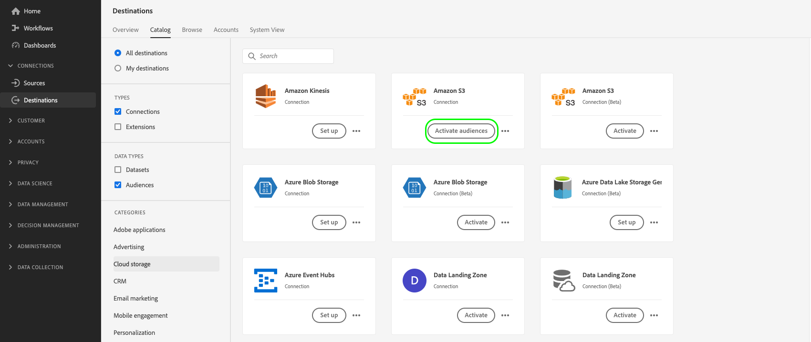

1. オーディエンスの有効化に使用する宛先接続を選択し、**[!UICONTROL Next]**&#x200B;を選択します。

   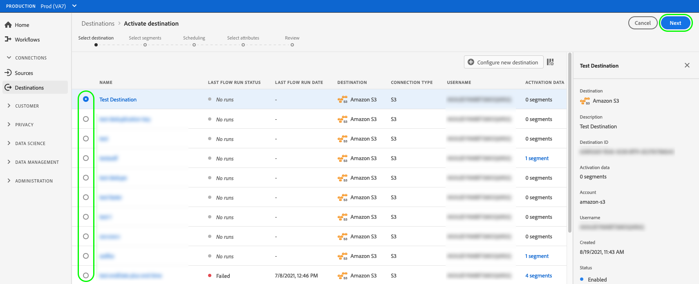

1. 次のセクションに移動して、[&#x200B; オーディエンスを選択](#select-audiences)します。

## オーディエンスの選択 {#select-audiences}

宛先に対してアクティブ化するオーディエンスを選択するには、オーディエンス名の左側にあるチェックボックスを使用し、**[!UICONTROL Next]**&#x200B;を選択します。

配信元に応じて、複数のタイプのオーディエンスから選択できます。

* **[!UICONTROL Segmentation Service]**: Segmentation ServiceによってExperience Platform内で生成されたオーディエンス。 詳しくは、[&#x200B; セグメント化ドキュメント &#x200B;](../../segmentation/ui/overview.md)を参照してください。
* **[!UICONTROL Custom upload]**: Experience Platform以外で生成され、CSV ファイルとしてExperience Platformにアップロードされたオーディエンス。 外部オーディエンスについて詳しくは、[&#x200B; オーディエンスの読み込み](../../segmentation/ui/audience-portal.md#import-audience)に関するドキュメントを参照してください。 **[!UICONTROL Custom uploads]**&#x200B;から始まるオーディエンスを選択すると、[&#x200B; エンリッチメント属性を選択](#select-enrichment-attributes)手順が自動的に有効になります。
* その他の種類のオーディエンスは、[!DNL Audience Manager]など、他のAdobe ソリューションから作成されています。

>[!IMPORTANT]
>
>バッチファイルベースの宛先に対してカスタムアップロードオーディエンスをアクティブ化する場合、データフローでアクティブ化できるオーディエンスは10個までという制限があります。

アクティブ化する1つまたは複数のオーディエンスを選択する際に表示される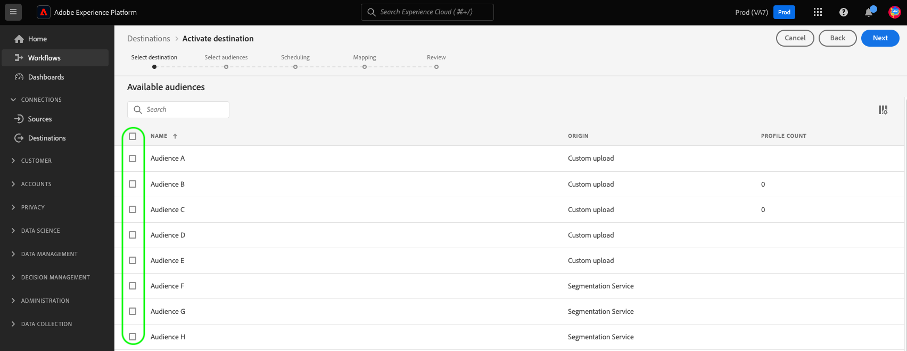

>[!TIP]
>
>既存のアクティベーションフローからオーディエンスを削除するには、**[!UICONTROL Activation data]** ページを使用します。 詳しくは、「[&#x200B; アクティベーションフローから複数のオーディエンスを削除](../ui/destination-details-page.md#bulk-remove)」の節を参照してください。

## オーディエンスの書き出しのスケジュール {#scheduling}

>[!CONTEXTUALHELP]
>id="platform_destinations_activate_schedule"
>title="スケジュール"
>abstract="鉛筆アイコンを使用して、ファイルの書き出しタイプ（完全なファイルまたは増分ファイル）と書き出し頻度を設定します。"

>[!CONTEXTUALHELP]
>id="platform_destinations_activate_schedule_weekly_messaging"
>title="週次書き出し"
>abstract="<sup>*</sup> 開始日を選択すると、選択した終了日まで、その週のその日にその後の書き出しが実行されます。"

>[!CONTEXTUALHELP]
>id="platform_destinations_activate_schedule_monthly_messaging"
>title="月次書き出し"
>abstract="<sup>*</sup> 開始日を選択すると、選択した終了日まで、その月のその日にその後の書き出しが実行されます。 月の日数が 30 日または 31 日に満たない場合、月の最終日に書き出しが行われます。"

[!DNL Adobe Experience Platform]は、メールマーケティングとクラウドストレージの宛先のデータを[異なるファイルタイプ &#x200B;](#supported-file-formats-export)として書き出します。 **[!UICONTROL Scheduling]** ページでは、書き出す各オーディエンスのスケジュールとファイル名を設定できます。

Experience Platformは、ファイルの書き出しごとにデフォルトスケジュールを自動的に設定します。 必要に応じて、各スケジュールの横にある鉛筆アイコンを選択し、カスタムスケジュールを定義することで、デフォルトのスケジュールを変更できます。

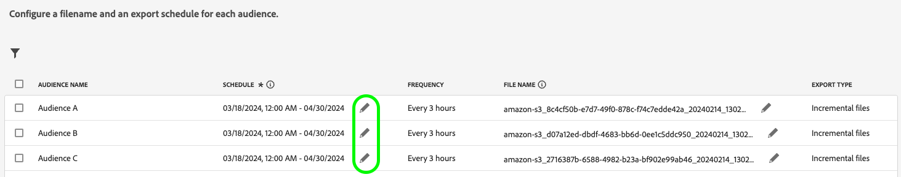

複数のスケジュールを同時に編集するには、画面の左側にあるチェックボックスを使用してオーディエンスを選択し、**[!UICONTROL Edit schedule]**&#x200B;を選択します。 設定したスケジュールは、選択したオーディエンスのすべての書き出されたファイルに適用されます。

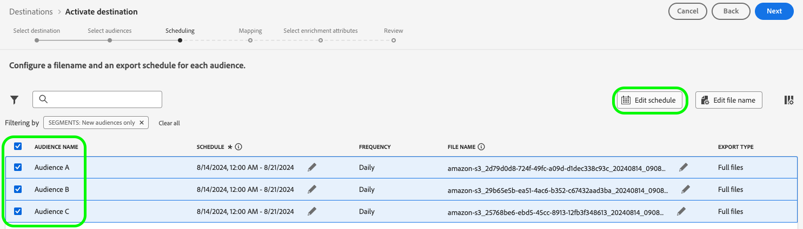

>[!TIP]
>
>既存のアクティベーションフローのオーディエンスアクティベーションスケジュールは、**[!UICONTROL Activation data]** ページから編集できます。 詳しくは、[&#x200B; アクティベーションスケジュールの一括編集](../ui/destination-details-page.md#bulk-edit-schedule)に関するドキュメントを参照してください。

>[!IMPORTANT]
>
>[!DNL Adobe Experience Platform] では、ファイルあたり 500 万件のレコード（行）で書き出しファイルが自動的に分割されます。 各行は 1 つのプロファイルを表します。
>
>分割ファイル名には、`filename.csv`、`filename_2.csv`、`filename_3.csv` のように、ファイルが大きな書き出しの一部であることを示す数字が付加されます。

### 完全ファイルを書き出し {#export-full-files}

>[!CONTEXTUALHELP]
>id="platform_destinations_activate_exportoptions"
>title="ファイルの書き出しオプション"
>abstract="「**完全ファイルを書き出し**」を選択して、オーディエンスに該当するすべてのプロファイルの完全なスナップショットを書き出します。 「**増分ファイルを書き出し**」を選択して、前回の書き出し以降にオーディエンスの対象として認定されたプロファイルのみを書き出します。<br> 最初の増分ファイルの書き出しには、オーディエンスに該当するすべてのプロファイルが含まれ、バックフィルとして機能します。 それ以後の増分ファイルには、最初の増分ファイル書き出し以降にオーディエンスに該当したプロファイルのみが含まれます。"
>additional-url="https://experienceleague.adobe.com/docs/experience-platform/destinations/ui/activate/activate-batch-profile-destinations.html?lang=ja#export-incremental-files" text="増分ファイルの書き出し"

>[!CONTEXTUALHELP]
>id="platform_destinations_activationchaining_aftersegmentevaluation"
>title="オーディエンス評価後にアクティベート"
>abstract="<p>アクティベーションは、毎日のセグメント化ジョブが完了した直後に実行されます。 これにより、最新のプロファイルが確実に書き出されます。</p><p>オーディエンスの評価後にプロファイルを書き出すオプションは、週次および月次の書き出し頻度では使用<i>できません</i>。</p>"

>[!CONTEXTUALHELP]
>id="platform_destinations_activationchaining_scheduled"
>title="スケジュールされたアクティベーション"
>abstract="アクティベーションが特定の時刻に実行されます。"

**[!UICONTROL Export full files]**&#x200B;を選択すると、選択したオーディエンスのすべてのプロファイル資格の完全なスナップショットを含むファイルの書き出しをトリガーできます。

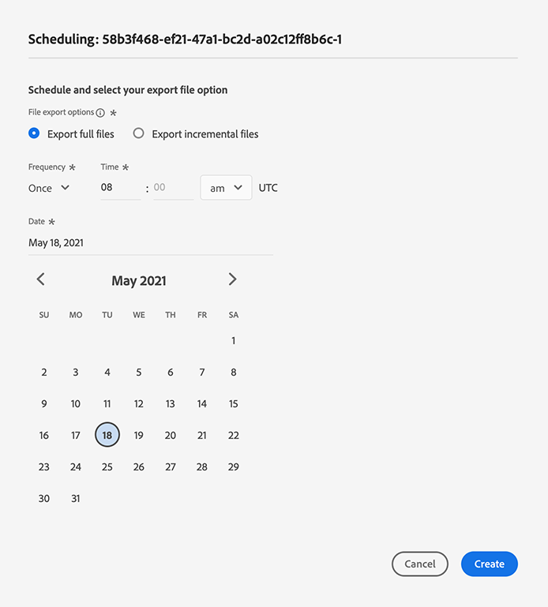

1. **[!UICONTROL Frequency]** セレクターを使用して、書き出し頻度を選択します。

   * **[!UICONTROL Once]**: 1回のオンデマンドの完全ファイル書き出しをスケジュールします。
   * **[!UICONTROL Daily]**：指定した時間に、1日1回、毎日1回の完全なファイル書き出しをスケジュールします。
   * **[!UICONTROL Weekly]**：開始日を選択すると、選択した終了日までの週のその後の書き出しが行われます。
   * **[!UICONTROL Monthly]**：開始日を選択すると、選択した終了日まで、その月のその後の書き出しが行われます。 月の日数が 30 日または 31 日に満たない場合、月の最終日に書き出しが行われます。

   >[!NOTE]
   >
   > 現在、週単位および月単位のスケジューリングオプションは、次のファイルベースのクラウドストレージ宛先でのみサポートされており、[人のオーディエンス &#x200B;](../../segmentation/types/overview.md#people-audience)および[見込み客オーディエンス &#x200B;](../../segmentation/types/overview.md#prospect-audience)をアクティブ化する場合にのみサポートされています。
   > 
   > * [Amazon S3](../catalog/cloud-storage/amazon-s3.md)
   > * [Azure Blob Storage](../catalog/cloud-storage/azure-blob.md)
   > * [Data Landing Zone](../catalog/cloud-storage/data-landing-zone.md)
   > * [Google Cloud Storage](../catalog/cloud-storage/google-cloud-storage.md)
   > * [SFTP](../catalog/cloud-storage/sftp.md)
   > 
   > 週単位および月単位のスケジューリングオプションは、他の宛先タイプでは使用できません。

2. **[!UICONTROL Time]** トグルを使用して、書き出しをオーディエンスの評価の直後に行うか、指定した時間にスケジュールに従って行うかを選択します。 **[!UICONTROL Scheduled]** オプションを選択する場合、セレクターを使用して、書き出しを行う必要がある時刻を[!DNL UTC]形式で選択できます。

   毎日のExperience Platform バッチセグメント化ジョブが完了した直後にアクティベーションジョブを実行するには、**[!UICONTROL After segment evaluation]** オプションを使用します。 このオプションを選択すると、アクティベーションジョブが実行されるときに、最新のプロファイルが宛先に書き出されます。 これにより、アクションに基づいて、1日に複数回オーディエンスが書き出される場合があります。

   >[!IMPORTANT]
   >
   >セグメント評価後にアクティブ化するように既に設定されているオーディエンスに対して[柔軟なオーディエンス評価](../../segmentation/ui/audience-portal.md#flexible-audience-evaluation)を実行すると、以前の毎日のアクティブ化ジョブに関係なく、柔軟なオーディエンス評価ジョブが終了するとすぐにオーディエンスがアクティブ化されます。 これにより、オーディエンスはアクションに応じて1日に複数回書き出される場合があります。

   <!-- Batch segmentation currently runs at {{insert time of day}} and lasts for an average {{x hours}}. Adobe reserves the right to modify this schedule. -->

   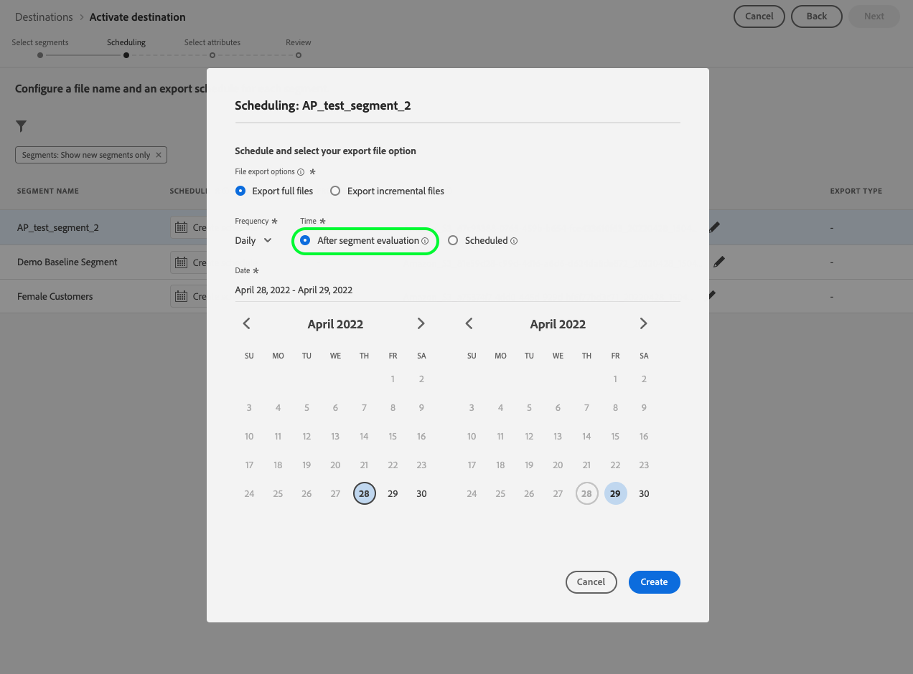
**[!UICONTROL Scheduled]** オプションを使用して、アクティブ化ジョブを特定の時間に実行します。 このオプションを選択すると、Experience Platform プロファイルデータが毎日同じ時間に書き出されます。 ただし、アクティベーションジョブが開始される前にバッチセグメンテーションジョブが完了したかどうかに応じて、書き出すプロファイルが最新ではない場合があります。

   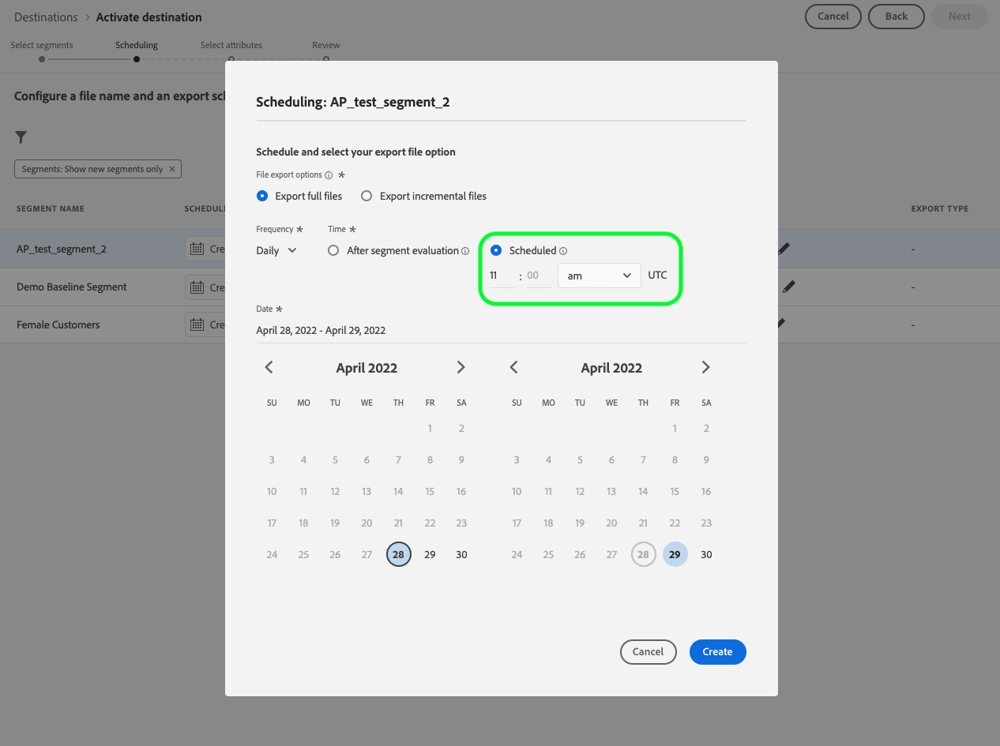

   過去24時間以内に作成され、[&#x200B; バッチセグメンテーション &#x200B;](../../segmentation/methods/batch-segmentation.md)を通じて評価されたオーディエンスをマッピングする場合は、毎日の書き出しスケジュールを設定して、早くても翌日から開始するように設定します。 これにより、毎日のバッチ評価ジョブが最初に実行され、完全なオーディエンスデータを書き出すことができます。

   書き出しスケジュールを設定する場合は、アクティベーションフローの完了後、少なくとも&#x200B;**1時間**&#x200B;に開始時間を設定します。 オーディエンスのアクティベーションは、システムを通じて反映するのに最大1時間かかります。 アクティベーション後1時間未満で書き出しを実行するようにスケジュールすると、スケジュールされた書き出しが実行されない可能性があります。

3. **[!UICONTROL Date]** セレクターを使用して、書き出しを行う日または間隔を選択します。 日常の書き出しでのベストプラクティスは、開始日と終了日を、ダウンストリームプラットフォームのキャンペーンの期間に合わせて設定することです。

   >[!IMPORTANT]
   >
   > 書き出し間隔を選択する場合、その間隔の最終日は書き出しに含まれません。 例えば、1月4日から11日の間隔を選択した場合、最後のファイル書き出しは1月10日に行われます。

4. スケジュールを保存するには、**[!UICONTROL Create]**&#x200B;を選択します。

### スケジュールされた書き出し動作について {#export-behavior}

スケジュールされた書き出しには、オーディエンスのスナップショットデータに、スナップショットの作成と書き出し時間の間に発生するプロファイルの増分またはIDの変更が含まれます。 これは、スナップショットデータのみを使用する[&#x200B; オンデマンド書き出し](export-file-now.md)とは異なります。

次の表は、スケジュールされた書き出しとオンデマンド書き出しの違いを示しています。特に、データの鮮度と用途が異なります。

|  | 定期エクスポート | 今すぐファイルを書き出し |
|--------|-------------------|-----------------|
| **データソース** | スナップショット +増分変更 | スナップショットのみ |
| **プロファイル属性** | エクスポート時の現在の値 | スナップショット時の値 |

オーディエンスの評価後にプロファイルが更新された場合、評価時にオーディエンスメンバーシップが決定されたにもかかわらず、スケジュールされた書き出しには更新された属性値が含まれます。

**例**:「retailIDがnullのプロファイル」のオーディエンスは、そのフィールドが&#x200B;*後*&#x200B;評価で&#x200B;*前*&#x200B;にスケジュールされたエクスポートが更新された場合、retailIDが入力されたプロファイルを書き出すことができます。

**レコメンデーション**

* 重複レコードを防ぐため、[重複排除キー](#deduplication-keys)を設定します
* オンデマンド書き出しを使用して、正確なスナップショットベースのデータを取得
* バッチ取り込みと評価スケジュールを調整して、差異を最小限に抑えます

オンデマンド書き出しについては、[&#x200B; オンデマンドでのファイルの書き出し](/help/destinations/ui/export-file-now.md#scheduled-vs-ondemand)に関するドキュメントを参照してください。

### 増分ファイルの書き出し {#export-incremental-files}

>[!CONTEXTUALHELP]
>id="platform_destinations_activate_something"
>title="ファイル名の設定"
>abstract="ファイルベースの宛先の場合、オーディエンスごとに一意のファイル名が生成されます。 ファイル名エディターを使用して、一意のファイル名を作成および編集するか、デフォルトの名前のままにします。"

**[!UICONTROL Export incremental files]**&#x200B;を選択して、最初のファイルが選択したオーディエンスのすべてのプロファイル条件の完全なスナップショットであり、その後のファイルが前回の書き出しからの増分プロファイル条件である書き出しをトリガーします。

>[!IMPORTANT]
>
>最初に書き出された増分ファイルには、オーディエンスに適格なすべてのプロファイルが含まれ、バックフィルとして機能します。

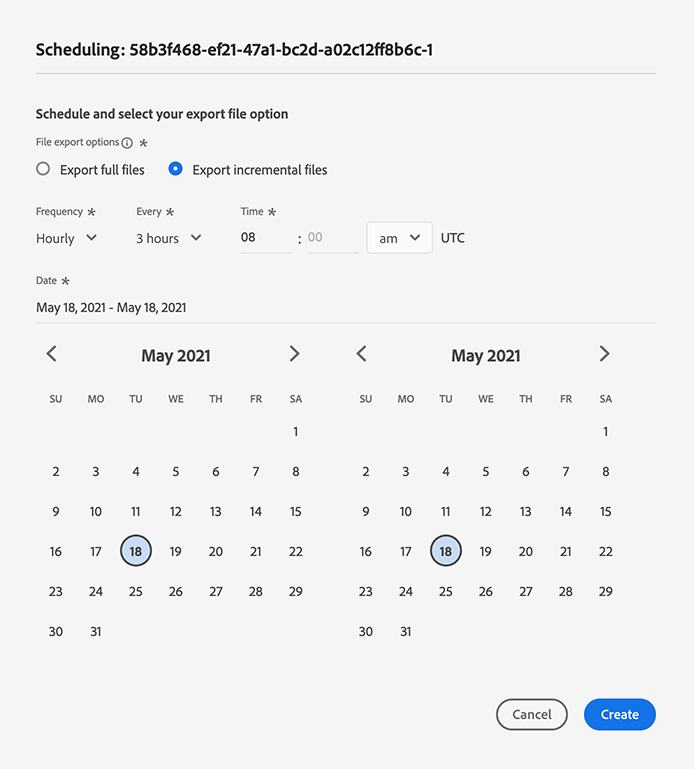

1. **[!UICONTROL Frequency]** セレクターを使用して、書き出し頻度を選択します。

   * **[!UICONTROL Daily]**：指定した時刻に、1日1回、毎日、増分ファイル書き出しをスケジュールします。
   * **[!UICONTROL Hourly]**: 3、6、8、または12時間ごとに増分ファイルの書き出しをスケジュールします。


2. **[!UICONTROL Time]** セレクターを使用して、書き出しを行う時刻を[!DNL UTC]形式で選択します。

3. **[!UICONTROL Date]** セレクターを使用して、書き出しを実行する間隔を選択します。 ベストプラクティスは、開始日と終了日を、ダウンストリームプラットフォームのキャンペーンの期間に合わせて設定することです。

   >[!IMPORTANT]
   >
   >間隔の最終日はエクスポートに含まれません。 例えば、1月4日から11日の間隔を選択した場合、最後のファイル書き出しは1月10日に行われます。

4. スケジュールを保存するには、**[!UICONTROL Create]**&#x200B;を選択します。

### ファイル名の設定 {#configure-file-names}

>[!CONTEXTUALHELP]
>id="platform_destinations_activate_filename"
>title="ファイル名の設定"
>abstract="ファイルベースの宛先の場合、オーディエンスごとに一意のファイル名が生成されます。 ファイル名エディターを使用して、一意のファイル名を作成および編集するか、デフォルトの名前のままにします。"

ほとんどの宛先では、デフォルトのファイル名は、宛先名、オーディエンス ID、日付と時刻インジケーターで構成されます。 例えば、書き出したファイル名を編集して、異なるキャンペーンを区別したり、データの書き出し時間をファイルに追加したりできます。 一部の宛先開発者は、別のデフォルトのファイル名追加オプションを宛先に表示するように選択する場合があります。

モーダルウィンドウを開いてファイル名を編集するには、鉛筆アイコンを選択します。 ファイル名は 255 文字までに制限されています。

>[!NOTE]
>
>次の画像は [!DNL Amazon S3] の宛先のファイル名を編集する方法を示していますが、プロセスはすべてのバッチ宛先 （SFTP、[!DNL Azure Blob Storage] または [!DNL Google Cloud Storage] など）で同じです。

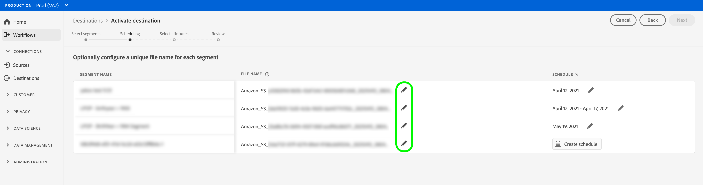

ファイル名エディターで、別のコンポーネントを選択してファイル名に追加できます。

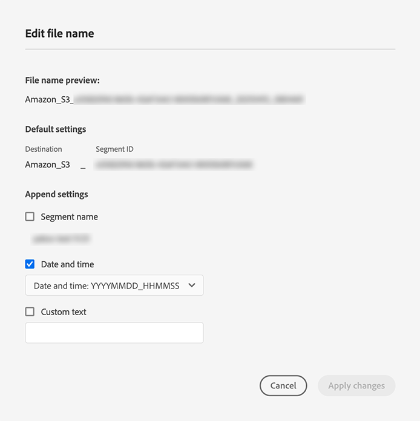

宛先名とオーディエンス IDをファイル名から削除することはできません。 これらのオプションに加えて、次のオプションを追加できます。

| ファイル名オプション | 説明 |
|---------|----------|
| **[!UICONTROL Audience name]** | 書き出されたオーディエンスの名前。 |
| **[!UICONTROL Date and time]** | ファイルが生成される時刻の`MMDDYYYY_HHMMSS`形式またはUNIX 10桁のタイムスタンプを追加するかどうかを選択します。 増分書き出しのたびにファイル名を動的に生成したい場合は、次のオプションのいずれかを選択します。 |
| **[!UICONTROL Custom text]** | ファイル名に追加する任意のカスタムテキスト。 |
| **[!UICONTROL Destination ID]** | オーディエンスの書き出しに使用する宛先データフローのID。 |
| **[!UICONTROL Destination name]** | オーディエンスのエクスポートに使用する宛先データフローの名前。 |
| **[!UICONTROL Organization name]** | Experience Platform内の組織名。 |
| **[!UICONTROL Sandbox name]** | オーディエンスの書き出しに使用するサンドボックスのID。 |

{style="table-layout:auto"}

複数のファイル名を同時に編集するには、画面の左側にあるチェックボックスを使用してオーディエンスを選択し、**[!UICONTROL Edit file name]**&#x200B;を選択します。 設定したファイル名オプションは、選択したオーディエンスのすべての書き出されたファイルに適用されます。

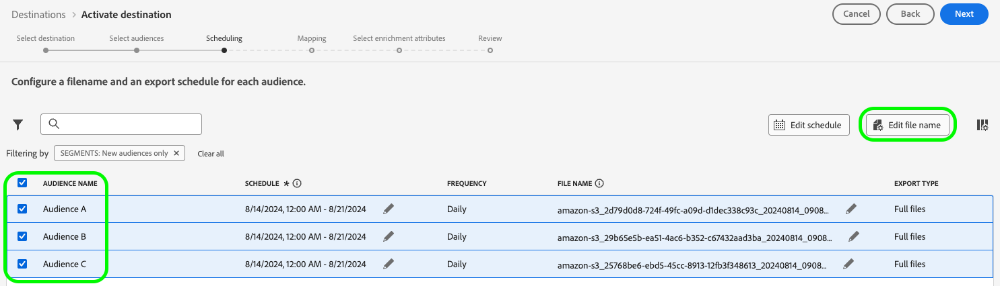

**[!UICONTROL Apply changes]**&#x200B;を選択して選択を確定します。

>[!IMPORTANT]
>
>**[!UICONTROL Date and Time]** コンポーネントを選択しない場合、ファイル名は静的になり、新しく書き出されたファイルは、書き出されるたびに、ストレージの場所にある以前のファイルを上書きします。 ストレージの場所からメールマーケティングプラットフォームへのインポートジョブを繰り返し実行する場合は、このオプションをお勧めします。

すべてのオーディエンスの設定が完了したら、**[!UICONTROL Next]**&#x200B;を選択して続行します。

## マッピング {#mapping}

この手順では、ターゲットの宛先に書き出すファイルに追加する、プロファイル属性を選択する必要があります。 書き出すプロファイル属性と ID を選択するには：

1. **[!UICONTROL Mapping]** ページで、**[!UICONTROL Add new mapping]**&#x200B;を選択します。

   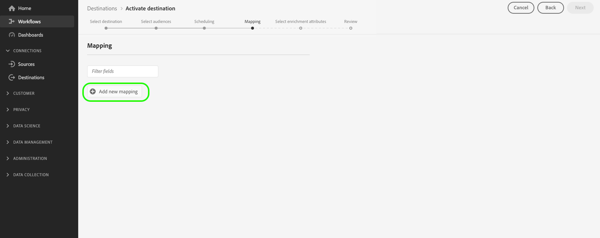

1. **[!UICONTROL Source field]** エントリの右側にある矢印を選択します。

   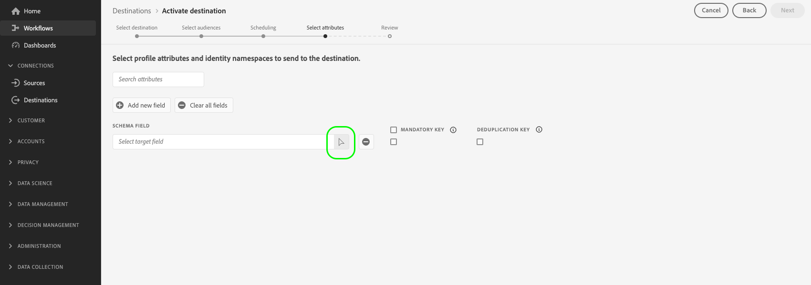

1. **[!UICONTROL Select source field]** ページで、宛先に書き出されたファイルに含めるプロファイル属性とIDを選択し、**[!UICONTROL Select]**&#x200B;を選択します。

   >[!TIP]
   >
   >次の画像に示すように、検索フィールドを使用して、選択を絞り込むことができます。

   値が入力されたスキーマフィールドのみを表示するには、**[!UICONTROL Show only fields with data]** トグルを使用します。 デフォルトでは、入力されたスキーマフィールドのみが表示されます。

   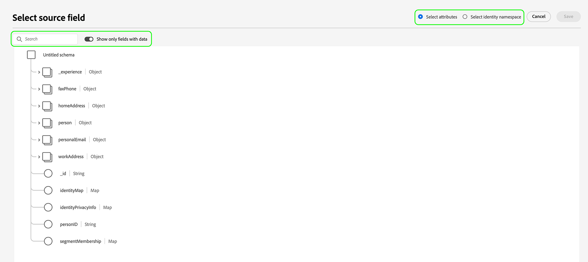

   スキーマフィールド名ではなく、フィールドのわかりやすい名前を表示するには、**[!UICONTROL Show display names for fields]** トグルを使用します。

   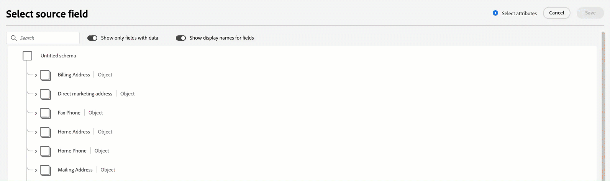

1. 書き出し用に選択したフィールドがマッピングビューに表示されます。 必要に応じて、書き出したファイルのヘッダーの名前を編集できます。 それには、ターゲットフィールドでアイコンを選択します。

   >[!NOTE]
   >
   >書き出されたファイルのフィールド名では、ドット （`.`）はサポートされていません。 フィールド名にドット（`person.name.firstName`など）が含まれる場合、書き出された列名の各ドットはアンダースコア（`_`）に置き換えられます。 例えば、`person.name.firstName`は書き出されたファイルの`person_name_firstName`になります。

   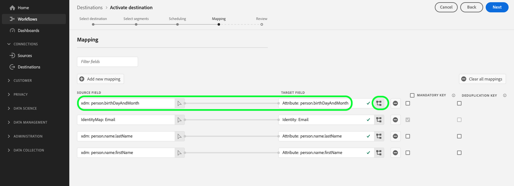

1. **[!UICONTROL Select target field]** ページで、書き出したファイルにヘッダーの目的の名前を入力し、**[!UICONTROL Select]**&#x200B;を選択します。

   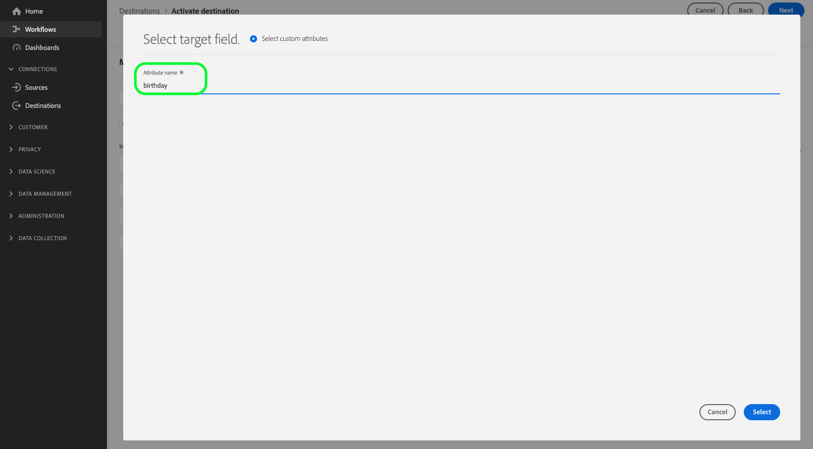

1. 書き出し用に選択したフィールドがマッピングビューに表示され、編集したヘッダーが書き出したファイルに表示されます。

   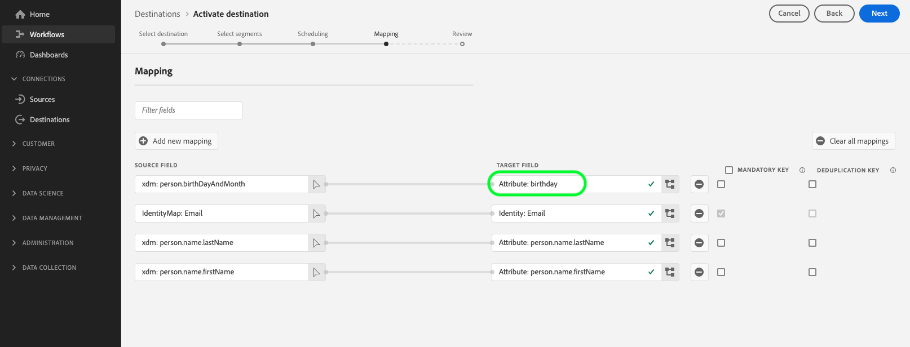

1. （オプション） UIのマッピングされたフィールドの順序は、書き出されたCSV ファイルの列の順序で上から下に反映され、一番上の行がCSV ファイルの一番左の列になります。 以下に示すように、マッピングされた行をドラッグ&amp;ドロップすることで、マッピングされたフィールドを任意の方法で並べ替えることができます。

   >[!NOTE]
   >
   >この機能はベータ版で、一部のお客様のみご利用いただけます。 この機能へのアクセスをリクエストするには、Adobe担当者にお問い合わせください。

   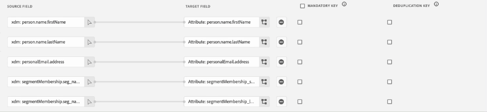

1. （オプション）書き出されたフィールドを[必須キー](#mandatory-keys)または [重複排除キー](#deduplication-keys)のどちらにするかを選択できます。

   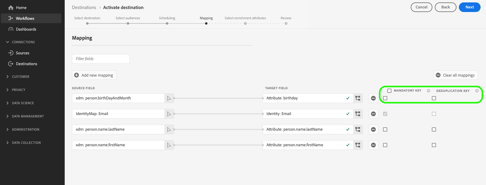

1. 書き出すフィールドをさらに追加するには、上記の手順を繰り返します。

### 必須の属性 {#mandatory-attributes}

>[!CONTEXTUALHELP]
>id="platform_destinations_activate_mandatorykey"
>title="必須の属性について"
>abstract="書き出されたすべてのプロファイルに含める XDM スキーマ属性を選択します。 必須キーのないプロファイルは、宛先に書き出されません。 必須キーを選択しない場合、属性に関係なく、すべての該当プロファイルを書き出します。"

必須属性は、選択した属性がすべてのプロファイルレコードに含まれるようにする、ユーザーが有効にしたチェックボックスです。 例：書き出されるすべてのプロファイルには、メールアドレスが含まれます。

[!DNL Experience Platform] が特定の属性を含むプロファイルのみを書き出すよう、属性を必須としてマークすることができます。 その結果、追加のフィルタリング形式として使用できます。 属性を必須としてマークする必要は&#x200B;**ありません**。

必須属性を選択しない場合、属性に関係なく、すべての対象プロファイルを書き出します。

属性の 1 つをスキーマの[一意の ID](../../destinations/catalog/email-marketing/overview.md#identity) にすることをお勧めします。 必須属性について詳しくは、[メールマーケティングの宛先](../../destinations/catalog/email-marketing/overview.md#identity)ドキュメントの ID の節を参照してください。

### 重複排除キー {#deduplication-keys}

>[!CONTEXTUALHELP]
>id="platform_destinations_activate_deduplicationkey"
>title="重複排除キーについて"
>abstract="重複排除キーを選択することで、書き出しファイル内にある、同一プロファイルの複数のレコードを排除します。 重複排除キーとして、1 つの名前空間または最大 2 つの XDM スキーマ属性を選択できます。 重複排除キーを選択しないと、書き出しファイルでプロファイルエントリの重複が発生する場合があります。"

>[!IMPORTANT]
>
>スケジュールされた書き出しに対して、常に重複排除キーを設定します。 重複排除を使用しない場合、スケジュールされた書き出しはスナップショットと増分データの両方を処理するため、同じプロファイルに対して行が重複したり、セグメントメンバーシップが競合したりすることがあります。

重複排除キーは、プロファイルの重複排除の方法を決定するユーザー定義のプライマリキーです。 同じ個人に複数のレコードが存在する場合、重複排除によって最新のレコードのみが書き出されます。

重複排除キーを使用すると、同一プロファイルの複数のレコードが 1 つの書き出しファイルに含まれる可能性がなくなります。

[!DNL Experience Platform] で重複排除キーを使用する方法は 3 つあります。

* 単一のID名前空間を[!UICONTROL deduplication key]として使用しています
* [!DNL XDM] プロファイルの単一のプロファイル属性を[!UICONTROL deduplication key]として使用しています
* 複合キーとして、[!DNL XDM] プロファイルから 2 つのプロファイル属性の組み合わせを使用する

>[!IMPORTANT]
>
> 単一の ID 名前空間を宛先に書き出すことができ、名前空間は自動的に重複排除キーとして設定されます。 複数の名前空間を宛先に送信することはサポートされていません。
> 
> ID 名前空間とプロファイル属性の組み合わせを重複排除キーとして使用することはできません。

### 重複排除の例 {#deduplication-example}

次の例は、選択した重複排除キーに応じた重複排除の仕組みを示しています。

次の 2 つのプロファイルについて考えてみましょう。

**プロファイル A**

```json
{
  "identityMap": {
    "Email": [
      {
        "id": "johndoe@example.com"
      },
      {
        "id": "doejohn_1@example.com"
      }
    ]
  },
  "segmentMembership": {
    "ups": {
      "fa5c4622-6847-4199-8dd4-8b7c7c7ed1d6": {
        "status": "realized",
        "lastQualificationTime": "2021-03-10 10:03:08"
      }
    }
  },
  "person": {
    "name": {
      "lastName": "Doe",
      "firstName": "John"
    }
  },
  "personalEmail": {
    "address": "johndoe@example.com"
  }
}
```

**プロファイル B**

```json
{
  "identityMap": {
    "Email": [
      {
        "id": "johndoe@example.com"
      },
      {
        "id": "doejohn_2@example.com"
      }
    ]
  },
  "segmentMembership": {
    "ups": {
      "fa5c4622-6847-4199-8dd4-8b7c7c7ed1d6": {
        "status": "realized",
        "lastQualificationTime": "2021-04-10 11:33:28"
      }
    }
  },
  "person": {
    "name": {
      "lastName": "D",
      "firstName": "John"
    }
  },
  "personalEmail": {
    "address": "johndoe@example.com"
  }
}
```

### 重複排除の使用例 1：重複排除なし {#deduplication-use-case-1}

重複排除を使用しない場合、書き出しファイルには次のエントリが含まれます。

| personalEmail | firstName | lastName |
|---|---|---|
| johndoe@example.com | John | Doe |
| johndoe@example.com | John | D |


### 重複排除の使用例 2：ID 名前空間に基づく重複排除 {#deduplication-use-case-2}

[!DNL Email] 名前空間の重複排除を指定した場合、書き出しファイルには次のエントリが含まれます。 プロファイル Bは、オーディエンスに適格な最新のプロファイルなので、書き出されるのはプロファイル Bのみです。

| メール* | personalEmail | firstName | lastName |
|---|---|---|---|
| johndoe@example.com | johndoe@example.com | John | D |
| doejohn_2@example.com | johndoe@example.com | John | D |

### 重複排除のユースケース 3：単一のプロファイル属性に基づく重複排除 {#deduplication-use-case-3}

`personal Email` 属性による重複排除を仮定した場合、エクスポートファイルには次のエントリが含まれます。 プロファイル Bは、オーディエンスに適格な最新のプロファイルなので、書き出されるのはプロファイル Bのみです。

| personalEmail* | firstName | lastName |
|---|---|---|
| johndoe@example.com | John | D |


### 重複排除のユースケース 4：2 つのプロファイル属性に基づく重複排除 {#deduplication-use-case-4}

複合キー `personalEmail + lastName` による重複排除を仮定した場合、エクスポートファイルには次のエントリが含まれます。

| personalEmail* | lastName* | firstName |
|---|---|---|
| johndoe@example.com | D | John |
| johndoe@example.com | Doe | John |

[!DNL CRM ID] やメールアドレスなどの ID 名前空間を重複排除キーとして選択して、すべてのプロファイルレコードが必ず一意に識別されるようにすることをお勧めします。

### 同じタイムスタンプを持つプロファイルの重複排除の動作 {#deduplication-same-timestamp}

プロファイルをファイルベースの宛先に書き出す場合、重複排除によって、複数のプロファイルが同じ重複排除キーと同じ参照タイムスタンプを共有する場合に、1つのプロファイルのみが書き出されます。 このタイムスタンプは、プロファイルのオーディエンスメンバーシップまたはID グラフが最後に更新された時点を表します。 プロファイルの更新およびエクスポート方法について詳しくは、[&#x200B; プロファイルのエクスポート動作](https://experienceleague.adobe.com/ja/docs/experience-platform/destinations/how-destinations-work/profile-export-behavior#what-determines-a-data-export-and-what-is-included-in-the-export-2) ドキュメントを参照してください。

#### 重要な考慮事項 {#key-considerations}

* **決定的選択**：複数のプロファイルに同じ重複排除キーと同じ参照タイムスタンプがある場合、重複排除ロジックは、選択した他の列（配列、マップ、オブジェクトなどの複雑な型を除く）の値を並べ替えることで、書き出すプロファイルを決定します。 ソートされた値は辞書順に評価され、最初のプロファイルが選択されます。

* **シナリオ例**

重複排除キーが`Email`列である次のデータを考えてみましょう。

| メール* | first_name | last_name | タイムスタンプ |
|---|---|---|---|
| `test1@test.com` | John | モリス | 2024-10-12T09:50 |
| `test1@test.com` | John | Doe | 2024-10-12T09:50 |
| `test2@test.com` | フランク | スミス | 2024-10-12T09:50 |

{style="table-layout:auto"}

重複排除の後、エクスポートファイルには次のものが含まれます。

| メール* | first_name | last_name | タイムスタンプ |
|---|---|---|---|
| `test1@test.com` | John | Doe | 2024-10-12T09:50 |
| `test2@test.com` | フランク | スミス | 2024-10-12T09:50 |

{style="table-layout:auto"}

**説明**: `test1@test.com`では、両方のプロファイルが同じ重複排除キーとタイムスタンプを共有しています。 アルゴリズムは、`first_name`と`last_name`列の値を辞書的に並べ替えます。 名前は同じなので、タイは`last_name`列を使用して解決されます。この列の前には「Doe」が表示されます。

**信頼性の向上**：この更新された重複排除プロセスにより、同じ座標を持つ連続した実行が常に同じ結果を生成し、一貫性が向上します。

### 計算フィールドを使用してデータ変換を実行する {#calculated-fields}

[計算フィールド &#x200B;](/help/destinations/ui/data-transformations-calculated-fields.md) コントロールを使用して、ファイルベースの宛先に書き出されたデータに対して様々なデータ変換を実行できます。

### 既知の制限事項 {#known-limitations}

新しい&#x200B;**[!UICONTROL Mapping]** ページには、次の既知の制限があります。

#### マッピングワークフローでオーディエンスメンバーシップ属性を選択できません {#audience-membership-attribute-mapping}

既知の制限のため、現在&#x200B;**[!UICONTROL Select field]** ウィンドウを使用して`segmentMembership.seg_namespace.seg_id.status`をファイル書き出しに追加することはできません。 代わりに、手動で値 `xdm: segmentMembership.seg_namespace.seg_id.status` をスキーマフィールドに貼り付ける必要があります（下図を参照）。

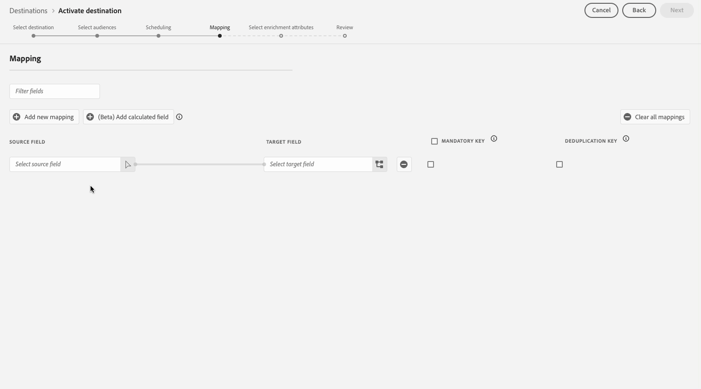


>[!NOTE]
>
>クラウドストレージの宛先の場合、デフォルトで次の属性がマッピングに追加されます。
>
>* `segmentMembership.seg_namespace.seg_id.status`
>* `segmentMembership.seg_namespace.seg_id.lastQualificationTime`

ファイルのエクスポートは、`segmentMembership.seg_namespace.seg_id.status` が選択されているかどうかによって、次のように異なります。

* `segmentMembership.seg_namespace.seg_id.status` フィールドが選択されている場合、書き出されたファイルには、最初の完全スナップショットに&#x200B;**[!UICONTROL Active]**&#x200B;人のメンバーが含まれ、その後の増分書き出しに新たに&#x200B;**[!UICONTROL Active]**&#x200B;人と&#x200B;**[!UICONTROL Expired]**&#x200B;人のメンバーが含まれます。
* `segmentMembership.seg_namespace.seg_id.status` フィールドが選択されていない場合、書き出されたファイルには、最初の完全スナップショットとその後の増分書き出しに&#x200B;**[!UICONTROL Active]**&#x200B;人のメンバーのみが含まれます。

ファイルベースの宛先に対する[&#x200B; プロファイル書き出し動作](/help/destinations/how-destinations-work/profile-export-behavior.md#file-based-destinations)の詳細をご確認ください。

#### ID 名前空間は現在、書き出し用に選択できません {#identity-namespaces-export-limitation}

以下の画像に示すように、ID 名前空間を書き出し用に選択する機能は、現在サポートされていません。 書き出し用にID名前空間を選択すると、**[!UICONTROL Review]** ステップでエラーが発生します。

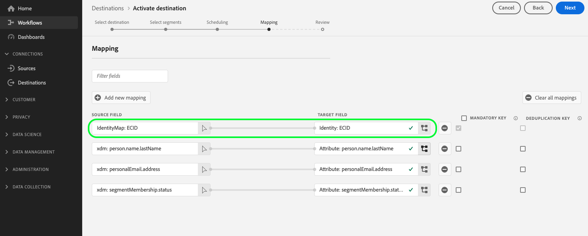

ベータ版の間に書き出したファイルに ID 名前空間を追加する必要がある場合の一時的な回避策として、次のいずれかを実行できます。

* 書き出しに ID 名前空間を含めるデータフローに、従来のクラウドストレージの宛先を使用する
* ID を属性として Experience Platform にアップロードし、クラウドストレージの宛先に書き出します。

## プロファイル属性の選択 {#select-attributes}

>[!IMPORTANT]
>
>カタログ内のすべてのクラウドストレージ宛先は、この節で説明する&#x200B;**[!UICONTROL Select attributes]** ステップに代わる改善された[[!UICONTROL Mapping] ステップ &#x200B;](#mapping)を表示できます。
>
>この&#x200B;**[!UICONTROL Select attributes]** ステップは、[!DNL Adobe Campaign]、Oracle Responsys、Oracle Eloqua、およびSalesforce Marketing Cloud メールマーケティングの宛先に対して引き続き表示されます。

プロファイルベースの宛先の場合、ターゲット宛先に送信するプロファイル属性を選択する必要があります。

1. **[!UICONTROL Select attributes]** ページで、**[!UICONTROL Add new field]**&#x200B;を選択します。

   

2. **[!UICONTROL Schema field]** エントリの右側にある矢印を選択します。

   

3. **[!UICONTROL Select field]** ページで、宛先に送信するXDM属性またはID名前空間を選択し、**[!UICONTROL Select]**&#x200B;を選択します。

   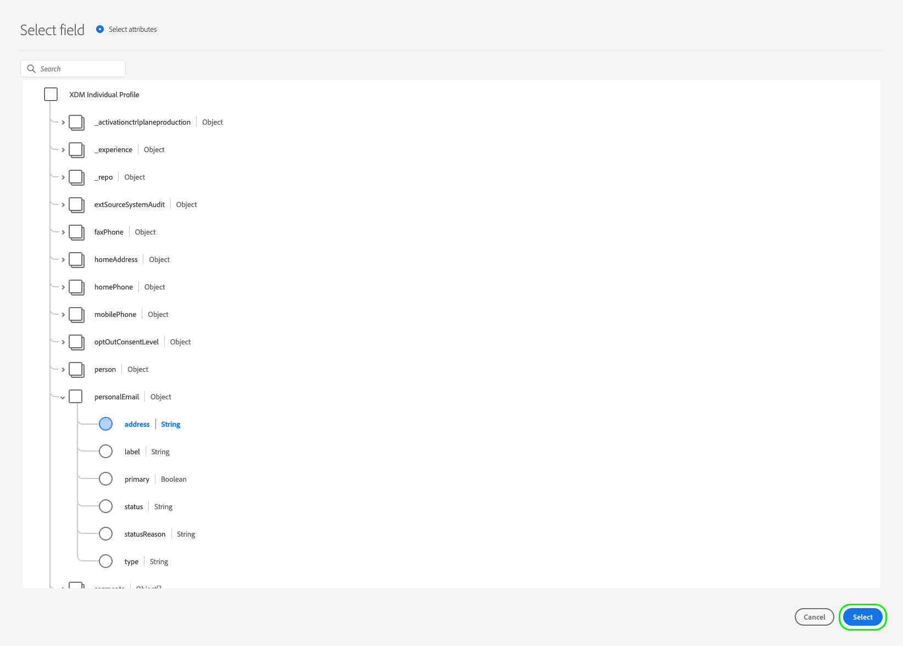

4. さらにマッピングを追加するには、手順 1～3 を繰り返します。

>[!NOTE]
>
> [!DNL Adobe Experience Platform]は、スキーマから推奨される4つの一般的に使用される属性（`person.name.firstName`、`person.name.lastName`、`personalEmail.address`、`segmentMembership.seg_namespace.seg_id.status`）を選択範囲に事前入力します。

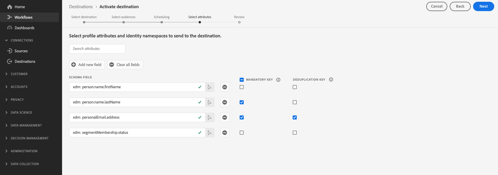

>[!IMPORTANT]
>
>既知の制限のため、現在&#x200B;**[!UICONTROL Select field]** ウィンドウを使用して`segmentMembership.seg_namespace.seg_id.status`をファイル書き出しに追加することはできません。 代わりに、以下に示すように、値`xdm: segmentMembership.seg_namespace.seg_id.status`をスキーマフィールドに手動で貼り付ける必要があります。
>
>

ファイルの書き出しは、`segmentMembership.seg_namespace.seg_id.status`が選択されているかどうかに応じて、次のように異なります。

* `segmentMembership.seg_namespace.seg_id.status` フィールドが選択されている場合、書き出されたファイルには、最初の完全スナップショットに&#x200B;**[!UICONTROL Active]**&#x200B;人のメンバーが含まれ、その後の増分書き出しには&#x200B;**[!UICONTROL Active]**&#x200B;人と&#x200B;**[!UICONTROL Expired]**&#x200B;人のメンバーが含まれます。
* `segmentMembership.seg_namespace.seg_id.status` フィールドが選択されていない場合、書き出されたファイルには、最初の完全スナップショットとその後の増分書き出しに&#x200B;**[!UICONTROL Active]**&#x200B;人のメンバーのみが含まれます。

## エンリッチメント属性を選択 {#select-enrichment-attributes}

>[!CONTEXTUALHELP]
>id="platform_destinations_activate_exclude_enrichment_attributes"
>title="エンリッチメント属性の除外"
>abstract="このオプションを有効にすると、選択したカスタムアップロードオーディエンスのプロファイルを宛先に書き出すことはできますが、その属性はすべて除外されます。"

>[!CONTEXTUALHELP]
>id="platform_destinations_enrichment_attributes_info_alert"
>title="階層出力の有効化"
>abstract="この宛先では、配列、マップおよびオブジェクトの書き出しを有効にする切り替えがオンになっているので、階層出力がサポートされています。 トップレベルの配列、配列要素、または同じ配列から複数のフィールドを1つのマッピングで書き出すことができます。 詳しくは、 ドキュメント を参照してください。"

>[!CONTEXTUALHELP]
>id="platform_destinations_enrichment_attributes_source_field"
>title="ソースフィールド"
>abstract="エクスポートするエンリッチメント属性を選択します。 配列内のフィールドの場合、ソースはトランスフォーム式を自動入力します。 1つのマッピングで複数のフィールドを書き出すには、最初に1つのフィールドを追加してから、ソース式を編集します。 詳しくは、 ドキュメント を参照してください。"

>[!CONTEXTUALHELP]
>id="platform_destinations_enrichment_attributes_target_field"
>title="ターゲットフィールド"
>abstract="ターゲットフィールドには、ソースフィールド名が自動的に入力されます。 書き出したファイル内でフィールドに別の名前を付ける場合は、別のエイリアスを使用するように編集します。"

>[!IMPORTANT]
>
>この手順は、[&#x200B; オーディエンス選択](#select-audiences)手順で&#x200B;**[!UICONTROL Custom upload]**&#x200B;個のオーディエンスを選択した場合にのみ表示されます。

エンリッチメント属性は、Experience Platformに&#x200B;**[!UICONTROL Custom uploads]**&#x200B;として取り込まれた、アップロードされたカスタムオーディエンスに対応します。 この手順では、選択した外部オーディエンスごとに、宛先に書き出す属性を選択できます。

エンリッチメント属性の選択ステップを示す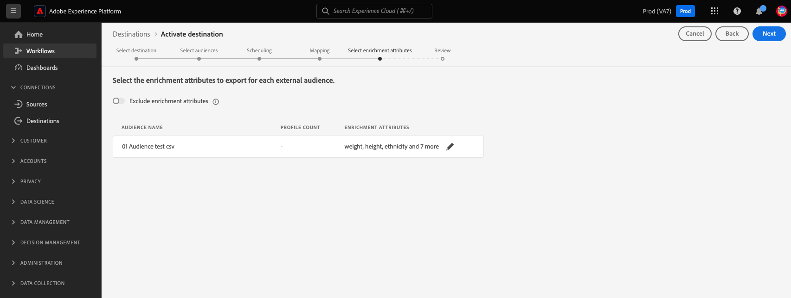

以下の手順に従って、各外部オーディエンスのエンリッチメント属性を選択します。

1. **[!UICONTROL Enrichment attributes]**&#x200B;列で、 （編集）ボタンを選択します。
1. 「**[!UICONTROL Add enrichment attribute]**」を選択します。 新しい空のスキーマフィールドが表示されます。
   エンリッチメント属性モーダル画面を示す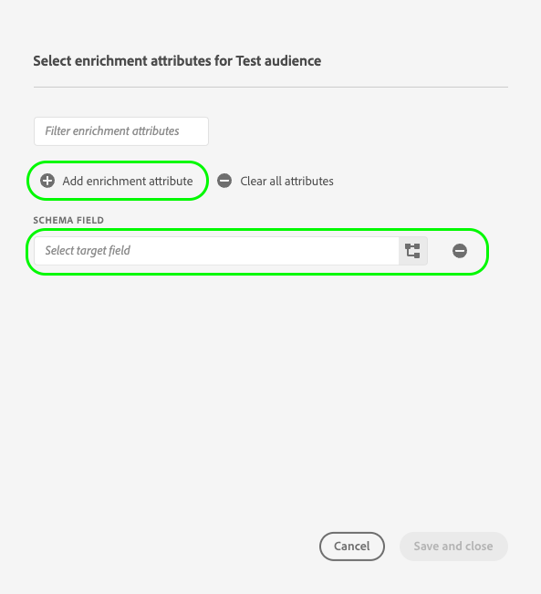
1. 空のフィールドの右側にあるボタンを選択して、フィールド選択画面を開きます。
1. オーディエンスに書き出す属性を選択します。
   エンリッチメント属性リストを示す
1. 書き出す属性をすべて追加したら、**[!UICONTROL Save and close]**&#x200B;を選択します。
1. 各外部オーディエンスに対して、これらの手順を繰り返します。

属性をエクスポートせずに宛先に対して外部オーディエンスをアクティブ化する場合は、**[!UICONTROL Exclude enrichment attributes]**&#x200B;切り替えを有効にします。 このオプションは、プロファイルを外部オーディエンスから書き出しますが、対応する属性はすべて宛先に送信されません。

エンリッチメント属性を除外トグルを示す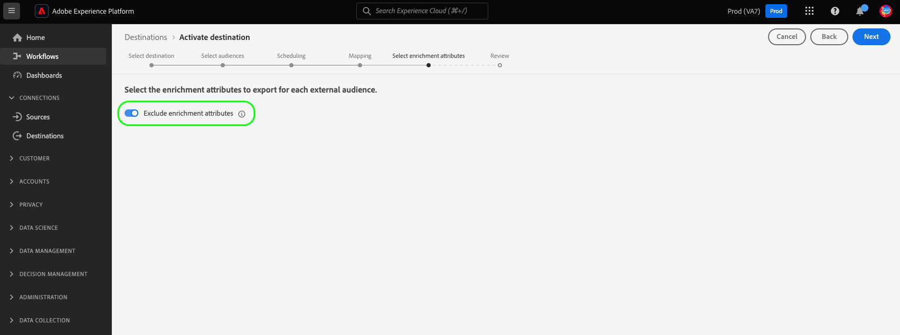

**[!UICONTROL Next]**&#x200B;を選択して、[&#x200B; レビュー](#review) ステップに移動します。

## レビュー {#review}

>[!NOTE]
>
>（データセット全体ではなく）データセット内の特定のフィールドのみに適用されたデータ使用ラベルがある場合、アクティベーション時のこれらのフィールドレベルラベルの適用は、次の条件で行われます。
>
>* フィールドはオーディエンス定義で使用されます。
>* フィールドは、ターゲット先の予測属性として設定されます。
>
> 例えば、フィールド `person.name.firstName` に宛先のマーケティングアクションと競合する特定のデータ使用ラベルがある場合、レビュー手順でデータ使用ポリシー違反が表示されます。 詳しくは、 [!DNL Adobe Experience Platform][&#128279;](../../rtcdp/privacy/data-governance-overview.md#destinations)の データガバナンスを参照してください。

**[!UICONTROL Review]** ページで、選択内容の概要を表示できます。 **[!UICONTROL Cancel]**&#x200B;を選択してフローを分割し、**[!UICONTROL Back]**&#x200B;を選択して設定を変更するか、**[!UICONTROL Finish]**&#x200B;を選択して選択を確定し、宛先へのデータ送信を開始します。

レビュー手順に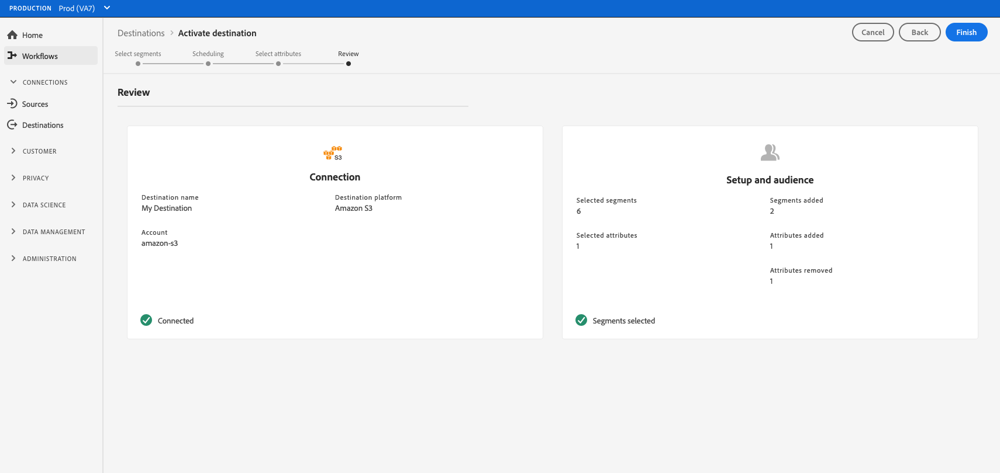

### 同意ポリシーの評価 {#consent-policy-evaluation}

>[!CONTEXTUALHELP]
>id="platform_governance_policies_viewApplicableConsentPolicies"
>title="適用可能な同意ポリシーを表示"
>abstract="お客様の組織が&#x200B;**Adobe Healthcare Shield**&#x200B;または&#x200B;**Adobe Privacy &amp; Security Shield**&#x200B;を購入した場合、**[!UICONTROL View applicable consent policies]**&#x200B;を選択して、適用される同意ポリシーと、その結果としてアクティベーションに含まれるプロファイルの数を確認します。 会社が前述の SKU へのアクセス権を持っていない場合は、このコントロールを無効になります。"

お客様の組織が&#x200B;**Adobe Healthcare Shield**&#x200B;または&#x200B;**Adobe Privacy &amp; Security Shield**&#x200B;を購入した場合、**[!UICONTROL View applicable consent policies]**&#x200B;を選択して、適用される同意ポリシーと、その結果としてアクティベーションに含まれるプロファイルの数を確認します。 詳しくは、[同意ポリシーの評価](/help/data-governance/enforcement/auto-enforcement.md#consent-policy-evaluation)を参照してください。

### データ使用ポリシーチェック {#data-usage-policy-checks}

**[!UICONTROL Review]** ステップでは、Experience Platformもデータ使用ポリシー違反をチェックします。 ポリシーに違反した場合の例を次に示します。 オーディエンスのアクティベーション ワークフローを完了するには、違反を解決する必要があります。 ポリシー違反を解決する方法について詳しくは、「データガバナンスのドキュメント」セクションの[&#x200B; データ使用ポリシー違反](/help/data-governance/enforcement/auto-enforcement.md#data-usage-violation)を参照してください。


### オーディエンスを絞り込む {#filter-audiences}

また、この手順では、ページで使用可能なフィルターを使用して、このワークフローの一部としてスケジュールまたはマッピングが更新されたオーディエンスのみを表示できます。 表示するテーブル列を切り替えることもできます。

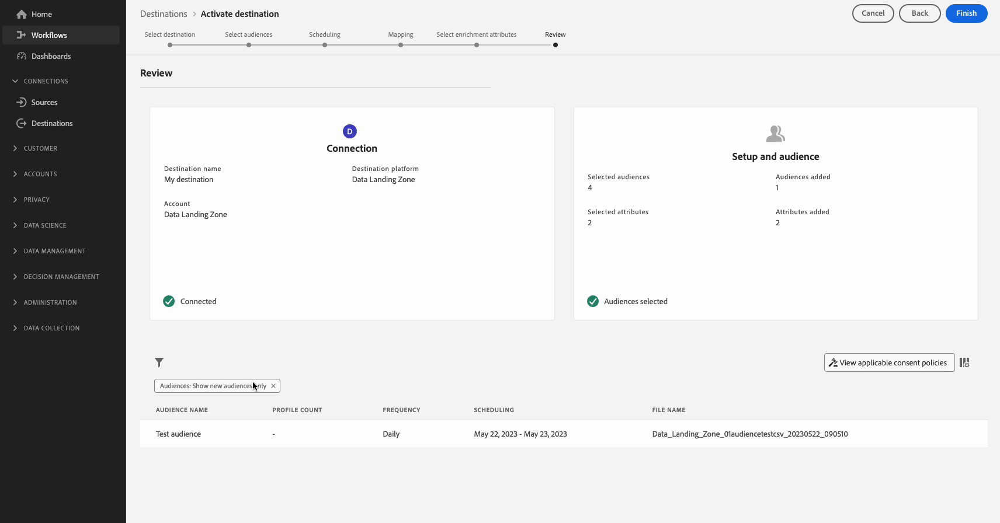

選択に満足しており、ポリシー違反が検出されていない場合は、**[!UICONTROL Finish]**&#x200B;を選択して選択を確認し、宛先へのデータ送信を開始します。

## オーディエンスのアクティブ化の検証 {#verify}

オーディエンスをクラウドストレージの宛先に書き出すと、[!DNL Adobe Experience Platform]は、指定したストレージの場所に`.csv`、`.json`、または`.parquet` ファイルを作成します。 ワークフローで設定したスケジュールに従って、ストレージの場所に新しいファイルが作成されます。 デフォルトのファイル形式は次のようになりますが、[&#x200B; ファイル名のコンポーネントを編集できます](#configure-file-names):
`<destinationName>_segment<segmentID>_<timestamp-yyyymmddhhmmss>.csv`

例えば、書き出し頻度を毎日に選択した場合、連続した 3 日間に受け取るファイルは次のようになります。

```console
Salesforce_Marketing_Cloud_segment12341e18-abcd-49c2-836d-123c88e76c39_20200408061804.csv
Salesforce_Marketing_Cloud_segment12341e18-abcd-49c2-836d-123c88e76c39_20200409052200.csv
Salesforce_Marketing_Cloud_segment12341e18-abcd-49c2-836d-123c88e76c39_20200410061130.csv
```

これらのファイルがストレージの場所に存在すれば、アクティベーションは成功しています。 エクスポートされるファイルの構造を理解するには、[サンプルの .csv ファイルをダウンロード](../assets/common/sample_export_file_segment12341e18-abcd-49c2-836d-123c88e76c39_20200408061804.csv)することができます。 このサンプルファイルには、プロファイル属性 `person.firstname`、`person.lastname`、`person.gender`、`person.birthyear` および `personalEmail.address` が含まれています。
