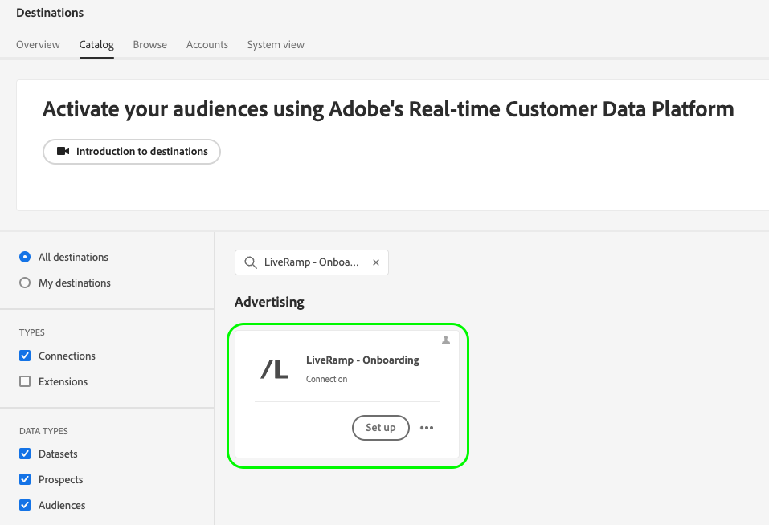
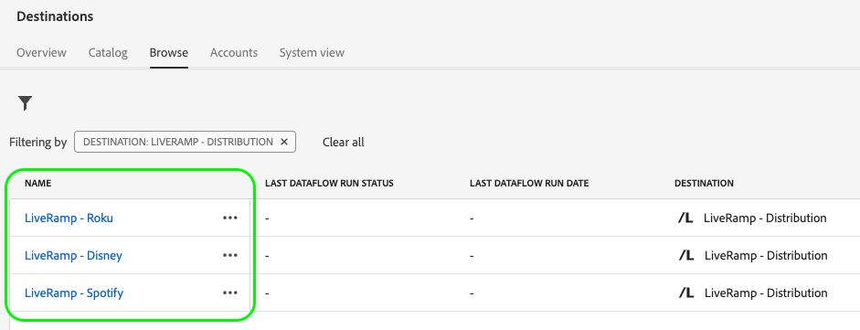

# LiveRamp 識別子に基づいて、キュレーションされた宛先に対するオーディエンスをアクティブ化します

Adobe Real-Time CDP統合のとの使用 [!DNL LiveRamp] を使用するキュレーションされた宛先のリストに対してオーディエンスをアクティブ化するには [!DNL [LiveRamp RampID]](https://docs.liveramp.com/connect/en/interpreting-rampid,-liveramp-s-people-based-identifier.html) アクティベーション用。次に示すような、接続された TV およびオーディオの宛先を含みます。

>[!IMPORTANT]
>
>取り込みや、Experience Platformインターフェイスで LiveRamp RampIDs を使用する必要はありません。
>
> PII ベースの識別子、既知の識別子、カスタム ID など、Real-Time CDPから ID を書き出すことができます ( 公式の [LiveRamp ドキュメント](https://docs.liveramp.com/connect/en/identity-and-identifier-terms-and-concepts.html#known-identifiers). これらの ID は、 [!DNL LiveRamp RampIDs] 活性化プロセスの下流に

* [[!DNL 4C Insights]](#insights)
* [[!DNL Acast]](#acast)
* [[!DNL Ampersand.tv]](#ampersand-tv)
* [[!DNL Captify]](#captify)
* [[!DNL Cardlytics]](#cardlytics)
* [[!DNL Disney (Hulu/ESPN/ABC)]](#disney)
* [[!DNL iHeartMedia]](#iheartmedia)
* [[!DNL Index Exchange]](#index-exchange)
* [[!DNL Magnite CTV Platform]](#magnite)
* [[!DNL Magnite DV+ (Rubicon Project)]](#magnite-dv)
* [[!DNL Nexxen]](#nexxen)
* [[!DNL One Fox]](#fox)
* [[!DNL Pandora]](#pandora)
* [[!DNL Reddit]](#reddit)
* [[!DNL Roku]](#roku)
* [[!DNL Spotify]](#spotify)
* [[!DNL Taboola]](#taboola)
* [[!DNL TargetSpot]](#targetspot)
* [[!DNL Teads]](#teads)
* [[!DNL WB Discovery]](#wb-discovery)

この記事では、Real-Time CDP UI から直接、Real-Time CDPから上記の宛先に対してオーディエンスをアクティブ化するために必要なワークフローについて説明します。

## アクティベーションワークフロー {#workflow}

2 つの手順を実行し、 [LiveRamp - Onboarding](../catalog/advertising/liveramp-onboarding.md) そして [LiveRamp - Distribution](../catalog/advertising/liveramp-distribution.md) 宛先に設定できます（下図を参照）。

まず、オーディエンスをReal-Time CDPから [[!DNL LiveRamp - Onboarding]](../catalog/advertising/liveramp-onboarding.md) の宛先（CSV ファイル）。

オーディエンスをエクスポートした後、 [[!DNL LiveRamp - Distribution]](../catalog/advertising/liveramp-distribution.md) 宛先。

>[!TIP]
>
>このプロセスにより、オーディエンスを [[!DNL Roku]](../catalog/advertising/liveramp-distribution.md#roku), [[!DNL Disney]](../catalog/advertising/liveramp-distribution.md#disney)Real-Time CDP UI から直接、 [!DNL LiveRamp] 有効化するアカウント。

### 手順 1：を通じて、オーディエンスをExperience Platformから LiveRamp に送信する [!DNL LiveRamp - Onboarding] 宛先 {#onboarding}

LiveRamp RampIDs に基づいてキュレーションされた宛先に対してオーディエンスをアクティブ化するために最初におこなう必要があることは、次のとおりです。 **オーディエンスをExperience Platformからにエクスポート[!DNL LiveRamp]**.

これをおこなうには、 **[!DNL LiveRamp - Onboarding]** 宛先。

設定方法については、以下を参照してください。 [!DNL LiveRamp - Onboarding] の宛先に移動して、Experience Platformからオーディエンスをエクスポートする場合は、 [[!DNL LiveRamp - Onboarding]](../catalog/advertising/liveramp-onboarding.md) 宛先のドキュメント。

>[!IMPORTANT]
>
>ファイルを [!DNL LiveRamp - Onboarding] 宛先に書き出す場合、Platform では[結合ポリシー ID](../../profile/merge-policies/overview.md) ごとに 1 つの CSV ファイルを生成します。詳しくは、 [[!DNL LiveRamp - Onboarding]](../catalog/advertising/liveramp-onboarding.md) 宛先のドキュメントを参照してください。

オーディエンスを LiveRamp に正常に書き出したら、次に進みます。 [手順 2](#distribution).

>[!TIP]
>
>に移行する前に [手順 2](#distribution), [validate](../catalog/advertising/liveramp-onboarding.md#exported-data) オーディエンスが LiveRamp に正常に書き出されたことを確認します。 次のドキュメントを参照してください： [宛先データフローの監視](../../dataflows/ui/monitor-destinations.md#dataflow-runs-for-batch-destinations) を参照し、次の特定の監視の詳細を確認します。 [[!DNL LiveRamp - Onboarding]](../catalog/advertising/liveramp-onboarding.md#exported-data).

### 手順 2: [!DNL LiveRamp - Distribution] 宛先 {#distribution}

次の条件が満たされた後 [検証済み](../catalog/advertising/liveramp-onboarding.md#exported-data) オーディエンスが LiveRamp に正常に書き出されたら、次のような優先する宛先に対してオーディエンスをアクティブ化します。 [[!DNL Roku]](../catalog/advertising/liveramp-distribution.md#roku), [[!DNL Disney]](../catalog/advertising/liveramp-distribution.md#disney)など。

オーディエンスをアクティブ化する（でエクスポート） [手順 1](#onboarding)) を使用して、 **[!DNL LiveRamp - Distribution]** 宛先。

設定方法については、以下を参照してください。 **[!DNL LiveRamp - Distribution]** の宛先に移動して、で書き出したオーディエンスをアクティブ化します。 [手順 1](#onboarding)を読む [[!DNL LiveRamp - Distribution]](../catalog/advertising/liveramp-distribution.md) 宛先のドキュメント。

>[!IMPORTANT]
>
>Adobe Analytics の **オーディエンス選択** の手順 **[!DNL LiveRamp - Distribution]** 宛先の場合は、 *全く同じオーディエンス* にエクスポートした [LiveRamp - Onboarding](../catalog/advertising/liveramp-onboarding.md) の宛先 [手順 1](#onboarding).

次を設定する場合、 **[!DNL LiveRamp - Distribution]** の宛先に関しては、使用するダウンストリームの宛先（Roku、Disney など）ごとに専用の接続を作成する必要があります。

>[!TIP]
>
>宛先に名前を付ける場合、Adobeでは次の形式にすることをお勧めします。 `LiveRamp - Downstream Destination Name`. この命名パターンにより、 [参照](../ui/destinations-workspace.md#browse) 「宛先」ワークスペースの「 」タブ
> 
>例：`LiveRamp - Roku`。

## 書き出されたデータ／データ書き出しの検証 {#exported-data}

オーディエンスのへのエクスポートが成功したことを検証するには、以下を実行します。 [[!DNL LiveRamp - Onboarding]](../catalog/advertising/liveramp-onboarding.md) の宛先については、 [宛先データフローの監視](../../dataflows/ui/monitor-destinations.md#dataflow-runs-for-batch-destinations) を参照し、次の特定の監視の詳細を確認します。 [[!DNL LiveRamp - Onboarding]](../catalog/advertising/liveramp-onboarding.md#exported-data).

対象の広告プラットフォーム（Roku、Disney など）に対するオーディエンスのアクティベーションが成功したことを検証するには、宛先プラットフォームアカウントにログインし、アクティベーション指標を確認します。
