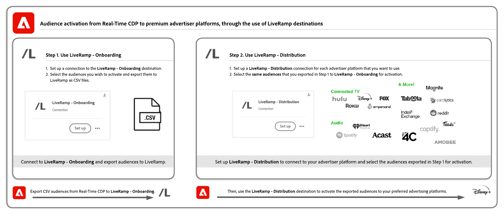
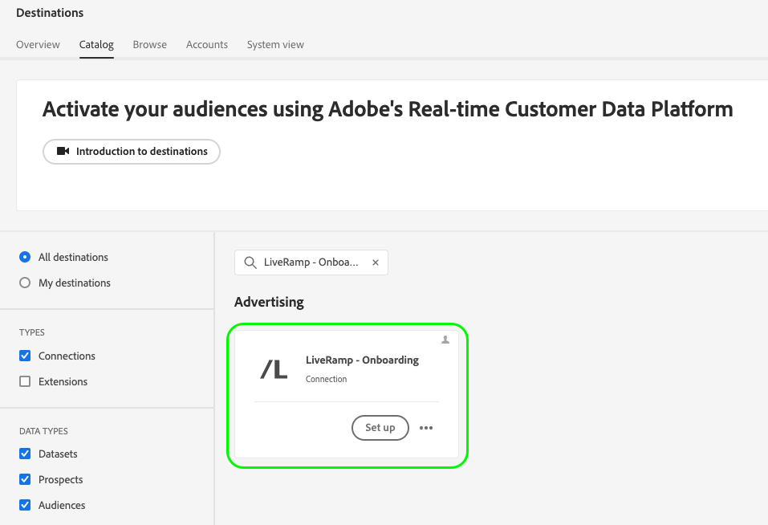
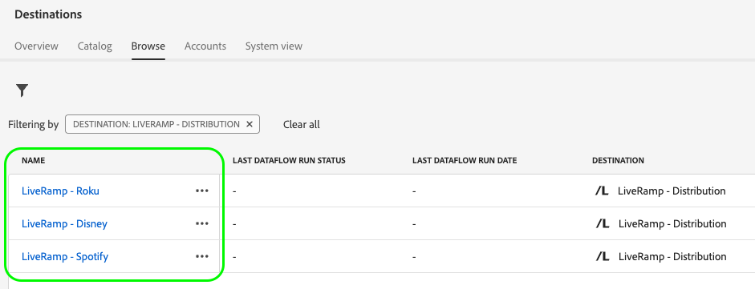

# LiveRampのIDにもとづいて、キュレートされた宛先にオーディエンスをアクティベートします

Adobe [!DNL Real-Time CDP]と[!DNL LiveRamp]の統合を使用して、コネクテッド TVとオーディオの宛先など、[[!DNL [LiveRamp RampID]]](https://docs.liveramp.com/connect/en/interpreting-rampid,-liveramp-s-people-based-identifier.html)をアクティベートに使用する宛先の厳選されたリストに対してオーディエンスをアクティベートします。次に示します。

>[!IMPORTANT]
>
>Experience Platform インターフェイスでLiveRamp RampIDを取り込む必要はなく、どのような方法でも使用できます。
>
> PII ベースのID、既知のID、カスタム IDなど、[!DNL Real-Time CDP]からIDを書き出すことができます。詳しくは、[LiveRampの公式ドキュメント &#x200B;](https://docs.liveramp.com/connect/en/identity-and-identifier-terms-and-concepts.html#known-identifiers)を参照してください。 これらのIDは、アクティベーションプロセスの下流で[!DNL LiveRamp RampIDs]と照合されます。

* [[!DNL 4C Insights]](#insights)
* [[!DNL Acast]](#acast)
* [[!DNL Ampersand.tv]](#ampersand-tv)
* [[!DNL Captify]](#captify)
* [[!DNL Cardlytics]](#cardlytics)
* [[!DNL Disney (Hulu/ESPN/ABC)]](#disney)
* [[!DNL iHeartMedia]](#iheartmedia)
* [[!DNL Index Exchange]](#index-exchange)
* [[!DNL Magnite CTV Platform]](#magnite)
* [[!DNL Magnite DV+ (Rubicon Project)]](#magnite-dv)
* [[!DNL Nexxen]](#nexxen)
* [[!DNL One Fox]](#fox)
* [[!DNL Pandora]](#pandora)
* [[!DNL Reddit]](#reddit)
* [[!DNL Roku]](#roku)
* [[!DNL Spotify]](#spotify)
* [[!DNL Taboola]](#taboola)
* [[!DNL TargetSpot]](#targetspot)
* [[!DNL Teads]](#teads)
* [[!DNL WB Discovery]](#wb-discovery)

この記事では、[!DNL Real-Time CDP]から上記の宛先に対して、[!DNL Real-Time CDP] UIから直接オーディエンスをアクティブ化するために必要なワークフローについて説明します。

## アクティベーションワークフロー {#workflow}

次の画像に示すように、2段階のプロセスを経て、[LiveRamp - オンボーディング &#x200B;](../catalog/advertising/liveramp-onboarding.md)および[LiveRamp - ディストリビューション &#x200B;](../catalog/advertising/liveramp-distribution.md)宛先を使用して、コネクテッド TVおよびオーディオ宛先にオーディエンスをアクティブ化します。

{width="1920" zoomable="yes"}

まず、オーディエンスを[!DNL Real-Time CDP]から[[!DNL LiveRamp - Onboarding]](../catalog/advertising/liveramp-onboarding.md)宛先にCSV ファイルとして書き出します。

オーディエンスを書き出したら、[[!DNL LiveRamp - Distribution]](../catalog/advertising/liveramp-distribution.md)宛先を使用してオーディエンスをアクティブ化します。

>[!TIP]
>
>このプロセスにより、アクティベーションのために[[!DNL Roku]](../catalog/advertising/liveramp-distribution.md#roku) アカウントにログインすることなく、[[!DNL Disney]](../catalog/advertising/liveramp-distribution.md#disney) UIから直接[!DNL Real-Time CDP]、[!DNL LiveRamp]などの宛先にオーディエンスをアクティベートできます。

### ビデオチュートリアル {#video}

このページで説明するワークフローのエンドツーエンドの説明については、次のビデオをご覧ください。

>[!VIDEO](https://video.tv.adobe.com/v/3452655?captions=jpn)

### 手順1: Experience Platformから[!DNL LiveRamp - Onboarding]の宛先を介してLiveRampにオーディエンスを送信する {#onboarding}

LiveRamp RampIDに基づいてオーディエンスをキュレートされた宛先にアクティベートするために最初に行う必要があることは、**Experience Platformから[!DNL LiveRamp]**&#x200B;へのオーディエンスのエクスポートです。

これは、**[!DNL LiveRamp - Onboarding]**&#x200B;宛先を使用して行います。

LiveRamp - オンボーディングの宛先カードを示す

[!DNL LiveRamp - Onboarding]宛先を設定し、Experience Platformからオーディエンスを書き出す方法については、[[!DNL LiveRamp - Onboarding]](../catalog/advertising/liveramp-onboarding.md)宛先ドキュメントを参照してください。

>[!IMPORTANT]
>
>ファイルを[!DNL LiveRamp - Onboarding]宛先に書き出す場合、Experience Platformは、各[結合ポリシーID](../../profile/merge-policies/overview.md)に対して1つのCSV ファイルを生成します。 LiveRampへのデータ書き出しを検証する方法について詳しくは、[[!DNL LiveRamp - Onboarding]](../catalog/advertising/liveramp-onboarding.md)宛先のドキュメントを参照してください。

オーディエンスをLiveRampに正常にエクスポートした後、[手順2](#distribution)に進みます。

>[!TIP]
>
>[手順2](#distribution)に移行する前に、[&#x200B; オーディエンスがLiveRampに正常にエクスポートされたことを検証](../catalog/advertising/liveramp-onboarding.md#exported-data)してください。 [宛先データフローの監視](../../dataflows/ui/monitor-destinations.md#dataflow-runs-for-batch-destinations)に関するドキュメントを参照し、[[!DNL LiveRamp - Onboarding]](../catalog/advertising/liveramp-onboarding.md#exported-data)の監視の詳細についてお読みください。

### 手順2: [!DNL LiveRamp - Distribution]宛先を介して、接続されたテレビおよびオーディオの宛先にオンボーディングされたオーディエンスをアクティブ化する {#distribution}

オーディエンスがLiveRampに正常にエクスポートされたことを[検証](../catalog/advertising/liveramp-onboarding.md#exported-data)したら、[[!DNL Roku]](../catalog/advertising/liveramp-distribution.md#roku)、[[!DNL Disney]](../catalog/advertising/liveramp-distribution.md#disney)など、お好みの宛先にオーディエンスをアクティベートします。

オーディエンス（[&#x200B; ステップ 1](#onboarding)で書き出した）をアクティブ化するには、**[!DNL LiveRamp - Distribution]**&#x200B;宛先を使用します。

LiveRamp – 配布先カードを示す

**[!DNL LiveRamp - Distribution]**&#x200B;宛先を設定し、[手順1](#onboarding)で書き出したオーディエンスをアクティブ化する方法については、[[!DNL LiveRamp - Distribution]](../catalog/advertising/liveramp-distribution.md)宛先ドキュメントを参照してください。

>[!IMPORTANT]
>
>**宛先の** オーディエンス選択&#x200B;**[!DNL LiveRamp - Distribution]** ステップで、*ステップ 1*&#x200B;で[LiveRamp - オンボーディング &#x200B;](../catalog/advertising/liveramp-onboarding.md)宛先に書き出した[まったく同じオーディエンス &#x200B;](#onboarding)を選択する必要があります。

**[!DNL LiveRamp - Distribution]**&#x200B;宛先を設定する場合は、使用するダウンストリーム宛先（Roku、Disneyなど）ごとに専用の接続を作成する必要があります。

>[!TIP]
>
>宛先に名前を付ける場合、Adobeでは次のフォーマットをお勧めします：`LiveRamp - Downstream Destination Name`。 この命名パターンは、宛先ワークスペースの「[参照](../ui/destinations-workspace.md#browse)」タブで宛先をすばやく特定するのに役立ちます。
> 
>例：`LiveRamp - Roku`。

## 書き出されたデータ／データ書き出しの検証 {#exported-data}

オーディエンスの[[!DNL LiveRamp - Onboarding]](../catalog/advertising/liveramp-onboarding.md)宛先への正常な書き出しを検証するには、[宛先データフローの監視](../../dataflows/ui/monitor-destinations.md#dataflow-runs-for-batch-destinations)に関するドキュメントを参照し、[[!DNL LiveRamp - Onboarding]](../catalog/advertising/liveramp-onboarding.md#exported-data)の特定の監視の詳細についてお読みください。

目的の広告プラットフォーム（Roku、Disneyなど）に対するオーディエンスのアクティベーションが成功したことを検証するには、宛先プラットフォームアカウントにログインし、アクティベーション指標を確認します。
