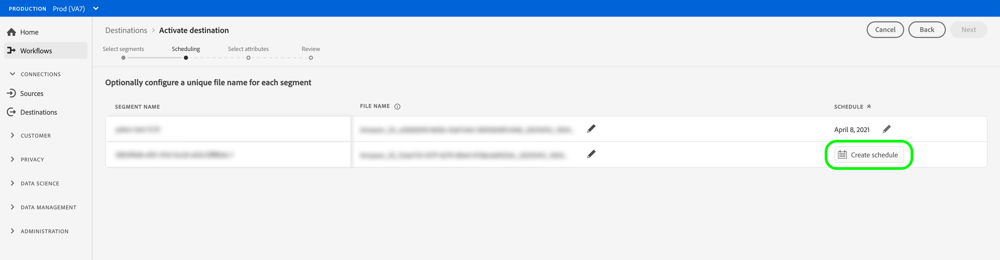

# 宛先へのプロファイルとセグメントのアクティブ化

## 概要 {#overview}

セグメントを宛先にマッピングして、[!DNL Adobe Experience Platform]に保存しているデータをアクティブ化します。 これをおこなうには、次の手順に従います。

## 前提条件 {#prerequisites}

宛先へのデータをアクティブ化するには、[宛先が接続されている](./connect-destination.md)必要があります。まだの場合は、[宛先カタログ](../catalog/overview.md)に移動し 、サポートされている宛先を参照して、1 つ以上の宛先を設定します。

## データのアクティブ化 {#activate-data}

アクティベーションワークフローの手順は、宛先のタイプによって若干異なります。 すべての宛先タイプの完全なワークフローを以下に示します。

## {#select-destination}に対してデータをアクティブ化する宛先を選択します

適用対象：すべての宛先

Adobe Experience Platformユーザーインターフェイスで、 **[!UICONTROL Destinations]** / **[!UICONTROL Browse]**&#x200B;に移動し、次の図に示すように、セグメントをアクティブ化する宛先に対応する&#x200B;**[!UICONTROL Activate]**&#x200B;ボタンをクリックします。


次の節の手順に従って、アクティブ化するセグメントを選択します。

## [!UICONTROL Segmentsstepを] 選択  {#select-segments}

適用対象：すべての宛先


**[!UICONTROL 宛先]**&#x200B;をアクティブ化ワークフローの&#x200B;**[!UICONTROL セグメントを選択]**&#x200B;ページで、宛先に対してアクティブ化する1つ以上のセグメントを選択します。 「**[!UICONTROL 次へ]**」を選択して、次の手順に進みます。


##  マッピング手順 {#mapping}

>[!CONTEXTUALHELP]
>id="platform_destinations_activate_applytransformation"
>title="変換の適用"
>abstract="非ハッシュ化のソースフィールドを使用する場合は、このオプションをオンにして、Adobe Experience Platformでアクティベーション時に自動的にハッシュ化するようにします。"

適用対象：ソーシャルの宛先とGoogleカスタマーマッチの広告の宛先


ソーシャルの宛先の場合、宛先でターゲットIDとしてマッピングするソース属性またはID名前空間を選択する必要があります。

## 例：[!DNL Facebook Custom Audience] {#example-facebook}でのオーディエンスデータのアクティブ化

以下に、[!DNL Facebook]でオーディエンスデータをアクティブ化する際の正しいIDマッピングの例を示します。

ソースフィールドの選択：

* 使用している電子メールアドレスがハッシュ化されていない場合は、`Email`名前空間をソースIDとして選択します。
* [!DNL Facebook] [電子メールハッシュ要件](../catalog/social/facebook.md#email-hashing-requirements)に従って、[!DNL Platform]にデータを取り込む際に顧客の電子メールアドレスをハッシュ化した場合は、`Email_LC_SHA256`名前空間をソースIDとして選択します。
* データがハッシュ化されていない電話番号で構成されている場合は、`PHONE_E.164`名前空間をソースIDとして選択します。 [!DNL Platform] は、要件に従って電話番号をハッシュ化 [!DNL Facebook] します。
* [!DNL Facebook] [電話番号のハッシュ要件](../catalog/social/facebook.md#phone-number-hashing-requirements)に従って[!DNL Platform]にデータを取り込む際に電話番号をハッシュ化した場合は、`Phone_SHA256`名前空間をソースIDとして選択します。
* データが[!DNL Apple]デバイスIDで構成されている場合は、`IDFA`名前空間をソースIDとして選択します。
* データが[!DNL Android]デバイスIDで構成されている場合は、`GAID`名前空間をソースIDとして選択します。
* データが他のタイプの識別子で構成されている場合は、`Custom`名前空間をソースIDとして選択します。

ターゲットフィールドの選択：

* ソース名前空間が`Email`または`Email_LC_SHA256`の場合、`Email_LC_SHA256`名前空間をターゲットIDとして選択します。
* ソース名前空間が`PHONE_E.164`または`Phone_SHA256`の場合、`Phone_SHA256`名前空間をターゲットIDとして選択します。
* ソース名前空間が`IDFA`または`GAID`の場合、`IDFA`または`GAID`の名前空間をターゲットIDとして選択します。
* ソース名前空間がカスタムの場合は、`Extern_ID`名前空間をターゲットIDとして選択します。


ハッシュ化されていない名前空間のデータは、アクティブ化時に[!DNL Platform]によって自動的にハッシュ化されます。

属性ソースのデータは自動的にハッシュ化されません。 ソースフィールドにハッシュ化されていない属性が含まれている場合、「**[!UICONTROL 変換を適用]**」オプションをオンにして、アクティブ化時に[!DNL Platform]でデータを自動的にハッシュ化します。


 

## 例：[!DNL Google Customer Match] {#example-gcm}でのオーディエンスデータのアクティブ化

これは、[!DNL Google Customer Match]でオーディエンスデータをアクティブ化する際の正しいIDマッピングの例です。

ソースフィールドの選択：

* 使用している電子メールアドレスがハッシュ化されていない場合は、`Email`名前空間をソースIDとして選択します。
* [!DNL Google Customer Match] [電子メールハッシュ要件](../catalog/social/../advertising/google-customer-match.md)に従って、[!DNL Platform]にデータを取り込む際に顧客の電子メールアドレスをハッシュ化した場合は、`Email_LC_SHA256`名前空間をソースIDとして選択します。
* データがハッシュ化されていない電話番号で構成されている場合は、`PHONE_E.164`名前空間をソースIDとして選択します。 [!DNL Platform] は、要件に従って電話番号をハッシュ化 [!DNL Google Customer Match] します。
* [!DNL Facebook] [電話番号のハッシュ要件](../catalog/social/../advertising/google-customer-match.md)に従って[!DNL Platform]にデータを取り込む際に電話番号をハッシュ化した場合は、`Phone_SHA256_E.164`名前空間をソースIDとして選択します。
* データが[!DNL Apple]デバイスIDで構成されている場合は、`IDFA`名前空間をソースIDとして選択します。
* データが[!DNL Android]デバイスIDで構成されている場合は、`GAID`名前空間をソースIDとして選択します。
* データが他のタイプの識別子で構成されている場合は、`Custom`名前空間をソースIDとして選択します。

ターゲットフィールドの選択：

* ソース名前空間が`Email`または`Email_LC_SHA256`の場合、`Email_LC_SHA256`名前空間をターゲットIDとして選択します。
* ソース名前空間が`PHONE_E.164`または`Phone_SHA256_E.164`の場合、`Phone_SHA256_E.164`名前空間をターゲットIDとして選択します。
* ソース名前空間が`IDFA`または`GAID`の場合、`IDFA`または`GAID`の名前空間をターゲットIDとして選択します。
* ソース名前空間がカスタムの場合は、`User_ID`名前空間をターゲットIDとして選択します。


ハッシュ化されていない名前空間のデータは、アクティブ化時に[!DNL Platform]によって自動的にハッシュ化されます。

属性ソースのデータは自動的にハッシュ化されません。 ソースフィールドにハッシュ化されていない属性が含まれている場合、「**[!UICONTROL 変換を適用]**」オプションをオンにして、アクティブ化時に[!DNL Platform]でデータを自動的にハッシュ化します。


## **** スケジュール手順 {#scheduling}

適用対象：電子メールマーケティングの宛先とクラウドストレージの宛先


[!DNL Adobe Experience Platform] 電子メールマーケティングおよびクラウドストレージの宛先のデータをファイルの形式で書き [!DNL CSV] 出します。**[!UICONTROL スケジュール]**&#x200B;の手順で、エクスポートする各セグメントのスケジュールとファイル名を設定できます。 スケジュールの設定は必須ですが、ファイル名の設定はオプションです。

>[!IMPORTANT]
> 
>[!DNL Adobe Experience Platform] は、エクスポートファイルを1ファイルあたり500万レコード（行）に自動的に分割します。各行は、1つのプロファイルを表します。
>
>分割ファイル名には、ファイルが大きなエクスポートの一部であることを示す数字が付加されます。例：`filename.csv`、`filename_2.csv`、`filename_3.csv`。

宛先に送信するセグメントに対応する「**[!UICONTROL スケジュール]**&#x200B;を作成」ボタンを選択します。



### 完全なファイル{#export-full-files}を書き出す

「**[!UICONTROL 完全なファイルをエクスポート]**」を選択すると、エクスポートしたファイルに、そのセグメントに適合するすべてのプロファイルの完全なスナップショットが含まれます。


1. **[!UICONTROL 頻度]**&#x200B;セレクターを使用して、1回（**[!UICONTROL 1回]**）書き出しか&#x200B;**[!UICONTROL 毎日]**&#x200B;書き出しかを選択します。 完全なファイル&#x200B;**[!UICONTROL Daily]**&#x200B;をエクスポートすると、毎日、開始日から終了日の午前12時（ESTの午後7時）にファイルがエクスポートされます。
2. **[!UICONTROL 時間]**&#x200B;セレクターを使用して、エクスポートを実行する時刻を[!DNL UTC]形式で選択します。 ファイル&#x200B;**[!UICONTROL Daily]**&#x200B;をエクスポートすると、毎日、開始日から選択した時刻の終了日まで、ファイルがエクスポートされます。

   >[!IMPORTANT]
   >
   >特定の時刻にファイルをエクスポートするオプションは、現在ベータ版で、ご利用のお客様は限定できます。

3. **[!UICONTROL 日付]**&#x200B;セレクターを使用して、エクスポートを実行する日または間隔を選択します。
4. 「**[!UICONTROL 作成]**」を選択してスケジュールを保存します。

### 増分ファイル{#export-incremental-files}を書き出す

「**[!UICONTROL 増分ファイルを書き出し]**」を選択すると、書き出したファイルには、最後の書き出し以降にそのセグメントで認定されたプロファイルのみが含まれます。

>[!IMPORTANT]
>
>最初に書き出された増分ファイルには、セグメントの対象として認定されるすべてのプロファイルが含まれ、バックフィルとして機能します。


1. **[!UICONTROL 頻度]**&#x200B;セレクターを使用して、**[!UICONTROL 日別]**&#x200B;または&#x200B;**[!UICONTROL 時間別]**&#x200B;の書き出しを選択します。 増分ファイル&#x200B;**[!UICONTROL Daily]**&#x200B;をエクスポートすると、毎日、開始日から終了日の午後12:00 UTC（ESTの午前7:00）にファイルがエクスポートされます。
   * **[!UICONTROL 時間別]**&#x200B;を選択する場合は、**[!UICONTROL 各]**&#x200B;セレクターを使用して、**[!UICONTROL 3]**、**[!UICONTROL 6]**、**[!UICONTROL 8]**、**[!UICONTROL 12]**&#x200B;時間のオプションを選択します。

      >[!IMPORTANT]
      >
      >増分ファイルを3時間、6時間、8時間または12時間ごとに書き出すオプションは現在ベータ版で、限られた数のお客様のみが利用できます。 ベータ版以外のお客様は、増分ファイルを1日に1回書き出すことができます。

2. **[!UICONTROL 時間]**&#x200B;セレクターを使用して、エクスポートを実行する時刻を[!DNL UTC]形式で選択します。

   >[!IMPORTANT]
   >
   >エクスポートの時刻を選択するオプションは、一部の顧客にのみ使用できます。 ベータ版以外のお客様は、増分ファイルを1日1回(UTCの午後12:00（ESTの午前7時）に書き出すことができます。

3. **[!UICONTROL 日付]**&#x200B;セレクターを使用して、エクスポートを実行する日または間隔を選択します。
4. 「**[!UICONTROL 作成]**」を選択してスケジュールを保存します。

### ファイル名{#file-names}を設定します。

デフォルトのファイル名は、宛先名、セグメントID、日時インジケーターで構成されます。 例えば、エクスポートしたファイル名を編集して、異なるキャンペーンを区別したり、データのエクスポート時間をファイルに追加したりできます。

鉛筆アイコンを選択してモーダルウィンドウを開き、ファイル名を編集します。 ファイル名は255文字までに制限されています。


ファイル名エディターで、別のコンポーネントを選択してファイル名に追加できます。


宛先名とセグメントIDは、ファイル名から削除できません。 これらに加えて、次を追加できます。

* **[!UICONTROL セグメント名]**:ファイル名にセグメント名を追加できます。
* **[!UICONTROL 日時]**:ファイルが生成され `MMDDYYYY_HHMMSS` た時刻の形式またはUnixの10桁のタイムスタンプを追加するかを選択します。各増分エクスポートで生成される動的ファイル名をファイルに含める場合は、これらのオプションの1つを選択します。
* **[!UICONTROL カスタムテキスト]**:ファイル名にカスタムテキストを追加します。

「**[!UICONTROL 変更を適用]**」を選択して、選択を確定します。

>[!IMPORTANT]
> 
>**[!UICONTROL 日時]**&#x200B;コンポーネントを選択しない場合、ファイル名は静的になり、新しく書き出されたファイルによって、保存場所にある以前のファイルが書き出しごとに上書きされます。 ストレージの場所から電子メールマーケティングプラットフォームに繰り返しインポートジョブを実行する場合は、このオプションをお勧めします。

すべてのセグメントの設定が完了したら、「**[!UICONTROL 次へ]**」を選択して続行します。

## **[!UICONTROL セグメントスケジュ]** ール  {#segment-schedule}

適用対象：広告の宛先，ソーシャルの宛先


**[!UICONTROL セグメントスケジュール]**&#x200B;ページで、宛先へのデータ送信の開始日と頻度を設定できます。

>[!IMPORTANT]
>
>ソーシャルの宛先の場合は、この手順でオーディエンスの接触チャネルを選択する必要があります。次の手順に進むには、まず次の画像のオプションのいずれかを選択してください。


>[!IMPORTANT]
>
>Googleカスタマーマッチの場合、この手順で[!DNL IDFA]または[!DNL GAID]セグメントをアクティブ化する際に、[!UICONTROL アプリID]を指定する必要があります。


## **[!UICONTROL 属性の]** 選択  {#select-attributes}

適用対象：eメールマーケティングの宛先とクラウドストレージの宛先


**[!UICONTROL 属性を選択]**&#x200B;ページで、「**[!UICONTROL 新しいフィールドを追加]**」を選択し、宛先に送信する属性を選択します。

>[!NOTE]
>
> Adobe Experience Platformは、スキーマの4つの推奨される、一般的に使用される属性を使用して、選択内容を事前入力します。`person.name.firstName`、`person.name.lastName`、`personalEmail.address`、`segmentMembership.status`。

ファイルのエクスポート方法は、`segmentMembership.status`が選択されているかどうかによって異なります。
* 「`segmentMembership.status`」フィールドを選択した場合、エクスポートされるファイルには、最初のフルスナップショットの「**[!UICONTROL アクティブ]**」メンバーと、後続の増分エクスポートの「**[!UICONTROL アクティブ]**」および「**[!UICONTROL 期限切れ]**」メンバーが含まれます。
* 「 `segmentMembership.status` 」フィールドが選択されていない場合、エクスポートされるファイルには、最初の完全なスナップショットとそれ以降の増分エクスポートで、**[!UICONTROL アクティブ]**&#x200B;メンバーのみが含まれます。


### 必須属性{#mandatory-attributes}

>[!CONTEXTUALHELP]
>id="platform_destinations_activate_mandatorykey"
>title="必須属性について"
>abstract="書き出されたすべてのプロファイルに含める必要があるXDMスキーマ属性を選択します。 必須キーのないプロファイルは、宛先にエクスポートされません。 必須キーを選択しない場合、属性に関係なく、対象となるすべてのプロファイルがエクスポートされます。"
>additional-url="http://www.adobe.com/go/destinations-mandatory-attributes-en" text="詳しくは、ドキュメントを参照してください。"

[!DNL Platform]が特定の属性を含むプロファイルのみを書き出すように、属性を必須としてマークできます。 その結果、追加のフィルタリング形式として使用できます。 属性を必須としてマークする必要は&#x200B;**ありません**。

必須の属性を選択しない場合、属性に関係なく、すべての適合済みプロファイルがエクスポートされます。

属性の1つを、スキーマの[一意の識別子](../../destinations/catalog/email-marketing/overview.md#identity)にすることをお勧めします。 必須属性について詳しくは、[Eメールマーケティングの宛先](../../destinations/catalog/email-marketing/overview.md#identity)ドキュメントのIDに関する節を参照してください。

### 重複排除キー{#deduplication-keys}

>[!CONTEXTUALHELP]
>id="platform_destinations_activate_deduplicationkey"
>title="重複排除キーについて"
>abstract="重複排除キーを選択することで、エクスポートファイル内の同じプロファイルの複数のレコードを排除します。 1つの名前空間または最大2つのXDMスキーマ属性を重複排除キーとして選択します。 重複排除キーを選択しないと、エクスポートファイルでプロファイルエントリが重複する場合があります。"
>additional-url="http://www.adobe.com/go/destinations-deduplication-keys-en" text="詳しくは、ドキュメントを参照してください。"

>[!IMPORTANT]
>
>重複排除キーを使用するオプションは現在ベータ版で、ご利用いただけるお客様は限定版です。

重複排除キーを使用すると、同じプロファイルの複数のレコードを1つのエクスポートファイルに含める可能性を排除できます。

[!DNL Platform]で重複排除キーを使用する方法は3つあります。

* 単一のID名前空間を[!UICONTROL 重複排除キー]として使用
* [!DNL XDM]プロファイルの単一のプロファイル属性を[!UICONTROL 重複排除キー]として使用
* [!DNL XDM]プロファイルの2つのプロファイル属性の組み合わせを複合キーとして使用する

>[!IMPORTANT]
>
> 単一のID名前空間を宛先に書き出すことができ、名前空間は重複排除キーとして自動的に設定されます。 宛先への複数の名前空間の送信はサポートされていません。
> 
> ID名前空間とプロファイル属性の組み合わせを重複排除キーとして使用することはできません。

### 重複排除の例{#deduplication-example}

次の例は、選択した重複排除キーに応じた重複排除の仕組みを示しています。

次の2つのプロファイルについて考えてみましょう。

**プロファイルA**

```json
{
  "identityMap": {
    "Email": [
      {
        "id": "johndoe_1@example.com"
      },
      {
        "id": "johndoe_2@example.com"
      }
    ]
  },
  "segmentMembership": {
    "ups": {
      "fa5c4622-6847-4199-8dd4-8b7c7c7ed1d6": {
        "status": "existing",
        "lastQualificationTime": "2021-03-10 10:03:08"
      }
    }
  },
  "person": {
    "name": {
      "lastName": "Doe",
      "firstName": "John"
    }
  },
  "personalEmail": {
    "address": "johndoe@example.com"
  }
}
```

**プロファイルB**

```json
{
  "identityMap": {
    "Email": [
      {
        "id": "johndoe_1@example.com"
      },
      {
        "id": "johndoe_2@example.com"
      }
    ]
  },
  "segmentMembership": {
    "ups": {
      "fa5c4622-6847-4199-8dd4-8b7c7c7ed1d6": {
        "status": "existing",
        "lastQualificationTime": "2021-04-10 11:33:28"
      }
    }
  },
  "person": {
    "name": {
      "lastName": "D",
      "firstName": "John"
    }
  },
  "personalEmail": {
    "address": "johndoe@example.com"
  }
}
```

### 重複排除の使用例1:重複排除なし

重複排除を使用しない場合、エクスポートファイルには次のエントリが含まれます。

| personalEmail | firstName | lastName |
|---|---|---|
| johndoe@example.com | John | Doe |
| johndoe@example.com | John | D |


### 重複排除の使用例2:id名前空間に基づく重複排除

[!DNL Email]名前空間による重複排除を想定すると、書き出しファイルには次のエントリが含まれます。 プロファイルBはセグメントに適合する最新のものなので、書き出されるのはプロファイルBのみです。

| メール* | personalEmail | firstName | lastName |
|---|---|---|---|
| johndoe_1@example.com | johndoe@example.com | John | D |
| johndoe_2@example.com | johndoe@example.com | John | D |

### 重複排除の使用例3:単一のプロファイル属性に基づく重複排除

`personal Email`属性による重複排除を想定すると、書き出しファイルには次のエントリが含まれます。 プロファイルBはセグメントに適合する最新のものなので、書き出されるのはプロファイルBのみです。

| personalEmail* | firstName | lastName |
|---|---|---|
| johndoe@example.com | John | D |


### 重複排除の使用例4:2つのプロファイル属性に基づく重複排除（複合重複排除キー）

複合キー`personalEmail + lastName`による重複排除を想定すると、エクスポートファイルには次のエントリが含まれます。

| personalEmail* | lastName* | firstName |
|---|---|---|
| johndoe@example.com | D | John |
| johndoe@example.com | Doe | John |


Adobeでは、すべてのプロファイルレコードが一意に識別されるように、[!DNL CRM ID]やEメールアドレスなどのID名前空間を重複排除キーとして選択することをお勧めします。

>[!NOTE]
> 
>データセット内の特定のフィールドに（データセット全体ではなく）データ使用ラベルが適用されている場合、アクティブ化時にこれらのフィールドレベルのラベルが適用されます。
>
>* これらのフィールドは、セグメント定義で使用されます。
>* フィールドは、ターゲット先の予測属性として設定されます。

>
> 
例えば、フィールド`person.name.firstName`に、宛先のマーケティングアクションと競合する特定のデータ使用ラベルが含まれている場合、レビュー手順でデータ使用ポリシー違反が表示されます。 詳しくは、「[Adobe Experience Platformのデータガバナンス](../../rtcdp/privacy/data-governance-overview.md#destinations)」を参照してください。

## **** Reviewstep {#review}

適用対象：すべての宛先


「**[!UICONTROL 確認]**」ページには、選択の概要が表示されます。「**[!UICONTROL キャンセル]**」を選択してフローを分割するか、「**[!UICONTROL 戻る]**」を選択して設定を変更する、または、「**[!UICONTROL 完了]**」を選択して確定し、宛先へのデータの送信を開始します。

>[!IMPORTANT]
>
>この手順では、Adobe Experience Platformはデータ使用ポリシーの違反を確認します。 次に、ポリシーに違反する例を示します。 違反を解決するまで、セグメントのアクティベーションワークフローを完了することはできません。 ポリシー違反の解決方法について詳しくは、データガバナンスのドキュメントの節の「[ポリシーの適用](../../rtcdp/privacy/data-governance-overview.md#enforcement)」を参照してください。


ポリシー違反が検出されなかった場合は、「**[!UICONTROL 完了]**」を選択して選択内容を確認し、宛先へのデータの送信を開始します。


## セグメントのアクティベーションが成功したことを確認します。 {#verify-activation}

### 電子メールマーケティングの宛先およびクラウドストレージの宛先  {#esp-and-cloud-storage}

電子メールマーケティングの宛先とクラウドストレージの宛先の場合、Adobe Experience Platformはストレージの指定した場所にタブ区切りの`.csv`ファイルを作成します。 新しいファイルはストレージの場所に毎日作成されます。デフォルトのファイル形式は次のとおりです。
`<destinationName>_segment<segmentID>_<timestamp-yyyymmddhhmmss>.csv`

3 日連続で受け取るファイルは次のようになります。

```console
Salesforce_Marketing_Cloud_segment12341e18-abcd-49c2-836d-123c88e76c39_20200408061804.csv
Salesforce_Marketing_Cloud_segment12341e18-abcd-49c2-836d-123c88e76c39_20200409052200.csv
Salesforce_Marketing_Cloud_segment12341e18-abcd-49c2-836d-123c88e76c39_20200410061130.csv
```

これらのファイルがストレージの場所に存在すれば、アクティベーションは成功しています。書き出されたファイルの構造を理解するには、サンプルの.csvファイル](../assets/common/sample_export_file_segment12341e18-abcd-49c2-836d-123c88e76c39_20200408061804.csv)を[ダウンロードします。 このサンプルファイルには、プロファイル属性`person.firstname`、`person.lastname`、`person.gender`、`person.birthyear`、`personalEmail.address`が含まれます。

## 広告の宛先

データをアクティブ化する対象の広告の宛先にあるアカウントを確認します。 アクティベーションに成功した場合、オーディエンスは広告プラットフォームに入力されます。

## ソーシャルの宛先

[!DNL Facebook]の場合、アクティブ化が成功すると、[[!UICONTROL Facebook Ads Manager]](https://www.facebook.com/adsmanager/manage/)で[!DNL Facebook]カスタムオーディエンスがプログラムによって作成されます。 ユーザーがアクティブ化されたセグメントに対してオーディエンスが資格を持つかどうかによって、ユーザーのセグメントメンバーシップが追加および削除されます。

>[!TIP]
>
>Adobe Experience Platformと[!DNL Facebook]の統合では、履歴オーディエンスのバックフィルがサポートされます。 宛先に対してセグメントをアクティブ化すると、すべての過去のセグメント認定が[!DNL Facebook]に送信されます。

## アクティベーションの無効化 {#disable-activation}

既存のアクティベーションフローを無効化するには、次の手順に従います。

1. 左側のナビゲーションバーで「**[!UICONTROL 宛先]**」を選択し、「**[!UICONTROL 参照]**」タブをクリックして、宛先名をクリックします。
2. 右側のパネルの「**[!UICONTROL 有効]**」コントロールをクリックして、アクティベーションフローの状態を変更します。
3. **データフロー状態の更新**&#x200B;ウィンドウで、「**確認**」を選択してアクティベーションフローを無効にします。
