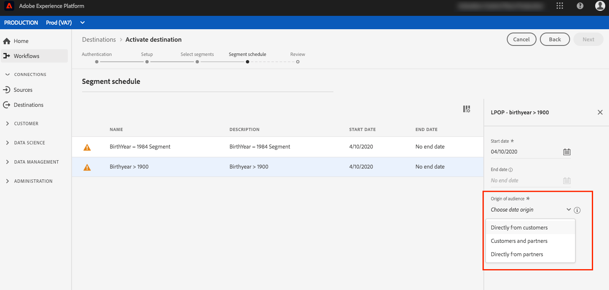

# 宛先へのプロファイルとセグメントのアクティブ化

セグメントを宛先にマッピングして、リアルタイム顧客データプラットフォームでのデータをアクティブ化します。 これをおこなうには、次の手順に従います。

## 前提条件 {#prerequisites}

宛先へのデータをアクティブ化するには、[宛先が接続されている](./connect-destination.md)必要があります。まだの場合は、[宛先カタログ](../catalog/overview.md)に移動し 、サポートされている宛先を参照して、1 つ以上の宛先を設定します。

## データのアクティブ化 {#activate-data}

アクティベーションワークフローの手順は、宛先のタイプによって若干異なります。 すべてのタイプの宛先に対する完全なワークフローを以下に示します。

### データをアクティブにする宛先の選択 {#select-destination}

適用先：すべての宛先

Real-time CDPユーザー・インタフェースで、 **[!UICONTROL Destinations]** / **[!UICONTROL Browse]**（宛先）に移動し、セグメントをアクティブにする宛先を選択します。


アクティベーションワークフローに移動する宛先の名前を選択します。


宛先に対するアクティベーションワークフローが既に存在する場合は、その宛先に対して現在アクティブ化されているセグメントを確認できます。 右側のパネルで「**[!UICONTROL アクティベーションの編集]**」を選択し、以下の手順に従ってアクティベーションの詳細を変更します。

宛先を選択したら、「 **[!UICONTROL アクティブ化]**」を選択します。

### [!UICONTROL セグメントの選択] 手順 {#select-segments}

適用先：すべての宛先


In the **[!UICONTROL Activate destination]** workflow, on the **[!UICONTROL Select Segments]** page, select one or more segments to activate to the destination. 「 **[!UICONTROL 次へ]** 」を選択して、次の手順に進みます。


### [!UICONTROL IDマッピング] 手順 {#identity-mapping}

適用先：ソーシャルリンク先とGoogle Customer Matchの広告先


ソーシャル宛先の場合は、ソース属性を選択して、宛先のターゲットIDとしてマッピングできます。 この手順は、スキーマで使用しているプライマリIDに応じて、オプションまたは必須です。

スキーマでプライマリIDとして電子メールアドレスを使用している場合は、次に示すように、IDマッピング手順をスキップできます。


スキーマでプライマリIDとして「報酬ID」や「忠誠度ID」など別のIDを使用する場合は、次に示すように、IDスキーマからの電子メールアドレスをソーシャル宛先のターゲットIDとして手動でマッピングする必要があります。


Adobe Experience Platformへのデータ取り込み時に、電子メールのハッシュ要件に従って顧客の電子メールアドレスをハッシュ化した場合は、ターゲットID `Email_LC_SHA256` として選択し [!DNL Facebook] ます [](/help/rtcdp/destinations/facebook-destination.md#email-hashing-requirements)。

使用している電子メールアドレス `Email` がハッシュ化されていない場合は、ターゲットIDを選択します。 リアルタイムCDPは、 [!DNL Facebook] 要件を満たすためにメール・アドレスをハッシュ化します。


### **[!UICONTROL 設定手順]** {#configure}

適用先：電子メールマーケティングの宛先とクラウドストレージの宛先


「 **[!UICONTROL 設定]** 」の手順では、書き出す各セグメントのスケジュールとファイル名を設定できます。 スケジュールの設定は必須ですが、ファイル名の設定はオプションです。

セグメントのスケジュールを追加するには、「スケジュールを **[!UICONTROL 作成]**」を選択します。


ポッパーが表示され、セグメントスケジュールを作成するためのオプションが表示されます。

- **ファイルのエクスポート**:フルファイルまたはインクリメンタルファイルを書き出すことができます。 フルファイルをエクスポートすると、そのセグメントに該当するすべてのプロファイルの完全なスナップショットが公開されます。 インクリメンタルファイルをエクスポートすると、前回のエクスポート以降、そのセグメントに該当するプロファイルの差分が発行されます。
- **頻度**:「フルファイルを **[!UICONTROL 書き出し]** 」を選択した場合 **[!UICONTROL 、「]** 1回 **[!UICONTROL 」または「]**&#x200B;毎日」を書き出すことができます。 [ **[!UICONTROL 増分ファイルの]** 書き出し **を選択した場合は]**、[毎日]のみを書き出すことができます。 ファイルのエクスポート **[!UICONTROL 一度]** 1回だけファイルをエクスポートします。 ファイルのエクスポート **[!UICONTROL 毎日]** ：ファイルを開始日から終了日の12:00 AM UTC（米国東部標準時の午後7:00 PM）に毎日エクスポートします。ファイルが選択されている場合は、午後12:00 UTC（米国東部標準時の午前7:00 AM EST）。
- **日付**:「 **[!UICONTROL 1回のみ]** 」を選択した場合は、1回限りのエクスポートの日付を選択できます。 「 **[!UICONTROL 毎日]** 」を選択した場合は、エクスポートの開始日と終了日を選択できます。


デフォルトのファイル名は、宛先名、セグメントID、日時インジケーターで構成されます。 例えば、異なるキャンペーンを区別したり、ファイルにデータの書き出し時間を付けたりするために、書き出したファイル名を編集できます。

鉛筆アイコンを選択してモーダルウィンドウを開き、ファイル名を編集します。 ファイル名は255文字までに制限されます。


ファイル名エディターで、別のコンポーネントを選択してファイル名に追加できます。 宛先名とセグメントIDはファイル名から削除できません。 これらに加えて、次を追加できます。

- **[!UICONTROL セグメント名]**:ファイル名にセグメント名を追加できます。
- **[!UICONTROL 日時]**:形式を追加するか、ファイルが生成される時刻の10桁のタイムスタンプをUnixに追加するかを選択します。 `MMDDYYYY_HHMMSS` ファイルに、増分書き出しのたびに動的なファイル名を生成する場合は、次のいずれかのオプションを選択します。
- **[!UICONTROL カスタムテキスト]**:ファイル名追加にカスタムテキストを追加します。

「 **[!UICONTROL Apply changes]** 」を選択して、選択を確認します。

>[!IMPORTANT]
> 
>「 **[!UICONTROL 日付と時間]** 」コンポーネントを選択しない場合、ファイル名は静的になり、新しくエクスポートされたファイルによって、ストレージー上の前のファイルが上書きされ、各エクスポートで上書きされます。 ストレージの場所から電子メールマーケティングプラットフォームに定期的にインポートジョブを実行する場合は、このオプションをお勧めします。


すべてのセグメントの設定が完了したら、「 **[!UICONTROL 次へ]** 」を選択して続行します。

### **[!UICONTROL セグメントスケジュール]** 手順 {#segment-schedule}

適用先：広告の宛先、ソーシャルの宛先


On the **[!UICONTROL Segment schedule]** page, you can set the start date for sending data to the destination, as well as the frequency of sending data to the destination.

>[!IMPORTANT]
>
>ソーシャルの宛先の場合は、この手順でオーディエンスの接触チャネルを選択する必要があります。次の手順に進むには、まず次の画像のオプションのいずれかを選択してください。



### **[!UICONTROL スケジュール]** 手順 {#scheduling}

適用先：電子メールマーケティングの宛先とクラウドストレージの宛先


On the **[!UICONTROL Scheduling]** page, you can see the start date for sending data to the destination as well as the frequency of sending data to the destination. これらの値は編集できません。

### **[!UICONTROL 属性の選択]** 手順 {#select-attributes}

適用先：電子メールマーケティングの宛先とクラウドストレージの宛先


On the **[!UICONTROL Select attributes]** page, select **[!UICONTROL Add new field]** and choose the attributes that you want to send to the destination.

>[!NOTE]
>
> Real-time CDPは、お客様のスキーマから推奨される、一般的に使用される4つの属性で、お客様の選択範囲を事前入力します。 `person.name.firstName`、 `person.name.lastName`、 `personalEmail.address`、 `segmentMembership.status`。

ファイルのエクスポートは、選択されているかどうかに応じて、次の方法で異な `segmentMembership.status` ります。
- この `segmentMembership.status` フィールドを選択した場合、エクスポートされたファイルには、最初の完全なスナップショットに「アクティブ **[!UICONTROL 」メンバーが含まれ、以降の増分エクスポートには「]** アクティブ **[!UICONTROL 」メンバーと「]** 期限切れ **** 」メンバーが含まれます。
- この `segmentMembership.status` フィールドを選択しない場合、エクスポートされたファイルには、最初のフルスナップショットとそれ以降の増分エクスポートでは、 **[!UICONTROL Active]** メンバーのみが含まれます。


さらに、異なる属性を必須としてマークすることもできます。 属性を必須としてマークすると、エクスポートしたセグメントにその属性が含まれている必要があります。 その結果、フィルタリングの追加形式として使用できます。 属性を必須としてマークする必要はあり **ません** 。

属性の1つは、スキーマの [一意の識別子にすることをお勧めします](/help/rtcdp/destinations/email-marketing-destinations.md#identity) 。 For more information about mandatory attributes, see the identity section in the [Email marketing destinations](/help/rtcdp/destinations/email-marketing-destinations.md#identity) documentation.

>[!NOTE]
> 
>データセット内の特定のフィールド（データセット全体ではなく）に対してデータ使用ラベルが適用されている場合、アクティベーション上でこれらのフィールドレベルのラベルが適用されるのは、次の条件の下です。
>- これらのフィールドは、セグメント定義で使用されます。
>- フィールドは、ターゲット先の投影属性として設定されます。

>
> 
例えば、フィールドに、宛先のマーケティングの使用例と競合する特定のデータ使用ラベルが含まれ `person.name.firstName` ている場合、レビュー手順でデータ使用ポリシー違反が表示されます。 詳細については、「 [Data Governance in Real-time CDP](../../rtcdp/privacy/data-governance-overview.md#destinations)」を参照してください。

### **[!UICONTROL レビュー]** 手順 {#review}

適用先：すべての宛先


「**[!UICONTROL 確認]**」ページには、選択の概要が表示されます。「**[!UICONTROL キャンセル]**」を選択してフローを分割するか、「**[!UICONTROL 戻る]**」を選択して設定を変更する、または、「**[!UICONTROL 完了]**」を選択して確定し、宛先へのデータの送信を開始します。

>[!IMPORTANT]
>
>この手順では、リアルタイムCDPがデータ使用ポリシー違反をチェックします。 次に、ポリシー違反の例を示します。 セグメントアクティベーションのワークフローは、違反を解決するまで完了できません。 ポリシー違反の解決方法について詳しくは、「データ管理ドキュメント」の「 [ポリシーの適用](../../rtcdp/privacy/data-governance-overview.md#enforcement) 」を参照してください。


ポリシー違反が検出されなかった場合は、「 **[!UICONTROL Finish]** 」を選択して、選択を確定し、開始が宛先にデータを送信することを確認します。


## アクティベーションの編集 {#edit-activation}

リアルタイム CDP の既存のアクティベーションフローを編集するには、次の手順に従います。

1. 左側のナビゲーションバーで「**[!UICONTROL 宛先]**」を選択し、「**[!UICONTROL 参照]**」タブをクリックして、宛先名をクリックします。
2. 右側のパネルで「**[!UICONTROL アクティベーションの編集]**」を選択し、宛先に送信するセグメントを変更します。

## セグメントのアクティベーションが成功したことを確認します。 {#verify-activation}

### 電子メールマーケティングの宛先およびクラウドストレージの宛先 {#esp-and-cloud-storage}

For email marketing destinations and cloud storage destinations, Real-time CDP creates a tab-delimited `.csv` or `.txt` file in the storage location that you provided. 新しいファイルはストレージの場所に毎日作成されます。The default file format is:
`<destinationName>_segment<segmentID>_<timestamp-yyyymmddhhmmss>.csv|txt`

ファイル形式は編集できます。 詳しくは、クラウドストレージの [宛先と電子メールマーケティングの宛先を設定する手順に進んでください](#configure) 。

デフォルトのファイル形式では、3日連続で受け取るファイルは次のようになります。

```console
Salesforce_Marketing_Cloud_segment12341e18-abcd-49c2-836d-123c88e76c39_20200408061804.csv
Salesforce_Marketing_Cloud_segment12341e18-abcd-49c2-836d-123c88e76c39_20200409052200.csv
Salesforce_Marketing_Cloud_segment12341e18-abcd-49c2-836d-123c88e76c39_20200410061130.csv
```

これらのファイルがストレージの場所に存在すれば、アクティベーションは成功しています。書き出したファイルの構造を理解するには、サンプルの.csvファイルを [ダウンロードし](../assets/common/sample_export_file_segment12341e18-abcd-49c2-836d-123c88e76c39_20200408061804.csv)ます。 このサンプルファイルには、プロファイル属性 `person.firstname`、、、、お `person.lastname`よびが含まれてい `person.gender``person.birthyear``personalEmail.address`ます。

### 広告の宛先

データをアクティブ化するそれぞれの広告先のアカウントを確認します。 アクティベーションに成功した場合、オーディエンスは広告プラットフォームに入力されます。

### ソーシャルネットワークの宛先

For [!DNL Facebook], a successful activation means that a [!DNL Facebook] custom audience would be created programmatically in [[!UICONTROL Facebook Ads Manager]](https://www.facebook.com/adsmanager/manage/). ユーザーがアクティブ化されたセグメントに対してオーディエンスが資格を持つかどうかによって、ユーザーのセグメントメンバーシップが追加および削除されます。

>[!TIP]
>
>The integration between Real-time CDP and [!DNL Facebook] supports historical audience backfills. 宛先に対してセグメントをアクティブ化する [!DNL Facebook] と、すべての過去のセグメント資格情報がに送信されます。

## アクティベーションの無効化 {#disable-activation}

既存のアクティベーションフローを無効化するには、次の手順に従います。

1. 左側のナビゲーションバーで「**[!UICONTROL 宛先]**」を選択し、「**[!UICONTROL 参照]**」タブをクリックして、宛先名をクリックします。
2. 右側のパネルの「**[!UICONTROL 有効]**」コントロールをクリックして、アクティベーションフローの状態を変更します。
3. **データフロー状態の更新**&#x200B;ウィンドウで、「**確認**」を選択してアクティベーションフローを無効にします。
