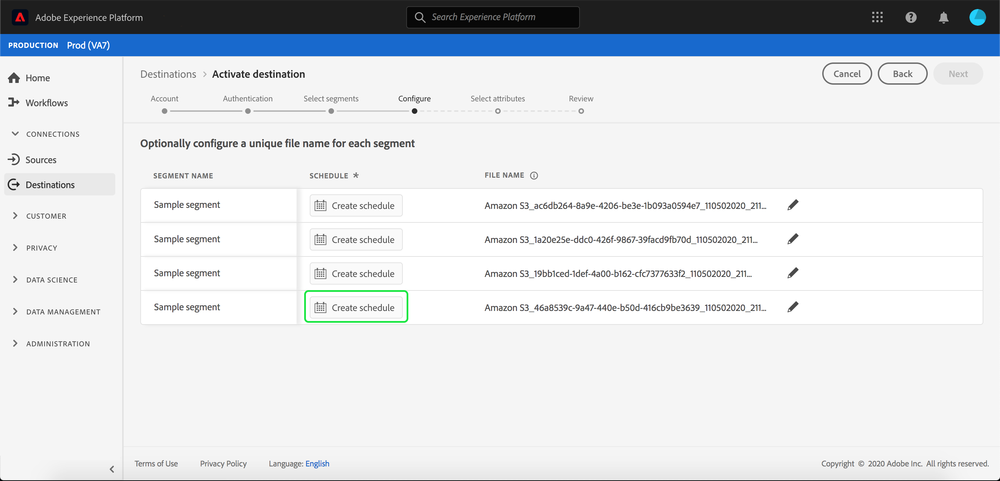
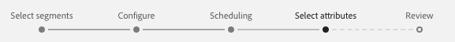

# 宛先へのプロファイルとセグメントのアクティブ化

## 概要 {#overview}

セグメントを宛先にマッピングして、[!DNL Adobe Experience Platform]にあるデータをアクティブにします。 これをおこなうには、次の手順に従います。

## 前提条件 {#prerequisites}

宛先へのデータをアクティブ化するには、[宛先が接続されている](./connect-destination.md)必要があります。まだの場合は、[宛先カタログ](../catalog/overview.md)に移動し 、サポートされている宛先を参照して、1 つ以上の宛先を設定します。

## データのアクティブ化 {#activate-data}

アクティベーションワークフローの手順は、宛先のタイプによって若干異なります。 すべてのタイプの宛先に対する完全なワークフローを以下に示します。

## {#select-destination}へのデータのアクティブ化先を選択

適用先：すべての宛先

Adobe Experience Platformユーザーインターフェイスで、**[!UICONTROL 宛先]**/**[!UICONTROL 参照]**&#x200B;に移動し、次の図に示すように、セグメントをアクティブにする宛先に対応する&#x200B;**[!UICONTROL アクティブ化]**&#x200B;ボタンをクリックします。


次のセクションの手順に従って、アクティブにするセグメントを選択します。

## [!UICONTROL セグメントの選択] 手順  {#select-segments}

適用先：すべての宛先


**[!UICONTROL 宛先]**&#x200B;をアクティブ化ワークフローの&#x200B;**[!UICONTROL セグメントを選択]**&#x200B;ページで、宛先にアクティブ化する1つ以上のセグメントを選択します。 「**[!UICONTROL 次へ]**」を選択して、次の手順に進みます。


## [!UICONTROL ID] マッピング手順  {#identity-mapping}

適用先：ソーシャルリンク先とGoogle Customer Matchの広告先


ソーシャル宛先の場合は、ソース属性またはID名前空間を選択して、宛先のターゲットIDとしてマップする必要があります。

## 例：[!DNL Facebook Custom Audience] {#example-facebook}でのオーディエンスデータのアクティブ化

以下は、[!DNL Facebook]でオーディエンスデータをアクティブ化する際の正しいIDマッピングの例です。

ソースフィールドの選択：

* 使用している電子メールアドレスがハッシュ化されていない場合は、`Email`名前空間をソースIDとして選択します。
* [!DNL Facebook] [電子メールハッシュ要件](../catalog/social/facebook.md#email-hashing-requirements)に従って、データインジェスト時に顧客の電子メールアドレスを[!DNL Platform]にハッシュした場合は、`Email_LC_SHA256`名前空間をソースIDとして選択します。
* データがハッシュ化されていない電話番号で構成されている場合は、`PHONE_E.164`名前空間をソースIDとして選択します。 [!DNL Platform] は、 [!DNL Facebook] 要件に合わせて電話番号をハッシュします。
* [!DNL Facebook] [電話番号ハッシュ要件](../catalog/social/facebook.md#phone-number-hashing-requirements)に従って、[!DNL Platform]にデータ取り込む際の電話番号をハッシュする場合は、`Phone_SHA256`名前空間をソースIDとして選択します。
* データが[!DNL Apple]デバイスIDで構成されている場合は、`IDFA`名前空間をソースIDとして選択します。
* データが[!DNL Android]デバイスIDで構成されている場合は、`GAID`名前空間をソースIDとして選択します。
* データが他の種類の識別子で構成されている場合は、`Custom`名前空間をソースIDとして選択します。

ターゲットフィールドの選択：

* ソース名前空間が`Email`または`Email_LC_SHA256`の場合は、`Email_LC_SHA256`名前空間をターゲットIDとして選択します。
* ソース名前空間が`PHONE_E.164`または`Phone_SHA256`の場合は、`Phone_SHA256`名前空間をターゲットIDとして選択します。
* ソース名前空間が`IDFA`または`GAID`の場合は、`IDFA`または`GAID`名前空間をターゲットIDとして選択します。
* ソース名前空間がカスタム名前空間の場合は、`Extern_ID`をターゲットIDとして選択します。


非ハッシュ化された名前空間のデータは、アクティベーション時に[!DNL Platform]によって自動的にハッシュされます。

属性ソースデータは自動的にハッシュされません。 ソースフィールドにハッシュ化されていない属性が含まれている場合は、「**[!UICONTROL 変換を適用]**」オプションをオンにして、アクティベーション上のデータを自動的にハッシュ化します。
[!DNL Platform]

 

## 例：[!DNL Google Customer Match] {#example-gcm}でのオーディエンスデータのアクティブ化

これは、[!DNL Google Customer Match]でオーディエンスデータをアクティブ化する際の正しいIDマッピングの例です。

ソースフィールドの選択：

* 使用している電子メールアドレスがハッシュ化されていない場合は、`Email`名前空間をソースIDとして選択します。
* [!DNL Google Customer Match] [電子メールハッシュ要件](../catalog/social/../advertising/google-customer-match.md)に従って、データインジェスト時に顧客の電子メールアドレスを[!DNL Platform]にハッシュした場合は、`Email_LC_SHA256`名前空間をソースIDとして選択します。
* データがハッシュ化されていない電話番号で構成されている場合は、`PHONE_E.164`名前空間をソースIDとして選択します。 [!DNL Platform] は、 [!DNL Google Customer Match] 要件に合わせて電話番号をハッシュします。
* [!DNL Facebook] [電話番号ハッシュ要件](../catalog/social/../advertising/google-customer-match.md)に従って、[!DNL Platform]にデータ取り込む際の電話番号をハッシュする場合は、`Phone_SHA256_E.164`名前空間をソースIDとして選択します。
* データが[!DNL Apple]デバイスIDで構成されている場合は、`IDFA`名前空間をソースIDとして選択します。
* データが[!DNL Android]デバイスIDで構成されている場合は、`GAID`名前空間をソースIDとして選択します。
* データが他の種類の識別子で構成されている場合は、`Custom`名前空間をソースIDとして選択します。

ターゲットフィールドの選択：

* ソース名前空間が`Email`または`Email_LC_SHA256`の場合は、`Email_LC_SHA256`名前空間をターゲットIDとして選択します。
* ソース名前空間が`PHONE_E.164`または`Phone_SHA256_E.164`の場合は、`Phone_SHA256_E.164`名前空間をターゲットIDとして選択します。
* ソース名前空間が`IDFA`または`GAID`の場合は、`IDFA`または`GAID`名前空間をターゲットIDとして選択します。
* ソース名前空間がカスタム名前空間の場合は、`User_ID`をターゲットIDとして選択します。


非ハッシュ化された名前空間のデータは、アクティベーション時に[!DNL Platform]によって自動的にハッシュされます。

属性ソースデータは自動的にハッシュされません。 ソースフィールドにハッシュ化されていない属性が含まれている場合は、「**[!UICONTROL 変換を適用]**」オプションをオンにして、アクティベーション上のデータを自動的にハッシュ化します。
[!DNL Platform]

## **** 設定手順  {#configure}

適用先：電子メールマーケティングの宛先とクラウドストレージの宛先


[!DNL Adobe Experience Platform] 電子メールマーケティングおよびクラウドストレージの宛先のデータを [!DNL CSV] ファイルの形式でエクスポートします。**[!UICONTROL 設定]**&#x200B;の手順では、エクスポートする各セグメントのスケジュールとファイル名を設定できます。 スケジュールの設定は必須ですが、ファイル名の設定はオプションです。

>[!IMPORTANT]
> 
>[!DNL Adobe Experience Platform] 1ファイルあたり500万件のレコード（行）でエクスポートファイルを自動的に分割します。各行は1つのプロファイルを表します。
>
>分割ファイル名には、そのファイルが大きな書き出しの一部であることを示す番号が付加されます。次に例を示します。`filename.csv`、`filename_2.csv`、`filename_3.csv`。


セグメントのスケジュールを追加するには、「**[!UICONTROL スケジュールを作成]**」を選択します。



ダイアログが表示され、セグメント集計表を作成するためのオプションが表示されます。

* **ファイルのエクスポート**:フルファイルまたはインクリメンタルファイルを書き出すことができます。フルファイルをエクスポートすると、そのセグメントに該当するすべてのプロファイルの完全なスナップショットが公開されます。 インクリメンタルファイルをエクスポートすると、前回のエクスポート以降、そのセグメントに該当するプロファイルの差分が発行されます。
* **頻度**:「フルフ **[!UICONTROL ァイルを]** 書き出し」を選択した場合は、「1日に1回」を書き出すことができ **** ます ****。[**[!UICONTROL 増分ファイルの書き出し]**]が選択されている場合は、**[!UICONTROL 毎日]**&#x200B;のみを書き出すことができます。 ファイル&#x200B;**[!UICONTROL 一度]**&#x200B;エクスポートすると、ファイルは1回だけエクスポートされます。 ファイルをエクスポートする&#x200B;**[!UICONTROL 毎日]**&#x200B;は、ファイルが完全に選択されている場合は毎日開始日から終了日の午前12:00 UTC（米国東部標準時の午後7:00 PM）にファイルをエクスポートします。ファイルが選択されている場合は12:00 PM UTC（米国東部標準時）です。
* **日付**:「1回限り」が選択され **** ている場合は、1回限りのエクスポートの日付を選択できます。「**[!UICONTROL 毎日]**」が選択されている場合は、エクスポートの開始と終了日を選択できます。


デフォルトのファイル名は、宛先名、セグメントID、日時インジケーターで構成されます。 例えば、異なるキャンペーンを区別したり、ファイルにデータの書き出し時間を付けたりするために、書き出したファイル名を編集できます。

鉛筆アイコンを選択してモーダルウィンドウを開き、ファイル名を編集します。 ファイル名は255文字までに制限されます。


ファイル名エディターで、別のコンポーネントを選択してファイル名に追加できます。 宛先名とセグメントIDはファイル名から削除できません。 これらに加えて、次を追加できます。

* **[!UICONTROL セグメント名]**:ファイル名にセグメント名を追加できます。
* **[!UICONTROL 日時]**:フ `MMDDYYYY_HHMMSS` ォーマットを追加するか、ファイルが生成された時刻の10桁のタイムスタンプをUnixに追加するかを選択します。ファイルに、増分書き出しのたびに動的なファイル名を生成する場合は、次のいずれかのオプションを選択します。
* **[!UICONTROL カスタムテキスト]**:ファイル名追加にカスタムテキストを追加します。

「**[!UICONTROL 変更を適用]**」を選択して、選択を確定します。

>[!IMPORTANT]
> 
>**[!UICONTROL 日時]**&#x200B;コンポーネントを選択しない場合、ファイル名は静的になり、新しく書き出されたファイルによってストレージー上の以前のファイルが上書きされ、各書き出しで上書きされます。 ストレージの場所から電子メールマーケティングプラットフォームに定期的にインポートジョブを実行する場合は、このオプションをお勧めします。


すべてのセグメントの設定が完了したら、「**[!UICONTROL 次へ]**」を選択して続行します。

## **[!UICONTROL セグメントの]** スケジュール  {#segment-schedule}

適用先：広告の宛先、ソーシャルの宛先


**[!UICONTROL セグメントスケジュール]**&#x200B;ページで、送信先にデータを送信する開始日と、送信先にデータを送信する頻度を設定できます。

>[!IMPORTANT]
>
>ソーシャルの宛先の場合は、この手順でオーディエンスの接触チャネルを選択する必要があります。次の手順に進むには、まず次の画像のオプションのいずれかを選択してください。


>[!IMPORTANT]
>
>Google Customer Matchの場合、[!DNL IDFA]または[!DNL GAID]セグメントをアクティブ化する際に、この手順で[!UICONTROL アプリID]を指定する必要があります。


## **** スケジュールの手順  {#scheduling}

適用先：電子メールマーケティングの宛先とクラウドストレージの宛先


**[!UICONTROL スケジュール]**&#x200B;ページでは、宛先へのデータ送信の開始日、および宛先へのデータ送信の頻度を確認できます。 これらの値は編集できません。

## **[!UICONTROL 属性]** 手順の選択  {#select-attributes}

適用先：電子メールマーケティングの宛先とクラウドストレージの宛先



**[!UICONTROL 属性を選択]**&#x200B;ページで、**[!UICONTROL 追加新しいフィールド]**&#x200B;を選択し、送信先に送信する属性を選択します。

>[!NOTE]
>
> Adobe Experience Platformは、スキーマで推奨され、よく使用される4つの属性を使用して、選択範囲を事前入力します。`person.name.firstName`、`person.name.lastName`、`personalEmail.address`、`segmentMembership.status`。

`segmentMembership.status`が選択されているかどうかによって、ファイルのエクスポートは次の方法で異なります。
* `segmentMembership.status`フィールドを選択した場合、エクスポートされたファイルには、最初のフルスナップショットに「**[!UICONTROL アクティブ]**」メンバーが含まれ、以降の増分エクスポートには「**[!UICONTROL アクティブ]**」メンバーと「**[!UICONTROL 期限切れ]**」メンバーが含まれます。
* `segmentMembership.status`フィールドが選択されていない場合、エクスポートされたファイルには、最初のフルスナップショットと以降の増分エクスポートに&#x200B;**[!UICONTROL アクティブ]**&#x200B;メンバーのみが含まれます。


さらに、異なる属性を必須としてマークすることもできます。 属性を必須としてマークすると、エクスポートしたセグメントにその属性が含まれている必要があります。 その結果、フィルタリングの追加形式として使用できます。 属性を必須としてマークするのは、**必須ではありません**。

属性の1つは、スキーマーの[一意の識別子](../../destinations/catalog/email-marketing/overview.md#identity)にすることをお勧めします。 必須属性について詳しくは、[電子メールマーケティングの宛先](../../destinations/catalog/email-marketing/overview.md#identity)ドキュメントのIDに関する節を参照してください。

>[!NOTE]
> 
>データセット内の特定のフィールド（データセット全体ではなく）に対してデータ使用ラベルが適用されている場合、アクティベーション上でこれらのフィールドレベルのラベルが適用されるのは、次の条件の下です。
>* これらのフィールドは、セグメント定義で使用されます。
>* フィールドは、ターゲット先の投影属性として設定されます。

>
> 
例えば、フィールド`person.name.firstName`に、宛先のマーケティングアクションと競合する特定のデータ使用ラベルが含まれている場合、レビュー手順でデータ使用ポリシー違反が表示されます。 詳しくは、[Adobe Experience Platform](../../rtcdp/privacy/data-governance-overview.md#destinations)でのデータ管理を参照してください。

## **[!UICONTROL Reviewstep]**   {#review}

適用先：すべての宛先


「**[!UICONTROL 確認]**」ページには、選択の概要が表示されます。「**[!UICONTROL キャンセル]**」を選択してフローを分割するか、「**[!UICONTROL 戻る]**」を選択して設定を変更する、または、「**[!UICONTROL 完了]**」を選択して確定し、宛先へのデータの送信を開始します。

>[!IMPORTANT]
>
>この手順では、Adobe Experience Platformがデータ使用ポリシーの違反を確認します。 次に、ポリシー違反の例を示します。 セグメントアクティベーションのワークフローは、違反を解決するまで完了できません。 ポリシー違反の解決方法について詳しくは、「データ管理ドキュメント」の「[ポリシーの適用](../../rtcdp/privacy/data-governance-overview.md#enforcement)」を参照してください。


ポリシー違反が検出されなかった場合は、[**[!UICONTROL 完了]**]を選択して、選択と開始が宛先にデータを送信することを確認します。


## セグメントのアクティベーションが成功したことを確認します。 {#verify-activation}

### 電子メールマーケティングの宛先およびクラウドストレージの宛先  {#esp-and-cloud-storage}

電子メールマーケティングのリンク先とクラウドストレージのリンク先の場合、Adobe Experience Platformは、指定したストレージーの場所にタブ区切りの`.csv`ファイルまたは`.txt`ファイルを作成します。 新しいファイルはストレージの場所に毎日作成されます。デフォルトのファイル形式は次のとおりです。
`<destinationName>_segment<segmentID>_<timestamp-yyyymmddhhmmss>.csv|txt`

ファイル形式は編集できます。 詳しくは、クラウドストレージの宛先と電子メールマーケティングの宛先について、[設定](#configure)の手順に進んでください。

デフォルトのファイル形式では、3日連続で受け取るファイルは次のようになります。

```console
Salesforce_Marketing_Cloud_segment12341e18-abcd-49c2-836d-123c88e76c39_20200408061804.csv
Salesforce_Marketing_Cloud_segment12341e18-abcd-49c2-836d-123c88e76c39_20200409052200.csv
Salesforce_Marketing_Cloud_segment12341e18-abcd-49c2-836d-123c88e76c39_20200410061130.csv
```

これらのファイルがストレージの場所に存在すれば、アクティベーションは成功しています。書き出したファイルの構造を理解するには、サンプルの.csvファイル](../assets/common/sample_export_file_segment12341e18-abcd-49c2-836d-123c88e76c39_20200408061804.csv)を[ダウンロードします。 このサンプルファイルには、プロファイル属性`person.firstname`、`person.lastname`、`person.gender`、`person.birthyear`、`personalEmail.address`が含まれます。

## 広告の宛先

データをアクティブ化するそれぞれの広告先のアカウントを確認します。 アクティベーションに成功した場合、オーディエンスは広告プラットフォームに入力されます。

## ソーシャルネットワークの宛先

[!DNL Facebook]の場合、アクティベーションが成功した場合は、[[!UICONTROL Facebook広告マネージャー]](https://www.facebook.com/adsmanager/manage/)で[!DNL Facebook]カスタムオーディエンスがプログラム的に作成されます。 ユーザーがアクティブ化されたセグメントに対してオーディエンスが資格を持つかどうかによって、ユーザーのセグメントメンバーシップが追加および削除されます。

>[!TIP]
>
>Adobe Experience Platformと[!DNL Facebook]の統合は、履歴オーディエンスのバックフィルをサポートします。 宛先に対してセグメントをアクティブ化すると、すべての過去のセグメント資格情報が[!DNL Facebook]に送信されます。

## アクティベーションの無効化 {#disable-activation}

既存のアクティベーションフローを無効化するには、次の手順に従います。

1. 左側のナビゲーションバーで「**[!UICONTROL 宛先]**」を選択し、「**[!UICONTROL 参照]**」タブをクリックして、宛先名をクリックします。
2. 右側のパネルの「**[!UICONTROL 有効]**」コントロールをクリックして、アクティベーションフローの状態を変更します。
3. **データフロー状態の更新**&#x200B;ウィンドウで、「**確認**」を選択してアクティベーションフローを無効にします。
