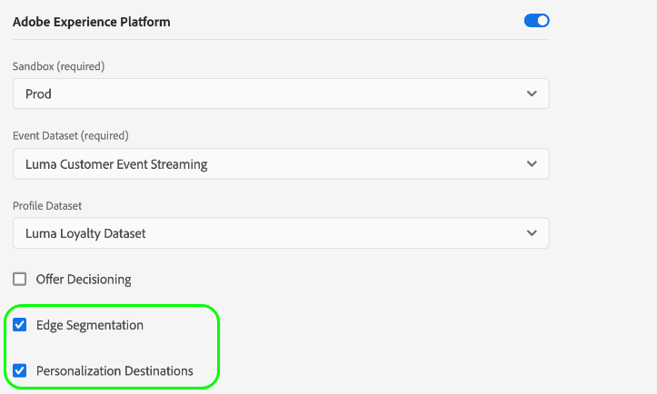
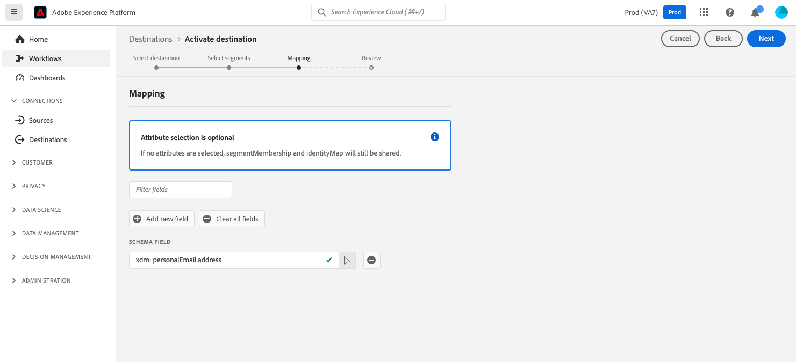
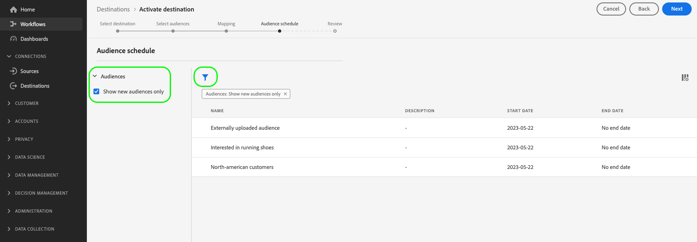
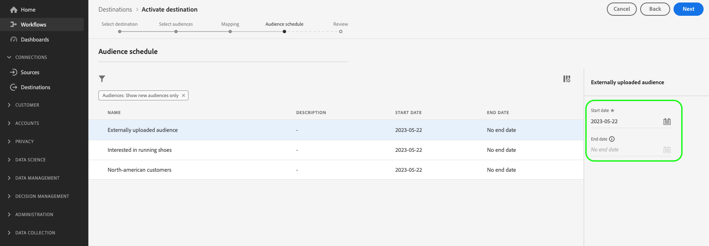

# エッジパーソナライゼーションの宛先に対してオーディエンスをアクティブ化する

## 概要 {#overview}

[!DNL Adobe Experience Platform]は、[&#x200B; エッジセグメント化](../../segmentation/methods/edge-segmentation.md)と[&#x200B; エッジ宛先](/help/destinations/destination-types.md#edge-personalization-destinations)を使用して、顧客がリアルタイムで大規模にオーディエンスを作成およびターゲティングできるようにします。 この機能は、同じページおよび次のページのパーソナライゼーションのユースケースを設定するのに役立ちます。

エッジの宛先の例は、[[!DNL Adobe Target]](../../destinations/catalog/personalization/adobe-target-connection.md)および[&#x200B; カスタムパーソナライゼーション &#x200B;](../../destinations/catalog/personalization/custom-personalization.md)接続です。

>[!NOTE]
>
>データストリーム IDを使用せずに[接続 [!DNL Adobe Target]  &#x200B;](../catalog/personalization/adobe-target-connection.md)を&#x200B;*設定する場合、この記事で説明するユースケースはサポートされていません。*&#x200B;データストリームがない場合は、次セッションのパーソナライゼーションのユースケースのみがサポートされます。

>[!IMPORTANT]
>
>* データをアクティブ化し、ワークフローの[&#x200B; マッピング手順](#mapping)を有効にするには、**[!UICONTROL View Destinations]**、**[!UICONTROL Activate Destinations]**、**[!UICONTROL View Profiles]**&#x200B;および&#x200B;**[!UICONTROL View Segments]** [&#x200B; アクセス制御権限](/help/access-control/home.md#permissions)が必要です。
>* ワークフローの[&#x200B; マッピング手順](#mapping)を経ずにデータをアクティベートするには、**[!UICONTROL View Destinations]**、**[!UICONTROL Activate Segment without Mapping]**、**[!UICONTROL View Profiles]**&#x200B;および&#x200B;**[!UICONTROL View Segments]**、[&#x200B; アクセス制御権限](/help/access-control/home.md#permissions)が必要です。
>* *ID*&#x200B;をエクスポートするには、**[!UICONTROL View Identity Graph]** [&#x200B; アクセス制御権限](/help/access-control/home.md#permissions)が必要です。  {width="100" zoomable="yes"}
> 
> [アクセス制御の概要](/help/access-control/ui/overview.md)を参照するか、製品管理者に問い合わせて必要な権限を取得してください。

この記事では、[!DNL Adobe Experience Platform] エッジ宛先に対するオーディエンスのアクティブ化に必要なワークフローについて説明します。 [&#x200B; エッジセグメント化](../../segmentation/methods/edge-segmentation.md)およびオプションの[&#x200B; プロファイル属性マッピング &#x200B;](#mapping)と組み合わせて使用すると、これらの宛先は、webおよびモバイルプロパティで同ページと次ページのパーソナライゼーションのユースケースを有効にします。

エッジパーソナライゼーション用に[!DNL Adobe Target]接続を設定する方法の概要については、以下のビデオをご覧ください。

>[!NOTE]
>
>Adobe Experience Platform のユーザーインターフェイスは頻繁に更新され、このビデオが録画された後に変更されている可能性があります。 最新の情報については、以下の節で説明する設定手順を参照してください。

>[!VIDEO](https://video.tv.adobe.com/v/3449794/?captions=jpn&quality=12&learn=on)

[!DNL Adobe Target]およびカスタム パーソナライゼーションの宛先にオーディエンスとプロファイル属性を共有する方法の概要については、次のビデオをご覧ください。

>[!VIDEO](https://video.tv.adobe.com/v/3447356/?captions=jpn&quality=12&learn=on)

## ユースケース {#use-cases}

[!DNL Adobe Target]などのAdobe パーソナライゼーションソリューション、または独自のパーソナライゼーションパートナープラットフォーム（例：[!DNL Optimizely]、[!DNL Pega]）と独自のシステム（例：インハウス CMS）を使用して、[&#x200B; カスタム Personalization](../catalog/personalization/custom-personalization.md)宛先を介してより深い顧客体験を実現します。 こうした機能の他には、Experience Platform Edge Networkのデータ収集とセグメンテーション機能も活用されています。

以下で説明するユースケースには、サイトパーソナライゼーションとターゲットオンサイト広告の両方が含まれます。

これらのユースケースを有効にするには、Experience Platformからオーディエンスとプロファイル属性情報の両方を迅速かつ合理的に取得し、Experience Platform UIの[[!DNL Adobe Target]](../catalog/personalization/adobe-target-connection.md)または[&#x200B; カスタム Personalization](../catalog/personalization/custom-personalization.md)接続に送信する方法が必要です。

### 同じページのパーソナライズ機能 {#same-page}

オーディエンスがweb サイトのページにアクセスし、 現在のページ訪問情報（参照URL、ブラウザー言語、埋め込み製品情報など）を使用して、次のアクションまたは決定（パーソナライゼーションなど）を選択し、Adobe以外のプラットフォームの[&#x200B; カスタムパーソナライゼーション &#x200B;](../catalog/personalization/custom-personalization.md)接続（例：[!DNL Pega]、[!DNL Optimizely]など）を使用できます。

### 次のページのパーソナライゼーション {#next-page}

オーディエンスは、web サイトのA ページにアクセスしました。 このインタラクションに基づいて、ユーザーは一連のオーディエンスに対して選定を行います。 オーディエンスは、リンクをクリックすると、A ページからB ページに移動します。前のページ Aでのインタラクションでユーザーが選定したオーディエンスは、現在のweb サイト訪問によって決定されたプロファイル更新と共に、次のアクションまたは決定（例えば、訪問者に表示する広告バナー、A/B テストの場合は表示するページのバージョン）に使用されます。

### 次のセッションのパーソナライズ機能 {#next-session}

顧客はweb サイトの複数のページにアクセスし、 これらのインタラクションに基づいて、ユーザーは一連のオーディエンスに対して適格であると判断しました。 その後、ユーザーは現在のブラウジングセッションを終了します。

翌日、ユーザーは同じ顧客web サイトに戻ります。 訪問したすべてのweb サイトページとの以前のインタラクション中に選定されたオーディエンスと、現在のweb サイト訪問によって決定されたプロファイル更新は、次のアクション/決定（例えば、訪問者に表示する広告バナー、またはA/B テストの場合は、表示するページのバージョン）を選択するために使用されます。

### ホームページのバナーをパーソナライズ {#home-page-banner}

ホームレンタルおよび販売会社が、バナーを使用してホームページをパーソナライズしたいと考えています。これは、[!DNL Adobe Experience Platform]のオーディエンスの条件に基づいています。 同社は、パーソナライズされたエクスペリエンスを提供する必要があるオーディエンスを選択し、そのオーディエンスをTarget オファーのターゲット条件として[!DNL Adobe Target]に送信できます。

## 前提条件 {#prerequisites}

### データ収集UIでのデータストリームの設定 {#configure-datastream}

パーソナライゼーションの宛先の設定における最初の手順は、Experience Platform Web SDK のデータストリームを設定することです。 これは Data Collection UI で行います。

データストリームを設定する場合、**[!UICONTROL Adobe Experience Platform]**&#x200B;の下で、**[!UICONTROL Edge Segmentation]**&#x200B;と&#x200B;**[!UICONTROL Personalization Destinations]**&#x200B;の両方が選択されていることを確認してください。

>[!TIP]
>
>2024年4月リリース以降、[接続先を [!DNL Adobe Target]](/help/destinations/catalog/personalization/adobe-target-connection.md)に設定する場合、「Edge セグメンテーション」チェックボックスをオンにする必要はありません。 この場合、[次セッションのパーソナライゼーション &#x200B;](#next-session)は、利用可能なパーソナライゼーションのユースケースのみが使用できます。

データストリームの設定方法について詳しくは、[Experience Platform Web SDK ドキュメント &#x200B;](../../datastreams/configure.md#aep)に記載されている手順に従ってください。

### [!DNL Active-On-Edge]結合ポリシーの作成 {#create-merge-policy}

宛先接続を作成したら、[!DNL Active-On-Edge]結合ポリシーを作成する必要があります。 [!DNL Active-On-Edge]結合ポリシーにより、オーディエンスは常に[&#x200B; エッジ &#x200B;](../../segmentation/methods/edge-segmentation.md)で評価され、リアルタイムおよび次ページのパーソナライゼーションのユースケースで利用できるようになります。

>[!IMPORTANT]
>
>現在、エッジの宛先は、デフォルトとして設定された[Active-on-Edge結合ポリシー](../../segmentation/ui/segment-builder.md#merge-policies)を使用するオーディエンスのアクティブ化のみをサポートしています。 別の結合ポリシーを使用するオーディエンスをエッジ宛先にマッピングする場合、そのオーディエンスは評価されません。

「[結合ポリシーの作成](../../profile/merge-policies/ui-guide.md#create-a-merge-policy)」の指示に従い、**[!UICONTROL Active-On-Edge Merge Policy]**&#x200B;切り替えを必ず有効にしてください。

### Experience Platformでの新しいオーディエンスの作成 {#create-audience}

[!DNL Active-On-Edge]結合ポリシーを作成したら、Experience Platformで新しいオーディエンスを作成する必要があります。

[&#x200B; オーディエンスビルダー](../../segmentation/ui/segment-builder.md) ガイドに従って、新しいオーディエンスを作成し、前の手順で作成した[結合ポリシーを](../../segmentation/ui/segment-builder.md#merge-policies)割り当てます[!DNL Active-On-Edge]。

### 宛先接続の作成 {#connect-destination}

データストリームを設定したら、パーソナライゼーションの宛先の設定を開始できます。

新しい宛先接続の作成方法に関する詳細な手順については、[宛先接続の作成チュートリアル](../ui/connect-destination.md)に従ってください。

設定する宛先に応じて、宛先固有の前提条件と関連情報については、次の記事を参照してください。

* [[!DNL Adobe Target] 接続](../catalog/personalization/adobe-target-connection.md#parameters)
* [カスタムパーソナライゼーション接続](../catalog/personalization/custom-personalization.md#parameters)

## 宛先の選択 {#select-destination}

前提条件を完了した後、同じページと次のページのパーソナライゼーションに使用するエッジパーソナライゼーションの宛先を選択できるようになりました。

1. **[!UICONTROL Connections > Destinations]**&#x200B;に移動し、「**[!UICONTROL Catalog]**」タブを選択します。

   Experience Platform UIで「

1. オーディエンスをアクティブ化するパーソナライゼーションの宛先に対応するカードで、以下の画像に示すように&#x200B;**[!UICONTROL Activate audiences]**&#x200B;を選択します。

   

1. オーディエンスの有効化に使用する宛先接続を選択し、**[!UICONTROL Next]**&#x200B;を選択します。

   

1. 次のセクションに移動して、[&#x200B; オーディエンスを選択](#select-audiences)します。

## オーディエンスの選択 {#select-audiences}

オーディエンス名の左側にあるチェックボックスを使用して、宛先に対してアクティブ化するオーディエンスを選択し、**[!UICONTROL Next]**&#x200B;を選択します。

宛先に対してアクティブ化するオーディエンスを選択するには、オーディエンス名の左側にあるチェックボックスを使用し、**[!UICONTROL Next]**&#x200B;を選択します。

配信元に応じて、複数のタイプのオーディエンスから選択できます。

* **[!UICONTROL Segmentation Service]**: Segmentation ServiceによってExperience Platform内で生成されたオーディエンス。 詳しくは、[&#x200B; セグメント化ドキュメント &#x200B;](../../segmentation/ui/overview.md)を参照してください。
* **[!UICONTROL Custom upload]**: Experience Platform以外で生成され、CSV ファイルとしてExperience Platformにアップロードされたオーディエンス。 外部オーディエンスについて詳しくは、[&#x200B; オーディエンスの読み込み](../../segmentation/ui/audience-portal.md#import-audience)に関するドキュメントを参照してください。
* その他の種類のオーディエンスは、[!DNL Audience Manager]など、他のAdobe ソリューションから作成されています。

## 属性のマップ {#mapping}

>[!IMPORTANT]
>
>プロファイル属性には、機密データが含まれる場合があります。 このデータを保護するために、**[!UICONTROL Custom Personalization]**&#x200B;宛先では、属性ベースのパーソナライゼーションの宛先を設定する際に[Edge Network API](https://developer.adobe.com/data-collection-apis/docs/)を使用する必要があります。 すべてのEdge Network API呼び出しは、[認証済みコンテキスト &#x200B;](https://developer.adobe.com/data-collection-apis/docs/getting-started/authentication/)で行う必要があります。
>
> 既にWeb SDKまたはMobile SDKを統合に使用している場合は、サーバーサイド統合を追加してEdge Network API経由で属性を取得できます。
>
> 上記の要件に従わない場合、パーソナライゼーションはオーディエンスメンバーシップのみに基づいて行われます。

ユーザーのパーソナライゼーションユースケースを有効にする属性を選択します。 つまり、属性の値が変更されたり、プロファイルに属性が追加されたりすると、そのプロファイルはオーディエンスのメンバーになり、パーソナライゼーションの宛先に対してアクティブ化されます。

属性の追加はオプションであり、引き続き次の手順に進み、属性を選択せずに同じページと次のページのパーソナライゼーションを有効にすることができます。 この手順で属性を追加しない場合でも、プロファイルのオーディエンスメンバーシップとID マップの条件に基づいてパーソナライゼーションが行われます。

### ソース属性を選択 {#select-source-attributes}

ソース属性を追加するには、**[!UICONTROL Add new field]**&#x200B;列の&#x200B;**[!UICONTROL Source field]** コントロールを選択し、次に示すように、目的のXDM属性フィールドを検索または移動します。

マッピング手順でターゲット属性を選択する方法を示す

### ターゲット属性を選択 {#select-target-attributes}

ターゲット属性を追加するには、**[!UICONTROL Add new field]**&#x200B;列の&#x200B;**[!UICONTROL Target field]** コントロールを選択し、ソース属性をマッピングするカスタム属性名を入力します。

>[!NOTE]
>
>ターゲット属性の選択は、宛先プラットフォームでのフレンドリ名フィールドマッピングをサポートするために、[&#x200B; カスタム Personalization](../catalog/personalization/custom-personalization.md)のアクティベーションワークフローにのみ適用されます。

## オーディエンスの書き出しのスケジュール {#scheduling}

デフォルトでは、[!UICONTROL Audience schedule] ページには、現在のアクティベーションフローで選択した新しく選択したオーディエンスのみが表示されます。

宛先に対してアクティブ化されているすべてのオーディエンスを表示するには、フィルターオプションを使用して、**[!UICONTROL Show new audiences only]** フィルターを無効にします。

**[!UICONTROL Audience schedule]** ページで、各オーディエンスを選択し、**[!UICONTROL Start date]**&#x200B;および&#x200B;**[!UICONTROL End date]** セレクターを使用して、宛先にデータを送信する時間間隔を設定します。

開始日と終了日がハイライト表示されたアクティベーション ワークフローの

**[!UICONTROL Next]**&#x200B;を選択して[!UICONTROL Review] ページに移動します。

## レビュー {#review}

**[!UICONTROL Review]** ページで、選択内容の概要を表示できます。 **[!UICONTROL Cancel]**&#x200B;を選択してフローを分割し、**[!UICONTROL Back]**&#x200B;を選択して設定を変更するか、**[!UICONTROL Finish]**&#x200B;を選択して選択を確定し、宛先へのデータ送信を開始します。

レビュー手順の

### 同意ポリシーの評価 {#consent-policy-evaluation}

お客様の組織が&#x200B;**Adobe Healthcare Shield**&#x200B;または&#x200B;**Adobe Privacy &amp; Security Shield**&#x200B;を購入した場合、**[!UICONTROL View applicable consent policies]**&#x200B;を選択して、適用される同意ポリシーと、その結果としてアクティベーションに含まれるプロファイルの数を確認します。 詳しくは、[同意ポリシーの評価](/help/data-governance/enforcement/auto-enforcement.md#consent-policy-evaluation)を参照してください。

### データ使用ポリシーチェック {#data-usage-policy-checks}

**[!UICONTROL Review]** ステップでは、Experience Platformもデータ使用ポリシー違反をチェックします。 ポリシーに違反した場合の例を次に示します。オーディエンスのアクティベーション ワークフローを完了するには、違反を解決する必要があります。 ポリシー違反を解決する方法について詳しくは、「データガバナンスのドキュメント」セクションの[&#x200B; データ使用ポリシー違反](/help/data-governance/enforcement/auto-enforcement.md#data-usage-violation)を参照してください。

### オーディエンスを絞り込む {#filter-audiences}

この手順では、ページで使用可能なフィルターを使用して、このワークフローの一部としてスケジュールまたはマッピングが更新されたオーディエンスのみを表示できます。 表示するテーブル列を切り替えることもできます。

選択に満足しており、ポリシー違反が検出されていない場合は、**[!UICONTROL Finish]**&#x200B;を選択して選択を確認し、宛先へのデータ送信を開始します。

<!--

Commenting out this part since destination monitoring is not available currently for the Adobe Target and Custom Personalization destinations.

## Verify audience activation {#verify}

Check the [destination monitoring documentation](../../dataflows/ui/monitor-destinations.md) for detailed information on how to monitor the flow of data to your destinations.

-->
