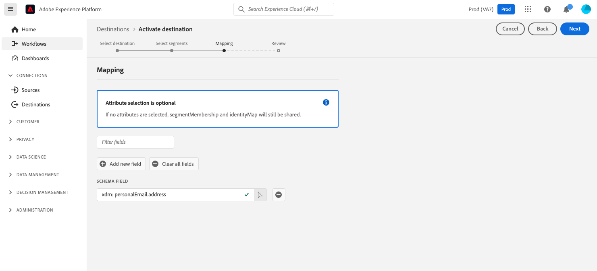
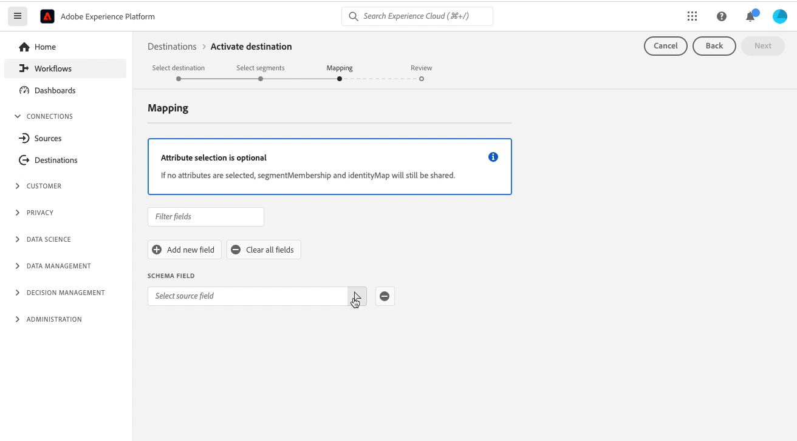

# エッジパーソナライゼーションの宛先に対するオーディエンスのアクティブ化

## 概要 {#overview}

Adobe Experience Platform使用 [エッジセグメント化](../../segmentation/ui/edge-segmentation.md) を edge の宛先と共に使用することで、顧客はオーディエンスをリアルタイムで大規模に作成し、ターゲットに設定できます。 この機能は、同じページおよび次のページのパーソナライゼーションのユースケースを設定するのに役立ちます。

エッジの宛先の例は、 [Adobe Target](../../destinations/catalog/personalization/adobe-target-connection.md) そして [カスタムパーソナライゼーション](../../destinations/catalog/personalization/custom-personalization.md) 接続。

>[!NOTE]
>
>条件 [Adobe Target接続の設定](../catalog/personalization/adobe-target-connection.md) datastream ID を使用しない場合、この記事で説明する使用例はサポートされません。 データストリームがない場合、次セッションのパーソナライゼーションの使用例のみがサポートされます。

>[!IMPORTANT]
> 
> * データをアクティブ化して [マッピング手順](#mapping) ワークフローの **[!UICONTROL 宛先の管理]**, **[!UICONTROL 宛先のアクティブ化]**, **[!UICONTROL プロファイルの表示]**、および **[!UICONTROL セグメントを表示]** [アクセス制御権限](/help/access-control/home.md#permissions).
> * を経由せずにデータをアクティブ化するには [マッピング手順](#mapping) ワークフローの **[!UICONTROL 宛先の管理]**, **[!UICONTROL マッピングなしでセグメントをアクティブ化]**, **[!UICONTROL プロファイルの表示]**、および **[!UICONTROL セグメントを表示]** [アクセス制御権限](/help/access-control/home.md#permissions).
> 
> [アクセス制御の概要](/help/access-control/ui/overview.md)を読むか、製品管理者に問い合わせて、必要な権限を取得してください。

この記事では、Adobe Experience Platform Edge の宛先でオーディエンスをアクティブ化するために必要なワークフローについて説明します。 と一緒に使用する場合 [エッジセグメント化](../../segmentation/ui/edge-segmentation.md) オプション [プロファイル属性マッピング](#mapping)を使用すると、これらの宛先によって、Web およびモバイルプロパティでの同じページおよび次のページのパーソナライゼーションの使用例を可能にします。

Edge パーソナライゼーション用のAdobe Target接続の設定方法の概要については、以下のビデオをご覧ください。

>[!NOTE]
>
>Adobe Experience Platform のユーザーインターフェイスは頻繁に更新され、このビデオが録画された後に変更されている可能性があります。 最新の情報については、以下の節で説明する設定手順を参照してください。

>[!VIDEO](https://video.tv.adobe.com/v/3418799/?quality=12&learn=on)

オーディエンスとプロファイル属性をAdobe Targetやカスタムパーソナライゼーションの宛先と共有する方法の概要については、以下のビデオをご覧ください。

>[!VIDEO](https://video.tv.adobe.com/v/3419036/?quality=12&learn=on)

## ユースケース {#use-cases}

エッジのパーソナライゼーションの宛先を使用すると、Adobe TargetなどのAdobeのパーソナライゼーションソリューションや、独自のパーソナライゼーションパートナープラットフォーム ( 例： [!DNL Optimizely], [!DNL Pega]) や独自システム（社内 CMS など）を使用して、 [カスタムパーソナライゼーション](../catalog/personalization/custom-personalization.md) 宛先。 これらすべてに加えて、Experience PlatformEdge ネットワークのデータ収集およびセグメント化機能も活用します。

以下に説明する使用例には、サイトのパーソナライゼーションとターゲット化されたオンサイト広告の両方が含まれます。

これらのユースケースを有効にするには、Experience Platformからオーディエンスとプロファイル属性の情報をすばやく効率的に取得し、その情報を [Adobe Target](../catalog/personalization/adobe-target-connection.md) または [カスタムパーソナライゼーション](../catalog/personalization/custom-personalization.md) 接続を使用します。

### 同じページのパーソナライズ機能 {#same-page}

ユーザーが Web サイトのページを訪問します。 顧客は、現在のページ訪問情報（参照 URL、ブラウザーの言語、埋め込まれた製品情報など）を使用して、 [カスタムパーソナライゼーション](../catalog/personalization/custom-personalization.md) 非Adobeプラットフォームの接続 ( 例： [!DNL Pega], [!DNL Optimizely]など )

### 次のページのパーソナライゼーション {#next-page}

あるユーザーが Web サイトのページ A を訪問します。 このインタラクションに基づいて、ユーザーは一連のオーディエンスの対象として認定されます。 次に、ページ A からページ B に移動するリンクをクリックします。ページ A での前のインタラクション中にユーザーが認定したオーディエンスと、現在の Web サイト訪問によって決定されたプロファイルの更新は、次のアクション/決定（例えば、訪問者に表示する広告バナー、A/B テストの場合は表示するページ）に使用されます。

### 次のセッションのパーソナライズ機能 {#next-session}

ユーザーが Web サイトの複数のページを訪問します。 これらのインタラクションに基づいて、ユーザーは一連のオーディエンスの対象として認定されます。 次に、ユーザは現在の閲覧セッションを終了する。

次の日に、ユーザーは同じ顧客 Web サイトに戻ります。 以前のインタラクションで、現在の Web サイトの訪問によって決定されたプロファイルの更新と共に、訪問者に表示する広告バナーや、表示するページのバージョン A/B テストの場合は次のアクション/決定を選択します。

### ホームページバナーのパーソナライズ {#home-page-banner}

あるレンタル販売会社は、Adobe Experience Platformでの閲覧資格に基づいて、自社のホームページをバナー付きでパーソナライズしたいと考えています。 会社は、パーソナライズされたエクスペリエンスを体験できるオーディエンスを選択し、それらのオーディエンスを Target オファーのターゲッティング条件として Adobe Target に送信できます。

## 前提条件 {#prerequisites}

### データ収集 UI でのデータストリームの設定 {#configure-datastream}

パーソナライゼーションの宛先の設定における最初の手順は、Experience Platform Web SDK のデータストリームを設定することです。 これは Data Collection UI で行います。

データストリームを設定する際に、「**[!UICONTROL Adobe Experience Platform]**」で「**[!UICONTROL エッジセグメンテーション]**」と「**[!UICONTROL パーソナライゼーションの宛先]**」の両方が選択されていることを確認します。

データストリームの設定方法の詳細については、[Platform Web SDK ドキュメント](../../datastreams/configure.md#aep)に記載されている手順に従ってください。

### の作成 [!DNL Active-On-Edge] 結合ポリシー {#create-merge-policy}

宛先接続を作成したら、[!DNL Active-On-Edge] 結合ポリシーを作成する必要があります。この [!DNL Active-On-Edge] 結合ポリシーにより、オーディエンスが常に評価されます [端に](../../segmentation/ui/edge-segmentation.md) とは、リアルタイムで次のページにパーソナライゼーションの使用例に使用できます。

>[!IMPORTANT]
>
>現在、エッジの宛先は、 [エッジ上のアクティブな結合ポリシー](../../segmentation/ui/segment-builder.md#merge-policies) をデフォルトとして設定します。 異なる結合ポリシーを使用するオーディエンスをエッジの宛先にマッピングした場合、それらのオーディエンスは評価されません。

[結合ポリシーの作成](../../profile/merge-policies/ui-guide.md#create-a-merge-policy)の手順に従い、「**[!UICONTROL エッジでアクティブ化結合ポリシー]**」切り替えスイッチを必ず有効にします。

### Platform での新しいオーディエンスの作成 {#create-audience}

次の [!DNL Active-On-Edge] 結合ポリシーの場合、Platform で新しいオーディエンスを作成する必要があります。

フォロー： [audience builder](../../segmentation/ui/segment-builder.md) 新しいオーディエンスを作成するためのガイドを参照し、必ず [割り当てる](../../segmentation/ui/segment-builder.md#merge-policies) の [!DNL Active-On-Edge] 手順 3 で作成した結合ポリシーです。

### 宛先接続の作成 {#connect-destination}

データストリームを設定したら、パーソナライゼーションの宛先の設定を開始できます。

新しい宛先接続の作成方法に関する詳細な手順については、[宛先接続の作成チュートリアル](../ui/connect-destination.md)に従ってください。

設定する宛先に応じて、次の記事で宛先固有の前提条件と関連情報について確認してください。

* [Adobe Target 接続](../catalog/personalization/adobe-target-connection.md#parameters)
* [カスタムパーソナライゼーション接続](../catalog/personalization/custom-personalization.md##parameters)

## 宛先の選択 {#select-destination}

前提条件を完了したら、同じページと次のページのパーソナライゼーションに使用するエッジのパーソナライゼーションの宛先を選択できるようになりました。

1. **[!UICONTROL 接続／宛先]**&#x200B;に移動し、「**[!UICONTROL カタログ]**」タブを選択します。

   

1. 選択 **[!UICONTROL オーディエンスをアクティブ化]** オーディエンスをアクティブ化するパーソナライゼーションの宛先に対応するカード（下図を参照）。

   

1. オーディエンスのアクティブ化に使用する宛先接続を選択し、「 」を選択します。 **[!UICONTROL 次へ]**.

   

1. 次のセクションに移動： [オーディエンスを選択](#select-audiences).

## オーディエンスを選択 {#select-audiences}

オーディエンス名の左側にあるチェックボックスを使用して、宛先に対してアクティブ化するオーディエンスを選択してから、を選択します。 **[!UICONTROL 次へ]**.

宛先に対してアクティブ化するオーディエンスを選択するには、オーディエンス名の左側にあるチェックボックスを使用して、 **[!UICONTROL 次へ]**.

オリジンに応じて、複数のタイプのオーディエンスから選択できます。

* **[!UICONTROL セグメント化サービス]**:セグメント化サービスによってExperience Platform内で生成されたオーディエンス。 詳しくは、 [セグメント化ドキュメント](../../segmentation/ui/overview.md) を参照してください。
* **[!UICONTROL カスタムアップロード]**:Experience Platform外で生成され、CSV ファイルとして Platform にアップロードされたオーディエンス。 外部オーディエンスについて詳しくは、 [オーディエンスのインポート](../../segmentation/ui/overview.md#import-audience).
* 他のタイプのオーディエンス ( 例：他のAdobeソリューションからのもの ) [!DNL Audience Manager].

## マップ属性 {#mapping}

>[!IMPORTANT]
>
> プロファイル属性には、機密データが含まれている場合があります。 このデータを保護するには、 **[!UICONTROL カスタムパーソナライゼーション]** の宛先では、 [Edge Network Server API](../../server-api/overview.md) 属性ベースのパーソナライゼーションの宛先を設定する際に使用します。 すべてのサーバー API 呼び出しは、 [認証コンテキスト](../../server-api/authentication.md).
>
> 既に統合に Web SDK または Mobile SDK を使用している場合は、サーバー側の統合を追加して、Server API を介して属性を取得できます。
>
> 上記の要件に従わない場合、パーソナライゼーションはオーディエンスのメンバーシップのみに基づきます。

ユーザーのパーソナライゼーションユースケースを有効にする属性を選択します。 つまり、属性の値が変更された場合、または属性がプロファイルに追加された場合、そのプロファイルはオーディエンスのメンバーになり、パーソナライゼーションの宛先に対してアクティブ化されます。

属性の追加はオプションで、属性を選択せずに次の手順に進み、同じページと次のページのパーソナライゼーションを有効にすることができます。 この手順で属性を追加しない場合、パーソナライゼーションは、オーディエンスのメンバーシップとプロファイルの ID マップの認定に基づいておこなわれます。

### ソース属性を選択 {#select-source-attributes}

ソース属性を追加するには、 **[!UICONTROL 新しいフィールドを追加]** ～に対する支配 **[!UICONTROL ソースフィールド]** 列を検索し、以下に示すように、目的の XDM 属性フィールドに移動します。

### ターゲット属性を選択 {#select-target-attributes}

ターゲット属性を追加するには、 **[!UICONTROL 新しいフィールドを追加]** ～に対する支配 **[!UICONTROL ターゲットフィールド]** 列を開き、ソース属性をマッピングするカスタム属性名を入力します。

>[!NOTE]
>
>ターゲット属性の選択は、 [カスタムパーソナライゼーション](../catalog/personalization/custom-personalization.md) 宛先プラットフォームでわかりやすい名前フィールドマッピングをサポートするための、アクティベーションワークフロー。

## オーディエンスの書き出しをスケジュール {#scheduling}

デフォルトでは、 [!UICONTROL オーディエンススケジュール] ページには、現在のアクティベーションフローで選択した新しく選択されたオーディエンスのみが表示されます。

宛先に対してアクティブ化されているすべてのオーディエンスを確認するには、フィルタリングオプションを使用して、 **[!UICONTROL 新しいオーディエンスのみを表示]** フィルター。

の **[!UICONTROL オーディエンススケジュール]** ページで、各オーディエンスを選択し、 **[!UICONTROL 開始日]** および **[!UICONTROL 終了日]** セレクター：宛先にデータを送信する際の時間間隔を設定します。

選択 **[!UICONTROL 次へ]** 行く [!UICONTROL レビュー] ページ。

## レビュー {#review}

「**[!UICONTROL レビュー]**」ページには、選択内容の概要が表示されます。「**[!UICONTROL キャンセル]**」を選択してフローを分割するか、「**[!UICONTROL 戻る]**」を選択して設定を変更する、または、「**[!UICONTROL 完了]**」を選択して確定し、宛先へのデータの送信を開始します。

### 同意ポリシーの評価 {#consent-policy-evaluation}

組織で **Adobe Healthcare Shield** または **Adobe Privacy &amp; Security Shield** を購入した場合、**[!UICONTROL 適用可能な同意ポリシーを表示]**&#x200B;を選択すると、どの同意ポリシーが適用され、その結果、いくつのプロファイルがアクティベーションに含まれるかを確認することができます。詳細 [同意ポリシーの評価](/help/data-governance/enforcement/auto-enforcement.md#consent-policy-evaluation) を参照してください。

### データ使用ポリシーのチェック {#data-usage-policy-checks}

内 **[!UICONTROL レビュー]** 手順の後、Experience Platformは、データ使用ポリシーの違反を確認します。 ポリシーに違反した場合の例を次に示します。違反を解決するまで、オーディエンスのアクティベーションワークフローを完了することはできません。 ポリシー違反の解決方法については、 [データ使用ポリシー違反](/help/data-governance/enforcement/auto-enforcement.md#data-usage-violation) （データガバナンスに関するドキュメントの節）。

### オーディエンスのフィルタリング {#filter-audiences}

この手順では、ページで使用可能なフィルターを使用して、このワークフローの一部としてスケジュールまたはマッピングが更新されたオーディエンスのみを表示できます。 また、表示するテーブル列を切り替えることもできます。

選択が完了し、ポリシー違反が検出されなかった場合は、「 」を選択します。 **[!UICONTROL 完了]** をクリックして選択を確定し、宛先へのデータの送信を開始します。

<!--

Commenting out this part since destination monitoring is not available currently for the Adobe Target and Custom Personalization destinations.

## Verify audience activation {#verify}

Check the [destination monitoring documentation](../../dataflows/ui/monitor-destinations.md) for detailed information on how to monitor the flow of data to your destinations.

-->
