# エッジ上のプロファイル属性をリアルタイムで検索し

[!DNL Adobe Experience Platform]は、すべてのプロファイルデータの信頼できる唯一の情報源として[ リアルタイム顧客プロファイル ](../../profile/home.md)を使用します。 迅速かつリアルタイムのデータ取得のために、[Edge Network](../../profile/edge-profiles.md)全体に分散される軽量プロファイルである[ エッジプロファイル ](../../collection/home.md)を使用します。 これにより、迅速なリアルタイムのパーソナライゼーションが可能になります。

## ユースケース {#use-cases}

ここでは、エッジプロファイル検索が有効な2つのユースケースを紹介します。

* **リアルタイム Personalization**: エッジプロファイルからプロファイル情報をすばやく取得し、web サイトでのユーザーエクスペリエンスをパーソナライズします。
* **カスタマーサポート**：お客様がサポートセンターの担当者に電話をかけると、リアルタイムでプロファイル情報を取得します。

このページでは、パーソナライゼーションエクスペリエンスの配信や、下流アプリケーションを通じた意思決定ルールの決定のために、エッジプロファイルデータをリアルタイムで検索するために従う必要がある手順について説明します。

## 用語と前提条件 {#prerequisites}

このページで説明するユースケースを設定する場合は、次のExperience Platform コンポーネントを使用します。

* [ データストリーム ](../../datastreams/overview.md): データストリームは、Web SDKから受信したイベントデータを受け取り、エッジプロファイルデータで応答します。
* [結合ポリシー](../../segmentation/ui/segment-builder.md#merge-policies): エッジ プロファイルが正しいプロファイルデータを使用するように、[!UICONTROL Active-On-Edge]結合ポリシーを作成します。
* [ カスタム Personalization接続](../catalog/personalization/custom-personalization.md): プロファイル属性をEdge Networkに送信する新しいカスタム パーソナライズ接続を設定します。
* [Edge Network API](https://developer.adobe.com/data-collection-apis/docs/): Edge Network API [ インタラクティブデータ収集](https://developer.adobe.com/data-collection-apis/docs/endpoints/interact/)機能を使用して、エッジプロファイルからプロファイル属性をすばやく取得します。

## パフォーマンスガードレール {#guardrails}

Edge プロファイル ルックアップのユースケースには、次の表に記載されている特定のパフォーマンスガードレールが適用されます。 Edge Network APIのガードレールについて詳しくは、ガードレール [ ドキュメントページ ](https://developer.adobe.com/data-collection-apis/docs/getting-started/guardrails/)を参照してください。

| Edge Network Service | エッジセグメント化 | リクエスト/秒 |
|---------|----------|---------|
| [Edge Network API](../catalog/personalization/custom-personalization.md)経由の[ カスタムパーソナライゼーションの宛先](https://developer.adobe.com/data-collection-apis/docs/api/) | ○ | 1500 |
| [Edge Network API](../catalog/personalization/custom-personalization.md)経由の[ カスタムパーソナライゼーションの宛先](https://developer.adobe.com/data-collection-apis/docs/api/) | × | 1500 |

{style="table-layout:auto"}

## 手順1：データストリームの作成と設定 {#create-datastream}

[ データストリーム設定](../../datastreams/configure.md#create-a-datastream) ドキュメントの手順に従って、次の&#x200B;**[!UICONTROL Service]**&#x200B;設定を持つ新しいデータストリームを作成します。

* **[!UICONTROL Service]**：[!UICONTROL Adobe Experience Platform]
* **[!UICONTROL Personalization Destinations]**：有効
* **[!UICONTROL Edge Segmentation]**: エッジのセグメント化が必要な場合は、このオプションを有効にしてください。 エッジ上のプロファイル属性のみを検索し、エッジプロファイルに基づいてセグメント化を実行しない場合は、このオプションを無効のままにします。


<!-- >[!IMPORTANT]
>
>Enabling edge segmentation limits the maximum number of lookup requests to 1500 request per second. If you need a higher request throughput, disable edge segmentation for your datastream. See the [guardrails documentation](../guardrails.md#edge-destinations-activation) for detailed information. -->

データストリーム設定画面を示す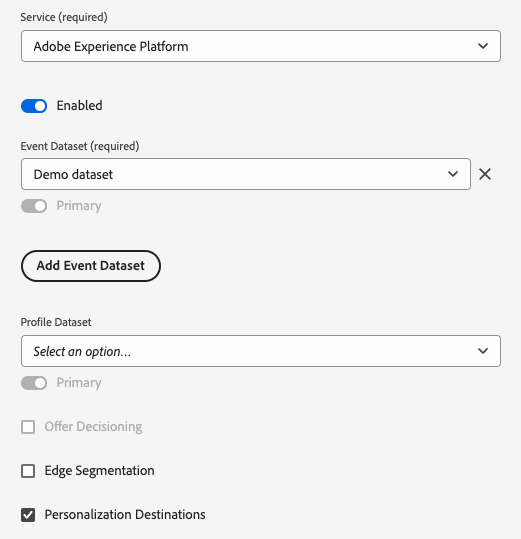


## 手順2：エッジ評価用にオーディエンスを設定する {#audience-edge-evaluation}

エッジでプロファイル属性を検索するには、オーディエンスをエッジ評価用に設定する必要があります。

アクティブ化するオーディエンスに、[Active-on-Edge結合ポリシー](../../segmentation/ui/segment-builder.md#merge-policies)がデフォルトとして設定されていることを確認します。 [!DNL Active-On-Edge]結合ポリシーにより、オーディエンスは常に[ エッジ ](../../segmentation/methods/edge-segmentation.md)で評価され、リアルタイムのパーソナライゼーションのユースケースで利用できるようになります。

「[結合ポリシーの作成](../../profile/merge-policies/ui-guide.md#create-a-merge-policy)」の指示に従い、**[!UICONTROL Active-On-Edge Merge Policy]**&#x200B;切り替えを必ず有効にしてください。

>[!IMPORTANT]
>
>オーディエンスが別の結合ポリシーを使用している場合、エッジからプロファイル属性を取得できず、エッジプロファイル検索を実行できません。

## 手順3：プロファイル属性データをEdge Networkに送信する{#configure-custom-personalization-connection}

属性やオーディエンスメンバーシップデータを含むエッジプロファイルをリアルタイムで検索するには、データをEdge Networkで利用できる必要があります。 この目的のために、**[!UICONTROL Custom Personalization With Attributes]**&#x200B;宛先への接続を作成し、エッジプロファイルで検索する属性を含むオーディエンスをアクティブ化する必要があります。

+++ カスタム Personalizationと属性接続の設定

新しい宛先接続の作成方法に関する詳細な手順については、[宛先接続の作成チュートリアル](../ui/connect-destination.md)に従ってください。

新しい宛先を設定する際に、[手順1](#create-datastream)で作成したデータストリームを&#x200B;**[!UICONTROL Datastream ID]** フィールドで選択します。 **[!UICONTROL Integration alias]**&#x200B;では、宛先名など、今後この宛先接続を特定するのに役立つ任意の値を使用できます。

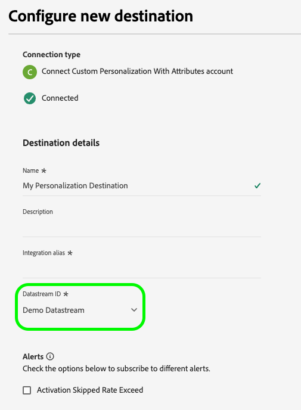

+++

+++カスタム Personalizationの属性コネクションへのオーディエンスのアクティベート

**[!UICONTROL Custom Personalization With Attributes]**&#x200B;接続を作成したら、Edge Networkにプロファイルデータを送信する準備が整いました。

>[!IMPORTANT]
>
> * データをアクティブ化し、ワークフローの[ マッピング手順](#mapping)を有効にするには、**[!UICONTROL View Destinations]**、**[!UICONTROL Activate Destinations]**、**[!UICONTROL View Profiles]**&#x200B;および&#x200B;**[!UICONTROL View Segments]** [ アクセス制御権限](/help/access-control/home.md#permissions)が必要です。
> 
> [アクセス制御の概要](/help/access-control/ui/overview.md)を参照するか、製品管理者に問い合わせて必要な権限を取得してください。

1. **[!UICONTROL Connections > Destinations]**&#x200B;に移動し、「**[!UICONTROL Catalog]**」タブを選択します。

   Experience Platform UIで「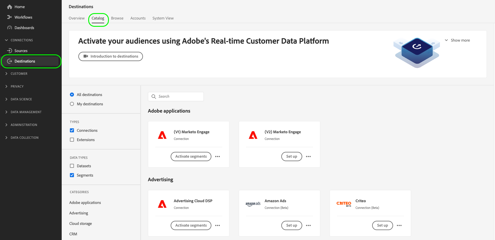

1. 次の画像に示すように、**[!UICONTROL Custom Personalization With Attributes]**&#x200B;宛先カードを検索し、**[!UICONTROL Activate audiences]**&#x200B;を選択します。

   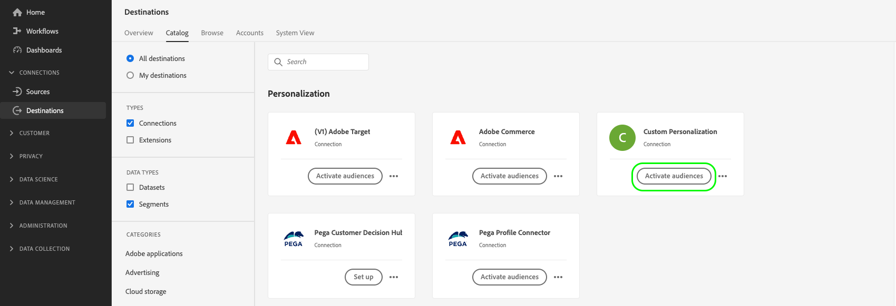

1. 以前に設定した宛先接続を選択し、**[!UICONTROL Next]**&#x200B;を選択します。

   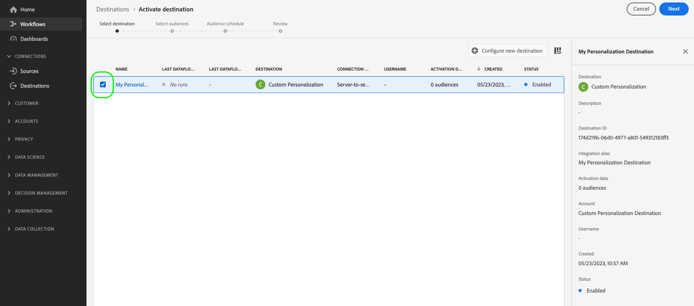

1. オーディエンスの選択。 オーディエンス名の左側にあるチェックボックスを使用して、宛先に対してアクティブ化するオーディエンスを選択し、**[!UICONTROL Next]**&#x200B;を選択します。

   配信元に応じて、複数のタイプのオーディエンスから選択できます。

   * **[!UICONTROL Segmentation Service]**: Segmentation ServiceによってExperience Platform内で生成されたオーディエンス。 詳しくは、[ セグメント化ドキュメント ](../../segmentation/ui/overview.md)を参照してください。
   * **[!UICONTROL Custom upload]**: Experience Platform以外で生成され、CSV ファイルとしてExperience Platformにアップロードされたオーディエンス。 外部オーディエンスについて詳しくは、[ オーディエンスの読み込み](../../segmentation/ui/audience-portal.md#import-audience)に関するドキュメントを参照してください。
   * その他の種類のオーディエンスは、[!DNL Audience Manager]など、他のAdobe ソリューションから作成されています。

     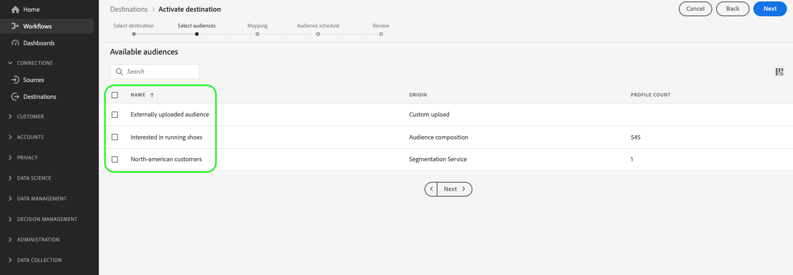

1. エッジプロファイルで使用できるようにしたいプロファイル属性を選択します。

   * **ソース属性を選択**。 ソース属性を追加するには、**[!UICONTROL Add new field]**&#x200B;列の&#x200B;**[!UICONTROL Source field]** コントロールを選択し、次に示すように、目的のXDM属性フィールドを検索または移動します。

     マッピング手順でターゲット属性を選択する方法を示す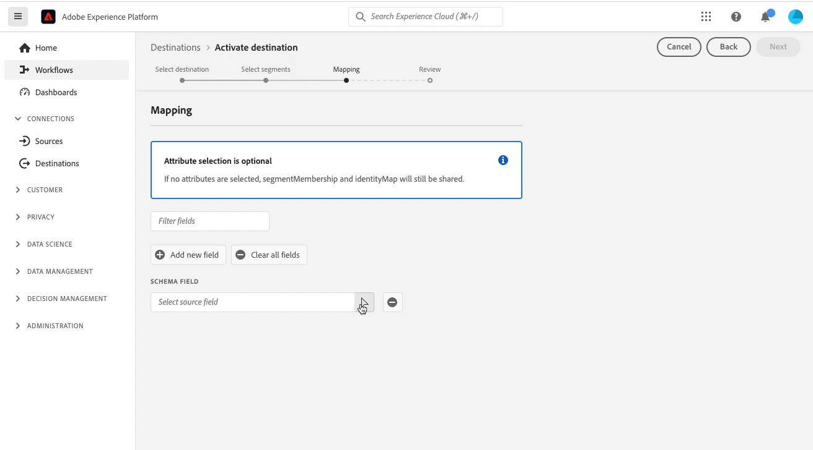

   * **ターゲット属性を選択**。 ターゲット属性を追加するには、**[!UICONTROL Add new field]**&#x200B;列の&#x200B;**[!UICONTROL Target field]** コントロールを選択し、ソース属性をマッピングするカスタム属性名を入力します。

     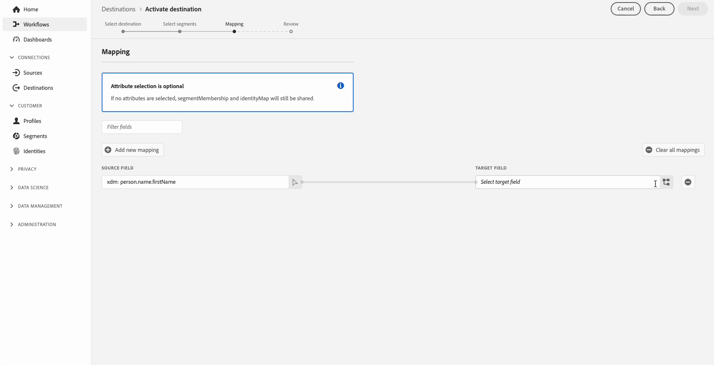

プロファイル属性のマッピングが完了したら、**[!UICONTROL Next]**&#x200B;を選択します。

**[!UICONTROL Review]** ページで、選択内容の概要を表示できます。 **[!UICONTROL Cancel]**&#x200B;を選択してフローを分割し、**[!UICONTROL Back]**&#x200B;を選択して設定を変更するか、**[!UICONTROL Finish]**&#x200B;を選択して選択を確定し、Edge Networkへのプロファイルデータの送信を開始します。

レビュー手順の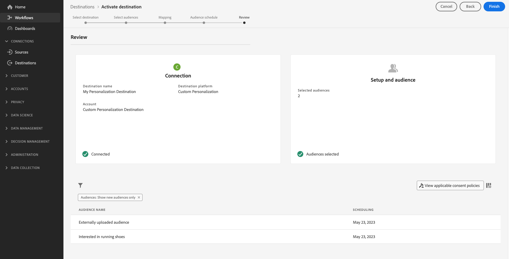

+++

+++同意ポリシーの評価

お客様の組織が&#x200B;**Adobe Healthcare Shield**&#x200B;または&#x200B;**Adobe Privacy &amp; Security Shield**&#x200B;を購入した場合、**[!UICONTROL View applicable consent policies]**&#x200B;を選択して、適用される同意ポリシーと、その結果としてアクティベーションに含まれるプロファイルの数を確認します。 詳しくは、[同意ポリシーの評価](/help/data-governance/enforcement/auto-enforcement.md#consent-policy-evaluation)を参照してください。

**データ使用ポリシーチェック**

**[!UICONTROL Review]** ステップでは、Experience Platformもデータ使用ポリシー違反をチェックします。 ポリシーに違反した場合の例を次に示します。オーディエンスのアクティベーション ワークフローを完了するには、違反を解決する必要があります。 ポリシー違反を解決する方法について詳しくは、「データガバナンスのドキュメント」セクションの[ データ使用ポリシー違反](/help/data-governance/enforcement/auto-enforcement.md#data-usage-violation)を参照してください。

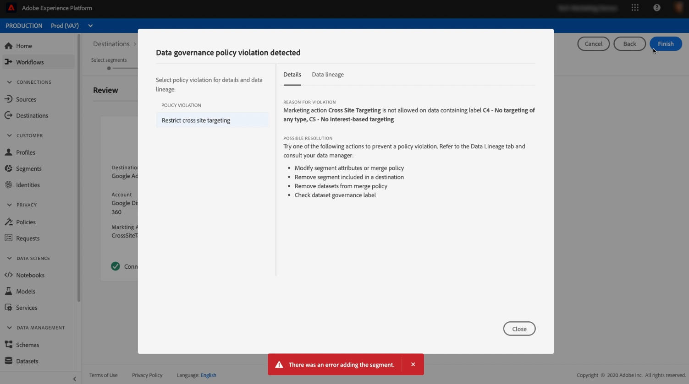

+++

+++オーディエンスを絞り込む

**[!UICONTROL Review]** ステップでは、ページで使用可能なフィルターを使用して、このワークフローの一部としてスケジュールまたはマッピングが更新されたオーディエンスのみを表示できます。 表示するテーブル列を切り替えることもできます。

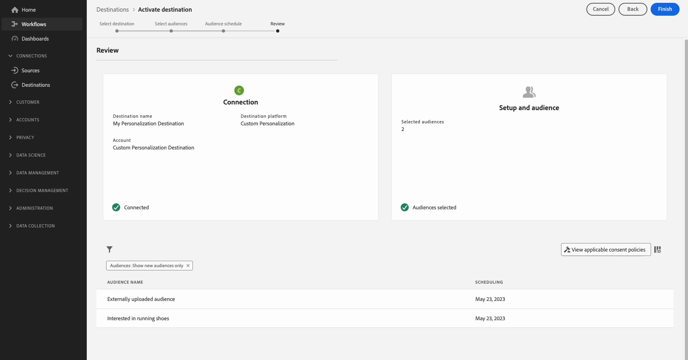


選択に満足しており、ポリシー違反が検出されていない場合は、**[!UICONTROL Finish]**&#x200B;を選択して選択を確認します。

+++

## 手順4：エッジのプロファイル属性を検索する {#configure-edge-profile-lookup}

これで、[ データストリームの設定](#create-datastream)が完了し、[属性を含む新しいカスタム Personalization destination connection](#configure-destination)が作成され、このconnectionを使用して[ プロファイル属性](#activate-audiences)を送信し、Edge Networkを検索できるようになりました。

次の手順では、エッジプロファイルからプロファイル属性を取得するようにパーソナライゼーションソリューションを設定します。

>[!IMPORTANT]
>
>プロファイル属性には、機密データが含まれる場合があります。 このデータを保護するには、[Edge Network API](https://developer.adobe.com/data-collection-apis/docs/getting-started/)を使用してプロファイル属性を取得する必要があります。 さらに、API呼び出しを認証するには、Edge Network API [interactive data collection endpoint](https://developer.adobe.com/data-collection-apis/docs/endpoints/interact/)を介してプロファイル属性を取得する必要があります。
>
>上記の要件に従わない場合、パーソナライゼーションはオーディエンスメンバーシップのみに基づいて行われ、プロファイル属性は利用できません。

[手順1](#create-datastream)で設定したデータストリームは、受信イベントデータを受け入れ、エッジプロファイル情報で応答する準備が整いました。

次の例に示すように、統合を設定してエッジプロファイル情報を取得します。

### リクエスト {#request}

エッジプロファイルデータを取得するには、次に示すように、イベントに含まれるプロファイル属性を検索するプライマリ IDを使用して、`POST` エンドポイントに空の`/interact`呼び出しを送信します。

```shell
curl -X POST "https://server.adobedc.net/ee/v2/interact?dataStreamId={DATASTREAM_ID}" 
-H "Authorization: Bearer {TOKEN}" 
-H "x-gw-ims-org-id: {ORG_ID}" 
-H "x-api-key: {API_KEY}" 
-H "Content-Type: application/json" 
-d '{
    "event":
    {
        "xdm": {
            "identityMap": {
                "Email": [
                    {  
                        "id":"test123@adobetest.com",
                        "primary":true
                    }
                ]
            }
        }
    }
    
}'
```

| パラメーター | タイプ | 必須 | 説明 |
| --- | --- | --- | --- |
| `dataStreamId` | `String` | はい。 | [手順1](#create-datastream)で作成したデータストリームのデータストリーム ID。 |

{style="table-layout:auto"}

### 応答 {#response}

応答が成功すると、プロファイルがエッジで見つかったかどうかに応じて、以下のタブの例に似た情報を含む`200 OK` オブジェクトを含むHTTP ステータス `Handle`が返されます。

>[!NOTE]
>
>API応答はモジュール式であり、`handle` オブジェクトには、様々なタイプの複数の`payload` オブジェクトを含めることができます。 エッジプロファイル検索に関連する情報は、`payload`を持つ`"type": "activation:pull"` オブジェクトの下にグループ化されます。

>[!BEGINTABS]

>[!TAB  プロファイルはエッジに存在します]

プロファイルがエッジに存在する場合、エッジにアクティブ化されたプロファイル属性とオーディエンスに応じて、次のような属性とオーディエンスメンバーシップを持つ応答が期待できます。

```json
{
  "requestId": "3c600138-d785-42ca-a025-bb725f4b5da9",
  "handle": [
    {
      "payload": [
        {
          "type": "profileLookup",
          "destinationId": "9218b727-ec59-4a46-b8b9-05503f138c5d",
          "alias": "rk-demo-custom-personalization-XXXX",
          "attributes": {
            "zip": {
              "value": "19000"
            },
            "firstName": {
              "value": "Test"
            },
            "lastName": {
              "value": "User123"
            },
            "gender": {
              "value": "male"
            },
            "city": {
              "value": "Philadelphia"
            },
            "state": {
              "value": "PA"
            },
            "email": {
              "value": "test123@adobetest.com"
            }
          },
          "segments": [
            {
              "id": "85018bd8-7ad1-4e17-ae30-8389c04bd3c0",
              "namespace": "ups"
            },
            {
              "id": "d09a8159-8b30-4178-b2f2-7a8c5e3168d9",
              "namespace": "ups"
            }
          ]
        }
      ],
      "type": "activation:pull",
      "eventIndex": 0
    }
  ]
}
```

`handle` オブジェクトは、次の表に示す情報を提供します。

| パラメーター | 説明 |
|---------|----------|
| `payload` | エッジ検索情報を含む`payload` オブジェクト。 応答には、エッジルックアップに関係なく、複数の追加`payload` オブジェクトが含まれる場合があります。 |
| `type` | ペイロードは、応答でタイプ別にグループ化されます。 エッジプロファイル検索のペイロードタイプは常に`profileLookup`に設定されます。 |
| `destinationId` | **[!UICONTROL Custom Personalization]**&#x200B;手順3[で作成した](#configure-custom-personalization-connection)接続インスタンスのID。 |
| `alias` | 宛先接続のエイリアス。ユーザーが[ カスタム Personalization](../catalog/personalization/custom-personalization.md)宛先接続を作成するときに設定します。 |
| `attributes` | この配列には、[手順3](#configure-custom-personalization-connection)でアクティブ化したオーディエンスのエッジプロファイル属性が含まれます。 |
| `segments` | この配列には、[手順3](#configure-custom-personalization-connection)でアクティブ化したオーディエンスが含まれます。 |
| `type` | `handle`個のオブジェクトがタイプ別にグループ化されています。 エッジプロファイル検索のユースケースの場合、`handle` オブジェクトのタイプは常に`activation:pull`です。 |
| `eventIndex` | Edge Networkは、クライアントから配列の形式でイベントを受け取ります。 配列内のイベントの順序は、処理中に保持され、このインデックスによって反映されます。 イベントのインデックス作成は`0`で始まります。 |

{style="table-layout:auto"}

>[!TAB  プロファイルがエッジに存在しません]

プロファイルがエッジに存在しない場合は、次のような応答が期待できます。

```json
{
  "requestId": "531b541a-4541-419e-ac99-fd7e452f0c0f",
  "handle": [
    {
      "payload": [],
      "type": "activation:pull",
      "eventIndex": 0
    }
  ]
}
```

`handle` オブジェクトは、次の表に示す情報を提供します。

| パラメーター | 説明 |
|---------|----------|
| `payload` | プロファイルがエッジに存在しない場合、`payload` オブジェクトは空です。 |
| `type` | `payload`個のオブジェクトがタイプ別にグループ化されています。 エッジプロファイル検索のユースケースの場合、`payload` オブジェクトのタイプは常に`activation:pull`です。 |
| `eventIndex` | Edge Networkは、クライアントから配列の形式でイベントを受け取ります。 配列内のイベントの順序は、処理中に保持され、このインデックスによって反映されます。 イベントのインデックス作成は`0`で始まります。 |

{style="table-layout:auto"}

>[!ENDTABS]

>[!SUCCESS]
>
>統合が正しく設定されていれば、エッジプロファイルデータにアクセスできるようになり、エッジプロファイルの属性とオーディエンスメンバーシップを使用して、ダウンストリームパーソナライゼーションエンジンでリアルタイムのパーソナライゼーションをトリガーできます。

## まとめ {#conclusion}

上記のステップに従うことで、エッジプロファイル属性をリアルタイムで効率的に検索し、下流のアプリケーションでパーソナライズされたエクスペリエンスと情報にもとづいた意思決定を実現できます。
