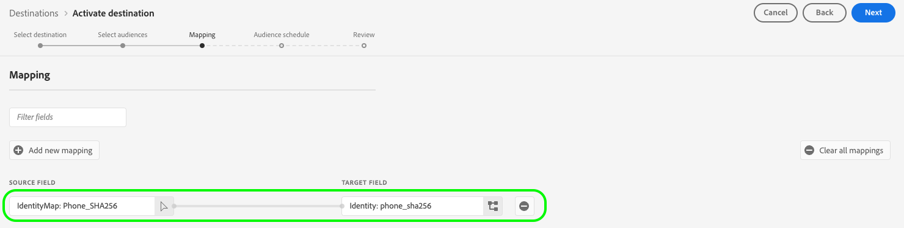

# ストリーミング宛先に対するオーディエンスのアクティブ化

>[!IMPORTANT]
> 
> * オーディエンスをアクティブ化し、ワークフローの [ マッピングステップ ](#mapping) を有効にするには、**[!UICONTROL View Destinations]**、**[!UICONTROL Activate Destinations]**、**[!UICONTROL View Profiles]** および **[!UICONTROL View Segments]** [ アクセス制御権限 ](/help/access-control/home.md#permissions) が必要です。
> * ワークフローの [ マッピングステップ ](#mapping) を実行せずにオーディエンスをアクティブ化するには、**[!UICONTROL View Destinations]**、**[!UICONTROL Activate Segment without Mapping]**、**[!UICONTROL View Profiles]** および **[!UICONTROL View Segments]** [ アクセス制御権限 ](/help/access-control/home.md#permissions) が必要です。
> * *ID* を書き出すには、**[!UICONTROL View Identity Graph]** [ アクセス制御権限 ](/help/access-control/home.md#permissions) が必要です。  {width="100" zoomable="yes"}
> 
> 詳しくは、[アクセス制御の概要](/help/access-control/ui/overview.md)または製品管理者に問い合わせて、必要な権限を取得してください。

## 概要 {#overview}

この記事では、Adobe Experience Platform ストリーミング宛先でオーディエンスをアクティブ化するために必要なワークフローについて説明します。

## 前提条件 {#prerequisites}

宛先へのオーディエンスをアクティブ化するには、正常に [ 宛先に接続 ](./connect-destination.md) されている必要があります。 まだ接続していない場合は、[宛先カタログ](../catalog/overview.md)に移動し、サポートされている宛先を参照し、使用する宛先を設定します。

## 宛先の選択 {#select-destination}

1. **[!UICONTROL Connections > Destinations]** に移動して、「**[!UICONTROL Catalog]**」タブを選択します。

   

1. 次の画像に示すように、オーディエンスをアクティベートする宛先に対応するカードで **[!UICONTROL Activate audiences]** を選択します。

   

1. オーディエンスをアクティベートするために使用する宛先接続を選択し、「**[!UICONTROL Next]**」を選択します。

   

1. 次の節の「オーディエンスを選択 [ に移動し ](#select-audiences) す。

## オーディエンスを選択 {#select-audiences}

宛先に対してアクティブ化するオーディエンスを選択するには、オーディエンス名の左側にあるチェックボックスを使用したあと、「**[!UICONTROL Next]**」を選択します。

接触チャネルに応じて、複数のタイプのオーディエンスから選択できます。

* **[!UICONTROL Segmentation Service]**: Segmentation Service によってExperience Platform内で生成されたオーディエンス。 詳しくは、[ セグメント化ドキュメント ](../../segmentation/ui/overview.md) を参照してください。
* **[!UICONTROL Custom upload]**:Experience Platform以外で生成され、CSV ファイルとしてExperience Platformにアップロードされたオーディエンス。 外部オーディエンスについて詳しくは、[ オーディエンスの読み込み ](../../segmentation/ui/audience-portal.md#import-audience) に関するドキュメントを参照してください。
* その他のタイプのオーディエンス。他のAdobe ソリューション（[!DNL Audience Manager] など）から派生します。

## 属性と ID のマッピング {#mapping}

>[!IMPORTANT]
>
>この手順は、一部のオーディエンスストリーミング宛先にのみ適用されます。 宛先に **[!UICONTROL Mapping]** しい手順がない場合は、[ オーディエンスのスケジュール設定 ](#scheduling) にスキップします。
>
>ストリーミング宛先に対してオーディエンスをアクティブ化する場合、ターゲットプロファイル属性に加えて、*少なくとも 1 つのターゲット ID 名前空間* もマッピングする必要があります。 そうでない場合、オーディエンスは宛先プラットフォームに対してアクティブ化されません。
>  {zoomable="yes"}

一部のオーディエンスストリーミング宛先では、宛先内のターゲット ID としてマッピングするために、ソース属性または ID 名前空間を選択する必要があります。

1. **[!UICONTROL Mapping]** ページで「**[!UICONTROL Add new mapping]**」を選択します。

   

1. **[!UICONTROL Source field]** エントリの右側の矢印を選択します。

   

1. **[!UICONTROL Select source field]** ページで、「**[!UICONTROL Select attributes]**」または「**[!UICONTROL Select identity namespace]**」オプションを使用して、使用可能なソースフィールドの 2 つのカテゴリを切り替えます。 使用可能な [!DNL XDM] プロファイル属性および ID 名前空間から、宛先にマッピングするものを選択してから、**[!UICONTROL Select]** を選択します。

   **[!UICONTROL Show only fields with data]** 切替スイッチを使用すると、値が入力されたスキーマフィールドのみを表示できます。 デフォルトでは、入力されたスキーマフィールドのみが表示されます。

   

   **[!UICONTROL Show display names for fields]** トグルを使用して、スキーマフィールド名の代わりに、フィールドのわかりやすい名前を表示します。

   

1. **[!UICONTROL Target field]** エントリの右側にあるボタンを選択します。

   

1. **[!UICONTROL Select target field]** ページで、ソースフィールドのマッピング先となるターゲット ID 名前空間を選択し、「**[!UICONTROL Select]**」を選択します。

   

1. さらにマッピングを追加するには、手順 1 ～ 5 を繰り返します。

### 変換を適用 {#apply-transformation}

>[!CONTEXTUALHELP]
>id="platform_destinations_activate_applytransformation"
>title="変換を適用"
>abstract="ハッシュ化されていないソースフィールドを使用している場合に、このオプションを有効にすると、Adobe Experience Platform でアクティベーション時に自動的にハッシュ化されます。"

ハッシュ化されていないソース属性を、宛先によってハッシュ化されることが期待されているターゲット属性（例：`email_lc_sha256` や `phone_sha256`）にマッピングしている場合、アクティベーション時に Adobe Experience Platform にソース属性を自動的にハッシュ化させるために、「**変換を適用**」オプションをオンにします。

## オーディエンスの書き出しのスケジュール {#scheduling}

>[!CONTEXTUALHELP]
>id="platform_destinations_activate_enddate"
>title="終了日"
>abstract="オーディエンススケジュールの終了日を追加することはできません。"

デフォルトでは、**[!UICONTROL Audience schedule]** ページには、現在のアクティベーションフローで選択した、新しく選択されたオーディエンスのみが表示されます。

宛先に対してアクティブ化されているすべてのオーディエンスを表示するには、「フィルター」オプションを使用し、**[!UICONTROL Show new audiences only]** フィルターを無効にします。

1. **[!UICONTROL Audience schedule]** ページで、各オーディエンスを選択し、**[!UICONTROL Start date]** セレクターと **[!UICONTROL End date]** セレクターを使用して、宛先にデータを送信する時間間隔を設定します。

   

   * 一部の宛先では、カレンダーセレクターの下にあるドロップダウンメニューを使用して、各オーディエンスの **[!UICONTROL Origin of audience]** を選択する必要があります。 宛先にこのセレクターが含まれていない場合、この手順はスキップします。

     

   * 一部の宛先では、[!DNL Experience Platform] のオーディエンスをターゲット宛先の対応するオーディエンスに手動でマッピングする必要があります。 これを行うには、各オーディエンスを選択し、宛先プラットフォームの対応するオーディエンス ID を「**[!UICONTROL Mapping ID]**」フィールドに入力します。 宛先にこのフィールドが含まれていない場合、この手順はスキップします。

     

   * 一部の宛先では、オーディエンスをアクティブ化する際に **[!UICONTROL App ID]** を入力する必要があ [!DNL IDFA] ま [!DNL GAID]。 宛先にこのフィールドが含まれていない場合、この手順はスキップします。

     

1. 「**[!UICONTROL Next]**」を選択して、[!UICONTROL Review] のページに移動します。

## レビュー {#review}

**[!UICONTROL Review]** のページには、選択内容の概要が表示されます。 **[!UICONTROL Cancel]** を選択してフローを中断する **[!UICONTROL Back]**、設定を変更する、または **[!UICONTROL Finish]** を選択して選択内容を確認し、宛先へのデータの送信を開始します。

### 同意ポリシーの評価 {#consent-policy-evaluation}

お客様の組織で **Adobe Healthcare Shield** または **Adobe Privacy &amp; Security Shield** を購入した場合、**[!UICONTROL View applicable consent policies]** を選択すると、どの同意ポリシーが適用され、その結果、いくつのプロファイルがアクティベーションに含まれるかを確認することができます。 詳しくは、[ 同意ポリシーの評価 ](/help/data-governance/enforcement/auto-enforcement.md#consent-policy-evaluation) を参照してください。

### データ使用ポリシーのチェック {#data-usage-policy-checks}

**[!UICONTROL Review]** の手順では、Experience Platformはデータ使用ポリシーの違反もチェックします。 ポリシーに違反した場合の例を次に示します。違反を解決するまで、Audience Activation ワークフローを完了することはできません。 ポリシー違反の解決方法については、データガバナンスに関するドキュメントの [ データ使用ポリシー違反 ](/help/data-governance/enforcement/auto-enforcement.md#data-usage-violation) を参照してください。

### オーディエンスのフィルタリング {#filter-audiences}

また、この手順では、ページで使用可能なフィルターを使用して、このワークフローの一環としてスケジュールまたはマッピングが更新されたオーディエンスのみを表示できます。 また、表示するテーブル列を切り替えることもできます。

選択内容に満足し、ポリシー違反が検出されていない場合は、「**[!UICONTROL Finish]**」を選択して選択内容を確定し、宛先へのデータの送信を開始します。

## Audience Activation の検証 {#verify}

宛先へのデータのフローを監視する方法について詳しくは、[ 宛先の監視に関するドキュメント ](../../dataflows/ui/monitor-destinations.md) を参照してください。

<!-- 
For [!DNL Facebook Custom Audience], a successful activation means that a [!DNL Facebook] custom audience would be created programmatically in [[!UICONTROL Facebook Ads Manager]](https://www.facebook.com/adsmanager/manage/). Audience membership in the audience would be added and removed as users are qualified or disqualified for the activated audiences.

>[!TIP]
>
>The integration between Adobe Experience Platform and [!DNL Facebook] supports historical audience backfills. All historical audience qualifications are sent to [!DNL Facebook] when you activate the audiences to the destination.
-->
