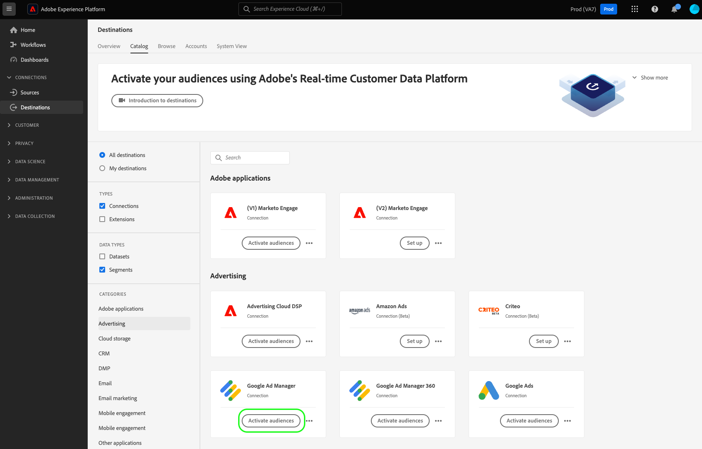
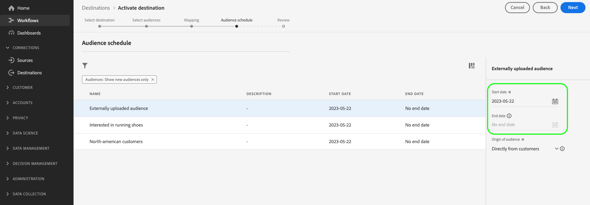

# ストリーミング先に対するオーディエンスのアクティブ化

>[!IMPORTANT]
> 
> * オーディエンスをアクティブ化して [マッピング手順](#mapping) ワークフローの「 **[!UICONTROL 宛先の管理]**, **[!UICONTROL 宛先のアクティブ化]**, **[!UICONTROL プロファイルの表示]**、および **[!UICONTROL セグメントを表示]** [アクセス制御権限](/help/access-control/home.md#permissions).
> * を経由せずにオーディエンスをアクティブ化するには [マッピング手順](#mapping) ワークフローの「 **[!UICONTROL 宛先の管理]**, **[!UICONTROL マッピングなしでセグメントをアクティブ化]**, **[!UICONTROL プロファイルの表示]**、および **[!UICONTROL セグメントを表示]** [アクセス制御権限](/help/access-control/home.md#permissions).
>* 書き出す *id*、 **[!UICONTROL ID グラフを表示]** [アクセス制御権限](/help/access-control/home.md#permissions).   {width="100" zoomable="yes"}
> 
> 詳しくは、[アクセス制御の概要](/help/access-control/ui/overview.md)または製品管理者に問い合わせて、必要な権限を取得してください。

## 概要 {#overview}

この記事では、Adobe Experience Platformのストリーミング宛先でオーディエンスをアクティブ化するために必要なワークフローについて説明します。

## 前提条件 {#prerequisites}

オーディエンスを宛先に対してアクティブ化するには、次の条件を満たす必要があります。 [宛先に接続されている](./connect-destination.md). まだ接続していない場合は、[宛先カタログ](../catalog/overview.md)に移動し、サポートされている宛先を参照し、使用する宛先を設定します。

## 宛先の選択 {#select-destination}

1. **[!UICONTROL 接続／宛先]**&#x200B;に移動し、「**[!UICONTROL カタログ]**」タブを選択します。

   

1. 選択 **[!UICONTROL オーディエンスをアクティブ化]** オーディエンスをアクティブ化する宛先に対応するカード（下図を参照）。

   

1. オーディエンスのアクティブ化に使用する宛先接続を選択し、「 」を選択します。 **[!UICONTROL 次へ]**.

   

1. 次のセクションに移動： [オーディエンスを選択](#select-audiences).

## オーディエンスを選択 {#select-audiences}

宛先に対してアクティブ化するオーディエンスを選択するには、オーディエンス名の左側にあるチェックボックスを使用して、 **[!UICONTROL 次へ]**.

オリジンに応じて、複数のタイプのオーディエンスから選択できます。

* **[!UICONTROL セグメント化サービス]**：セグメント化サービスによってExperience Platform内で生成されたオーディエンス。 詳しくは、 [セグメント化ドキュメント](../../segmentation/ui/overview.md) を参照してください。
* **[!UICONTROL カスタムアップロード]**：オーディエンスがExperience Platform外で生成され、CSV ファイルとして Platform にアップロードされた。 外部オーディエンスについて詳しくは、 [オーディエンスのインポート](../../segmentation/ui/overview.md#import-audience).
* 他のタイプのオーディエンス ( 例：他のAdobeソリューションからのもの ) [!DNL Audience Manager].

## 属性と ID のマッピング {#mapping}

>[!IMPORTANT]
>
>この手順は、一部のオーディエンスストリーミングの宛先にのみ適用されます。 宛先に **[!UICONTROL マッピング]** ステップ、スキップ [オーディエンススケジュール](#scheduling).

一部のオーディエンスストリーミングの宛先では、宛先のターゲット ID としてマッピングするために、ソース属性または ID 名前空間を選択する必要があります。

1. Adobe Analytics の **[!UICONTROL マッピング]** ページ、選択 **[!UICONTROL 新しいマッピングを追加]**.

   

1. **[!UICONTROL ソースフィールド]**&#x200B;エントリの右側の矢印を選択します。

   

1. Adobe Analytics の **[!UICONTROL ソースフィールドを選択]** ページでは、 **[!UICONTROL 属性を選択]** または **[!UICONTROL ID 名前空間を選択]** 使用可能なソースフィールドの 2 つのカテゴリを切り替えるためのオプション。 使用可能な [!DNL XDM] プロファイル属性と id 名前空間で、宛先にマッピングする名前空間を選択し、「 」を選択します。 **[!UICONTROL 選択]**.

   

1. の右側にあるボタンを選択します。 **[!UICONTROL ターゲットフィールド]** エントリ。

   

1. Adobe Analytics の **[!UICONTROL ターゲットフィールドを選択]** ページで、ソースフィールドをマッピングするターゲット id 名前空間を選択し、「 」を選択します。 **[!UICONTROL 選択]**.

   

1. さらにマッピングを追加するには、手順 1 ～ 5 を繰り返します。

### 変換を適用 {#apply-transformation}

>[!CONTEXTUALHELP]
>id="platform_destinations_activate_applytransformation"
>title="変換を適用"
>abstract="ハッシュ化されていないソースフィールドを使用している場合に、このオプションを有効にすると、Adobe Experience Platform でアクティベーション時に自動的にハッシュ化されます。"

ハッシュ化されていないソース属性を、宛先によってハッシュ化されることが期待されているターゲット属性（例：`email_lc_sha256` や `phone_sha256`）にマッピングしている場合、アクティベーション時に Adobe Experience Platform にソース属性を自動的にハッシュ化させるために、「**変換を適用**」オプションをオンにします。

## オーディエンスの書き出しをスケジュール {#scheduling}

>[!CONTEXTUALHELP]
>id="platform_destinations_activate_enddate"
>title="終了日"
>abstract="オーディエンススケジュールの終了日を追加することはできません。"

デフォルトでは、 **[!UICONTROL オーディエンススケジュール]** ページには、現在のアクティベーションフローで選択した新しく選択されたオーディエンスのみが表示されます。

宛先に対してアクティブ化されているすべてのオーディエンスを確認するには、フィルタリングオプションを使用して、 **[!UICONTROL 新しいオーディエンスのみを表示]** フィルター。

1. 次の日： **[!UICONTROL オーディエンススケジュール]** ページで、各オーディエンスを選択し、 **[!UICONTROL 開始日]** および **[!UICONTROL 終了日]** セレクター：宛先にデータを送信する際の時間間隔を設定します。

   

   * 一部の宛先では、 **[!UICONTROL オーディエンスの起源]** 各オーディエンスに対して、カレンダーセレクターの下にあるドロップダウンメニューを使用します。 宛先にこのセレクターが含まれていない場合は、この手順をスキップします。

     

   * 一部の宛先では、手動でマッピングする必要があります [!DNL Platform] オーディエンスをターゲットとする宛先のオーディエンスに関連付けます。 これをおこなうには、各オーディエンスを選択し、 **[!UICONTROL マッピング ID]** フィールドに入力します。 宛先にこのフィールドが含まれていない場合は、この手順をスキップします。

     

   * 一部の宛先では、 **[!UICONTROL アプリ ID]** 有効化時 [!DNL IDFA] または [!DNL GAID] オーディエンス。 宛先にこのフィールドが含まれていない場合は、この手順をスキップします。

     

1. 選択 **[!UICONTROL 次へ]** に行く [!UICONTROL レビュー] ページに貼り付けます。

## レビュー {#review}

「**[!UICONTROL レビュー]**」ページには、選択内容の概要が表示されます。「**[!UICONTROL キャンセル]**」を選択してフローを分割するか、「**[!UICONTROL 戻る]**」を選択して設定を変更する、または、「**[!UICONTROL 完了]**」を選択して確定し、宛先へのデータの送信を開始します。

### 同意ポリシーの評価 {#consent-policy-evaluation}

組織で **Adobe Healthcare Shield** または **Adobe Privacy &amp; Security Shield** を購入した場合、**[!UICONTROL 適用可能な同意ポリシーを表示]**&#x200B;を選択すると、どの同意ポリシーが適用され、その結果、いくつのプロファイルがアクティベーションに含まれるかを確認することができます。お読みください [同意ポリシーの評価](/help/data-governance/enforcement/auto-enforcement.md#consent-policy-evaluation) を参照してください。

### データ使用ポリシーのチェック {#data-usage-policy-checks}

Adobe Analytics の **[!UICONTROL レビュー]** 手順の後、Experience Platformは、データ使用ポリシーの違反を確認します。 ポリシーに違反した場合の例を次に示します。違反を解決するまで、オーディエンスのアクティベーションワークフローを完了することはできません。 ポリシー違反の解決方法については、 [データ使用ポリシーの違反](/help/data-governance/enforcement/auto-enforcement.md#data-usage-violation) （データガバナンスに関するドキュメントの節）を参照してください。

### オーディエンスのフィルタリング {#filter-audiences}

また、この手順では、ページで使用可能なフィルターを使用して、このワークフローの一部としてスケジュールまたはマッピングが更新されたオーディエンスのみを表示できます。 また、表示するテーブル列を切り替えることもできます。

選択が完了し、ポリシー違反が検出されなかった場合は、「 」を選択します。 **[!UICONTROL 完了]** をクリックして選択を確定し、宛先へのデータの送信を開始します。

## オーディエンスのアクティベーションを検証 {#verify}

次を確認します。 [宛先の監視に関するドキュメント](../../dataflows/ui/monitor-destinations.md) を参照してください。

<!-- 
For [!DNL Facebook Custom Audience], a successful activation means that a [!DNL Facebook] custom audience would be created programmatically in [[!UICONTROL Facebook Ads Manager]](https://www.facebook.com/adsmanager/manage/). Audience membership in the audience would be added and removed as users are qualified or disqualified for the activated audiences.

>[!TIP]
>
>The integration between Adobe Experience Platform and [!DNL Facebook] supports historical audience backfills. All historical audience qualifications are sent to [!DNL Facebook] when you activate the audiences to the destination.
-->
