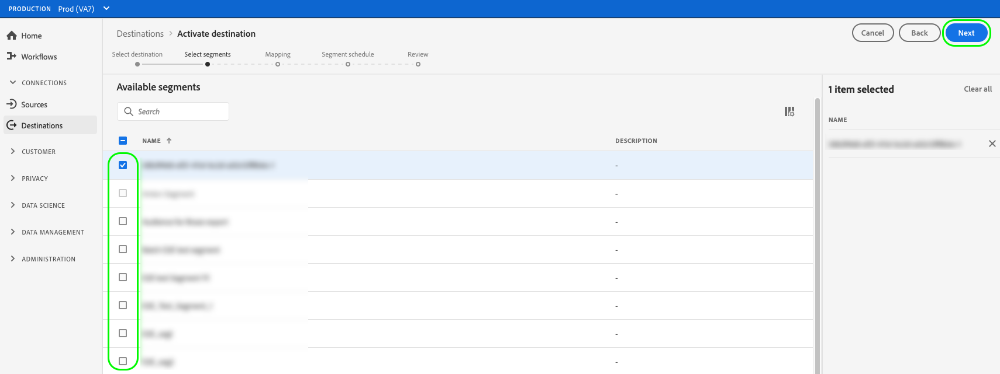
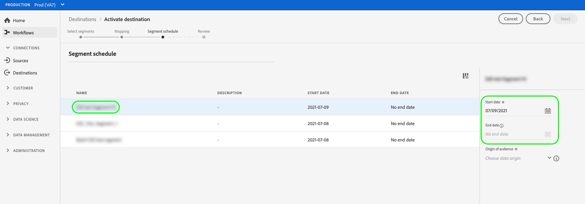

# ストリーミングセグメント書き出しの宛先に対するオーディエンスデータのアクティブ化

## 概要 {#overview}

この記事では、Adobe Experience Platformのセグメントストリーミング宛先でオーディエンスデータをアクティブ化するために必要なワークフローについて説明します。

## 前提条件 {#prerequisites}

宛先に対してデータをアクティブ化するには、宛先 ](./connect-destination.md) に [ 正常に接続されている必要があります。 まだの場合は、[ 宛先カタログ ](../catalog/overview.md) に移動し、サポートされている宛先を参照して、使用する宛先を設定します。

## 宛先の選択 {#select-destination}

1. **[!UICONTROL 接続/宛先]** に移動し、「**[!UICONTROL カタログ]**」タブを選択します。

   

1. 次の図に示すように、セグメントをアクティブ化する宛先に対応するカードで「**[!UICONTROL セグメントをアクティブ化]**」を選択します。

   

1. セグメントのアクティブ化に使用する宛先接続を選択し、「**[!UICONTROL 次へ]**」を選択します。

   

1. 次のセクションに移動して [ セグメントを選択します ](#select-segments)。

## セグメントの選択 {#select-segments}

セグメント名の左側にあるチェックボックスを使用して、宛先に対してアクティブ化するセグメントを選択し、「**[!UICONTROL 次へ]**」を選択します。

## 属性と ID のマッピング {#mapping}

>[!IMPORTANT]
>
>この手順は、一部のセグメントストリーミング宛先にのみ適用されます。 宛先に **[!UICONTROL マッピング]** 手順がない場合は、「[ セグメントの書き出しをスケジュール ](#scheduling)」にスキップします。

セグメントストリーミングの宛先によっては、宛先のターゲット ID としてマッピングするソース属性または ID 名前空間を選択する必要がある場合があります。

1. **[!UICONTROL マッピング]** ページで、「**[!UICONTROL 新しいマッピングを追加]**」を選択します。

   

1. **[!UICONTROL ソースフィールド]** エントリの右側にある矢印を選択します。

   

1. **[!UICONTROL ソースフィールドを選択]** ページで、**[!UICONTROL 属性を選択]** または **[!UICONTROL ID 名前空間を選択]** オプションを使用して、使用可能なソースフィールドの 2 つのカテゴリを切り替えます。 使用可能な [!DNL XDM] プロファイル属性と ID 名前空間から、宛先にマッピングするプロファイル属性と ID 名前空間を選択し、「****」を選択します。

   

1. 「**[!UICONTROL ターゲットフィールド]**」エントリの右側にあるボタンを選択します。

   

1. **[!UICONTROL ターゲットフィールドを選択]** ページで、ソースフィールドのマッピング先のターゲット ID 名前空間を選択し、「**[!UICONTROL 選択]**」を選択します。

   

1. マッピングをさらに追加するには、手順 1 ～ 5 を繰り返します。

### 変換の適用 {#apply-transformation}

>[!CONTEXTUALHELP]
>id="platform_destinations_activate_applytransformation"
>title="変換の適用"
>abstract="非ハッシュ化のソースフィールドを使用する場合は、このオプションを選択し、Adobe Experience Platformでアクティベーション時に自動的にハッシュ化します。"
>additional-url="https://experienceleague.adobe.com/docs/experience-platform/destinations/ui/activate/activate-segment-streaming-destinations.html?lang=en#apply-transformation" text="詳しくは、ドキュメントを参照してください。"

ハッシュ化されていないソース属性を、宛先でハッシュ化が必要なターゲット属性にマッピングする場合 ( 例：`email_lc_sha256` または `phone_sha256`)、「**変換を適用**」オプションをオンにして、Adobe Experience Platformがアクティブ化時にソース属性を自動的にハッシュ化するようにします。

## スケジュールセグメントの書き出し {#scheduling}

デフォルトでは、[!UICONTROL  セグメントスケジュール ] ページには、現在のアクティベーションフローで選択した新しく選択したセグメントのみが表示されます。

宛先に対してアクティブ化されているすべてのセグメントを表示するには、フィルタリングオプションを使用して、「**[!UICONTROL Show new segments only]**」フィルターを無効にします。

1. **[!UICONTROL セグメントスケジュール]** ページで、各セグメントを選択し、**[!UICONTROL 開始日]** および **[!UICONTROL 終了日]** セレクターを使用して、宛先にデータを送信する時間間隔を設定します。

   

   * 一部の宛先では、カレンダーセレクターの下のドロップダウンメニューを使用して、各セグメントの **[!UICONTROL オーディエンスの接触チャネル]** を選択する必要があります。 宛先にこのセレクターが含まれていない場合は、この手順をスキップします。

      

   * 一部の宛先では、[!DNL Platform] セグメントをターゲットの宛先の対応するセグメントに手動でマッピングする必要があります。 これをおこなうには、各セグメントを選択し、宛先プラットフォームから対応するセグメント ID を「**[!UICONTROL マッピング ID]**」フィールドに入力します。 宛先にこのフィールドが含まれていない場合は、この手順をスキップしてください。

      

   * 一部の宛先では、[!DNL IDFA] または [!DNL GAID] セグメントをアクティブ化する際に、**[!UICONTROL アプリ ID]** を入力する必要があります。 宛先にこのフィールドが含まれていない場合は、この手順をスキップしてください。

      

1. **[!UICONTROL 次へ]** を選択して、[!UICONTROL  レビュー ] ページに移動します。

## レビュー {#review}

「**[!UICONTROL 確認]**」ページには、選択の概要が表示されます。「**[!UICONTROL キャンセル]**」を選択してフローを分割するか、「**[!UICONTROL 戻る]**」を選択して設定を変更する、または、「**[!UICONTROL 完了]**」を選択して確定し、宛先へのデータの送信を開始します。

>[!IMPORTANT]
>
>この手順では、Adobe Experience Platformはデータ使用ポリシーの違反を確認します。 次に、ポリシーに違反する例を示します。 違反を解決するまで、セグメントのアクティベーションワークフローを完了することはできません。 ポリシー違反の解決方法について詳しくは、データガバナンスのドキュメントの節の [ ポリシーの適用 ](../../rtcdp/privacy/data-governance-overview.md#enforcement) を参照してください。

ポリシー違反が検出されなかった場合は、「**[!UICONTROL 完了]**」を選択して選択内容を確認し、宛先へのデータの送信を開始します。

## セグメントのアクティベーションの検証 {#verify}

宛先へのデータのフローを監視する方法の詳細については、[ 宛先の監視に関するドキュメント ](../../dataflows/ui/monitor-destinations.md) を参照してください。

<!-- 
For [!DNL Facebook Custom Audience], a successful activation means that a [!DNL Facebook] custom audience would be created programmatically in [[!UICONTROL Facebook Ads Manager]](https://www.facebook.com/adsmanager/manage/). Segment membership in the audience would be added and removed as users are qualified or disqualified for the activated segments.

>[!TIP]
>
>The integration between Adobe Experience Platform and [!DNL Facebook] supports historical audience backfills. All historical segment qualifications are sent to [!DNL Facebook] when you activate the segments to the destination.
-->
