# ストリーミング配信先でオーディエンスを活用

>[!IMPORTANT]
>
> * オーディエンスをアクティブ化し、ワークフローの[&#x200B; マッピング手順](#mapping)を有効にするには、**[!UICONTROL View Destinations]**、**[!UICONTROL Activate Destinations]**、**[!UICONTROL View Profiles]**&#x200B;および&#x200B;**[!UICONTROL View Segments]** [&#x200B; アクセス制御権限](/help/access-control/home.md#permissions)が必要です。
> * ワークフローの[&#x200B; マッピング手順](#mapping)を経ずにオーディエンスをアクティブ化するには、**[!UICONTROL View Destinations]**、**[!UICONTROL Activate Segment without Mapping]**、**[!UICONTROL View Profiles]**&#x200B;および&#x200B;**[!UICONTROL View Segments]**、[&#x200B; アクセス制御権限](/help/access-control/home.md#permissions)が必要です。
> * *ID*&#x200B;をエクスポートするには、**[!UICONTROL View Identity Graph]** [&#x200B; アクセス制御権限](/help/access-control/home.md#permissions)が必要です。  {width="100" zoomable="yes"}
> 
> 詳しくは、[アクセス制御の概要](/help/access-control/ui/overview.md)または製品管理者に問い合わせて、必要な権限を取得してください。

## 概要 {#overview}

この記事では、[!DNL Adobe Experience Platform] ストリーミング宛先でオーディエンスをアクティブ化するために必要なワークフローについて説明します。

## 前提条件 {#prerequisites}

宛先に対してオーディエンスをアクティブ化するには、宛先[に正常に](./connect-destination.md)接続している必要があります。 まだ接続していない場合は、[宛先カタログ](../catalog/overview.md)に移動し、サポートされている宛先を参照し、使用する宛先を設定します。

## 宛先の選択 {#select-destination}

1. **[!UICONTROL Connections > Destinations]**&#x200B;に移動し、「**[!UICONTROL Catalog]**」タブを選択します。

   様々なストリーミング宛先を示す

1. 以下の画像に示すように、オーディエンスをアクティブ化する宛先に対応するカードで&#x200B;**[!UICONTROL Activate audiences]**&#x200B;を選択します。

   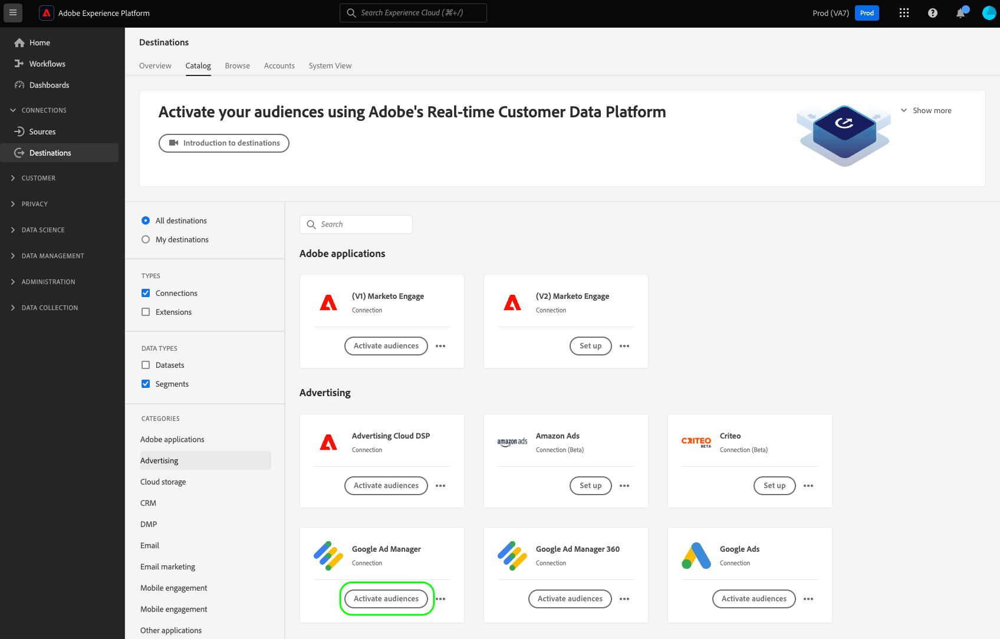

1. オーディエンスの有効化に使用する宛先接続を選択し、**[!UICONTROL Next]**&#x200B;を選択します。

   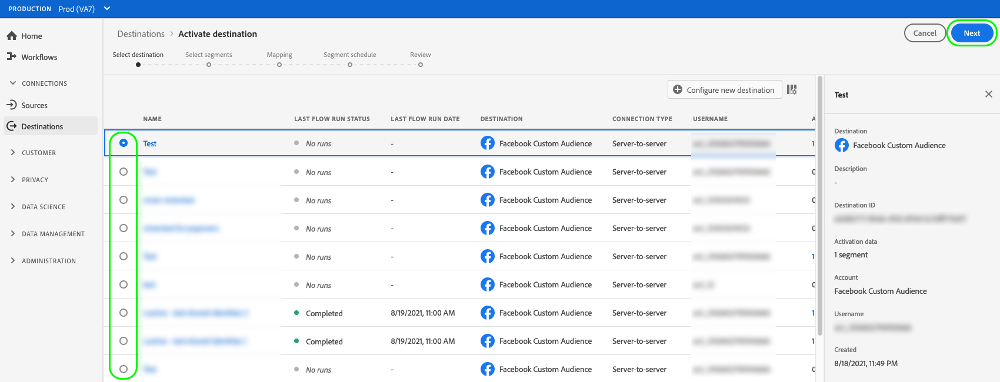

1. 次のセクションに移動して、[&#x200B; オーディエンスを選択](#select-audiences)します。

## オーディエンスの選択 {#select-audiences}

宛先に対してアクティブ化するオーディエンスを選択するには、オーディエンス名の左側にあるチェックボックスを使用し、**[!UICONTROL Next]**&#x200B;を選択します。

配信元に応じて、複数のタイプのオーディエンスから選択できます。

* **[!UICONTROL Segmentation Service]**: Segmentation ServiceによってExperience Platform内で生成されたオーディエンス。 詳しくは、[&#x200B; セグメント化ドキュメント &#x200B;](../../segmentation/ui/overview.md)を参照してください。
* **[!UICONTROL Custom upload]**: Experience Platform以外で生成され、CSV ファイルとしてExperience Platformにアップロードされたオーディエンス。 外部オーディエンスについて詳しくは、[&#x200B; オーディエンスの読み込み](../../segmentation/ui/audience-portal.md#import-audience)に関するドキュメントを参照してください。
* その他の種類のオーディエンスは、[!DNL Audience Manager]など、他のAdobe ソリューションから作成されています。

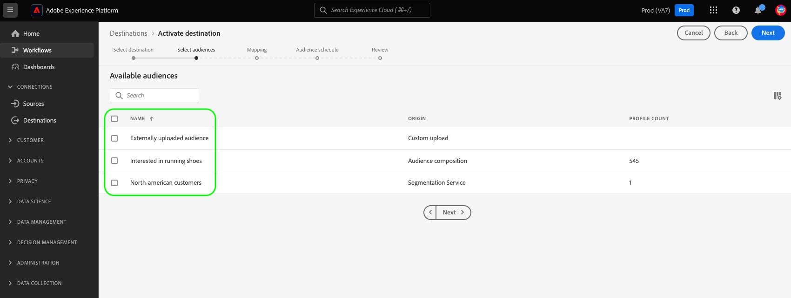

## 属性と ID のマッピング {#mapping}

>[!IMPORTANT]
>
>この手順は、一部のオーディエンスストリーミング宛先にのみ適用されます。 宛先に&#x200B;**[!UICONTROL Mapping]** ステップがない場合は、[&#x200B; オーディエンススケジューリング &#x200B;](#scheduling)にスキップします。
>
>ストリーミング宛先にオーディエンスをアクティブ化する場合は、ターゲットプロファイル属性に加えて、*少なくとも1つのターゲット ID名前空間*をマッピングする必要があります。 そうでない場合、オーディエンスは宛先プラットフォームに対してアクティブ化されません。
> 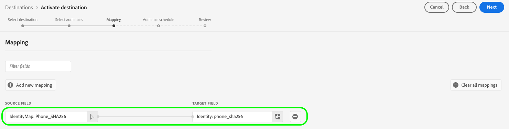 {zoomable="yes"}

一部のオーディエンスストリーミング宛先では、宛先内のターゲット IDとしてマッピングするために、ソース属性またはID名前空間を選択する必要があります。

1. **[!UICONTROL Mapping]** ページで、**[!UICONTROL Add new mapping]**&#x200B;を選択します。

   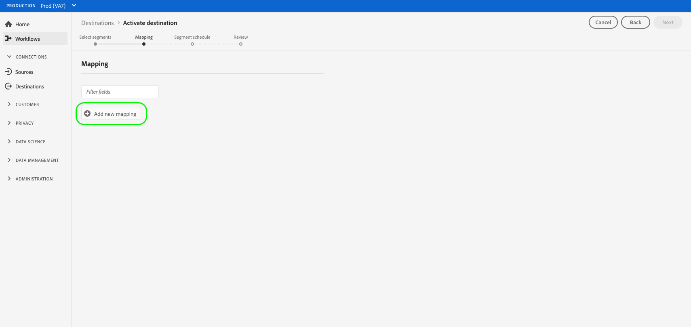

1. **[!UICONTROL Source field]** エントリの右側にある矢印を選択します。

   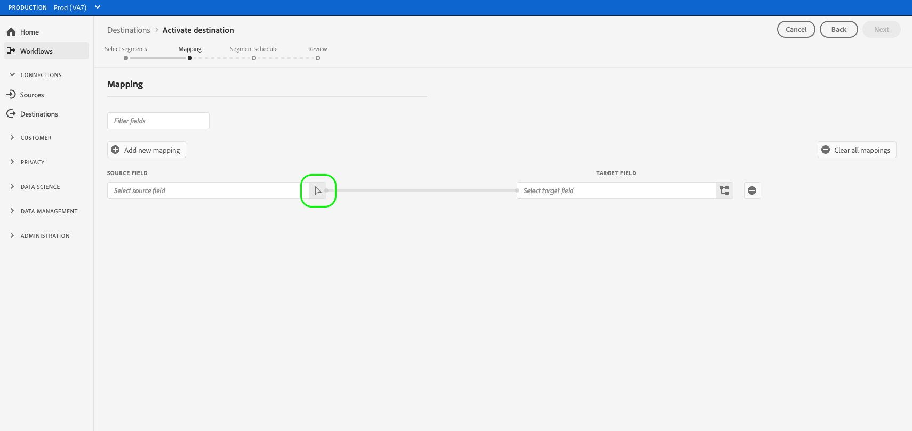

1. **[!UICONTROL Select source field]** ページで、**[!UICONTROL Select attributes]**&#x200B;または&#x200B;**[!UICONTROL Select identity namespace]** オプションを使用して、使用可能なソースフィールドの2つのカテゴリを切り替えます。 使用可能な[!DNL XDM] プロファイル属性とID名前空間から、宛先にマッピングするプロファイル属性を選択し、**[!UICONTROL Select]**&#x200B;を選択します。

   値が入力されたスキーマフィールドのみを表示するには、**[!UICONTROL Show only fields with data]** トグルを使用します。 デフォルトでは、入力されたスキーマフィールドのみが表示されます。

   

   スキーマフィールド名ではなく、フィールドのわかりやすい名前を表示するには、**[!UICONTROL Show display names for fields]** トグルを使用します。

   

1. **[!UICONTROL Target field]** エントリの右側にあるボタンを選択します。

   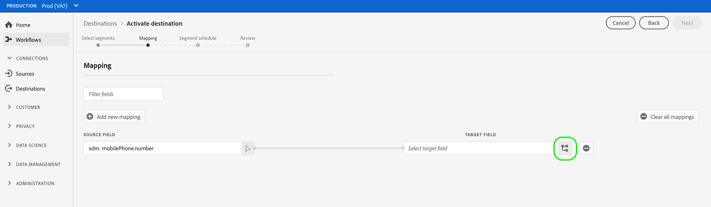

1. **[!UICONTROL Select target field]** ページで、ソースフィールドをマッピングするターゲット ID名前空間を選択し、**[!UICONTROL Select]**&#x200B;を選択します。

   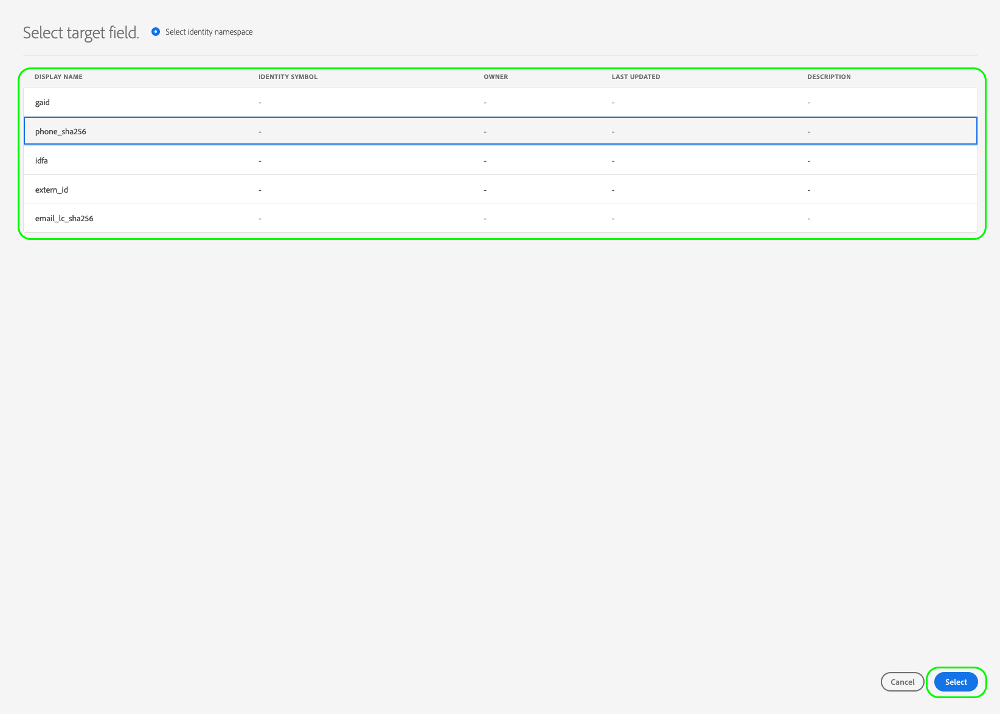

1. さらにマッピングを追加するには、手順1～5を繰り返します。

### 変換を適用 {#apply-transformation}

>[!CONTEXTUALHELP]
>id="platform_destinations_activate_applytransformation"
>title="変換を適用"
>abstract="ハッシュ化されていないソースフィールドを使用する場合は、このオプションをオンにして、[!DNL Adobe Experience Platform]がアクティベーション時に自動的にハッシュ化されるようにします。"

ハッシュ化されていないソース属性を、宛先がハッシュ化されることを期待するターゲット属性（例：`email_lc_sha256`または`phone_sha256`）にマッピングする場合は、「**変換を適用**」オプションをオンにして、アクティベーション時にソース属性を[!DNL Adobe Experience Platform]自動的にハッシュ化します。

## オーディエンスの書き出しのスケジュール {#scheduling}

>[!CONTEXTUALHELP]
>id="platform_destinations_activate_enddate"
>title="終了日"
>abstract="オーディエンススケジュールの終了日を追加することはできません。"

デフォルトでは、**[!UICONTROL Audience schedule]** ページには、現在のアクティベーションフローで選択した新しく選択したオーディエンスのみが表示されます。

宛先に対してアクティブ化されているすべてのオーディエンスを表示するには、フィルターオプションを使用して、**[!UICONTROL Show new audiences only]** フィルターを無効にします。

1. **[!UICONTROL Audience schedule]** ページで、各オーディエンスを選択し、**[!UICONTROL Start date]**&#x200B;および&#x200B;**[!UICONTROL End date]** セレクターを使用して、宛先にデータを送信する時間間隔を設定します。

   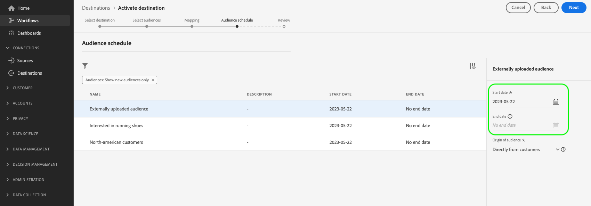

   * 一部の宛先では、カレンダーセレクターの下にあるドロップダウンメニューを使用して、各オーディエンスの&#x200B;**[!UICONTROL Origin of audience]**&#x200B;を選択する必要があります。 宛先にこのセレクターが含まれていない場合は、この手順をスキップしてください。

     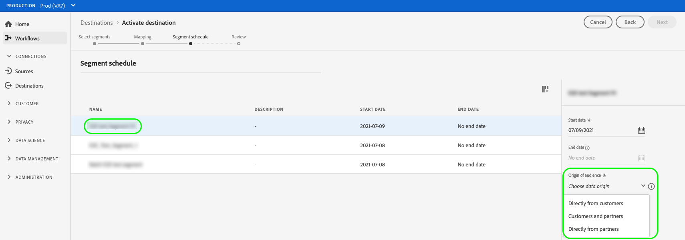

   * 一部の宛先では、[!DNL Experience Platform]人のオーディエンスをターゲット宛先の相手に手動でマッピングする必要があります。 これを行うには、各オーディエンスを選択し、宛先プラットフォームの対応するオーディエンス IDを&#x200B;**[!UICONTROL Mapping ID]** フィールドに入力します。 宛先にこのフィールドが含まれていない場合は、この手順をスキップしてください。

     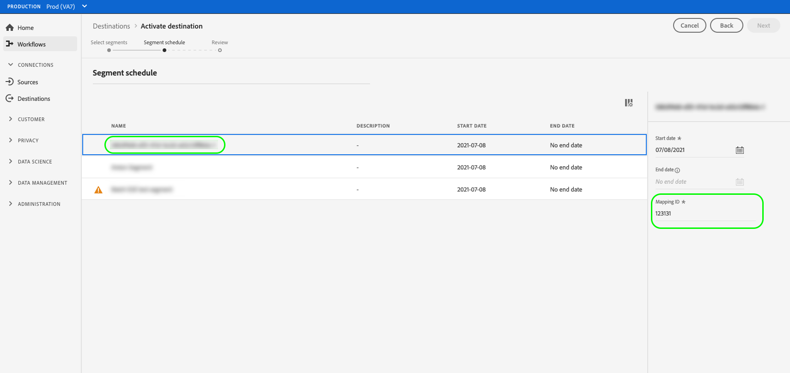

   * 一部の宛先では、**[!UICONTROL App ID]**&#x200B;または[!DNL IDFA]個のオーディエンスをアクティブ化する際に、[!DNL GAID]を入力する必要があります。 宛先にこのフィールドが含まれていない場合は、この手順をスキップしてください。

     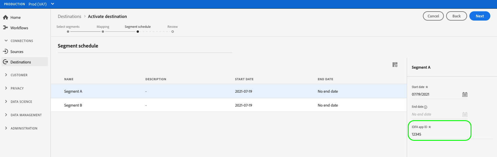

1. **[!UICONTROL Next]**&#x200B;を選択して[!UICONTROL Review] ページに移動します。

## レビュー {#review}

**[!UICONTROL Review]** ページで、選択内容の概要を表示できます。 **[!UICONTROL Cancel]**&#x200B;を選択してフローを分割し、**[!UICONTROL Back]**&#x200B;を選択して設定を変更するか、**[!UICONTROL Finish]**&#x200B;を選択して選択を確定し、宛先へのデータ送信を開始します。

レビュー手順の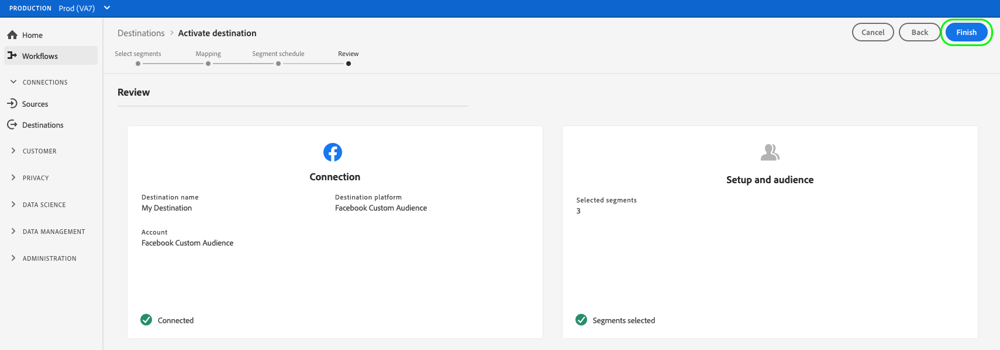

### 同意ポリシーの評価 {#consent-policy-evaluation}

お客様の組織が&#x200B;**Adobe Healthcare Shield**&#x200B;または&#x200B;**Adobe Privacy &amp; Security Shield**&#x200B;を購入した場合、**[!UICONTROL View applicable consent policies]**&#x200B;を選択して、適用される同意ポリシーと、その結果としてアクティベーションに含まれるプロファイルの数を確認します。 詳しくは、[同意ポリシーの評価](/help/data-governance/enforcement/auto-enforcement.md#consent-policy-evaluation)を参照してください。

### データ使用ポリシーチェック {#data-usage-policy-checks}

**[!UICONTROL Review]** ステップでは、Experience Platformもデータ使用ポリシー違反をチェックします。 ポリシーに違反した場合の例を次に示します。オーディエンスのアクティベーション ワークフローを完了するには、違反を解決する必要があります。 ポリシー違反を解決する方法について詳しくは、「データガバナンスのドキュメント」セクションの[&#x200B; データ使用ポリシー違反](/help/data-governance/enforcement/auto-enforcement.md#data-usage-violation)を参照してください。

### オーディエンスを絞り込む {#filter-audiences}

また、この手順では、ページで使用可能なフィルターを使用して、このワークフローの一部としてスケジュールまたはマッピングが更新されたオーディエンスのみを表示できます。 表示するテーブル列を切り替えることもできます。

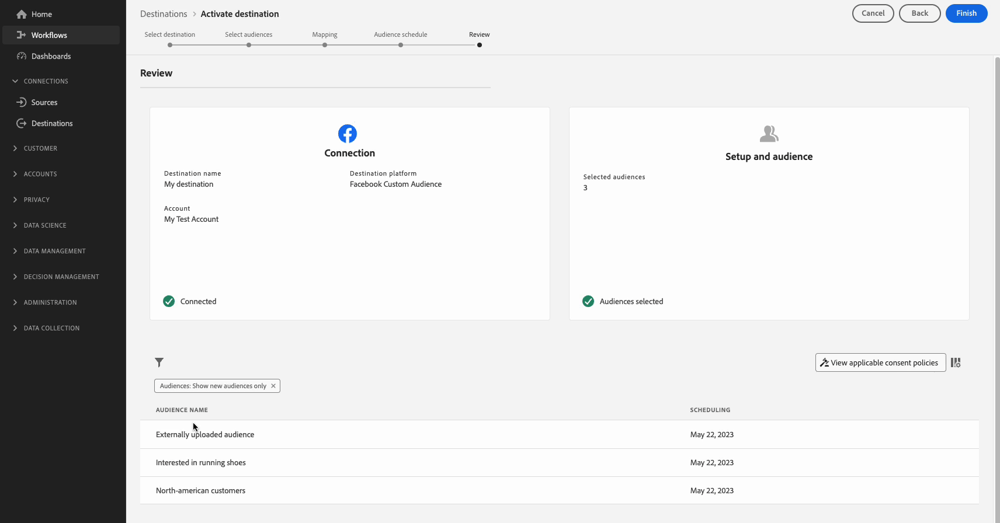

選択に満足しており、ポリシー違反が検出されていない場合は、**[!UICONTROL Finish]**&#x200B;を選択して選択を確認し、宛先へのデータ送信を開始します。

## オーディエンスのアクティブ化の検証 {#verify}

宛先へのデータのフローを監視する方法の詳細については、[宛先モニタリングに関するドキュメント &#x200B;](../../dataflows/ui/monitor-destinations.md)を参照してください。

<!-- 
For [!DNL Facebook Custom Audience], a successful activation means that a [!DNL Facebook] custom audience would be created programmatically in [[!UICONTROL Facebook Ads Manager]](https://www.facebook.com/adsmanager/manage/). Audience membership in the audience would be added and removed as users are qualified or disqualified for the activated audiences.

>[!TIP]
>
>The integration between [!DNL Adobe Experience Platform] and [!DNL Facebook] supports historical audience backfills. All historical audience qualifications are sent to [!DNL Facebook] when you activate the audiences to the destination.
-->
