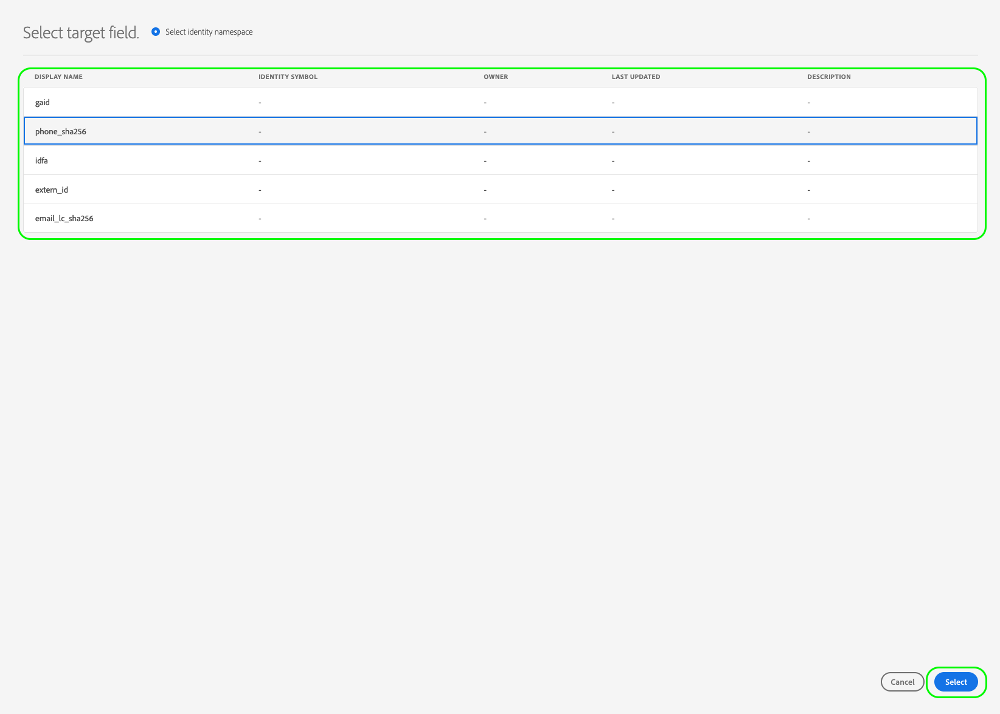

# ストリーミング宛先に対するオーディエンスのアクティブ化

>[!IMPORTANT]
> 
> * オーディエンスをアクティブ化し、 [マッピングステップ](#mapping) ワークフローで、次が必要です **[!UICONTROL 宛先の表示]**, **[!UICONTROL 宛先のアクティブ化]**, **[!UICONTROL プロファイルの表示]**、および **[!UICONTROL セグメントの表示]** [アクセス制御権限](/help/access-control/home.md#permissions).
> * を実行せずにオーディエンスをアクティブ化するには [マッピングステップ](#mapping) ワークフローで、次が必要です **[!UICONTROL 宛先の表示]**, **[!UICONTROL マッピングを使用しないセグメントのアクティブ化]**, **[!UICONTROL プロファイルの表示]**、および **[!UICONTROL セグメントの表示]** [アクセス制御権限](/help/access-control/home.md#permissions).
>* エクスポートする *id*、が必要です **[!UICONTROL ID グラフの表示]** [アクセス制御権限](/help/access-control/home.md#permissions).   {width="100" zoomable="yes"}
> 
> 詳しくは、[アクセス制御の概要](/help/access-control/ui/overview.md)または製品管理者に問い合わせて、必要な権限を取得してください。

## 概要 {#overview}

この記事では、Adobe Experience Platform ストリーミング宛先でオーディエンスをアクティブ化するために必要なワークフローについて説明します。

## 前提条件 {#prerequisites}

宛先に対してオーディエンスをアクティブ化するには、が正常に機能している必要があります [宛先に接続しました](./connect-destination.md). まだ接続していない場合は、[宛先カタログ](../catalog/overview.md)に移動し、サポートされている宛先を参照し、使用する宛先を設定します。

## 宛先の選択 {#select-destination}

1. **[!UICONTROL 接続／宛先]**&#x200B;に移動し、「**[!UICONTROL カタログ]**」タブを選択します。

   

1. を選択 **[!UICONTROL オーディエンスをアクティベート]** 次の画像に示すように、オーディエンスをアクティベートする宛先に対応するカードで。

   

1. オーディエンスをアクティベートするために使用する宛先接続を選択してから、を選択します **[!UICONTROL 次]**.

   

1. 次のセクションに移動： [オーディエンスを選択](#select-audiences).

## オーディエンスを選択 {#select-audiences}

宛先に対してアクティブ化するオーディエンスを選択するには、オーディエンス名の左側にあるチェックボックスを使用したあと、「」を選択します。 **[!UICONTROL 次]**.

接触チャネルに応じて、複数のタイプのオーディエンスから選択できます。

* **[!UICONTROL セグメント化サービス]**:Segmentation Service によってExperience Platform内で生成されたオーディエンス。 を参照してください。 [セグメント化ドキュメント](../../segmentation/ui/overview.md) を参照してください。
* **[!UICONTROL カスタムアップロード]**:Experience Platform以外で生成され、CSV ファイルとして Platform にアップロードされたオーディエンス。 外部オーディエンスについて詳しくは、のドキュメントを参照してください。 [オーディエンスのインポート](../../segmentation/ui/audience-portal.md#import-audience).
* その他のAdobeソリューションから生成される、次のようなオーディエンスのタイプ [!DNL Audience Manager].

## 属性と ID のマッピング {#mapping}

>[!IMPORTANT]
>
>この手順は、一部のオーディエンスストリーミング宛先にのみ適用されます。 宛先にがありません **[!UICONTROL マッピング]** 手順、次へスキップ [オーディエンスのスケジュール](#scheduling).
>
>ストリーミング宛先に対してオーディエンスをアクティブ化する場合、もマッピングする必要があります *少なくとも 1 つのターゲット id 名前空間*ターゲットプロファイル属性に加えて。 そうでない場合、オーディエンスは宛先プラットフォームに対してアクティブ化されません。
>  {zoomable="yes"}

一部のオーディエンスストリーミング宛先では、宛先内のターゲット ID としてマッピングするために、ソース属性または ID 名前空間を選択する必要があります。

1. が含まれる **[!UICONTROL マッピング]** ページ、選択 **[!UICONTROL 新しいマッピングを追加]**.

   

1. **[!UICONTROL ソースフィールド]**&#x200B;エントリの右側の矢印を選択します。

   

1. が含まれる **[!UICONTROL ソースフィールドを選択]** ページ、を使用 **[!UICONTROL 属性を選択]** または **[!UICONTROL ID 名前空間を選択]** 使用可能なソースフィールドの 2 つのカテゴリを切り替えるオプション。 利用可能なの [!DNL XDM] プロファイル属性と ID 名前空間を選択し、宛先にマッピングするものを選択します **[!UICONTROL を選択]**.

   の使用 **[!UICONTROL データのあるフィールドのみを表示]** 値が入力されたスキーマフィールドのみを表示するように切り替えます。 デフォルトでは、入力されたスキーマフィールドのみが表示されます。

   

1. の右側にあるボタンを選択します **[!UICONTROL ターゲットフィールド]** エントリ。

   

1. が含まれる **[!UICONTROL ターゲットフィールドを選択]** ページで、ソースフィールドにマッピングするターゲット id 名前空間を選択して、を選択します **[!UICONTROL を選択]**.

   

1. さらにマッピングを追加するには、手順 1 ～ 5 を繰り返します。

### 変換を適用 {#apply-transformation}

>[!CONTEXTUALHELP]
>id="platform_destinations_activate_applytransformation"
>title="変換を適用"
>abstract="ハッシュ化されていないソースフィールドを使用している場合に、このオプションを有効にすると、Adobe Experience Platform でアクティベーション時に自動的にハッシュ化されます。"

ハッシュ化されていないソース属性を、宛先によってハッシュ化されることが期待されているターゲット属性（例：`email_lc_sha256` や `phone_sha256`）にマッピングしている場合、アクティベーション時に Adobe Experience Platform にソース属性を自動的にハッシュ化させるために、「**変換を適用**」オプションをオンにします。

## オーディエンスの書き出しのスケジュール {#scheduling}

>[!CONTEXTUALHELP]
>id="platform_destinations_activate_enddate"
>title="終了日"
>abstract="オーディエンススケジュールの終了日を追加することはできません。"

デフォルトでは、 **[!UICONTROL オーディエンススケジュール]** ページには、現在のアクティベーションフローで選択した、新しく選択したオーディエンスのみが表示されます。

宛先に対してアクティブ化されているすべてのオーディエンスを表示するには、フィルタリングオプションを使用して、 **[!UICONTROL 新しいオーディエンスのみを表示]** フィルター。

1. 日 **[!UICONTROL オーディエンススケジュール]** ページで各オーディエンスを選択してから、 **[!UICONTROL 開始日]** および **[!UICONTROL 終了日]** セレクター：宛先にデータを送信する時間間隔を設定します。

   

   * 一部の宛先では、 **[!UICONTROL オーディエンスの接触チャネル]** 各オーディエンスについて、カレンダーセレクターの下にあるドロップダウンメニューを使用します。 宛先にこのセレクターが含まれていない場合、この手順はスキップします。

     

   * 一部の宛先では、手動でマッピングする必要があります [!DNL Platform] ターゲット宛先の相手へのオーディエンス。 これを行うには、各オーディエンスを選択し、対応するオーディエンス ID をの宛先プラットフォームから入力します。 **[!UICONTROL マッピング ID]** フィールド。 宛先にこのフィールドが含まれていない場合、この手順はスキップします。

     

   * 一部の宛先では、 **[!UICONTROL アプリ ID]** アクティベート時 [!DNL IDFA] または [!DNL GAID] オーディエンス。 宛先にこのフィールドが含まれていない場合、この手順はスキップします。

     

1. を選択 **[!UICONTROL 次]** に移動します [!UICONTROL レビュー] ページ。

## レビュー {#review}

「**[!UICONTROL レビュー]**」ページには、選択内容の概要が表示されます。「**[!UICONTROL キャンセル]**」を選択してフローを分割するか、「**[!UICONTROL 戻る]**」を選択して設定を変更する、または、「**[!UICONTROL 完了]**」を選択して確定し、宛先へのデータの送信を開始します。

### 同意ポリシーの評価 {#consent-policy-evaluation}

組織で **Adobe Healthcare Shield** または **Adobe Privacy &amp; Security Shield** を購入した場合、**[!UICONTROL 適用可能な同意ポリシーを表示]**&#x200B;を選択すると、どの同意ポリシーが適用され、その結果、いくつのプロファイルがアクティベーションに含まれるかを確認することができます。詳細を読む [同意ポリシーの評価](/help/data-governance/enforcement/auto-enforcement.md#consent-policy-evaluation) を参照してください。

### データ使用ポリシーのチェック {#data-usage-policy-checks}

が含まれる **[!UICONTROL レビュー]** また、Experience Platformはデータ使用ポリシーの違反がないかどうかを確認します。 ポリシーに違反した場合の例を次に示します。違反を解決するまで、Audience Activation ワークフローを完了することはできません。 ポリシー違反の解決方法については、以下を参照してください [データ使用ポリシーの違反](/help/data-governance/enforcement/auto-enforcement.md#data-usage-violation) データガバナンスに関するドキュメントの節を参照してください。

### オーディエンスのフィルタリング {#filter-audiences}

また、この手順では、ページで使用可能なフィルターを使用して、このワークフローの一環としてスケジュールまたはマッピングが更新されたオーディエンスのみを表示できます。 また、表示するテーブル列を切り替えることもできます。

選択内容に満足し、ポリシー違反が検出されていない場合は、を選択します **[!UICONTROL 終了]** をクリックして選択内容を確認し、宛先へのデータの送信を開始します。

## Audience Activation の検証 {#verify}

を確認します [宛先の監視ドキュメント](../../dataflows/ui/monitor-destinations.md) 宛先へのデータのフローを監視する方法について詳しくは、こちらを参照してください。

<!-- 
For [!DNL Facebook Custom Audience], a successful activation means that a [!DNL Facebook] custom audience would be created programmatically in [[!UICONTROL Facebook Ads Manager]](https://www.facebook.com/adsmanager/manage/). Audience membership in the audience would be added and removed as users are qualified or disqualified for the activated audiences.

>[!TIP]
>
>The integration between Adobe Experience Platform and [!DNL Facebook] supports historical audience backfills. All historical audience qualifications are sent to [!DNL Facebook] when you activate the audiences to the destination.
-->
