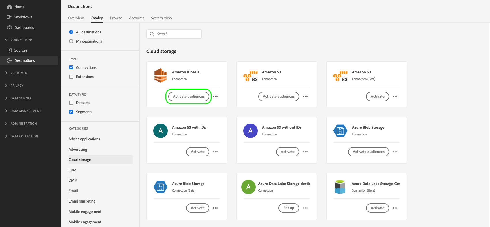
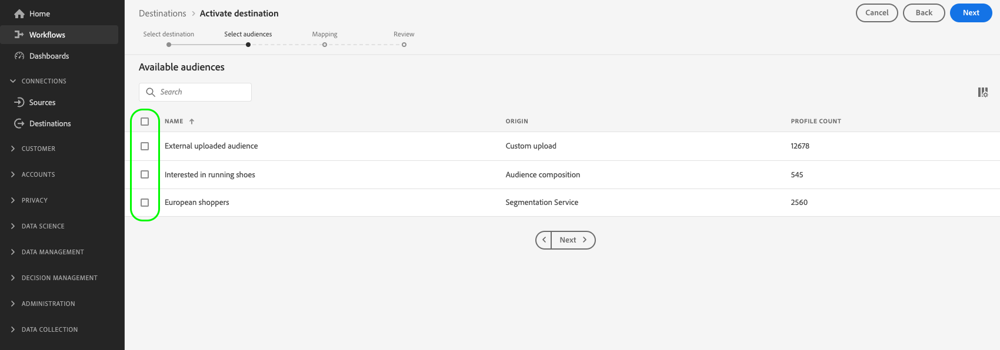

# ストリーミングプロファイルの書き出し先に対するオーディエンスのアクティブ化

>[!IMPORTANT]
> 
> * データをアクティブ化して [マッピング手順](#mapping) ワークフローの **[!UICONTROL 宛先の管理]**, **[!UICONTROL 宛先のアクティブ化]**, **[!UICONTROL プロファイルの表示]**、および **[!UICONTROL セグメントを表示]** [アクセス制御権限](/help/access-control/home.md#permissions).
> * を経由せずにデータをアクティブ化するには [マッピング手順](#mapping) ワークフローの **[!UICONTROL 宛先の管理]**, **[!UICONTROL マッピングなしでセグメントをアクティブ化]**, **[!UICONTROL プロファイルの表示]**、および **[!UICONTROL セグメントを表示]** [アクセス制御権限](/help/access-control/home.md#permissions).
> 
> 詳しくは、[アクセス制御の概要](/help/access-control/ui/overview.md)または製品管理者に問い合わせて、必要な権限を取得してください。

## 概要 {#overview}

この記事では、Amazon Kinesisなど、Adobe Experience Platformストリーミングプロファイルベースの宛先で、オーディエンスデータをアクティブ化するために必要なワークフローについて説明します。

## 前提条件 {#prerequisites}

宛先へのデータをアクティベートするには、正常に[宛先に接続する](./connect-destination.md)必要があります。まだ接続していない場合は、[宛先カタログ](../catalog/overview.md)に移動し、サポートされている宛先を参照し、使用する宛先を設定します。

## 宛先の選択 {#select-destination}

1. **[!UICONTROL 接続／宛先]**&#x200B;に移動し、「**[!UICONTROL カタログ]**」タブを選択します。

   

1. 選択 **[!UICONTROL オーディエンスをアクティブ化]** オーディエンスをアクティブ化する宛先に対応するカード（下図を参照）。

   

1. オーディエンスのアクティブ化に使用する宛先接続を選択し、「 」を選択します。 **[!UICONTROL 次へ]**.

   

1. 次のセクションに移動： [オーディエンスを選択](#select-audiences).

## オーディエンスを選択 {#select-audiences}

宛先に対してアクティブ化するオーディエンスを選択するには、オーディエンス名の左側にあるチェックボックスを使用して、 **[!UICONTROL 次へ]**.

オリジンに応じて、複数のタイプのオーディエンスから選択できます。

* **[!UICONTROL セグメント化サービス]**:セグメント化サービスによってExperience Platform内で生成されたオーディエンス。 詳しくは、 [セグメント化ドキュメント](../../segmentation/ui/overview.md) を参照してください。
* **[!UICONTROL カスタムアップロード]**:Experience Platform外で生成され、CSV ファイルとして Platform にアップロードされたオーディエンス。 外部オーディエンスについて詳しくは、 [オーディエンスのインポート](../../segmentation/ui/overview.md#import-audience).
* 他のタイプのオーディエンス ( 例：他のAdobeソリューションからのもの ) [!DNL Audience Manager].



## プロファイル属性の選択 {#select-attributes}

内 **[!UICONTROL マッピング]** 手順：ターゲットの宛先に送信するプロファイル属性を選択します。

1. **[!UICONTROL 属性を選択]**&#x200B;ページで「**[!UICONTROL 新しいフィールドを追加]**」を選択します。

   

1. 「**[!UICONTROL スキーマフィールド]**」エントリの右側の矢印を選択します。

   

1. **[!UICONTROL フィールドを選択]**&#x200B;ページで、宛先に送信する XDM 属性を選択してから「**[!UICONTROL 選択]**」を選択します。

   

1. フィールドをさらに追加するには、手順 1 ～ 3 を繰り返して、「 」を選択します。 **[!UICONTROL 次へ]**.

## レビュー {#review}

「**[!UICONTROL レビュー]**」ページには、選択内容の概要が表示されます。「**[!UICONTROL キャンセル]**」を選択してフローを分割するか、「**[!UICONTROL 戻る]**」を選択して設定を変更する、または、「**[!UICONTROL 完了]**」を選択して確定し、宛先へのデータの送信を開始します。


### 同意ポリシーの評価 {#consent-policy-evaluation}

組織で **Adobe Healthcare Shield** または **Adobe Privacy &amp; Security Shield** を購入した場合、**[!UICONTROL 適用可能な同意ポリシーを表示]**&#x200B;を選択すると、どの同意ポリシーが適用され、その結果、いくつのプロファイルがアクティベーションに含まれるかを確認することができます。詳細 [同意ポリシーの評価](/help/data-governance/enforcement/auto-enforcement.md#consent-policy-evaluation) を参照してください。

### データ使用ポリシーのチェック {#data-usage-policy-checks}

内 **[!UICONTROL レビュー]** 手順の後、Experience Platformは、データ使用ポリシーの違反を確認します。 ポリシーに違反した場合の例を次に示します。違反を解決するまで、オーディエンスのアクティベーションワークフローを完了することはできません。 ポリシー違反の解決方法については、 [データ使用ポリシー違反](/help/data-governance/enforcement/auto-enforcement.md#data-usage-violation) （データガバナンスに関するドキュメントの節）。


### オーディエンスのフィルタリング {#filter-audiences}

また、この手順では、ページで使用可能なフィルターを使用して、このワークフローの一部としてスケジュールまたはマッピングが更新されたオーディエンスのみを表示できます。


選択が完了し、ポリシー違反が検出されなかった場合は、「 」を選択します。 **[!UICONTROL 完了]** をクリックして選択を確定し、宛先へのデータの送信を開始します。

## オーディエンスのアクティベーションを検証 {#verify}

エクスポート済み [!DNL Experience Platform] データは、ターゲットとなる宛先に JSON 形式で配置されます。 例えば、以下のイベントには、特定のオーディエンスに適合し、別のオーディエンスから離脱したプロファイルの電子メールアドレス属性が含まれます。 この見込み客の ID は次のとおりです `ECID` および `email_lc_sha256`.

```json
{
  "person": {
    "email": "yourstruly@adobe.com"
  },
  "segmentMembership": {
    "ups": {
      "7841ba61-23c1-4bb3-a495-00d3g5fe1e93": {
        "lastQualificationTime": "2020-05-25T21:24:39Z",
        "status": "exited"
      },
      "59bd2fkd-3c48-4b18-bf56-4f5c5e6967ae": {
        "lastQualificationTime": "2020-05-25T23:37:33Z",
        "status": "realized"
      }
    }
  },
  "identityMap": {
    "ecid": [
      {
        "id": "14575006536349286404619648085736425115"
      },
      {
        "id": "66478888669296734530114754794777368480"
      }
    ],
    "email_lc_sha256": [
      {
        "id": "655332b5fa2aea4498bf7a290cff017cb4"
      },
      {
        "id": "66baf76ef9de8b42df8903f00e0e3dc0b7"
      }
    ]
  }
}
```
