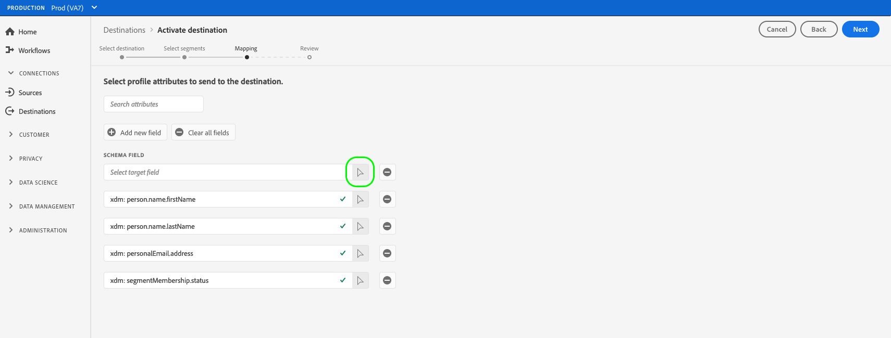

# ストリーミングプロファイルの書き出し先に対するオーディエンスデータのアクティブ化

## 概要 {#overview}

この記事では、Amazon Kinesisなど、Adobe Experience Platformストリーミングプロファイルベースの宛先でオーディエンスデータをアクティブ化するために必要なワークフローについて説明します。

## 前提条件 {#prerequisites}

宛先に対してデータをアクティブ化するには、宛先 ](./connect-destination.md) に [ 正常に接続されている必要があります。 まだの場合は、[ 宛先カタログ ](../catalog/overview.md) に移動し、サポートされている宛先を参照して、使用する宛先を設定します。

## 宛先の選択 {#select-destination}

1. **[!UICONTROL 接続/宛先]** に移動し、「**[!UICONTROL カタログ]**」タブを選択します。

   

1. 次の図に示すように、セグメントをアクティブ化する宛先に対応するカードで「**[!UICONTROL セグメントをアクティブ化]**」を選択します。

   

1. セグメントのアクティブ化に使用する宛先接続を選択し、「**[!UICONTROL 次へ]**」を選択します。

   

1. 次のセクションに移動して [ セグメントを選択します ](#select-segments)。

## セグメントの選択 {#select-segments}

セグメント名の左側にあるチェックボックスを使用して、宛先に対してアクティブ化するセグメントを選択し、「**[!UICONTROL 次へ]**」を選択します。


## プロファイル属性の選択 {#select-attributes}

ターゲットの宛先に送信するプロファイル属性を選択します。

>[!NOTE]
>
> Adobe Experience Platformは、スキーマの 4 つの推奨される、一般的に使用される属性を使用して、選択内容を事前入力します。`person.name.firstName`、`person.name.lastName`、`personalEmail.address`、`segmentMembership.status`。

`segmentMembership.status` が選択されているかどうかによって、ファイルのエクスポートは次の方法で異なります。
* 「`segmentMembership.status`」フィールドを選択した場合、エクスポートされるファイルには、最初のフルスナップショットの「**[!UICONTROL アクティブ]**」メンバーと、後続の増分エクスポートの「**[!UICONTROL アクティブ]**」および「**[!UICONTROL 期限切れ]**」メンバーが含まれます。
* 「 `segmentMembership.status` 」フィールドが選択されていない場合、エクスポートされたファイルには、最初の完全なスナップショットとそれ以降の増分エクスポートで **[!UICONTROL アクティブ]** メンバーのみが含まれます。


1. **[!UICONTROL 属性を選択]** ページで、「**[!UICONTROL 新しいフィールドを追加]**」を選択します。

   

1. 「**[!UICONTROL スキーマフィールド]**」エントリの右側にある矢印を選択します。

   

1. **[!UICONTROL フィールド]** を選択ページで、宛先に送信する XDM 属性を選択し、「**[!UICONTROL 選択]**」を選択します。

   


1. マッピングをさらに追加するには、手順 1 ～ 3 を繰り返し、「**[!UICONTROL 次へ]**」を選択します。

## レビュー {#review}

「**[!UICONTROL 確認]**」ページには、選択の概要が表示されます。「**[!UICONTROL キャンセル]**」を選択してフローを分割するか、「**[!UICONTROL 戻る]**」を選択して設定を変更する、または、「**[!UICONTROL 完了]**」を選択して確定し、宛先へのデータの送信を開始します。

>[!IMPORTANT]
>
>この手順では、Adobe Experience Platformはデータ使用ポリシーの違反を確認します。 次に、ポリシーに違反する例を示します。 違反を解決するまで、セグメントのアクティベーションワークフローを完了することはできません。 ポリシー違反の解決方法について詳しくは、データガバナンスのドキュメントの節の [ ポリシーの適用 ](../../rtcdp/privacy/data-governance-overview.md#enforcement) を参照してください。


ポリシー違反が検出されなかった場合は、「**[!UICONTROL 完了]**」を選択して選択内容を確認し、宛先へのデータの送信を開始します。


## セグメントのアクティベーションの検証 {#verify}

書き出された [!DNL Experience Platform] データは、JSON 形式のターゲット宛先に格納されます。 例えば、以下のイベントは、特定のセグメントに適合し、別のセグメントから離脱したオーディエンスの電子メールアドレスプロファイル属性を含みます。 この見込顧客の ID は ECID と電子メールです。

```json
{
  "person": {
    "email": "yourstruly@adobe.con"
  },
  "segmentMembership": {
    "ups": {
      "7841ba61-23c1-4bb3-a495-00d3g5fe1e93": {
        "lastQualificationTime": "2020-05-25T21:24:39Z",
        "status": "exited"
      },
      "59bd2fkd-3c48-4b18-bf56-4f5c5e6967ae": {
        "lastQualificationTime": "2020-05-25T23:37:33Z",
        "status": "existing"
      }
    }
  },
  "identityMap": {
    "ecid": [
      {
        "id": "14575006536349286404619648085736425115"
      },
      {
        "id": "66478888669296734530114754794777368480"
      }
    ],
    "email_lc_sha256": [
      {
        "id": "655332b5fa2aea4498bf7a290cff017cb4"
      },
      {
        "id": "66baf76ef9de8b42df8903f00e0e3dc0b7"
      }
    ]
  }
}
```
