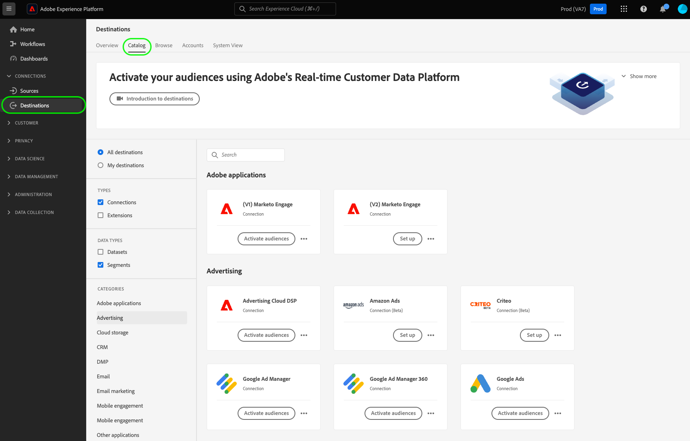
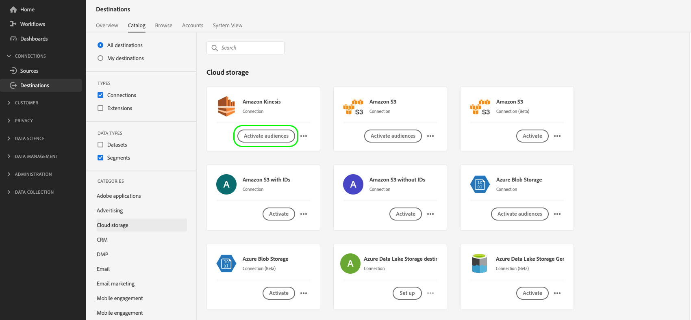
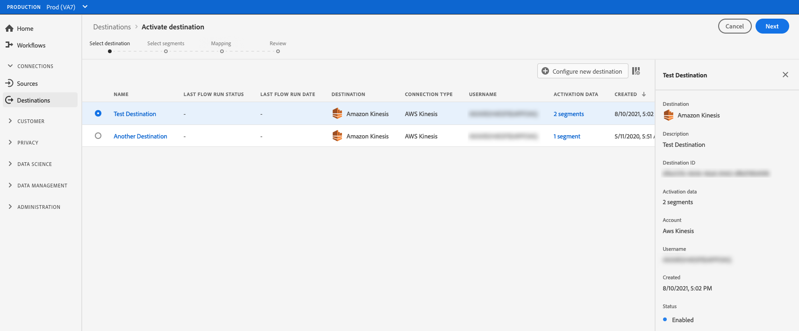
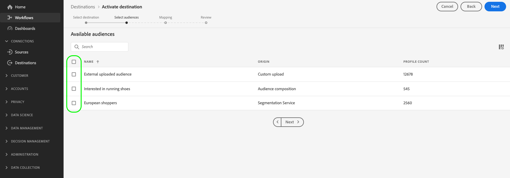
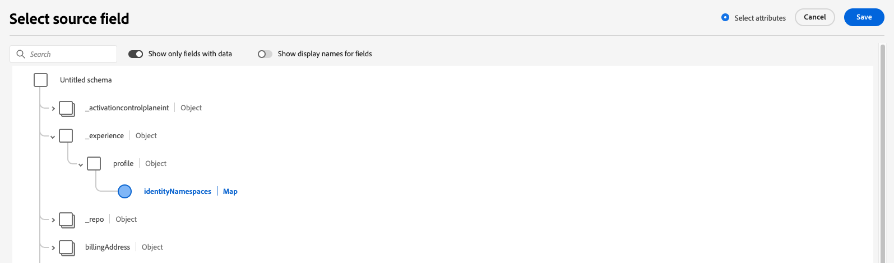
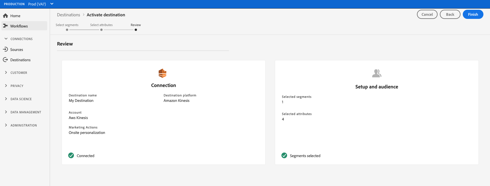

# ストリーミングプロファイルの書き出し宛先に対してオーディエンスをアクティブ化する

>[!IMPORTANT]
>
> * データをアクティブ化し、ワークフローの[ マッピング手順](#mapping)を有効にするには、**[!UICONTROL View Destinations]**、**[!UICONTROL Activate Destinations]**、**[!UICONTROL View Profiles]**&#x200B;および&#x200B;**[!UICONTROL View Segments]** [ アクセス制御権限](/help/access-control/home.md#permissions)が必要です。
> * ワークフローの[ マッピング手順](#mapping)を経ずにデータをアクティベートするには、**[!UICONTROL View Destinations]**、**[!UICONTROL Activate Segment without Mapping]**、**[!UICONTROL View Profiles]**&#x200B;および&#x200B;**[!UICONTROL View Segments]**、[ アクセス制御権限](/help/access-control/home.md#permissions)が必要です。
> 
> 詳しくは、[アクセス制御の概要](/help/access-control/ui/overview.md)または製品管理者に問い合わせて、必要な権限を取得してください。

## 概要 {#overview}

この記事では、[!DNL Adobe Experience Platform]のオーディエンスデータをストリーミングプロファイルベースの宛先（[ エンタープライズ宛先](/help/destinations/destination-types.md#advanced-enterprise-destinations)とも呼ばれます）にアクティベートするために必要なワークフローについて説明します。

この記事は、次の3つの宛先に適用されます。

* [Amazon Kinesis](/help/destinations/catalog/cloud-storage/amazon-kinesis.md)
* [Azure Event Hubs](/help/destinations/catalog/cloud-storage/azure-event-hubs.md)
* [HTTP API宛先](/help/destinations/catalog/streaming/http-destination.md)。

## 前提条件 {#prerequisites}

宛先へのデータをアクティベートするには、正常に[宛先に接続する](./connect-destination.md)必要があります。まだ接続していない場合は、[宛先カタログ](../catalog/overview.md)に移動し、サポートされている宛先を参照し、使用する宛先を設定します。

## 宛先の選択 {#select-destination}

1. **[!UICONTROL Connections > Destinations]**&#x200B;に移動し、「**[!UICONTROL Catalog]**」タブを選択します。

   

1. 以下の画像に示すように、オーディエンスをアクティブ化する宛先に対応するカードで&#x200B;**[!UICONTROL Activate audiences]**&#x200B;を選択します。

   

1. オーディエンスの有効化に使用する宛先接続を選択し、**[!UICONTROL Next]**&#x200B;を選択します。

   

1. 次のセクションに移動して、[ オーディエンスを選択](#select-audiences)します。

## オーディエンスの選択 {#select-audiences}

宛先に対してアクティブ化するオーディエンスを選択するには、オーディエンス名の左側にあるチェックボックスを使用し、**[!UICONTROL Next]**&#x200B;を選択します。

配信元に応じて、複数のタイプのオーディエンスから選択できます。

* **[!UICONTROL Segmentation Service]**: Segmentation ServiceによってExperience Platform内で生成されたオーディエンス。 詳しくは、[ オーディエンスポータルのドキュメント ](../../segmentation/ui/audience-portal.md)を参照してください。
* **[!UICONTROL Custom upload]**: Experience Platform以外で生成され、CSV ファイルとしてExperience Platformにアップロードされたオーディエンス。 外部オーディエンスについて詳しくは、[ オーディエンスの読み込み](../../segmentation/ui/audience-portal.md#import-audience)に関するドキュメントを参照してください。
* その他の種類のオーディエンスは、[!DNL Audience Manager]など、他のAdobe ソリューションから作成されています。



## プロファイル属性の選択 {#select-attributes}

**[!UICONTROL Mapping]** ステップで、ターゲット宛先に送信するプロファイル属性を選択します。

1. **[!UICONTROL Select attributes]** ページで、**[!UICONTROL Add new field]**&#x200B;を選択します。

   マッピング手順の「新しいフィールドを追加」コントロールを強調表示する

1. **[!UICONTROL Schema field]** エントリの右側にある矢印を選択します。

   マッピング手順でソースフィールドを選択する方法を示す

1. **[!UICONTROL Select source field]** ページで、宛先に送信するXDM属性を選択し、**[!UICONTROL Save]**&#x200B;を選択します。

   

   値が入力されたスキーマフィールドのみを表示するには、**[!UICONTROL Show only fields with data]** トグルを使用します。 デフォルトでは、入力されたスキーマフィールドのみが表示されます。

   スキーマフィールド名ではなく、フィールドのわかりやすい名前を表示するには、**[!UICONTROL Show display names for fields]** トグルを使用します。

   

1. さらにフィールドを追加するには、手順1 ～ 3を繰り返してから、**[!UICONTROL Next]**&#x200B;を選択します。

## レビュー {#review}

**[!UICONTROL Review]** ページで、選択内容の概要を表示できます。 **[!UICONTROL Cancel]**&#x200B;を選択してフローを分割し、**[!UICONTROL Back]**&#x200B;を選択して設定を変更するか、**[!UICONTROL Finish]**&#x200B;を選択して選択を確定し、宛先へのデータ送信を開始します。

レビュー手順の

### 同意ポリシーの評価 {#consent-policy-evaluation}

[同意ポリシー評価](/help/data-governance/enforcement/auto-enforcement.md#consent-policy-evaluation)は、現在、Amazon Kinesis、Azure Event Hubs、HTTP APIの3つのエンタープライズ宛先への書き出しではサポートされていません。

つまり、*ターゲットにすることに同意していないプロファイルは、これら3つの宛先への書き出しに*&#x200B;含まれます。

<!--

If your organization purchased **Adobe Healthcare Shield** or **Adobe Privacy & Security Shield**, select **[!UICONTROL View applicable consent policies]** to see which consent policies are applied and how many profiles are included in the activation as a result of them. Read about [consent policy evaluation](/help/data-governance/enforcement/auto-enforcement.md#consent-policy-evaluation) for more information.

-->

### データ使用ポリシーチェック {#data-usage-policy-checks}

**[!UICONTROL Review]** ステップでは、Experience Platformもデータ使用ポリシー違反をチェックします。 ポリシーに違反した場合の例を次に示します。オーディエンスのアクティベーション ワークフローを完了するには、違反を解決する必要があります。 ポリシー違反を解決する方法について詳しくは、「データガバナンスのドキュメント」セクションの[ データ使用ポリシー違反](/help/data-governance/enforcement/auto-enforcement.md#data-usage-violation)を参照してください。


### オーディエンスを絞り込む {#filter-audiences}

また、この手順では、ページで使用可能なフィルターを使用して、このワークフローの一部としてスケジュールまたはマッピングが更新されたオーディエンスのみを表示できます。


選択に満足しており、ポリシー違反が検出されていない場合は、**[!UICONTROL Finish]**&#x200B;を選択して選択を確認し、宛先へのデータ送信を開始します。

## オーディエンスのアクティブ化の検証 {#verify}

書き出された[!DNL Experience Platform] データは、JSON形式でターゲットの宛先に格納されます。 例えば、以下のイベントには、特定のオーディエンスに適格で別のオーディエンスを終了したプロファイルのemail address属性が含まれます。 この見込客のIDは`ECID`と`email_lc_sha256`です。

```json
{
  "person": {
    "email": "yourstruly@adobe.com"
  },
  "segmentMembership": {
    "ups": {
      "7841ba61-23c1-4bb3-a495-00d3g5fe1e93": {
        "lastQualificationTime": "2020-05-25T21:24:39Z",
        "status": "exited"
      },
      "59bd2fkd-3c48-4b18-bf56-4f5c5e6967ae": {
        "lastQualificationTime": "2020-05-25T23:37:33Z",
        "status": "realized"
      }
    }
  },
  "identityMap": {
    "ecid": [
      {
        "id": "14575006536349286404619648085736425115"
      },
      {
        "id": "66478888669296734530114754794777368480"
      }
    ],
    "email_lc_sha256": [
      {
        "id": "655332b5fa2aea4498bf7a290cff017cb4"
      },
      {
        "id": "66baf76ef9de8b42df8903f00e0e3dc0b7"
      }
    ]
  }
}
```
