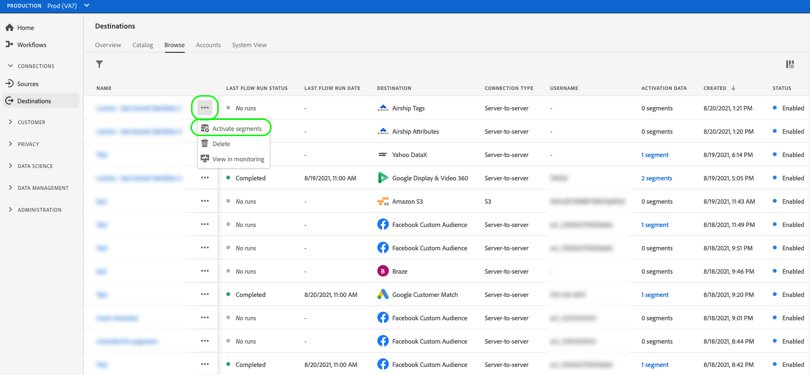

# 有効化の概要

>[!IMPORTANT]
>
>* データをアクティブ化するには、**[!UICONTROL View Destinations]**、**[!UICONTROL Activate Destinations]**、**[!UICONTROL View Profiles]**&#x200B;および&#x200B;**[!UICONTROL View Segments]** [&#x200B; アクセス制御権限](/help/access-control/home.md#permissions)が必要です。 [アクセス制御の概要](/help/access-control/ui/overview.md)を参照するか、製品管理者に問い合わせて必要な権限を取得してください。
>* *ID*&#x200B;をエクスポートするには、**[!UICONTROL View Identity Graph]** [&#x200B; アクセス制御権限](/help/access-control/home.md#permissions)が必要です。  {width="100" zoomable="yes"}

[!DNL Adobe Experience Platform]は幅広い宛先をサポートしています。 オーディエンスのアクティベーションのワークフローは、サポートするオーディエンスデータの種類やデータの書き出しの頻度によって、配信先によって異なります。

## アクティベーション方法 {#activation-methods}

宛先を[設定した後](connect-destination.md)、複数の方法でオーディエンスをアクティブ化できます。

### 宛先カタログからオーディエンスをアクティブ化 {#activate-from-catalog}

宛先カタログから宛先に対してオーディエンスをアクティブ化する方法について詳しくは、次のガイドを参照してください。

* [ストリーミングオーディエンスの書き出し先に対するオーディエンスデータの有効化](activate-segment-streaming-destinations.md)
* [ストリーミングプロファイル書き出し宛先に対するオーディエンスデータの有効化](activate-streaming-profile-destinations.md)
* [プロファイル書き出しのバッチ宛先に対するオーディエンスデータの有効化](activate-batch-profile-destinations.md)

### [!UICONTROL Browse] ページからオーディエンスをアクティブ化 {#activate-from-browse}

次の手順に従って、**[!UICONTROL Browse]** ページから宛先にデータをアクティベートします。

1. **[!UICONTROL Connections > Destinations]**&#x200B;に移動し、「**[!UICONTROL Browse]**」タブを選択します。

   

1. セグメントのアクティブ化に使用する宛先接続を見つけ、[!UICONTROL Name]列の3つのドットを選択し、**[!UICONTROL Activate audiences]**&#x200B;を選択します。

   

1. 選択した宛先に応じて、**[!UICONTROL Select segments]** ステップから次の記事で説明されている手順に従って、アクティベーション ワークフローを完了します。

   * [ストリーミングオーディエンスの書き出し先に対するオーディエンスデータの有効化](activate-segment-streaming-destinations.md)
   * [ストリーミングプロファイル書き出し宛先に対するオーディエンスデータの有効化](activate-streaming-profile-destinations.md)
   * [プロファイル書き出しのバッチ宛先に対するオーディエンスデータの有効化](activate-batch-profile-destinations.md)

### オーディエンスの詳細ページからオーディエンスをアクティベートする {#activate-audience-details}

オーディエンスの詳細ページから宛先に対してオーディエンスをアクティブ化できます。 詳しくは、[&#x200B; オーディエンスの詳細](../../segmentation/ui/audience-portal.md#audience-details)を参照してください。

選択した宛先に応じて、以下の記事で説明されている手順に従って、アクティベーションのワークフローを完了します。

* [ストリーミングオーディエンスの書き出し先に対するオーディエンスデータの有効化](activate-segment-streaming-destinations.md)
* [ストリーミングプロファイル書き出し宛先に対するオーディエンスデータの有効化](activate-streaming-profile-destinations.md)
* [プロファイル書き出しのバッチ宛先に対するオーディエンスデータの有効化](activate-batch-profile-destinations.md)
